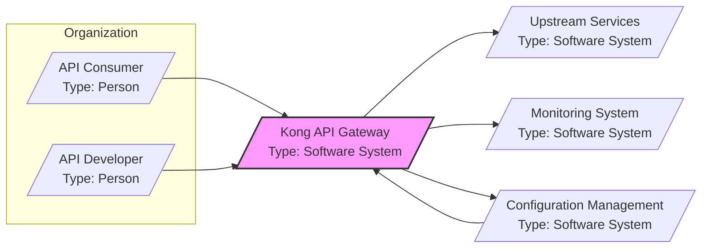

# BUSINESS POSTURE

Kong is an open-source API Gateway and service connectivity platform. Its primary business goal is to provide a robust, scalable, and secure solution for managing and securing APIs and microservices. Kong helps organizations to control access to their backend services, route traffic efficiently, and add functionalities like authentication, authorization, rate limiting, and monitoring to their APIs without modifying the underlying services.

Business priorities for Kong users typically include:
- API Management: Centralized control and management of APIs.
- Security: Protecting APIs from unauthorized access and attacks.
- Scalability and Performance: Handling high traffic volumes and ensuring low latency.
- Observability: Monitoring API traffic and performance.
- Extensibility: Adapting to specific needs through plugins and customization.

Key business risks associated with using an API Gateway like Kong include:
- Availability risk: If Kong becomes unavailable, all APIs managed by it become inaccessible, disrupting business operations.
- Security risk: Misconfiguration or vulnerabilities in Kong could expose backend services to security breaches.
- Performance risk: Improperly configured or overloaded Kong instances can introduce latency and degrade API performance.
- Data loss or corruption risk: Issues with Kong's data storage or processing could lead to loss or corruption of API traffic data or configuration.
- Compliance risk: Failure to properly secure and manage APIs through Kong could lead to non-compliance with relevant regulations (e.g., GDPR, PCI DSS).

# SECURITY POSTURE

Existing security controls for Kong (based on documentation and repository analysis):

- security control: Authentication and Authorization: Kong supports various authentication mechanisms (API keys, JWT, OAuth 2.0, mTLS, etc.) and authorization policies to control access to APIs. Implemented as plugins within Kong Gateway.
- security control: Input Validation: Kong validates incoming requests based on configured schemas and plugins like Request Transformer and Request Validator. Implemented as plugins within Kong Gateway.
- security control: Rate Limiting and Traffic Control: Kong provides rate limiting, traffic shaping, and request size limiting to protect backend services from overload and abuse. Implemented as plugins within Kong Gateway.
- security control: TLS/SSL Termination: Kong can terminate TLS/SSL connections, ensuring encrypted communication between clients and the gateway. Configured within Kong Gateway listener settings.
- security control: Web Application Firewall (WAF): Kong integrates with WAF solutions through plugins to protect against common web attacks. Implemented via plugins integrating with external WAF services.
- security control: Audit Logging: Kong provides audit logging capabilities to track API access and configuration changes. Configured within Kong Gateway and logs can be sent to external systems.
- security control: Secret Management: Kong supports integration with secret management tools for storing and retrieving sensitive information like API keys and database credentials. Implemented through environment variables, configuration files, and integrations with secret vaults.
- security control: Secure Configuration: Kong encourages secure configuration practices through documentation and default settings. Described in Kong documentation and best practices guides.
- security control: Regular Security Updates: Kong project releases regular security updates and patches to address identified vulnerabilities. Managed by Kong project release cycle and communicated through release notes and security advisories.
- security control: Secure Development Lifecycle: Kong project follows secure development practices, including code reviews and security testing. Implemented by Kong development team and community contributions.

Accepted risks for Kong (inferred based on common API Gateway deployments):

- accepted risk: Complexity of Configuration: Kong's extensive features and plugin ecosystem can lead to complex configurations, increasing the risk of misconfiguration and security vulnerabilities. Mitigation is through thorough testing, documentation, and configuration management practices.
- accepted risk: Plugin Vulnerabilities: While Kong core is actively maintained, vulnerabilities in community-developed plugins could introduce security risks. Mitigation is through careful plugin selection, security reviews of plugins, and staying updated with plugin security advisories.
- accepted risk: Dependency Vulnerabilities: Kong relies on various dependencies (e.g., OpenResty, Lua libraries, database drivers), and vulnerabilities in these dependencies could affect Kong's security. Mitigation is through regular dependency updates and vulnerability scanning.

Recommended security controls:

- security control: Automated Security Scanning: Implement automated SAST/DAST scanning in the Kong development and deployment pipelines to identify vulnerabilities early in the lifecycle.
- security control: Security Hardening Guides: Develop and follow security hardening guides for Kong instances and underlying infrastructure to minimize the attack surface.
- security control: Penetration Testing: Conduct regular penetration testing of Kong deployments to identify and address security weaknesses.
- security control: Security Incident Response Plan: Establish a clear security incident response plan for Kong deployments to effectively handle security incidents.
- security control: Dependency Scanning and Management: Implement automated dependency scanning and management to track and update dependencies and address vulnerabilities promptly.

Security requirements for Kong:

- Authentication:
    - Requirement: Kong must support multiple authentication mechanisms to accommodate different API security needs (e.g., API keys for simple APIs, OAuth 2.0 for user-centric APIs, mTLS for service-to-service communication).
    - Requirement: Authentication mechanisms should be configurable per route or service to allow granular access control.
    - Requirement: Kong should provide mechanisms to securely manage and store authentication credentials (e.g., integration with secret management systems).

- Authorization:
    - Requirement: Kong must provide flexible authorization policies to control access based on roles, permissions, or other attributes.
    - Requirement: Authorization policies should be enforceable at different levels (e.g., route, service, plugin).
    - Requirement: Kong should support integration with external authorization services (e.g., policy decision points) for complex authorization scenarios.

- Input Validation:
    - Requirement: Kong must validate all incoming requests to prevent injection attacks and ensure data integrity.
    - Requirement: Input validation should be configurable and customizable based on API specifications and data types.
    - Requirement: Kong should provide mechanisms to sanitize or reject invalid input and log validation failures.

- Cryptography:
    - Requirement: Kong must support strong cryptographic algorithms and protocols for securing communication and data at rest.
    - Requirement: Kong should enforce TLS/SSL for all external communication and support mutual TLS for enhanced security.
    - Requirement: Kong should provide mechanisms for encrypting sensitive data at rest, such as configuration secrets and cached data.

# DESIGN

## C4 CONTEXT



Context Diagram Elements:

- Name: API Consumer
    - Type: Person
    - Description: External users or applications that consume APIs managed by Kong.
    - Responsibilities: Consume APIs to access data or functionality provided by backend services.
    - Security controls: Authenticate with Kong using configured authentication mechanisms. Subject to rate limiting and access control policies enforced by Kong.

- Name: API Developer
    - Type: Person
    - Description: Internal developers who configure and manage Kong, define routes, plugins, and policies.
    - Responsibilities: Configure Kong, define API routes, apply plugins, manage security policies, monitor API traffic.
    - Security controls: Authenticate with Kong Admin API. Authorized to manage Kong configuration based on configured roles and permissions. Access to Kong Admin API should be restricted and audited.

- Name: Kong API Gateway
    - Type: Software System
    - Description: The central API Gateway responsible for managing, securing, and routing API traffic.
    - Responsibilities: API request routing, authentication, authorization, rate limiting, request/response transformation, logging, monitoring, plugin execution.
    - Security controls: Implements authentication and authorization mechanisms, input validation, rate limiting, TLS termination, WAF integration, audit logging, secure configuration management.

- Name: Upstream Services
    - Type: Software System
    - Description: Backend services or microservices that provide the actual API functionality. Kong routes requests to these services.
    - Responsibilities: Process API requests, provide API responses, implement business logic.
    - Security controls: Rely on Kong for front-end security. Implement their own internal security controls. Should only be accessible through Kong.

- Name: Monitoring System
    - Type: Software System
    - Description: External monitoring and logging systems used to collect and analyze Kong metrics, logs, and events.
    - Responsibilities: Collect and analyze Kong logs and metrics for performance monitoring, security analysis, and troubleshooting.
    - Security controls: Securely receive logs and metrics from Kong. Implement access control to monitoring data.

- Name: Configuration Management
    - Type: Software System
    - Description: Systems used to manage Kong's configuration, such as version control systems, CI/CD pipelines, or configuration management tools.
    - Responsibilities: Store and manage Kong configuration, automate configuration deployment, ensure configuration consistency.
    - Security controls: Securely store Kong configuration. Implement access control to configuration data. Integrate with Kong Admin API for automated configuration updates.

## C4 CONTAINER

```mermaid
graph LR
    subgraph "Kong API Gateway"
        AdminAPI[/"Admin API"\nType: Web Application/]
        Proxy[/"Proxy"\nType: Web Application/]
        Database[/"Database (PostgreSQL/Cassandra)"\nType: Database/]
        Plugins[/"Plugins"\nType: Software Component/]
    end

    Developer --> AdminAPI
    User --> Proxy
    Proxy --> Plugins
    Proxy --> Database
    AdminAPI --> Database
    AdminAPI --> Plugins
    Proxy --> UpstreamService
    MonitoringSystem --> AdminAPI

    style "Kong API Gateway" fill:#f9f,stroke:#333,stroke-width:2px
```

Container Diagram Elements:

- Name: Admin API
    - Type: Web Application
    - Description: RESTful API for configuring and managing Kong. Used by administrators and automation tools.
    - Responsibilities: Configuration management, plugin management, route management, service management, retrieving metrics and status.
    - Security controls: Authentication and authorization for Admin API access. TLS/SSL encryption for API communication. Audit logging of Admin API actions. Role-Based Access Control (RBAC) for administrative functions.

- Name: Proxy
    - Type: Web Application
    - Description: Data plane of Kong, responsible for proxying and processing API requests. Based on Nginx and OpenResty.
    - Responsibilities: Request routing, plugin execution, authentication, authorization, rate limiting, request/response transformation, logging, load balancing.
    - Security controls: Executes configured plugins for security enforcement. TLS/SSL termination for incoming requests. Input validation through plugins. Rate limiting and traffic control.

- Name: Database (PostgreSQL/Cassandra)
    - Type: Database
    - Description: Stores Kong's configuration data, including routes, services, plugins, and consumer information. Supports PostgreSQL and Cassandra.
    - Responsibilities: Persistent storage of Kong configuration. Data retrieval for Kong components.
    - Security controls: Database access control (authentication and authorization). Encryption at rest for sensitive data (depending on database capabilities and configuration). Secure database configuration and hardening. Network segmentation to restrict access to the database.

- Name: Plugins
    - Type: Software Component
    - Description: Extensible modules that add functionalities to Kong, such as authentication, authorization, traffic control, and transformations.
    - Responsibilities: Implement specific API gateway functionalities. Enforce security policies. Modify request and response flows.
    - Security controls: Plugins themselves should be developed securely. Kong provides a plugin development framework with security considerations. Plugin configurations should be validated.

## DEPLOYMENT

Deployment Architecture: Kubernetes Cluster

```mermaid
graph LR
    subgraph "Kubernetes Cluster"
        subgraph "kong-namespace"
            KongDeployment[/"Kong Deployment"\nType: Kubernetes Deployment/]
            KongService[/"Kong Service (LoadBalancer)"\nType: Kubernetes Service/]
            KongAdminService[/"Kong Admin Service (ClusterIP)"\nType: Kubernetes Service/]
            KongDatabase[/"Kong Database (PostgreSQL/Cassandra)"\nType: Kubernetes StatefulSet/]
        end
        IngressController[/"Ingress Controller"\nType: Kubernetes Deployment/]
    end
    Internet[/"Internet"\nType: External Network/]
    DeveloperPC[/"Developer PC"\nType: Physical Device/]

    Internet --> KongService
    DeveloperPC --> KongAdminService
    KongService --> KongDeployment
    KongAdminService --> KongDeployment
    KongDeployment --> KongDatabase
    IngressController --> KongService

    style "Kubernetes Cluster" fill:#f9f,stroke:#333,stroke-width:2px
    style "kong-namespace" fill:#eee,stroke:#333,stroke-width:1px,stroke-dasharray: 5 5
```

Deployment Diagram Elements (Kubernetes Deployment):

- Name: Kubernetes Cluster
    - Type: Infrastructure
    - Description: Underlying Kubernetes cluster providing the runtime environment for Kong.
    - Responsibilities: Container orchestration, resource management, networking, service discovery.
    - Security controls: Kubernetes RBAC, Network Policies, Pod Security Policies/Admission Controllers, cluster security hardening, regular security updates.

- Name: kong-namespace
    - Type: Kubernetes Namespace
    - Description: Dedicated Kubernetes namespace to isolate Kong components.
    - Responsibilities: Resource isolation, access control within the Kubernetes cluster for Kong components.
    - Security controls: Kubernetes RBAC for namespace access control. Network Policies to restrict network traffic within the namespace.

- Name: Kong Deployment
    - Type: Kubernetes Deployment
    - Description: Kubernetes Deployment managing Kong Proxy and Admin API pods.
    - Responsibilities: Running Kong containers, ensuring desired replica count, rolling updates.
    - Security controls: Container image security scanning, Pod Security Context, resource limits, liveness and readiness probes.

- Name: Kong Service (LoadBalancer)
    - Type: Kubernetes Service
    - Description: Kubernetes LoadBalancer service exposing Kong Proxy to the internet.
    - Responsibilities: External access to Kong Proxy, load balancing across Kong pods.
    - Security controls: Network security groups/firewall rules to restrict access to Kong Proxy ports. TLS/SSL termination at Kong.

- Name: Kong Admin Service (ClusterIP)
    - Type: Kubernetes Service
    - Description: Kubernetes ClusterIP service exposing Kong Admin API within the cluster.
    - Responsibilities: Internal access to Kong Admin API for configuration and management.
    - Security controls: Network Policies to restrict access to Kong Admin API service from within the cluster. Kubernetes RBAC for Admin API access control.

- Name: Kong Database (PostgreSQL/Cassandra)
    - Type: Kubernetes StatefulSet
    - Description: Kubernetes StatefulSet managing the Kong database (PostgreSQL or Cassandra).
    - Responsibilities: Persistent storage for Kong configuration, database replication and failover.
    - Security controls: Persistent volume encryption, database access control, network segmentation, database security hardening.

- Name: Internet
    - Type: External Network
    - Description: Public internet from where API consumers access Kong.
    - Responsibilities: Provide network connectivity for API consumers.
    - Security controls: General internet security considerations.

- Name: Developer PC
    - Type: Physical Device
    - Description: Developer's workstation used to access Kong Admin API for configuration.
    - Responsibilities: Access Kong Admin API for configuration and management.
    - Security controls: Endpoint security on developer's PC. Secure access to Kubernetes cluster and Kong Admin API.

- Name: Ingress Controller
    - Type: Kubernetes Deployment
    - Description: Kubernetes Ingress Controller that can route traffic to Kong Service. (Optional, Kong can be directly exposed via LoadBalancer)
    - Responsibilities: Ingress routing, TLS termination (can be offloaded to Kong as well).
    - Security controls: Ingress controller security hardening, TLS configuration.

## BUILD

Build Process Diagram:

```mermaid
graph LR
    Developer[/"Developer"\nType: Person/] --> SourceCode[/"Source Code (GitHub)"\nType: Code Repository/]
    SourceCode --> BuildSystem[/"Build System (GitHub Actions/Jenkins)"\nType: CI/CD System/]
    BuildSystem --> BuildArtifacts[/"Build Artifacts (Docker Images, Packages)"\nType: Artifact Repository/]
    BuildArtifacts --> DeploymentEnvironment[/"Deployment Environment (Kubernetes, Cloud, On-Premise)"\nType: Infrastructure/]

    subgraph "Build System"
        SecurityScanners[/"Security Scanners (SAST/DAST, Dependency Scan)"\nType: Security Tool/]
        Linters[/"Linters"\nType: Code Analysis Tool/]
        UnitTests[/"Unit Tests"\nType: Testing Framework/]
        IntegrationTests[/"Integration Tests"\nType: Testing Framework/]
        CodeSigning[/"Code Signing"\nType: Security Tool/]
    end
    BuildSystem --> SecurityScanners
    BuildSystem --> Linters
    BuildSystem --> UnitTests
    BuildSystem --> IntegrationTests
    BuildSystem --> CodeSigning

    style "Build System" fill:#eee,stroke:#333,stroke-width:1px,stroke-dasharray: 5 5
```

Build Process Description:

1. Developer: Developers write code and commit changes to the Source Code repository (e.g., GitHub).
2. Source Code (GitHub): Kong's source code is hosted on GitHub. This is the starting point for the build process.
3. Build System (GitHub Actions/Jenkins): A CI/CD system (e.g., GitHub Actions, Jenkins) is triggered by code changes.
    - Security Scanners (SAST/DAST, Dependency Scan): Static Application Security Testing (SAST), Dynamic Application Security Testing (DAST), and dependency scanning tools are used to identify potential vulnerabilities in the code and dependencies.
    - Linters: Code linters are used to enforce code style and identify potential code quality issues.
    - Unit Tests: Unit tests are executed to verify the functionality of individual code components.
    - Integration Tests: Integration tests are executed to verify the interaction between different components.
    - Code Signing: Build artifacts (e.g., Docker images, packages) are signed to ensure integrity and authenticity.
4. Build Artifacts (Docker Images, Packages): The build system produces build artifacts, such as Docker images and packages, which are stored in an artifact repository (e.g., Docker Registry, Package Registry).
5. Deployment Environment (Kubernetes, Cloud, On-Premise): Build artifacts are deployed to the target deployment environment (e.g., Kubernetes cluster, cloud environment, on-premise infrastructure).

Build Process Security Controls:

- security control: Source Code Management Security: Secure access control to the source code repository. Code review process for all code changes.
- security control: Automated Build Process: Fully automated build process to reduce manual errors and ensure consistency.
- security control: Security Scanning in Build Pipeline: Integration of SAST, DAST, and dependency scanning tools in the build pipeline to identify vulnerabilities early.
- security control: Code Linting and Static Analysis: Use of linters and static analysis tools to improve code quality and identify potential issues.
- security control: Automated Testing: Comprehensive suite of unit and integration tests to ensure code functionality and prevent regressions.
- security control: Build Artifact Signing: Signing of build artifacts to ensure integrity and authenticity and prevent tampering.
- security control: Secure Artifact Repository: Secure artifact repository with access control and vulnerability scanning.
- security control: Supply Chain Security: Management of dependencies and ensuring the security of the software supply chain.

# RISK ASSESSMENT

Critical business processes protected by Kong:

- API Access Control: Kong protects access to backend services by enforcing authentication and authorization policies. Failure to protect this process could lead to unauthorized access to sensitive data and functionalities.
- API Traffic Management: Kong manages API traffic by routing requests, applying rate limits, and ensuring service availability. Failure in traffic management could lead to service disruptions and performance degradation.
- API Security Enforcement: Kong enforces various security policies through plugins, such as WAF, input validation, and threat detection. Failure in security enforcement could expose backend services to attacks and vulnerabilities.

Data being protected and its sensitivity:

- API Keys and Credentials: Kong manages API keys, tokens, and other credentials used for authentication. These are highly sensitive and their compromise could lead to unauthorized access. Sensitivity: High.
- API Request and Response Data: Kong processes API request and response data, which may contain sensitive information depending on the APIs being managed (e.g., personal data, financial data). Sensitivity: Medium to High (depending on API).
- Kong Configuration Data: Kong's configuration data, including routes, services, plugins, and policies, is sensitive as it defines the security posture of the API gateway. Sensitivity: Medium.
- Audit Logs: Kong generates audit logs that contain information about API access and configuration changes. These logs are important for security monitoring and incident response. Sensitivity: Medium.

# QUESTIONS & ASSUMPTIONS

Questions:

- What is the specific deployment environment for Kong (Cloud provider, on-premise, hybrid)?
- What are the specific types of APIs being managed by Kong (public, private, partner)?
- What are the specific security compliance requirements for the APIs and data being managed by Kong (e.g., GDPR, PCI DSS, HIPAA)?
- What are the performance and scalability requirements for Kong?
- What monitoring and logging systems are currently in place or planned to be used with Kong?
- What secret management solutions are being used or planned to be used with Kong?
- What is the process for managing and updating Kong plugins?

Assumptions:

- BUSINESS POSTURE: The primary business goal is to securely and reliably manage APIs for internal and external consumers. Security and availability are high priorities.
- SECURITY POSTURE: Kong is intended to be deployed in a security-conscious environment. Security controls are expected to be actively implemented and maintained. Secure Software Development Lifecycle (SSDLC) practices are assumed to be in place for Kong development and deployment.
- DESIGN: Kong is deployed in a Kubernetes environment for scalability and resilience. PostgreSQL is used as the database backend. Standard Kong plugins are used for common API gateway functionalities. The build process includes automated security checks and artifact signing.