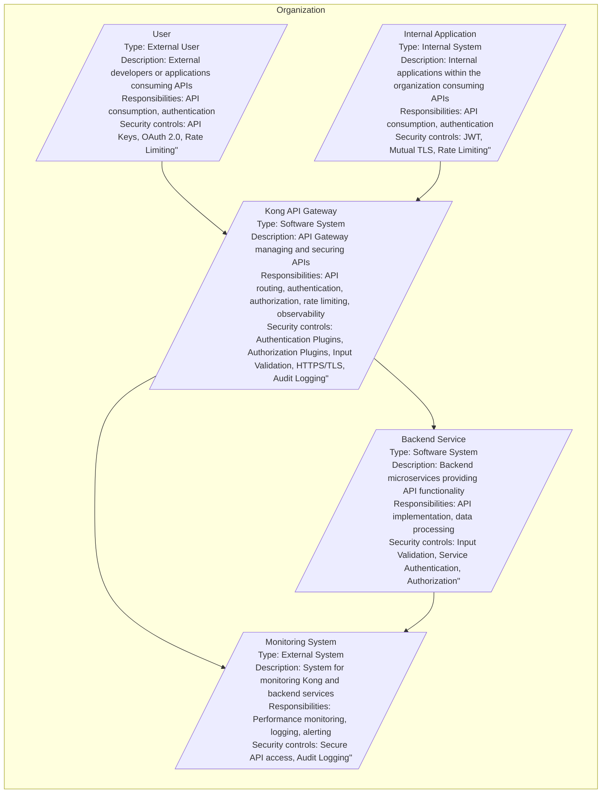
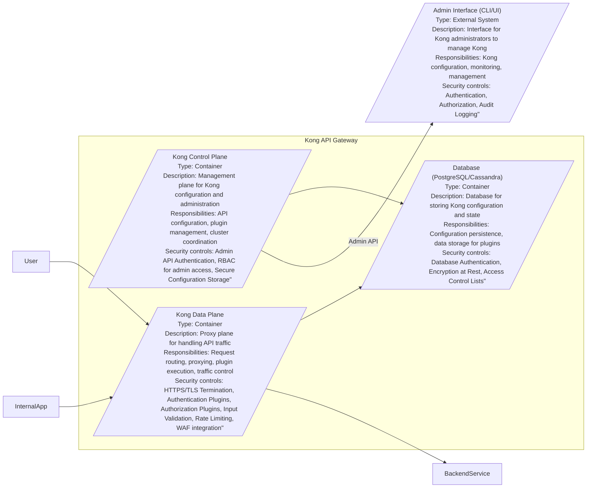

# BUSINESS POSTURE

Kong API Gateway is a cloud-native, fast, scalable, and extensible API Gateway and service mesh. It is designed to manage and secure APIs and microservices, providing features like request routing, authentication, authorization, rate limiting, and observability.

Business priorities and goals for adopting Kong API Gateway typically include:

- Centralized API Management: To provide a single point of entry for all APIs, simplifying management and governance.
- Enhanced Security: To secure APIs with authentication, authorization, and other security policies, protecting backend services from unauthorized access and attacks.
- Improved Performance and Scalability: To handle high traffic volumes and ensure low latency for API requests.
- Increased Observability: To gain insights into API traffic, performance, and errors for monitoring and troubleshooting.
- Developer Productivity: To simplify API consumption and integration for developers.
- Modernization of Infrastructure: To adopt a cloud-native architecture and microservices.

Most important business risks that need to be addressed:

- Availability and Reliability: Downtime of the API Gateway can disrupt all dependent services and business processes.
- Security Breaches: Vulnerabilities in the API Gateway or misconfigurations can lead to unauthorized access to backend services and sensitive data.
- Performance Bottlenecks: Poorly configured or overloaded API Gateway can become a bottleneck, impacting application performance.
- Data Loss or Corruption: Misconfigurations or failures in the API Gateway could potentially lead to data loss or corruption during request processing.
- Compliance Violations: Failure to properly secure and manage APIs can lead to non-compliance with industry regulations and data privacy laws.

# SECURITY POSTURE

Existing security controls:

- security control: Authentication and Authorization Plugins: Kong offers various plugins for authentication (e.g., Key Authentication, JWT, OAuth 2.0) and authorization (e.g., ACL, RBAC) to secure APIs. Implemented as Kong plugins.
- security control: Input Validation: Kong plugins can be used to validate incoming requests and payloads, preventing injection attacks and ensuring data integrity. Implemented as Kong plugins or custom logic within plugins.
- security control: Rate Limiting and Traffic Control: Kong provides plugins to control traffic flow, prevent abuse, and protect backend services from overload. Implemented as Kong plugins.
- security control: HTTPS/TLS Termination: Kong can terminate TLS connections, ensuring encrypted communication between clients and the gateway. Implemented in Kong core.
- security control: Secret Management: Kong supports integration with secret management solutions for storing and managing sensitive credentials. Described in Kong documentation and implemented via configuration.
- security control: Audit Logging: Kong provides logging capabilities to track API access and events for auditing and security monitoring. Implemented in Kong core and plugins.

Accepted risks:

- accepted risk: Plugin vulnerabilities: Reliance on third-party or community-developed plugins introduces potential vulnerabilities if plugins are not properly maintained or audited. Mitigation: Use only trusted and well-maintained plugins, perform security reviews of plugins, and keep plugins updated.
- accepted risk: Configuration errors: Misconfigurations of Kong or its plugins can lead to security vulnerabilities or operational issues. Mitigation: Implement infrastructure-as-code for configuration management, use configuration validation tools, and follow security best practices for configuration.

Recommended security controls:

- security control: Web Application Firewall (WAF): Integrate a WAF in front of Kong to provide an additional layer of protection against common web attacks (e.g., OWASP Top 10).
- security control: API Security Testing: Implement automated API security testing (DAST, SAST) in the CI/CD pipeline to identify vulnerabilities early in the development lifecycle.
- security control: Security Information and Event Management (SIEM) integration: Integrate Kong logs with a SIEM system for centralized security monitoring and incident response.
- security control: Regular Security Audits and Penetration Testing: Conduct periodic security audits and penetration testing to identify and address vulnerabilities in Kong and its configurations.
- security control: Supply Chain Security for Plugins: Implement controls to verify the integrity and security of Kong plugins, including dependency scanning and vulnerability checks.

Security requirements:

- Authentication:
    - Requirement: Kong MUST support multiple authentication mechanisms to accommodate different API consumers and security needs (e.g., API keys, JWT, OAuth 2.0).
    - Requirement: Authentication mechanisms MUST be configurable per API route or service.
    - Requirement: Kong MUST securely store and manage authentication credentials and secrets.
- Authorization:
    - Requirement: Kong MUST provide fine-grained authorization capabilities to control access to specific API endpoints and resources.
    - Requirement: Authorization policies MUST be centrally managed and enforced by Kong.
    - Requirement: Kong MUST support role-based access control (RBAC) or attribute-based access control (ABAC) for authorization.
- Input Validation:
    - Requirement: Kong MUST validate all incoming requests to prevent injection attacks and ensure data integrity.
    - Requirement: Input validation rules MUST be configurable and customizable based on API specifications.
    - Requirement: Kong MUST sanitize or reject invalid input and provide informative error messages.
- Cryptography:
    - Requirement: Kong MUST use strong cryptographic algorithms and protocols for all security-sensitive operations, including TLS/HTTPS, secret storage, and data encryption.
    - Requirement: Kong MUST properly manage cryptographic keys and certificates.
    - Requirement: Kong MUST support encryption of sensitive data at rest and in transit where required.

# DESIGN

## C4 CONTEXT



Elements of context diagram:

- Element:
    - Name: User
    - Type: External User
    - Description: External developers or applications consuming APIs exposed through Kong.
    - Responsibilities: API consumption, authentication with Kong, adhering to API usage policies.
    - Security controls: API Keys, OAuth 2.0 for authentication, Rate Limiting to prevent abuse.

- Element:
    - Name: Internal Application
    - Type: Internal System
    - Description: Internal applications within the organization that consume APIs managed by Kong.
    - Responsibilities: API consumption, authentication with Kong, adhering to internal API usage policies.
    - Security controls: JWT, Mutual TLS for authentication, Rate Limiting for traffic management within the organization.

- Element:
    - Name: Kong API Gateway
    - Type: Software System
    - Description: The Kong API Gateway itself, responsible for managing and securing access to backend services.
    - Responsibilities: API routing, request/response transformation, authentication, authorization, rate limiting, traffic management, observability, logging, and plugin management.
    - Security controls: Authentication Plugins (Key Auth, JWT, OAuth 2.0, etc.), Authorization Plugins (ACL, RBAC), Input Validation plugins, HTTPS/TLS termination, Secret Management, Audit Logging, WAF integration (recommended).

- Element:
    - Name: Backend Service
    - Type: Software System
    - Description: The backend microservices or applications that provide the actual API functionality and data.
    - Responsibilities: Implementing API endpoints, processing requests, managing data, and returning responses.
    - Security controls: Input Validation to protect against malicious requests from Kong or directly, Service Authentication to ensure communication with Kong is secure, Authorization to control access within the service itself.

- Element:
    - Name: Monitoring System
    - Type: External System
    - Description: An external monitoring system used to collect metrics, logs, and traces from Kong and backend services for performance monitoring, alerting, and troubleshooting.
    - Responsibilities: Collecting and analyzing monitoring data, providing dashboards and alerts, and enabling observability.
    - Security controls: Secure API access for Kong to push metrics and logs, Audit Logging of access to monitoring data.

## C4 CONTAINER



Elements of container diagram:

- Element:
    - Name: Kong Control Plane
    - Type: Container
    - Description: The control plane component of Kong, responsible for managing Kong's configuration, plugins, and cluster state.
    - Responsibilities: Handling API configuration updates, managing plugins, coordinating configuration across Kong nodes in a cluster, providing the Admin API.
    - Security controls: Admin API Authentication (e.g., API Keys, Basic Auth), Role-Based Access Control (RBAC) for Admin API access, Secure Configuration Storage in the database, Audit Logging of administrative actions.

- Element:
    - Name: Kong Data Plane
    - Type: Container
    - Description: The data plane component of Kong, responsible for proxying and processing API traffic.
    - Responsibilities: Receiving API requests, routing requests to backend services, enforcing security policies (authentication, authorization, rate limiting), executing plugins, handling request and response transformations, collecting metrics and logs.
    - Security controls: HTTPS/TLS Termination, Authentication Plugins, Authorization Plugins, Input Validation plugins, Rate Limiting plugins, WAF integration (recommended), secure communication with the Control Plane and Database.

- Element:
    - Name: Database (PostgreSQL/Cassandra)
    - Type: Container
    - Description: The database used by Kong to store configuration data, plugin configurations, and other state information. Kong supports PostgreSQL and Cassandra.
    - Responsibilities: Persistent storage of Kong configuration, data storage for certain plugins (e.g., rate limiting, session management).
    - Security controls: Database Authentication, Encryption at Rest for sensitive data, Access Control Lists to restrict database access, regular database backups.

- Element:
    - Name: Admin Interface (CLI/UI)
    - Type: External System
    - Description: The administrative interface (CLI or UI) used by Kong administrators to interact with the Kong Control Plane.
    - Responsibilities: Providing a user interface for configuring Kong, managing plugins, monitoring Kong's status, and performing administrative tasks.
    - Security controls: Authentication for access to the Admin Interface, Authorization to control access to administrative functions based on roles, Audit Logging of administrative actions performed through the interface.

## DEPLOYMENT

Deployment Solution: Kubernetes Deployment

```mermaid
graph LR
    subgraph "Kubernetes Cluster"
        subgraph "kong-namespace"
            KongControlPlanePod[/"Kong Control Plane Pod"\nType: Pod\nDescription: Kubernetes Pod running Kong Control Plane container\nResponsibilities: Kong Control Plane responsibilities\nSecurity controls: Kubernetes RBAC, Network Policies, Pod Security Policies"/]
            KongDataPlanePod[/"Kong Data Plane Pod (ReplicaSet)"\nType: ReplicaSet\nDescription: Kubernetes ReplicaSet running multiple Kong Data Plane pods\nResponsibilities: Kong Data Plane responsibilities, High Availability\nSecurity controls: Kubernetes RBAC, Network Policies, Pod Security Policies, Load Balancing"/]
            DatabasePod[/"Database Pod (PostgreSQL)"\nType: Pod\nDescription: Kubernetes Pod running PostgreSQL database\nResponsibilities: Kong Database responsibilities\nSecurity controls: Kubernetes Secrets, Network Policies, Persistent Volumes, Database Authentication"/]
            KongService[/"Kong Service (LoadBalancer)"\nType: Service\nDescription: Kubernetes LoadBalancer service exposing Kong Data Plane\nResponsibilities: External access to Kong Data Plane, Load Balancing\nSecurity controls: Ingress Controller, Network Policies, Cloud Provider Load Balancer Security"/]
            AdminService[/"Kong Admin Service (ClusterIP)"\nType: Service\nDescription: Kubernetes ClusterIP service exposing Kong Control Plane Admin API\nResponsibilities: Internal access to Kong Admin API\nSecurity controls: Network Policies, Kubernetes RBAC for access to Admin API"/]
        end
        IngressController[/"Ingress Controller"\nType: Kubernetes Component\nDescription: Kubernetes Ingress Controller routing external traffic to Kong Service\nResponsibilities: Ingress routing, TLS termination (optional)\nSecurity controls: Ingress Controller Security Policies, TLS Configuration"/]
    end
    IngressController --> KongService
    User --> IngressController
    InternalApp --> IngressController
    KongControlPlanePod --> DatabasePod
    KongDataPlanePod --> DatabasePod
    KongDataPlanePod --> BackendService
    Admin --> AdminService
```

Elements of deployment diagram:

- Element:
    - Name: Kubernetes Cluster
    - Type: Infrastructure
    - Description: The underlying Kubernetes cluster where Kong is deployed.
    - Responsibilities: Providing the container orchestration platform, managing resources, ensuring high availability.
    - Security controls: Kubernetes RBAC, Network Policies, Pod Security Policies, Node Security, etcd encryption, regular security updates.

- Element:
    - Name: kong-namespace
    - Type: Kubernetes Namespace
    - Description: A dedicated Kubernetes namespace for deploying Kong components, providing isolation and resource management.
    - Responsibilities: Resource isolation, access control within the Kong deployment.
    - Security controls: Kubernetes RBAC for namespace access, Network Policies to isolate namespace traffic.

- Element:
    - Name: Kong Control Plane Pod
    - Type: Pod
    - Description: Kubernetes Pod running the Kong Control Plane container.
    - Responsibilities: Kong Control Plane responsibilities (configuration management, plugin management).
    - Security controls: Kubernetes RBAC to control access to the Pod, Network Policies to restrict network access, Pod Security Policies to enforce security standards, resource limits.

- Element:
    - Name: Kong Data Plane Pod (ReplicaSet)
    - Type: ReplicaSet
    - Description: Kubernetes ReplicaSet managing multiple Kong Data Plane Pods for scalability and high availability.
    - Responsibilities: Kong Data Plane responsibilities (API proxying, security enforcement), handling API traffic, ensuring high availability through replication and load balancing.
    - Security controls: Kubernetes RBAC, Network Policies, Pod Security Policies, Load Balancing across Pods, health checks for automatic failover.

- Element:
    - Name: Database Pod (PostgreSQL)
    - Type: Pod
    - Description: Kubernetes Pod running the PostgreSQL database for Kong.
    - Responsibilities: Kong database responsibilities (configuration storage, plugin data).
    - Security controls: Kubernetes Secrets to manage database credentials, Network Policies to restrict database access, Persistent Volumes for data persistence, Database Authentication, Encryption at Rest (if supported by PostgreSQL and Kubernetes).

- Element:
    - Name: Kong Service (LoadBalancer)
    - Type: Service
    - Description: Kubernetes LoadBalancer service exposing the Kong Data Plane to external traffic.
    - Responsibilities: Providing external access to Kong APIs, load balancing traffic across Kong Data Plane Pods.
    - Security controls: Ingress Controller for routing and TLS termination, Network Policies to control access to the Service, Cloud Provider Load Balancer security features (e.g., security groups, firewall rules).

- Element:
    - Name: Kong Admin Service (ClusterIP)
    - Type: Service
    - Description: Kubernetes ClusterIP service exposing the Kong Control Plane Admin API for internal management access.
    - Responsibilities: Providing internal access to the Kong Admin API for configuration and management.
    - Security controls: Network Policies to restrict access to the Admin Service within the cluster, Kubernetes RBAC for controlling access to the Admin API.

- Element:
    - Name: Ingress Controller
    - Type: Kubernetes Component
    - Description: Kubernetes Ingress Controller responsible for routing external traffic to the Kong Service.
    - Responsibilities: Routing external requests to Kong based on defined ingress rules, TLS termination (optional).
    - Security controls: Ingress Controller Security Policies, TLS Configuration for secure communication, rate limiting at the Ingress Controller level (optional).

## BUILD

```mermaid
graph LR
    subgraph "Developer Workstation"
        Developer[/"Developer"\nType: Person\nDescription: Software developer contributing to Kong project\nResponsibilities: Code development, code review, testing, committing code\nSecurity controls: Secure workstation, code review process, access control to repository"/]
    end
    subgraph "GitHub"
        GitHubRepo[/"GitHub Repository"\nType: Code Repository\nDescription: Kong source code repository on GitHub\nResponsibilities: Source code management, version control, collaboration\nSecurity controls: Access control (IAM), branch protection, audit logging"/]
        GitHubActions[/"GitHub Actions"\nType: CI/CD System\nDescription: GitHub Actions for automated build, test, and release pipelines\nResponsibilities: Build automation, testing, security scanning, artifact publishing\nSecurity controls: Secure workflows, secret management, vulnerability scanning, audit logging"/]
    end
    subgraph "Artifact Registry"
        ContainerRegistry[/"Container Registry (e.g., Docker Hub, GitHub Packages)"\nType: Artifact Storage\nDescription: Registry for storing and distributing Kong container images\nResponsibilities: Container image storage, versioning, distribution\nSecurity controls: Access control, vulnerability scanning, image signing"/]
    end
    Developer --> GitHubRepo
    GitHubRepo --> GitHubActions
    GitHubActions --> ContainerRegistry
    GitHubActions --> BuildArtifacts[/"Build Artifacts (Binaries, Packages)"\nType: Artifact Storage\nDescription: Storage for compiled binaries and packages\nResponsibilities: Binary and package storage, versioning, distribution\nSecurity controls: Access control, integrity checks, signing"/]
```

Elements of build diagram:

- Element:
    - Name: Developer
    - Type: Person
    - Description: Software developers contributing to the Kong project.
    - Responsibilities: Writing code, performing code reviews, running tests, committing code to the repository.
    - Security controls: Secure developer workstations, code review process to identify vulnerabilities, access control to the GitHub repository, developer training on secure coding practices.

- Element:
    - Name: GitHub Repository
    - Type: Code Repository
    - Description: The GitHub repository hosting the Kong source code.
    - Responsibilities: Source code management, version control, collaboration among developers, tracking code changes.
    - Security controls: Access control (IAM) to restrict who can access and modify the repository, branch protection rules to enforce code review and prevent direct commits to main branches, audit logging of repository activities.

- Element:
    - Name: GitHub Actions
    - Type: CI/CD System
    - Description: GitHub Actions used for automating the build, test, and release pipelines for Kong.
    - Responsibilities: Automating the build process, running unit and integration tests, performing security scans (SAST, DAST, dependency scanning), building container images, publishing artifacts to registries.
    - Security controls: Securely configured workflows, secret management for storing API keys and credentials used in the build process, vulnerability scanning of dependencies and build artifacts, audit logging of CI/CD pipeline activities.

- Element:
    - Name: Container Registry (e.g., Docker Hub, GitHub Packages)
    - Type: Artifact Storage
    - Description: A container registry used to store and distribute Kong container images.
    - Responsibilities: Storing container images, managing image versions, providing access to container images for deployment.
    - Security controls: Access control to restrict who can push and pull images, vulnerability scanning of container images, image signing to ensure image integrity and authenticity.

- Element:
    - Name: Build Artifacts (Binaries, Packages)
    - Type: Artifact Storage
    - Description: Storage for compiled binaries and packages of Kong (e.g., DEB, RPM packages).
    - Responsibilities: Storing compiled binaries and packages, managing versions, providing access to artifacts for installation and deployment.
    - Security controls: Access control to restrict access to build artifacts, integrity checks to ensure artifacts are not tampered with, signing of artifacts to ensure authenticity and integrity.

# RISK ASSESSMENT

Critical business processes we are trying to protect:

- API Availability: Ensuring continuous availability of APIs for consumers and internal applications is critical for business operations.
- API Security: Protecting APIs from unauthorized access, data breaches, and attacks is essential for maintaining data confidentiality, integrity, and compliance.
- API Performance: Maintaining acceptable API performance (latency, throughput) is crucial for user experience and application performance.

Data we are trying to protect and their sensitivity:

- API Request/Response Data: This data can include sensitive information depending on the APIs being managed. Sensitivity varies widely, and can include PII, financial data, or proprietary business information.
- Kong Configuration Data: This includes API routes, plugins configurations, authentication credentials, and other sensitive settings. This data is highly sensitive as it controls the security and functionality of the API gateway.
- Audit Logs: Audit logs contain information about API access and administrative actions, which are important for security monitoring and incident response. These logs can contain sensitive information and need to be protected.

# QUESTIONS & ASSUMPTIONS

Questions:

- What is the specific deployment environment for Kong (cloud provider, on-premises, hybrid)? (Assumption: Kubernetes on a cloud provider)
- What are the specific APIs being managed by Kong and their sensitivity levels? (Assumption: APIs handle a mix of public and internal data with varying sensitivity)
- What are the compliance requirements for the APIs and data being managed? (Assumption: General compliance requirements like GDPR, PCI DSS might be relevant depending on the data)
- What is the organization's risk appetite and security maturity level? (Assumption: Medium risk appetite, seeking to improve security posture)
- What existing monitoring and logging infrastructure is in place? (Assumption: Basic monitoring and logging infrastructure exists, needs integration with Kong)

Assumptions:

- BUSINESS POSTURE: The primary business goal is to securely and reliably manage APIs to enable digital transformation and microservices adoption. Security and availability are high priorities.
- SECURITY POSTURE: The organization is aware of basic security controls but needs guidance on implementing more advanced security measures. They are willing to invest in security to mitigate identified risks.
- DESIGN: Kong will be deployed in a Kubernetes environment on a cloud provider for scalability and resilience. PostgreSQL will be used as the database. GitHub Actions will be used for CI/CD.