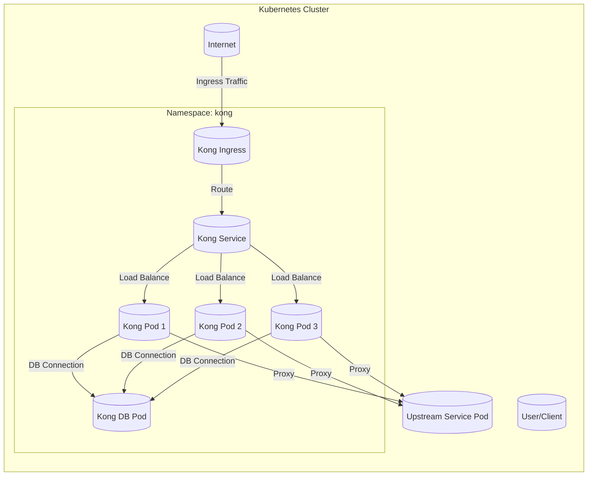
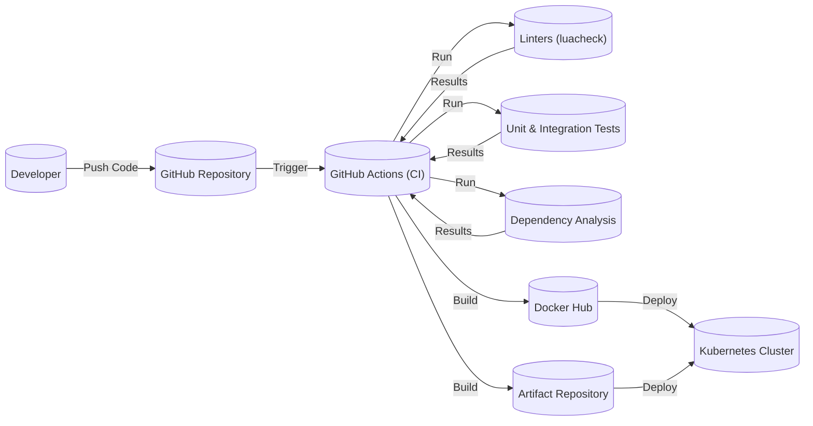

Okay, let's create a design document for the Kong API Gateway, keeping in mind its purpose and potential security considerations.

# BUSINESS POSTURE

Kong is an open-source API Gateway and Microservices Management Layer.  It's designed to sit in front of RESTful APIs and extend their functionality with plugins.  The business priorities and goals that Kong addresses are:

*   Scalability:  Allowing organizations to handle increasing API traffic without performance degradation.
*   Centralized Management:  Providing a single point of control for managing multiple APIs and microservices.
*   Extensibility:  Enabling the addition of features like authentication, rate limiting, and transformations without modifying the underlying services.
*   Reliability:  Ensuring high availability and fault tolerance for API traffic.
*   Security: Protecting backend services from unauthorized access and malicious traffic.
*   Observability: Providing insights into API usage and performance through logging, monitoring, and analytics.
*   Faster Time to Market: Reducing the complexity of building and deploying APIs, allowing developers to focus on core business logic.

Most important business risks that need to be addressed:

*   Unauthorized API Access:  If Kong is misconfigured or compromised, attackers could gain access to sensitive backend services and data.
*   Denial of Service (DoS):  Overwhelming Kong with requests could make APIs unavailable to legitimate users.
*   Data Breaches:  Sensitive data transmitted through Kong could be intercepted or exposed if proper security measures are not in place.
*   Plugin Vulnerabilities:  Vulnerabilities in Kong plugins could be exploited to compromise the gateway or backend services.
*   Configuration Errors:  Incorrect configuration of Kong can lead to security loopholes or performance issues.
*   Lack of Auditing:  Without proper logging and auditing, it can be difficult to detect and investigate security incidents.

# SECURITY POSTURE

Kong, being an API gateway, inherently acts as a security control point. Here's a breakdown of its existing security controls, accepted risks, recommendations, and security requirements:

Existing Security Controls:

*   security control: Authentication Plugins: Kong provides various authentication plugins (Key Auth, JWT, OAuth 2.0, Basic Auth, LDAP) to verify the identity of API consumers. Implemented as plugins.
*   security control: Authorization Plugins:  Plugins like the ACL (Access Control List) plugin can be used to enforce authorization rules, controlling which consumers can access specific APIs. Implemented as plugins.
*   security control: Rate Limiting Plugins:  Protect backend services from overload and abuse by limiting the number of requests from a particular consumer. Implemented as plugins.
*   security control: Request Transformation Plugins:  Modify incoming requests before they reach the backend service, potentially removing sensitive headers or adding required parameters. Implemented as plugins.
*   security control: Response Transformation Plugins: Modify outgoing responses, potentially masking sensitive data or adding security headers. Implemented as plugins.
*   security control: IP Restriction Plugin: Allow or deny access based on the client's IP address. Implemented as plugins.
*   security control: SSL/TLS Termination: Kong can handle SSL/TLS encryption and decryption, ensuring secure communication between clients and the gateway. Implemented in core.
*   security control: Logging Plugins:  Capture details about API requests and responses, which can be used for auditing and security analysis. Implemented as plugins.
*   security control: Admin API Security: The Kong Admin API, used for configuring the gateway, can be secured with authentication and access control. Implemented in core.

Accepted Risks:

*   accepted risk: Plugin Security:  The security of Kong relies heavily on the security of the plugins used.  Vulnerabilities in third-party plugins can pose a risk.
*   accepted risk: Configuration Complexity:  Kong's extensive configuration options can lead to misconfigurations if not managed carefully.
*   accepted risk: Default Credentials:  If default credentials for the Admin API or database are not changed, attackers could gain control of the gateway.
*   accepted risk: Upstream Service Security: Kong acts as a gateway, but it cannot guarantee the security of the backend services it proxies.

Recommended Security Controls:

*   security control: Web Application Firewall (WAF): Integrate a WAF (e.g., ModSecurity) with Kong to protect against common web attacks like SQL injection and cross-site scripting.
*   security control: Mutual TLS (mTLS):  Implement mTLS between Kong and backend services to ensure that only authorized services can communicate with each other.
*   security control: Regular Security Audits:  Conduct regular security audits of Kong's configuration and plugins to identify and address potential vulnerabilities.
*   security control: Intrusion Detection System (IDS): Deploy an IDS to monitor network traffic and detect malicious activity targeting Kong.

Security Requirements:

*   Authentication:
    *   Strong authentication mechanisms should be used to verify the identity of API consumers.
    *   Support for multi-factor authentication (MFA) should be considered for sensitive APIs.
    *   API keys and other credentials should be securely stored and managed.

*   Authorization:
    *   Fine-grained authorization rules should be enforced to control access to specific APIs and resources.
    *   The principle of least privilege should be applied, granting only the necessary permissions to each consumer.

*   Input Validation:
    *   All input received from clients should be validated to prevent injection attacks and other vulnerabilities.
    *   Input validation should be performed both at the gateway level and within the backend services.

*   Cryptography:
    *   SSL/TLS should be used to encrypt all communication between clients and Kong, and between Kong and backend services.
    *   Strong cryptographic algorithms and key lengths should be used.
    *   Sensitive data should be encrypted at rest and in transit.

# DESIGN

## C4 CONTEXT

```mermaid
graph LR
    subgraph Kong System
        Kong[("Kong API Gateway")]
    end
    User[("User/Client")]
    UpstreamService1[("Upstream Service 1")]
    UpstreamService2[("Upstream Service 2")]
    KongDatabase[(("Kong Database"))]
    Admin[("Administrator")]
    MonitoringSystem[("Monitoring System")]

    User -- "API Requests" --> Kong
    Kong -- "Proxied Requests" --> UpstreamService1
    Kong -- "Proxied Requests" --> UpstreamService2
    Kong -- "Configuration Data" --> KongDatabase
    Admin -- "Configuration" --> Kong
    Kong -- "Metrics & Logs" --> MonitoringSystem
```

C4 Context Element Descriptions:

*   User/Client:
    *   Name: User/Client
    *   Type: External User
    *   Description: Represents any user or application that consumes APIs exposed through Kong.
    *   Responsibilities: Initiates API requests to Kong.
    *   Security controls: Authentication (API Key, JWT, OAuth2, etc.), Rate Limiting, IP Restriction.

*   Kong API Gateway:
    *   Name: Kong API Gateway
    *   Type: System
    *   Description: The core Kong system, acting as a reverse proxy and providing API management features.
    *   Responsibilities: Receives API requests, applies plugins, routes requests to upstream services, returns responses to clients.
    *   Security controls: Authentication, Authorization, Rate Limiting, Request/Response Transformation, SSL/TLS Termination, Input Validation.

*   Upstream Service 1:
    *   Name: Upstream Service 1
    *   Type: External System
    *   Description: A backend service that provides API functionality.
    *   Responsibilities: Processes API requests and returns responses.
    *   Security controls: Should implement its own security measures (authentication, authorization, input validation). Kong can enforce policies, but the upstream service is ultimately responsible for its own security.

*   Upstream Service 2:
    *   Name: Upstream Service 2
    *   Type: External System
    *   Description: Another backend service that provides API functionality.
    *   Responsibilities: Processes API requests and returns responses.
    *   Security controls: Similar to Upstream Service 1.

*   Kong Database:
    *   Name: Kong Database
    *   Type: External System
    *   Description: A database (PostgreSQL or Cassandra) used by Kong to store configuration data.
    *   Responsibilities: Stores Kong's configuration, including services, routes, plugins, and consumers.
    *   Security controls: Database access control, encryption at rest, regular backups.

*   Administrator:
    *   Name: Administrator
    *   Type: External User
    *   Description: A user responsible for configuring and managing Kong.
    *   Responsibilities: Configures Kong through the Admin API or configuration files.
    *   Security controls: Strong authentication, access control, audit logging.

*   Monitoring System:
    *   Name: Monitoring System
    *   Type: External System
    *   Description: A system used to monitor Kong's performance and health.
    *   Responsibilities: Collects metrics and logs from Kong.
    *   Security controls: Secure communication with Kong, access control.

## C4 CONTAINER

```mermaid
graph LR
    subgraph Kong API Gateway
        AdminAPI[("Admin API")]
        Proxy[("Proxy Service")]
        PluginExecutor[("Plugin Executor")]
        Cache[("Data Cache")]
        KongDatabase[(("Kong Database"))]

        AdminAPI -- "Configuration" --> PluginExecutor
        AdminAPI -- "Configuration" --> Cache
        User[("User/Client")]
        UpstreamService[("Upstream Service")]

        User -- "API Request" --> Proxy
        Proxy -- "Request" --> PluginExecutor
        PluginExecutor -- "Modified Request" --> UpstreamService
        UpstreamService -- "Response" --> PluginExecutor
        PluginExecutor -- "Modified Response" --> Proxy
        Proxy -- "API Response" --> User
        PluginExecutor -- "Read/Write" --> Cache
        PluginExecutor -- "Read/Write Config" --> KongDatabase
    end
```

C4 Container Element Descriptions:

*   Admin API:
    *   Name: Admin API
    *   Type: Container (REST API)
    *   Description:  The RESTful API used to configure and manage Kong.
    *   Responsibilities:  Provides endpoints for managing services, routes, plugins, consumers, and other Kong entities.
    *   Security controls:  Authentication (Basic Auth, Key Auth), TLS, Access Control (RBAC or custom rules).

*   Proxy Service:
    *   Name: Proxy Service
    *   Type: Container (Reverse Proxy)
    *   Description:  The core component that handles incoming API requests and forwards them to upstream services.
    *   Responsibilities:  Receives requests, determines the appropriate upstream service based on routing rules, and forwards the request.
    *   Security controls:  TLS Termination, Request Validation (basic checks).

*   Plugin Executor:
    *   Name: Plugin Executor
    *   Type: Container (Component)
    *   Description:  The component responsible for executing Kong plugins.
    *   Responsibilities:  Loads and executes plugins in the configured order, applying their logic to requests and responses.
    *   Security controls:  Plugin Sandboxing (limited access to resources), Input Validation (within plugins).

*   Data Cache:
    *   Name: Data Cache
    *   Type: Container (In-Memory Cache)
    *   Description: An in-memory cache used to store frequently accessed data, such as routing information and plugin configurations.
    *   Responsibilities: Improves performance by reducing the need to access the database for every request.
    *   Security controls: Data encryption (if sensitive data is cached).

*   Kong Database:
    *   Name: Kong Database
    *   Type: External System (Database)
    *   Description:  A database (PostgreSQL or Cassandra) used by Kong to store configuration data.
    *   Responsibilities:  Stores Kong's configuration, including services, routes, plugins, and consumers.
    *   Security controls:  Database access control, encryption at rest, regular backups.

## DEPLOYMENT

Kong can be deployed in various ways, including:

1.  Traditional Deployment:  Installing Kong directly on virtual machines or bare-metal servers.
2.  Containerized Deployment:  Using Docker to run Kong in containers.
3.  Kubernetes Deployment:  Deploying Kong as a Kubernetes Ingress Controller or using a custom deployment.
4.  Cloud-Based Deployment:  Using managed services like AWS API Gateway or Azure API Management, which offer similar functionality to Kong.

We'll describe a Kubernetes deployment in detail, as it's a common and recommended approach.



Deployment Element Descriptions:

*   Kubernetes Cluster:
    *   Name: Kubernetes Cluster
    *   Type: Infrastructure
    *   Description: The Kubernetes cluster where Kong is deployed.
    *   Responsibilities: Orchestrates and manages the Kong containers.
    *   Security controls: Kubernetes RBAC, Network Policies, Pod Security Policies.

*   Namespace: kong:
    *   Name: Namespace: kong
    *   Type: Logical Grouping
    *   Description: A Kubernetes namespace dedicated to Kong resources.
    *   Responsibilities: Isolates Kong resources from other applications in the cluster.
    *   Security controls: Namespace-level access control.

*   Kong Pod (1, 2, 3):
    *   Name: Kong Pod (1, 2, 3)
    *   Type: Container Instance
    *   Description:  Instances of the Kong container running within Kubernetes pods. Multiple pods provide high availability and scalability.
    *   Responsibilities:  Handles API requests, executes plugins, and communicates with the database.
    *   Security controls:  All Kong security controls (Authentication, Authorization, etc.), Pod Security Policies.

*   Kong DB Pod:
    *   Name: Kong DB Pod
    *   Type: Container Instance
    *   Description: A pod running the database (PostgreSQL or Cassandra) used by Kong.
    *   Responsibilities: Stores Kong's configuration data.
    *   Security controls: Database access control, encryption at rest, regular backups, Pod Security Policies.

*   Kong Service:
    *   Name: Kong Service
    *   Type: Kubernetes Service
    *   Description: A Kubernetes Service that exposes the Kong pods to external traffic.
    *   Responsibilities: Load balances traffic across the Kong pods.
    *   Security controls: Network Policies.

*   Kong Ingress:
    *   Name: Kong Ingress
    *   Type: Kubernetes Ingress
    *   Description: A Kubernetes Ingress resource that defines how external traffic should be routed to the Kong Service.
    *   Responsibilities:  Provides a single entry point for external traffic to the cluster.
    *   Security controls:  TLS termination (if configured), Ingress rules.

*   Internet:
    *   Name: Internet
    *   Type: External Network
    *   Description: The public internet.
    *   Responsibilities: N/A
    *   Security controls: N/A

*   User/Client:
    *   Name: User/Client
    *   Type: External User
    *   Description: Represents any user or application that consumes APIs exposed through Kong.
    *   Responsibilities: Initiates API requests to Kong.
    *   Security controls: Authentication (API Key, JWT, OAuth2, etc.), Rate Limiting, IP Restriction.

*   Upstream Service Pod:
    *   Name: Upstream Service Pod
    *   Type: Container Instance
    *   Description: Pods running the upstream services.
    *   Responsibilities: Processes API requests and returns responses.
    *   Security controls: Should implement its own security measures.

## BUILD

Kong's build process involves several steps, from source code to deployable artifacts. Here's a description, focusing on security controls:

1.  Development: Developers write code for Kong (primarily Lua and OpenResty) and plugins.
2.  Source Code Management: Code is stored in a Git repository (GitHub).
    *   security control: Access control to the repository.
    *   security control: Branch protection rules (requiring code reviews, passing tests).
3.  Continuous Integration (CI):  GitHub Actions are used to automate the build process.
    *   security control: Automated testing (unit tests, integration tests).
    *   security control: Static analysis (using tools like luacheck to identify potential code quality and security issues).
    *   security control: Dependency analysis (checking for known vulnerabilities in dependencies).
4.  Artifact Creation:  The CI process builds Kong packages (e.g., .deb, .rpm) and Docker images.
5.  Artifact Storage:  Packages and images are stored in repositories (e.g., Docker Hub, package repositories).
    *   security control: Access control to artifact repositories.
    *   security control: Image signing (to verify the integrity of Docker images).
6.  Deployment:  The artifacts are deployed to the target environment (e.g., Kubernetes cluster).



# RISK ASSESSMENT

*   Critical Business Processes:
    *   API Access:  Providing secure and reliable access to APIs is the core business process.
    *   API Management:  Managing the lifecycle of APIs, including deployment, versioning, and monitoring.
    *   Service Connectivity:  Facilitating communication between different services and applications.

*   Data Sensitivity:
    *   Personally Identifiable Information (PII):  If APIs handle PII, protecting this data is critical.  Sensitivity: High.
    *   Financial Data:  APIs that handle financial transactions or data require the highest level of security. Sensitivity: High.
    *   Authentication Credentials:  API keys, tokens, and other credentials used for authentication must be protected. Sensitivity: High.
    *   Configuration Data:  Kong's configuration data, including upstream service details and plugin configurations, should be protected. Sensitivity: Medium.
    *   API Request/Response Data:  The actual data transmitted through APIs can vary in sensitivity, depending on the specific API. Sensitivity: Variable (Low to High).

# QUESTIONS & ASSUMPTIONS

*   Questions:
    *   What specific compliance requirements (e.g., PCI DSS, HIPAA) apply to the systems using Kong?
    *   What is the expected traffic volume and growth rate for the APIs?
    *   What are the existing security policies and procedures within the organization?
    *   What is the level of expertise of the team managing Kong?
    *   What are the specific upstream services that Kong will be proxying?
    *   What is organization risk appetite?

*   Assumptions:
    *   BUSINESS POSTURE: The organization prioritizes API security and availability.
    *   SECURITY POSTURE: Basic security controls (firewalls, network segmentation) are in place at the infrastructure level.
    *   DESIGN: Kong will be deployed in a high-availability configuration. The database used by Kong is properly secured and backed up. Developers writing custom plugins follow secure coding practices.