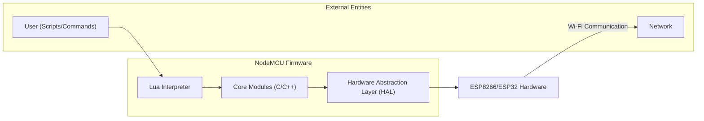
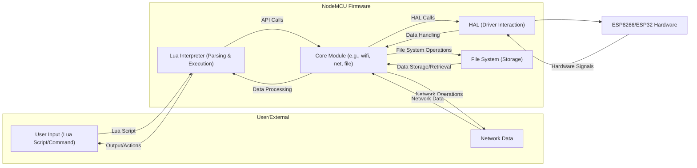

# Project Design Document: NodeMCU Firmware

**Version:** 1.1
**Date:** October 26, 2023
**Author:** AI Software Architect

## 1. Introduction

This document provides an enhanced architectural design of the NodeMCU firmware project, based on the repository found at [https://github.com/nodemcu/nodemcu-firmware](https://github.com/nodemcu/nodemcu-firmware). This detailed design is specifically created to facilitate thorough threat modeling. It aims to clearly articulate the system's components, their interactions, and data flows, thereby enabling security experts to identify potential vulnerabilities and attack vectors.

## 2. Goals and Non-Goals

**Goals:**

*   Present a refined and more detailed overview of the NodeMCU firmware architecture, emphasizing security-relevant aspects.
*   Clearly identify key components, their specific functionalities, and their interfaces.
*   Provide a comprehensive description of data flow within the firmware, highlighting potential points of interception or manipulation.
*   Explicitly highlight potential areas of security concern based on the detailed design, serving as direct input for threat identification.
*   Serve as a robust and actionable foundation for subsequent threat modeling exercises by security professionals.

**Non-Goals:**

*   Provide an exhaustive, line-by-line code analysis of the entire codebase.
*   Detail every single function or API call available within the firmware.
*   Include highly granular implementation details that are prone to frequent changes.
*   Present a completed security audit, penetration testing report, or specific vulnerability assessments.

## 3. High-Level Architecture

The NodeMCU firmware is architected to operate efficiently on resource-constrained microcontrollers like the ESP8266 and ESP32. It offers a high-level scripting environment using Lua, enabling developers to interact with the device's hardware and network capabilities.

**Components:**

*   **User (Scripts/Commands):** Represents any external entity interacting with the NodeMCU device. This includes users uploading Lua scripts, sending commands via serial interfaces (like UART), or interacting through network protocols. This is a primary entry point for potential attacks.
*   **Lua Interpreter:** The central component responsible for parsing and executing Lua scripts provided by the user. It acts as a bridge between user-level scripts and the underlying system functionalities. Security vulnerabilities here could allow for arbitrary code execution.
*   **Core Modules (C/C++):** A collection of pre-compiled modules written in C/C++ that expose hardware and software functionalities to the Lua environment. These modules handle critical operations and are potential targets for exploitation if vulnerabilities exist. Examples include:
    *   `wifi`: Manages Wi-Fi connections and network configurations.
    *   `net`: Handles network protocols like TCP/IP and UDP.
    *   `file`: Provides access to the device's file system.
    *   `gpio`: Controls the general-purpose input/output pins.
    *   `crypto`: Offers cryptographic functionalities.
*   **Hardware Abstraction Layer (HAL):** A layer of code that provides a consistent and abstracted interface to the underlying hardware. This isolates the core modules from the specific details of the ESP8266 or ESP32 hardware. Vulnerabilities in the HAL could lead to direct hardware manipulation.
*   **ESP8266/ESP32 Hardware:** The physical microcontroller unit, encompassing the CPU, memory, Wi-Fi radio, and various peripherals. Physical access or vulnerabilities at this level can have severe consequences.
*   **Network:** Represents the external network the NodeMCU device connects to, a common attack vector for network-connected devices.

## 4. Component Details

This section provides a more granular description of the key components, focusing on aspects relevant to security.

*   **Lua Interpreter:**
    *   Executes user-provided Lua scripts, making it a critical point for input validation and sanitization.
    *   Relies on a C API to interact with the core modules, potential vulnerabilities in this interface could be exploited.
    *   Manages memory allocation for Lua scripts, making it susceptible to memory-related vulnerabilities if not handled correctly.
    *   The security of the Lua standard library and any custom Lua libraries included is paramount.

*   **Core Modules (C/C++):**
    *   **`wifi` module:** Handles sensitive operations like storing Wi-Fi credentials and establishing network connections. Vulnerabilities here could lead to unauthorized network access or disclosure of credentials.
    *   **`net` module:** Responsible for handling network data. Buffer overflows or format string vulnerabilities in this module could be exploited through network traffic. Proper handling of network protocols and data parsing is crucial.
    *   **`file` module:** Manages access to the file system, where sensitive data like configuration files or user data might be stored. Insecure file handling could lead to data breaches or unauthorized modifications.
    *   **`gpio` module:** While seemingly less critical, improper control over GPIO pins could be exploited to cause physical damage or disrupt connected hardware.
    *   **`crypto` module:** The security of cryptographic operations depends heavily on the correct implementation and usage of this module. Weak or flawed cryptography can render data vulnerable.
    *   **`mqtt` module:** Handles communication using the MQTT protocol. Security considerations include proper authentication, authorization, and secure communication channels (TLS).
    *   **`http` module:**  If the device hosts a web server, vulnerabilities in this module could allow for web-based attacks. If it acts as a client, it needs to securely handle responses.
    *   **`uart` module:** Serial communication, if not properly secured, can be a point of attack for local access.

*   **Hardware Abstraction Layer (HAL):**
    *   Provides low-level access to hardware peripherals. Vulnerabilities here could allow for direct manipulation of hardware components, bypassing higher-level security measures.
    *   The security of device drivers within the HAL is critical.

## 5. Data Flow

The following diagram illustrates the typical data flow within the NodeMCU firmware, highlighting potential security checkpoints.

**Data Flow Description:**

1. **User Input:** User provides input (Lua scripts or commands) via serial, network, or other interfaces. This is the initial entry point and requires strict input validation.
2. **Lua Interpreter (Parsing & Execution):** The interpreter parses and executes the Lua script. Security checks should be in place to prevent malicious scripts from executing dangerous commands or exploiting vulnerabilities.
3. **Core Module Interaction:** The Lua interpreter calls functions within the core modules to perform specific tasks. Data passed between the interpreter and core modules needs careful validation.
4. **HAL Interaction:** Core modules interact with the HAL to control hardware. Data passed to the HAL should be sanitized to prevent unexpected hardware behavior or exploits.
5. **Hardware Interaction:** The HAL directly interacts with the ESP8266/ESP32 hardware.
6. **Network Operations:** Core modules like `wifi` and `net` handle network communication, receiving and sending data. Network data is a significant attack vector and requires robust security measures (e.g., TLS, input validation).
7. **File System Operations:** Core modules like `file` interact with the file system for storage and retrieval. Access control and secure storage practices are essential here.

## 6. Security Considerations

Based on the detailed architecture and data flow, the following security considerations are paramount for threat modeling:

*   **Lua Script Injection:** The ability to execute arbitrary Lua scripts presents a significant risk. Without proper sandboxing or input validation, malicious scripts could compromise the entire system.
*   **Buffer Overflows in Core Modules:** Due to the use of C/C++, vulnerabilities like buffer overflows in core modules (especially those handling network data or file parsing) are potential attack vectors.
*   **Insecure Network Communication:** Lack of encryption (e.g., TLS/SSL) for network communication exposes sensitive data to eavesdropping and manipulation.
*   **Weak Credential Management:** Storing sensitive credentials (Wi-Fi passwords, API keys) insecurely (e.g., in plaintext in the file system or in easily reversible formats) can lead to unauthorized access.
*   **Denial of Service (DoS):** Malicious scripts or network attacks could exploit resource limitations, leading to a denial of service.
*   **Insecure Firmware Updates:** A compromised firmware update mechanism could allow attackers to install malicious firmware. Secure boot and verified updates are crucial.
*   **Side-Channel Attacks:** Depending on the implementation of cryptographic algorithms, side-channel attacks (e.g., timing attacks) might be possible.
*   **Memory Corruption Vulnerabilities:** Bugs in the Lua interpreter or core modules could lead to memory corruption, potentially allowing for arbitrary code execution.
*   **GPIO Pin Manipulation:** Unauthorized manipulation of GPIO pins could have physical consequences, depending on the connected hardware.
*   **Exposure of Debug Interfaces:** Unsecured debug interfaces (JTAG, UART) can provide attackers with direct access to the system.
*   **Insufficient Input Validation:** Lack of proper input validation at various stages (Lua scripts, network data, file inputs) can lead to various vulnerabilities.
*   **Cross-Site Scripting (XSS) if Web Interface Exists:** If the device hosts a web interface, it is susceptible to XSS vulnerabilities if user-provided data is not properly sanitized.
*   **Insecure Deserialization:** If the firmware deserializes data from untrusted sources, vulnerabilities in the deserialization process could be exploited.

## 7. Dependencies

The NodeMCU firmware relies on several external components and libraries, each with its own security considerations:

*   **ESP-IDF (Espressif IoT Development Framework):** The underlying SDK. Security vulnerabilities in ESP-IDF can directly impact NodeMCU. Keeping ESP-IDF updated is crucial.
*   **Lua:** The scripting language. Security vulnerabilities in the Lua interpreter itself could be exploited.
*   **lwIP:** A lightweight TCP/IP stack. Known vulnerabilities in lwIP need to be addressed.
*   **mbed TLS (or similar):** Provides cryptographic functionalities. The security of the cryptographic implementation is paramount.
*   **SPIFFS/LittleFS:** File systems used for storage. Vulnerabilities in the file system implementation could lead to data corruption or information disclosure.
*   **Third-party Lua libraries:** Any external Lua libraries included in the firmware can introduce new vulnerabilities.

## 8. Deployment

The deployment process involves flashing the firmware onto the ESP device, which presents potential security risks:

*   **Physical Access Required:** The flashing process typically requires physical access to the device, making it vulnerable to attacks if the device is not physically secured.
*   **Compromised Flashing Tools:** If the flashing tools used are compromised, they could inject malicious code into the firmware.
*   **Unsecured Flashing Protocol:** If the communication between the flashing tool and the device is not secure, it could be intercepted or manipulated.
*   **Rollback Attacks:** If the firmware update process doesn't prevent downgrading to older, vulnerable versions, rollback attacks are possible.

## 9. Future Considerations

Future developments could introduce new security challenges:

*   **Integration with Cloud Services:** Connecting to cloud services introduces new attack vectors related to cloud security and API security.
*   **Over-the-Air (OTA) Updates:** While convenient, OTA updates require robust security measures to prevent malicious updates.
*   **Support for New Protocols:** Implementing new network protocols or communication methods can introduce new vulnerabilities if not done securely.
*   **Increased Complexity:** As the firmware grows in complexity, the likelihood of introducing security vulnerabilities increases.

This enhanced design document provides a more detailed and security-focused view of the NodeMCU firmware architecture. This information is essential for conducting a comprehensive threat modeling exercise to identify potential vulnerabilities and design appropriate security mitigations.