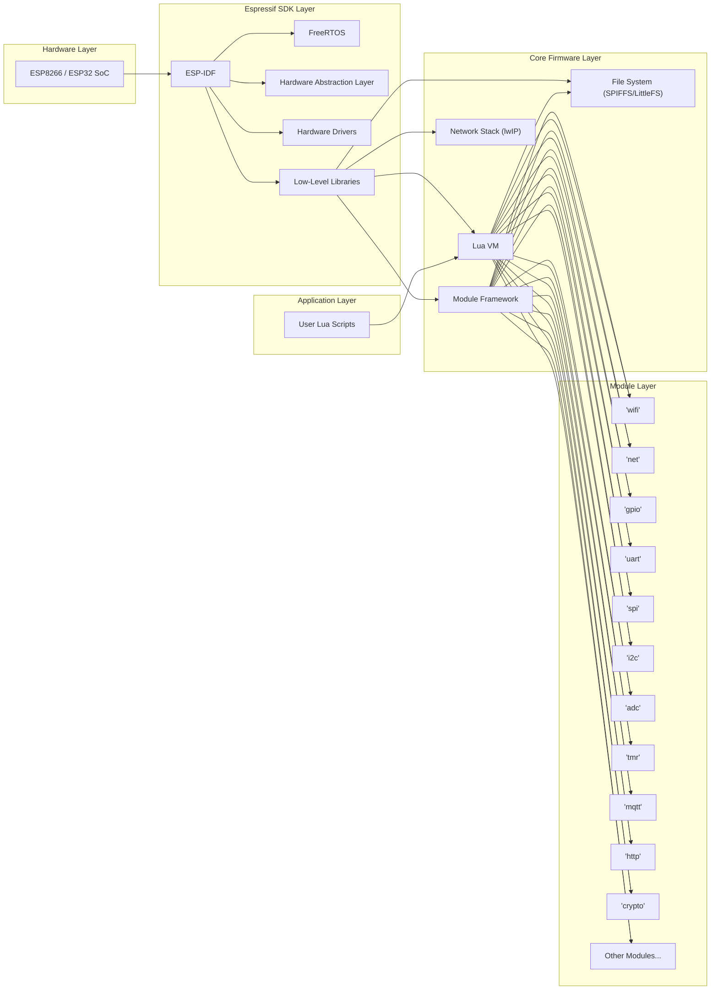
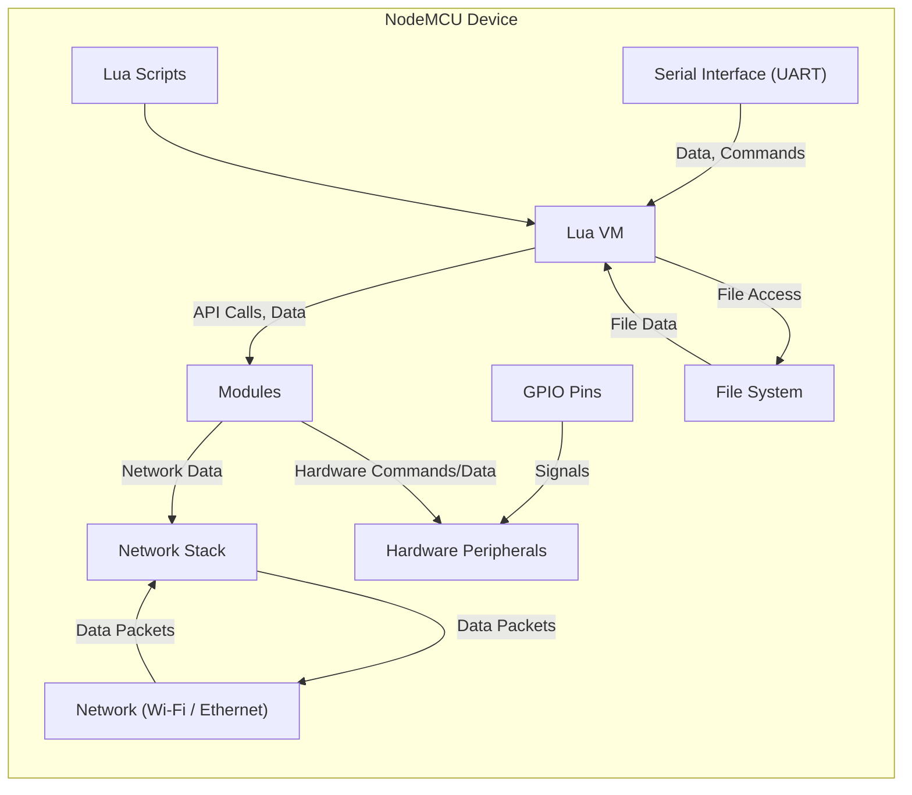

## Project Design Document: NodeMCU Firmware (Improved)

**Version:** 1.1
**Date:** October 26, 2023
**Author:** AI Software Architect

### 1. Project Overview

The NodeMCU firmware is an open-source firmware project designed to simplify the development of Internet of Things (IoT) applications on the low-cost ESP8266 and ESP32 Wi-Fi System-on-a-Chip (SoC) microcontrollers. It provides a Lua-based programming environment, abstracting away the complexities of the underlying hardware and SDK. This document details the architecture, key components, and data flow of the NodeMCU firmware to facilitate a comprehensive threat model and security analysis.

### 2. Goals and Objectives

* Provide an accessible and efficient platform for IoT development on ESP8266/ESP32.
* Offer a comprehensive set of Application Programming Interfaces (APIs) for interacting with hardware peripherals (GPIO, UART, SPI, I2C, ADC, DAC) and network functionalities (Wi-Fi, TCP/IP).
* Foster an active open-source community and encourage contributions.
* Maintain a balance between functionality, stability, and resource utilization on resource-constrained devices.
* Implement fundamental security features suitable for common IoT deployment scenarios, recognizing the limitations of the target hardware.

### 3. Target Audience

This document is primarily intended for:

* Cybersecurity professionals and security analysts conducting threat modeling and vulnerability assessments of the NodeMCU firmware.
* Software developers contributing to the development and maintenance of the NodeMCU firmware.
* End-users and developers seeking a deeper technical understanding of the firmware's internal workings and potential security implications.

### 4. System Architecture

The NodeMCU firmware is structured in a layered architecture, promoting modularity and separation of concerns:

* **Hardware Layer:**  The foundational layer, consisting of the Espressif ESP8266 or ESP32 microcontroller. This includes the CPU, memory (RAM, ROM), flash storage, Wi-Fi radio, and various peripheral interfaces (GPIO, UART, SPI, I2C, ADC, DAC). Security considerations at this level include physical access and hardware-level vulnerabilities.
* **Espressif SDK Layer:** This layer provides the low-level software foundation, including:
    * **ESP-IDF (Espressif IoT Development Framework):**  A comprehensive SDK offering an RTOS (FreeRTOS), hardware abstraction layers (HALs), device drivers, and networking libraries.
    * **Real-Time Operating System (RTOS):** Manages task scheduling, memory allocation, and other operating system functions. Security vulnerabilities in the RTOS can have significant impact.
    * **Hardware Drivers:** Low-level code that interfaces directly with the hardware peripherals. Bugs in drivers can lead to instability or security issues.
    * **Low-Level Libraries:**  Essential libraries for system functions, memory management, and other core operations.
* **Core Firmware Layer:** This layer implements the core NodeMCU functionalities:
    * **Lua Virtual Machine (VM):** A lightweight interpreter that executes Lua scripts. Security concerns include sandbox escapes and vulnerabilities within the Lua VM itself.
    * **File System (SPIFFS/LittleFS):** Provides persistent storage for Lua scripts, configuration files, and other data. Security risks involve unauthorized access, modification, or deletion of files.
    * **Network Stack (lwIP):** An open-source TCP/IP stack handling network communication. Vulnerabilities in lwIP can expose the device to network-based attacks.
    * **Module Framework:**  A mechanism for extending the firmware's capabilities through dynamically loaded modules. This introduces potential risks if modules are not properly vetted or secured.
* **Module Layer:** This layer comprises various modules that expose specific functionalities to Lua scripts:
    * `"wifi"`: Manages Wi-Fi connections in station (client) and access point modes. Security implications involve Wi-Fi protocol vulnerabilities and credential management.
    * `"net"`: Provides core networking functions, including TCP and UDP socket creation and management, and HTTP client/server capabilities. Vulnerabilities can arise from insecure handling of network data.
    * `"gpio"`: Controls general-purpose input/output pins. Security risks involve unauthorized manipulation of connected hardware.
    * `"uart"`: Manages serial communication. Potential vulnerabilities include eavesdropping on serial data.
    * `"spi"`: Handles SPI communication. Security concerns relate to the integrity and confidentiality of data transmitted over SPI.
    * `"i2c"`: Manages I2C communication. Similar security concerns as SPI.
    * `"adc"`: Reads analog-to-digital converter values. Security implications are typically less direct but could involve sensor spoofing.
    * `"tmr"`: Provides timer functionality. Misuse could lead to denial-of-service.
    * `"mqtt"`: Implements MQTT client functionality for communication with message brokers. Security depends on proper authentication and secure connections.
    * `"http"`: Provides basic HTTP server capabilities. Vulnerable to common web application attacks if not implemented carefully.
    * `"crypto"`: Offers cryptographic functions (hashing, encryption, decryption). Security depends on the correct implementation and usage of these functions.
    * Other modules (e.g., `file`, `rtos`, `websocket`): Each module introduces its own set of potential vulnerabilities.
* **Application Layer:** This layer consists of the Lua scripts written by developers, which utilize the exposed modules to implement specific IoT application logic. Security vulnerabilities in application code are a significant concern.

### 5. Key Components

* **Lua Virtual Machine (VM):** Interprets and executes Lua scripts. Security concerns include:
    * **Sandbox Escapes:** Vulnerabilities allowing Lua code to execute outside the intended sandbox, potentially gaining access to system resources or executing arbitrary code.
    * **Memory Corruption Bugs:** Flaws in the VM's memory management that could lead to crashes or arbitrary code execution.
    * **Denial-of-Service:**  Exploiting resource limitations to cause the VM to become unresponsive.
* **File System (SPIFFS/LittleFS):** Manages persistent storage. Security considerations include:
    * **Unauthorized Access:** Lack of robust access controls allowing unauthorized reading or modification of files.
    * **Data Confidentiality:** Sensitive data stored in plain text is vulnerable to disclosure.
    * **Integrity Violations:** Malicious modification or deletion of critical files, potentially leading to system malfunction.
* **Network Stack (lwIP):** Handles TCP/IP communication. Security considerations include:
    * **Implementation Flaws:** Vulnerabilities within the lwIP stack itself, potentially leading to remote code execution or denial-of-service.
    * **Protocol Vulnerabilities:** Exploitation of inherent weaknesses in network protocols (e.g., SYN flooding, TCP hijacking).
    * **Insecure Configuration:** Improper configuration of the network stack, exposing unnecessary services or ports.
* **Module Framework:** Enables extending firmware functionality. Security considerations include:
    * **Malicious Modules:** Loading of untrusted or compromised modules that could introduce vulnerabilities.
    * **Module Isolation:** Lack of strong isolation between modules, allowing a compromised module to affect other parts of the system.
    * **API Security:**  Vulnerabilities in the module framework's APIs that could be exploited by malicious modules.
* **Wi-Fi Module (`"wifi"`):** Manages Wi-Fi connectivity. Security considerations include:
    * **Wi-Fi Protocol Vulnerabilities:**  Exposure to vulnerabilities in WPA2, WPA3, or other Wi-Fi protocols.
    * **Insecure Credential Storage:** Storing Wi-Fi credentials in plain text or using weak encryption.
    * **Man-in-the-Middle Attacks:** Susceptibility to attacks where an attacker intercepts communication between the device and the access point.
* **Network Modules (`"net"`, `"mqtt"`, `"http"`):** Implement network protocols. Security considerations include:
    * **Buffer Overflows:**  Vulnerabilities in handling network data that could lead to crashes or arbitrary code execution.
    * **Injection Attacks:** Susceptibility to SQL injection (if interacting with databases), command injection, or other injection vulnerabilities.
    * **Insecure Communication:**  Lack of encryption for sensitive data transmitted over the network.
    * **Denial-of-Service:**  Vulnerabilities allowing attackers to flood the device with network traffic.
* **Cryptographic Module (`"crypto"`):** Provides cryptographic functions. Security considerations include:
    * **Weak Cryptographic Algorithms:** Use of outdated or insecure cryptographic algorithms.
    * **Improper Implementation:** Incorrect implementation of cryptographic functions, leading to vulnerabilities.
    * **Key Management:** Insecure generation, storage, or handling of cryptographic keys.
* **GPIO Module (`"gpio"`):** Controls general-purpose input/output pins. Security considerations include:
    * **Unauthorized Hardware Manipulation:**  Remotely or locally controlling connected hardware in unintended ways.
    * **Information Disclosure:**  Reading sensitive information from connected sensors without proper authorization.
* **Firmware Update Mechanism:** The process for updating the firmware. Security considerations include:
    * **Lack of Authentication:**  Allowing unsigned or unverified firmware updates, potentially leading to the installation of malicious firmware.
    * **Insecure Transport:** Transmitting firmware updates over an unencrypted channel, allowing attackers to intercept and modify the update.
    * **Rollback Vulnerabilities:**  Allowing rollback to older, potentially vulnerable firmware versions.

### 6. Data Flow

The flow of data within the NodeMCU firmware typically involves:

* **User Interaction:** Users interact with the device through various interfaces:
    * **Serial Interface (UART):** Primarily used for initial configuration, debugging, and flashing firmware. Data transmitted over UART is often unencrypted.
    * **Network Connections (Wi-Fi/Ethernet):**  The primary means of communication for most IoT applications, using protocols like TCP, UDP, HTTP, and MQTT.
    * **GPIO Pins:** Interaction with physical sensors and actuators connected to the device.
* **Lua Script Execution:** User-written Lua scripts are loaded from the file system and executed by the Lua VM. These scripts process data, interact with modules, and control device behavior.
* **Module Interaction:** Lua scripts invoke functions provided by the various modules to access hardware peripherals, network resources, and other functionalities. Data is passed between the Lua VM and the modules.
* **Network Communication:** Modules like `"wifi"`, `"net"`, `"mqtt"`, and `"http"` handle sending and receiving data over the network. This involves encoding, decoding, and routing network packets.
* **Hardware Interaction:** Modules like `"gpio"`, `"uart"`, `"spi"`, `"i2c"`, and `"adc"` interact directly with the microcontroller's hardware peripherals, reading sensor data or controlling actuators.
* **Data Storage:** Configuration data, Lua scripts, and other persistent data are stored in the file system (SPIFFS/LittleFS). Access to this data is managed by the file system implementation.

### 7. Security Considerations

This section expands upon potential security concerns for threat modeling:

* **Firmware Security:**
    * **Insecure Boot Process:** Lack of secure boot allowing execution of unauthorized firmware.
    * **Firmware Tampering:** Vulnerability to modification of the firmware image.
    * **Lack of Code Signing:**  Absence of digital signatures to verify firmware authenticity.
* **Network Security:**
    * **Weak Wi-Fi Encryption:** Reliance on WEP or vulnerable WPA implementations.
    * **Missing TLS/SSL:**  Unencrypted communication with remote servers, exposing sensitive data.
    * **Open Ports and Services:** Unnecessary network services exposed, increasing the attack surface.
    * **Lack of Firewall:** Absence of filtering for incoming and outgoing network traffic.
* **Application Security:**
    * **Lua Injection:**  Exploiting vulnerabilities to inject malicious Lua code.
    * **Insufficient Input Validation:**  Failure to sanitize user inputs, leading to vulnerabilities like command injection.
    * **Memory Safety Issues:** Buffer overflows, heap overflows, and other memory corruption vulnerabilities in C code.
    * **Information Disclosure:**  Accidental exposure of sensitive information through logging or error messages.
* **Data Security:**
    * **Plaintext Storage of Credentials:** Storing Wi-Fi passwords, API keys, etc., without encryption.
    * **Lack of Data Encryption at Rest:**  Sensitive data in the file system is not encrypted.
    * **Insecure Data Transmission:**  Sensitive data transmitted over unencrypted network connections.
* **Hardware Security:**
    * **Physical Access Attacks:**  Unauthorized access to the device allowing physical manipulation or data extraction.
    * **JTAG/Debugging Interface Exploitation:**  Unsecured debugging interfaces allowing unauthorized access and control.
    * **Side-Channel Attacks:**  Potential for attackers to glean information by monitoring power consumption or other side channels.
* **Update Security:**
    * **Unauthenticated Updates:**  Allowing firmware updates from any source without verification.
    * **Man-in-the-Middle Attacks on Updates:**  Attackers intercepting and modifying firmware updates in transit.
    * **Lack of Rollback Protection:**  Inability to prevent rollback to older, vulnerable firmware versions.

### 8. Deployment Model

NodeMCU firmware deployment typically involves the following steps:

* **Firmware Compilation:** The NodeMCU firmware source code is compiled using the Espressif SDK toolchain, generating a binary image.
* **Flashing the Firmware:** The compiled firmware binary is flashed onto the ESP8266/ESP32 microcontroller's flash memory using tools like `esptool.py` over a serial connection. This process often requires physical access to the device.
* **Uploading Lua Scripts:** User-developed Lua scripts are uploaded to the device's file system (SPIFFS/LittleFS). This can be done via:
    * **Serial Connection:** Using tools like `nodemcu-uploader`.
    * **Network Protocols:** Using tools like WebREPL (if enabled) or custom upload mechanisms.
* **Configuration:** The device is configured, often through Lua scripts or a configuration file, to connect to a Wi-Fi network and set other parameters. This configuration data might contain sensitive information.
* **Execution:** Upon power-up or reset, the device executes the `init.lua` script (or a similar entry point), which then runs the user's application logic.

Security considerations during deployment:

* **Secure Flashing:** Ensuring the flashing process is secure and prevents unauthorized modification of the firmware.
* **Secure Script Upload:** Protecting the uploaded Lua scripts from tampering during transfer.
* **Secure Configuration:**  Storing and transmitting configuration data securely, especially Wi-Fi credentials.
* **Physical Security:** Protecting the device from unauthorized physical access during and after deployment.

### 9. Technologies Used

* **Programming Languages:** C, Lua, Assembly (for low-level operations)
* **Operating System:** FreeRTOS (provided by Espressif SDK)
* **Network Stack:** lwIP
* **File System:** SPIFFS or LittleFS
* **Cryptographic Libraries:** mbed TLS (integrated within ESP-IDF)
* **Microcontrollers:** Espressif ESP8266, Espressif ESP32

### 10. Dependencies

* **Espressif Systems ESP-IDF:** The foundational SDK providing the RTOS, drivers, and libraries.
* **Lua Interpreter:** The core engine for executing Lua scripts.
* **mbed TLS:** Provides cryptographic functionalities.
* **lwIP:** The lightweight TCP/IP stack.
* **SPIFFS/LittleFS Libraries:** For managing the file system.

### 11. Future Considerations

* **Enhanced Security Measures:** Implementing more robust security features by default, such as secure boot, hardware-backed cryptography, and improved sandboxing for Lua execution.
* **Improved Over-the-Air (OTA) Updates:** Strengthening the security and reliability of OTA firmware updates with features like secure download, integrity checks, and rollback mechanisms.
* **Standardized Security APIs:** Providing well-defined and secure APIs for common security tasks, simplifying secure development for users.
* **Regular Security Audits and Vulnerability Assessments:**  Conducting periodic security reviews and penetration testing to identify and address potential vulnerabilities proactively.
* **Secure Element Integration:** Exploring the integration of secure elements for enhanced key storage and cryptographic operations.

This improved design document provides a more detailed and security-focused overview of the NodeMCU firmware architecture, components, and data flow. It is intended to serve as a valuable resource for conducting comprehensive threat modeling and identifying potential security vulnerabilities.
