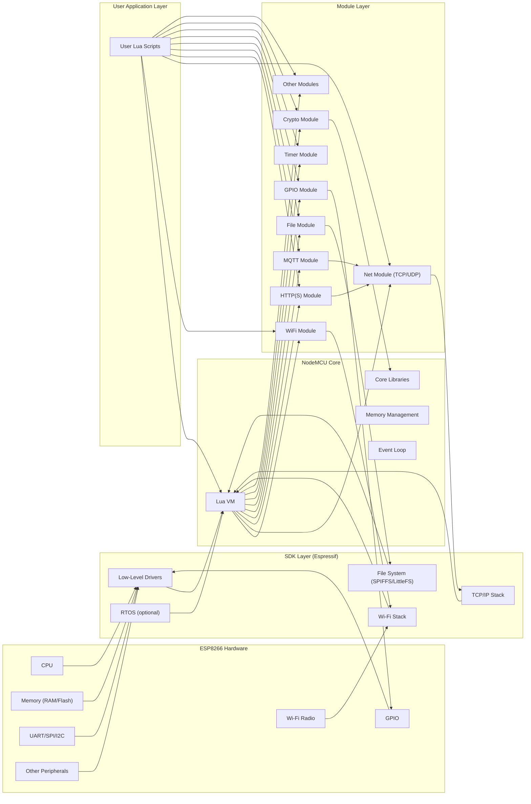
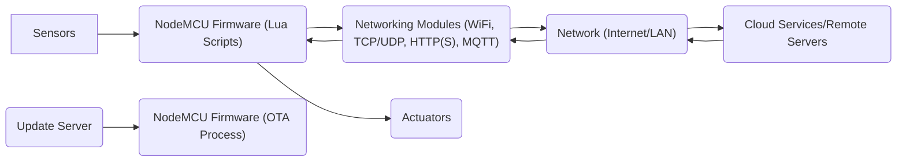

# Project Design Document: NodeMCU Firmware

**Version:** 1.1
**Date:** October 26, 2023
**Author:** AI Software Architect

## 1. Introduction

This document provides a detailed design overview of the NodeMCU firmware project, based on the repository found at [https://github.com/nodemcu/nodemcu-firmware](https://github.com/nodemcu/nodemcu-firmware). This document is intended to serve as a foundation for subsequent threat modeling activities. It outlines the key architectural components, data flows, and external interfaces of the firmware, with a particular focus on security considerations.

## 2. Project Overview

The NodeMCU firmware is an open-source firmware for the ESP8266 Wi-Fi System-on-a-Chip (SoC). It provides a Lua-based programming environment, enabling developers to create and deploy Internet of Things (IoT) applications rapidly. The firmware integrates a variety of modules that expose the ESP8266's hardware capabilities and networking functionalities through a user-friendly API.

## 3. Architectural Design

The NodeMCU firmware architecture is structured in a layered approach, promoting modularity and separation of concerns:

*   **Hardware Layer:** The foundation of the system, encompassing the ESP8266 microcontroller.
    *   Includes the CPU, memory (RAM and Flash), Wi-Fi radio, GPIO pins, UART, SPI, I2C, and other peripherals.
    *   Provides the physical resources for the firmware to operate.
*   **SDK Layer (Espressif Systems):** Provides low-level software support for the ESP8266 hardware.
    *   Offers drivers for peripherals, a Wi-Fi stack for managing wireless connections, and a TCP/IP stack for network communication.
    *   Includes file system implementations like SPIFFS or LittleFS for persistent storage.
    *   May optionally include a Real-Time Operating System (RTOS) for task management.
*   **NodeMCU Core:** The heart of the firmware, responsible for the Lua execution environment and core functionalities.
    *   Embeds the Lua Virtual Machine (Lua VM) to interpret and execute user scripts.
    *   Provides core libraries for memory management, event handling (the event loop), and basic system operations.
    *   Acts as a bridge between the SDK and the module layer.
*   **Module Layer:** Extends the core functionality by providing specific capabilities accessible through Lua.
    *   **Networking:** `wifi` (managing Wi-Fi connections), `net` (TCP and UDP socket communication), `http` and `https` (client functionality), `mqtt` (client functionality).
    *   **Hardware Interaction:** `gpio` (controlling GPIO pins), `spi`, `i2c`, `uart`, `adc`, `timer`.
    *   **Utilities:** `file` (file system access), `rtctime` (real-time clock), `crypto` (cryptographic functions).
    *   **Other Modules:**  Potentially including `websocket`, `coap`, etc.
*   **User Application Layer:** Consists of the Lua scripts developed by users to implement their specific IoT application logic.
    *   Leverages the APIs provided by the module layer to interact with hardware and network services.
    *   Defines the behavior and functionality of the NodeMCU device.

## 4. Data Flow

Data within the NodeMCU firmware flows through various stages, depending on the application:

*   **Sensor Data Acquisition:** User Lua scripts utilize the `gpio`, `adc`, `spi`, or `i2c` modules to read data from connected sensors.
*   **Local Processing:** The Lua VM executes the user scripts, processing the acquired sensor data. This might involve filtering, aggregation, or transformation.
*   **Network Transmission:** Processed data is often transmitted over the network using modules like `wifi` for establishing a connection and `net`, `http(s)`, or `mqtt` for sending data to servers or other devices.
    *   Examples: Sending sensor readings to a cloud platform via MQTT, posting data to a REST API using HTTP.
*   **Command Reception:** The device can receive commands from the network, typically through protocols like HTTP or MQTT.
*   **Local Action Execution:** Received commands are interpreted by the Lua scripts, which then use modules like `gpio` to control actuators or modify the device's behavior.
*   **Firmware Updates (OTA):**  The firmware can receive updates over the network, involving downloading new firmware images and flashing them to the ESP8266's flash memory.

## 5. Key Components and Security Considerations

This section details critical components and their associated security considerations:

*   **Lua Virtual Machine (Lua VM):** Executes user-provided Lua scripts.
    *   **Security Considerations:**
        *   **Code Injection:**  Vulnerable to code injection if user input is not properly sanitized before being used in Lua `loadstring` or similar functions.
        *   **Resource Exhaustion:** Malicious scripts could potentially consume excessive memory or CPU resources, leading to denial of service.
        *   **Limited Sandboxing:** The level of sandboxing provided by the NodeMCU core needs careful review to prevent unauthorized access to system resources.
*   **Wi-Fi Module:** Manages the device's connection to Wi-Fi networks.
    *   **Security Considerations:**
        *   **Weak or Default Credentials:** Susceptible to unauthorized access if configured with weak or default Wi-Fi passwords.
        *   **Man-in-the-Middle Attacks:** Vulnerable to MITM attacks if communication with the access point is not properly secured (e.g., using WPA3).
        *   **Exposure of Network Credentials:** Improper handling or storage of Wi-Fi credentials could lead to their compromise.
*   **Networking Modules (TCP/UDP, HTTP, MQTT):** Handle network communication.
    *   **Security Considerations:**
        *   **Lack of Encryption:** Transmitting sensitive data over unencrypted connections (plain HTTP, unencrypted MQTT) exposes it to eavesdropping.
        *   **Vulnerabilities in Protocol Implementations:** Potential flaws in the underlying TCP/IP stack or specific protocol implementations could be exploited.
        *   **Insufficient Input Validation:**  Failing to validate data received over the network can lead to buffer overflows or other vulnerabilities.
        *   **Replay Attacks:**  Susceptible to replay attacks if proper authentication and session management are not implemented.
*   **File System Module:** Provides access to the ESP8266's flash memory.
    *   **Security Considerations:**
        *   **Unauthorized Access:** Lack of access controls could allow malicious actors to read or modify sensitive files, including configuration data or stored credentials.
        *   **Data Tampering:**  The integrity of stored data could be compromised if not properly protected.
        *   **Information Disclosure:** Sensitive information stored in the file system could be exposed if the device is compromised.
*   **OTA Update Mechanism:** Enables firmware updates over the network.
    *   **Security Considerations:**
        *   **Insecure Update Channel:**  Downloading updates over unencrypted connections makes them susceptible to tampering.
        *   **Lack of Authentication:**  Failure to verify the authenticity of the update server or the firmware image can lead to the installation of malicious firmware.
        *   **Insufficient Integrity Checks:**  Without proper checksums or signatures, corrupted firmware could be installed, bricking the device or introducing vulnerabilities.
        *   **Rollback Vulnerabilities:**  The ability to rollback to older, potentially vulnerable firmware versions could be exploited.
*   **GPIO Module:** Controls the general-purpose input/output pins.
    *   **Security Considerations:**
        *   **Physical Attacks:** While not a direct network security concern, improper configuration or lack of protection could make the device vulnerable to physical attacks or manipulation of connected hardware.
        *   **Information Leakage:**  Careless handling of sensitive data on GPIO pins could lead to information leakage.
*   **Configuration Storage:** Stores device settings, including Wi-Fi credentials and API keys.
    *   **Security Considerations:**
        *   **Plaintext Storage:** Storing sensitive information in plaintext in flash memory is a major vulnerability.
        *   **Lack of Access Control:**  Insufficient protection against unauthorized reading of configuration data.

## 6. External Interfaces and Security Implications

The NodeMCU firmware interacts with the external world through several interfaces, each with its own security implications:

*   **Wi-Fi Network Interface:** The primary communication channel.
    *   **Security Implications:**
        *   **Exposure to Network Attacks:** The device is exposed to various network-based attacks if the Wi-Fi network is compromised or if the device itself has vulnerabilities.
        *   **Data Interception:** Unencrypted communication can be intercepted by attackers on the same network.
        *   **Unauthorized Access:**  Weak Wi-Fi security allows unauthorized devices to connect to the network and potentially interact with the NodeMCU device.
*   **Serial Interface (UART):** Used for debugging, flashing, and sometimes communication.
    *   **Security Implications:**
        *   **Physical Access Required:** Requires physical access to the device, but can provide a backdoor for attackers to gain control, extract firmware, or inject malicious code.
        *   **Information Disclosure:** Debugging output might reveal sensitive information.
*   **GPIO Pins:** Physical connections to external hardware.
    *   **Security Implications:**
        *   **Physical Tampering:**  Attackers with physical access could manipulate connected sensors or actuators.
        *   **Signal Injection:**  Malicious signals could be injected through unprotected GPIO pins.
*   **Over-the-Air (OTA) Update Interface:**  Used for receiving firmware updates.
    *   **Security Implications:**
        *   **Man-in-the-Middle Attacks:**  If the update process is not secure, attackers could intercept and replace legitimate updates with malicious ones.
        *   **Unauthorized Updates:**  Lack of proper authentication could allow unauthorized parties to push firmware updates to the device.
*   **Web Interface (Optional):** Some applications expose a web interface for configuration or control.
    *   **Security Implications:**
        *   **Web Application Vulnerabilities:**  Susceptible to common web application vulnerabilities like cross-site scripting (XSS), cross-site request forgery (CSRF), and SQL injection (if a database is involved).
        *   **Authentication and Authorization Issues:** Weak or missing authentication and authorization mechanisms can allow unauthorized access and control.

## 7. Security Considerations (Detailed)

This section provides a more structured overview of potential security threats:

*   **Authentication and Authorization:**
    *   Weak or default passwords for Wi-Fi or web interfaces.
    *   Lack of proper authentication for network services (e.g., MQTT).
    *   Insufficient authorization mechanisms to control access to device functionalities.
*   **Data Protection:**
    *   Transmission of sensitive data over unencrypted channels (HTTP, unencrypted MQTT).
    *   Storage of sensitive data (credentials, API keys) in plaintext in the file system.
    *   Lack of encryption for data at rest.
*   **Firmware Security:**
    *   Insecure OTA update mechanisms, allowing for malicious firmware installation.
    *   Lack of secure boot to verify the integrity of the firmware.
    *   Vulnerabilities in the firmware code itself (buffer overflows, etc.).
*   **Network Security:**
    *   Exposure to network attacks due to open ports or vulnerable services.
    *   Susceptibility to denial-of-service (DoS) attacks.
    *   Vulnerability to man-in-the-middle (MITM) attacks.
*   **Physical Security:**
    *   Unauthorized access through the serial interface.
    *   Physical tampering with the device or connected hardware.
*   **Code Security:**
    *   Code injection vulnerabilities in user Lua scripts.
    *   Resource exhaustion due to malicious scripts.
    *   Exposure of sensitive information through debugging output.
*   **Supply Chain Security:**
    *   Potential for compromised components or firmware during manufacturing or distribution.

## 8. Deployment Model and Security Considerations

The deployment process for NodeMCU firmware involves:

*   **Firmware Compilation:** The NodeMCU firmware is compiled using a toolchain specific to the ESP8266.
*   **Flashing:** The compiled firmware binary is flashed onto the ESP8266's flash memory via a serial connection using tools like `esptool.py`.
    *   **Security Considerations:**
        *   **Compromised Build Environment:** If the development or build environment is compromised, malicious code could be injected into the firmware.
        *   **Insecure Flashing Process:**  If the flashing process is not properly secured, attackers with physical access could potentially intercept or modify the firmware being flashed.
*   **Initial Configuration:** After flashing, the device needs to be configured, typically involving setting up the Wi-Fi connection.
    *   **Security Considerations:**
        *   **Exposure of Credentials:** The initial configuration process might involve transmitting Wi-Fi credentials over an insecure channel.
        *   **Default Credentials:**  Using default credentials during the initial setup creates a significant security risk.
*   **Over-the-Air (OTA) Updates (Subsequent Deployments):** Once deployed, firmware updates can be performed over the network.
    *   **Security Considerations:** (Covered in the OTA Update Mechanism section).

## 9. Future Considerations for Security Enhancement

*   **Implement Secure Boot:** Ensure that only trusted and verified firmware can be executed on the device.
*   **Enhance OTA Update Security:** Implement robust authentication and integrity checks for firmware updates, potentially using code signing and secure communication protocols.
*   **Secure Storage for Credentials:** Utilize hardware-backed security features or encryption to protect sensitive information like Wi-Fi passwords and API keys.
*   **Improve Lua Sandboxing:**  Strengthen the isolation of user scripts to prevent unauthorized access to system resources.
*   **Implement Secure Communication Protocols:** Enforce the use of HTTPS and secure MQTT (with TLS) for network communication.
*   **Regular Security Audits and Penetration Testing:** Conduct periodic security assessments to identify and address potential vulnerabilities.
*   **Security Hardening of the Underlying SDK:** Stay updated with security patches and best practices for the Espressif SDK.
*   **Consider Hardware Security Modules (HSMs):** Explore the use of external or integrated HSMs for enhanced key management and cryptographic operations.

This improved design document provides a more detailed and security-focused overview of the NodeMCU firmware, serving as a stronger foundation for subsequent threat modeling activities.