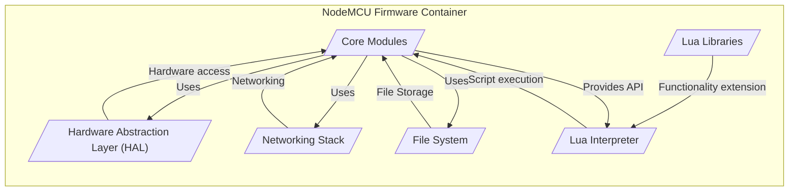
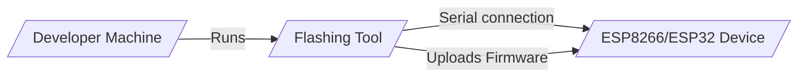
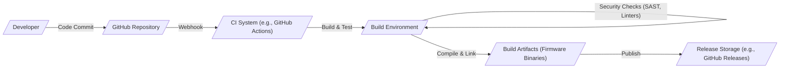

# BUSINESS POSTURE

- Business priorities and goals:
 - Priority: Provide a stable, versatile, and open-source firmware platform for ESP8266 and ESP32 microcontrollers.
 - Goal: Enable developers and hobbyists to easily create Internet of Things (IoT) applications and embedded systems using Lua scripting language.
 - Goal: Foster a strong community around the NodeMCU platform, encouraging contributions, support, and knowledge sharing.
 - Goal: Maintain compatibility with a wide range of hardware and software components to maximize usability and adoption.

- Most important business risks:
 - Business risk: Security vulnerabilities in the firmware could lead to device compromise, data breaches, and denial of service, damaging the platform's reputation and user trust.
 - Business risk: Lack of timely security updates and patches could leave users vulnerable to known exploits, hindering adoption in security-sensitive applications.
 - Business risk: Supply chain vulnerabilities in dependencies or build tools could introduce malicious code into the firmware, compromising the integrity of the platform.
 - Business risk: Open-source nature might lead to slower adoption of security best practices if the community lacks sufficient security expertise and resources.
 - Business risk: Compatibility issues with evolving hardware and software ecosystems could fragment the user base and reduce the platform's appeal.

# SECURITY POSTURE

- Existing security controls:
 - security control: Code reviews are likely performed by maintainers and community contributors during pull requests, although the depth and rigor of these reviews may vary. (Implemented in: GitHub Pull Request process)
 - security control: Open-source nature allows for community scrutiny and bug reporting, potentially leading to the discovery of security vulnerabilities. (Implemented in: Public GitHub repository)
 - security control: Basic input validation is likely implemented in various modules to prevent crashes and unexpected behavior, but the extent of security-focused input validation is unclear. (Implemented in: Source code of individual modules)
 - accepted risk: Reliance on community contributions for security vulnerability discovery and patching may lead to delays in addressing critical issues.
 - accepted risk: Limited resources dedicated to proactive security testing and auditing may result in undetected vulnerabilities.
 - accepted risk: Users are responsible for securely configuring and deploying the firmware in their specific environments, which may lead to misconfigurations and vulnerabilities.

- Recommended security controls:
 - security control: Implement automated Static Application Security Testing (SAST) tools in the CI/CD pipeline to identify potential vulnerabilities in the codebase.
 - security control: Integrate dependency vulnerability scanning to detect and address known vulnerabilities in third-party libraries used by the firmware.
 - security control: Establish a clear process for reporting and handling security vulnerabilities, including a security contact and a public security policy.
 - security control: Conduct regular security audits and penetration testing, potentially engaging external security experts, to proactively identify and address security weaknesses.
 - security control: Implement a secure boot mechanism to ensure the firmware integrity and prevent unauthorized modifications during boot process.
 - security control: Provide guidelines and best practices for users on secure configuration and deployment of NodeMCU firmware in various IoT scenarios.

- Security requirements:
 - Authentication:
  - Requirement: For network communication (e.g., Wi-Fi, HTTP/MQTT), support standard authentication protocols like WPA2/3 for Wi-Fi and TLS/SSL with username/password or certificate-based authentication for higher-level protocols.
  - Requirement: For local access to device functionalities (if applicable), consider implementing role-based access control to restrict access to sensitive operations.
 - Authorization:
  - Requirement: Implement authorization mechanisms to control access to sensitive functionalities and resources within the firmware, ensuring that only authorized components or users can perform specific actions.
  - Requirement: Follow the principle of least privilege, granting only necessary permissions to different modules and components within the firmware.
 - Input validation:
  - Requirement: Implement robust input validation for all external inputs, including network data, serial communication, and configuration parameters, to prevent injection attacks, buffer overflows, and other input-related vulnerabilities.
  - Requirement: Sanitize and encode outputs to prevent cross-site scripting (XSS) vulnerabilities if the firmware exposes any web interfaces or generates dynamic content.
 - Cryptography:
  - Requirement: Utilize strong and well-vetted cryptographic libraries for all cryptographic operations, such as encryption, hashing, and digital signatures.
  - Requirement: Properly manage cryptographic keys, ensuring secure generation, storage, and usage. Avoid hardcoding keys in the firmware.
  - Requirement: Implement secure communication protocols like TLS/SSL for all network communication involving sensitive data.

# DESIGN

## C4 CONTEXT

```mermaid
graph LR
    subgraph "NodeMCU Ecosystem"
        center "NodeMCU Firmware"
    end
    user1[/"Developers"/] -- "Develop and flash firmware, contribute code" --> center
    user2[/"End Users"/] -- "Use devices running NodeMCU firmware" --> center
    ext1[/"Wi-Fi Network"/] -- "Network connectivity" --> center
    ext2[/"Cloud Services"/] -- "Data exchange, remote control" --> center
    ext3[/"Hardware (ESP8266/ESP32)"/] -- "Runs on" --> center
    center -- "Firmware updates" --> ext4[/"Firmware Update Server"/]
```

- Elements of context diagram:
 - - Name: NodeMCU Firmware
   - Type: Software System
   - Description: Open-source firmware for ESP8266 and ESP32 microcontrollers, enabling IoT applications using Lua scripting.
   - Responsibilities: Provides core functionalities for hardware interaction, networking, scripting environment, and application execution on ESP microcontrollers.
   - Security controls: Implements security controls as described in the SECURITY POSTURE section, including input validation, cryptographic functions, and potentially secure boot.
 - - Name: Developers
   - Type: Person
   - Description: Software developers who use NodeMCU firmware to create IoT applications, contribute to the firmware codebase, and customize it for their needs.
   - Responsibilities: Develop applications using NodeMCU Lua API, flash firmware onto devices, contribute code improvements and bug fixes to the project.
   - Security controls: Responsible for secure coding practices in their applications, securely managing device credentials, and reporting security vulnerabilities in the firmware.
 - - Name: End Users
   - Type: Person
   - Description: Individuals or organizations who deploy and use devices running NodeMCU firmware for various IoT applications.
   - Responsibilities: Operate and maintain devices running NodeMCU firmware, configure network settings, and potentially interact with applications running on the devices.
   - Security controls: Responsible for securing their Wi-Fi networks, protecting access to devices, and applying firmware updates when available.
 - - Name: Wi-Fi Network
   - Type: External System
   - Description: Wireless network infrastructure that NodeMCU devices connect to for internet access and communication with other systems.
   - Responsibilities: Provides network connectivity for NodeMCU devices, handles network authentication and encryption (e.g., WPA2/3).
   - Security controls: Implements Wi-Fi security protocols (WPA2/3), network firewalls, and access controls to protect the network and connected devices.
 - - Name: Cloud Services
   - Type: External System
   - Description: Cloud platforms and services that NodeMCU devices may interact with for data storage, remote control, analytics, and other cloud-based functionalities.
   - Responsibilities: Provides cloud-based services for IoT applications, handles data storage, processing, and communication with devices.
   - Security controls: Implements cloud security best practices, including access control, data encryption, and secure APIs to protect data and prevent unauthorized access.
 - - Name: Hardware (ESP8266/ESP32)
   - Type: External System
   - Description: ESP8266 and ESP32 microcontrollers, the target hardware platforms on which NodeMCU firmware runs.
   - Responsibilities: Executes NodeMCU firmware, provides processing power, memory, and hardware interfaces for IoT applications.
   - Security controls: Hardware security features (if any) provided by ESP chips, such as secure boot, flash encryption, and hardware cryptographic accelerators.
 - - Name: Firmware Update Server
   - Type: External System
   - Description: Server infrastructure that hosts firmware update files and facilitates over-the-air (OTA) firmware updates for NodeMCU devices.
   - Responsibilities: Stores and distributes firmware updates, manages versioning, and ensures secure delivery of updates to devices.
   - Security controls: Implements secure storage and transmission of firmware updates, uses digital signatures to verify firmware integrity, and controls access to update server.

## C4 CONTAINER



- Elements of container diagram:
 - - Name: Core Modules
   - Type: Software Container
   - Description: Collection of core firmware modules written in C/C++ that provide essential functionalities and manage interactions between different components.
   - Responsibilities: Manages system initialization, task scheduling, memory management, inter-process communication, and provides core APIs for other containers.
   - Security controls: Implements core security functionalities like input validation, access control within the firmware, and interfaces with hardware security features.
 - - Name: Lua Interpreter
   - Type: Software Container
   - Description: Lua scripting engine that executes Lua scripts provided by developers, enabling application logic and customization.
   - Responsibilities: Executes Lua code, provides Lua API for accessing firmware functionalities, and manages Lua script execution environment.
   - Security controls: Implements security boundaries for Lua scripts, restricts access to sensitive system resources, and enforces secure coding practices in Lua scripts (through documentation and examples).
 - - Name: Networking Stack
   - Type: Software Container
   - Description: TCP/IP networking stack that handles network communication, including Wi-Fi, Ethernet (if supported), and network protocols (TCP, UDP, HTTP, MQTT, etc.).
   - Responsibilities: Manages network connections, handles network protocol implementations, provides network APIs for other containers, and manages network security protocols (e.g., TLS/SSL).
   - Security controls: Implements network security protocols (WPA2/3, TLS/SSL), handles network input validation, and protects against network-based attacks.
 - - Name: Hardware Abstraction Layer (HAL)
   - Type: Software Container
   - Description: Hardware abstraction layer that provides a consistent interface for accessing hardware peripherals (GPIO, UART, SPI, I2C, etc.) across different ESP chip variants.
   - Responsibilities: Abstracts hardware differences, provides hardware access APIs for other containers, and manages hardware initialization and configuration.
   - Security controls: Implements secure access to hardware peripherals, protects against unauthorized hardware access, and potentially interfaces with hardware security features.
 - - Name: File System
   - Type: Software Container
   - Description: File system implementation that allows storing and managing files on the device's flash memory.
   - Responsibilities: Provides file storage and retrieval functionalities, manages file system operations, and provides file system APIs for other containers.
   - Security controls: Implements file access control, protects against unauthorized file access, and potentially supports file system encryption.
 - - Name: Lua Libraries
   - Type: Software Container
   - Description: Collection of Lua libraries that extend the functionality of the Lua interpreter, providing pre-built modules for common tasks and functionalities.
   - Responsibilities: Provides reusable Lua modules for developers, simplifies application development, and extends the capabilities of the Lua scripting environment.
   - Security controls: Libraries should be reviewed for security vulnerabilities, and secure coding practices should be followed in library development.

## DEPLOYMENT

- Possible deployment solutions:
 - Direct flashing via serial connection from developer machine.
 - Over-The-Air (OTA) updates from a firmware update server.

- Detailed deployment solution: Direct flashing via serial connection from developer machine.



- Elements of deployment diagram:
 - - Name: Developer Machine
   - Type: Infrastructure
   - Description: Developer's computer used for compiling firmware, writing Lua scripts, and flashing firmware onto ESP devices.
   - Responsibilities: Runs development tools, stores source code, and initiates firmware flashing process.
   - Security controls: Security controls on developer machine are crucial, including OS security, antivirus, and access control to prevent malware and unauthorized access.
 - - Name: Flashing Tool
   - Type: Software
   - Description: Software application (e.g., esptool.py) used to upload compiled firmware binaries to ESP devices via serial connection.
   - Responsibilities: Communicates with ESP device via serial protocol, uploads firmware image to flash memory, and verifies successful flashing.
   - Security controls: Ensure flashing tool is obtained from a trusted source to prevent supply chain attacks. Secure communication channel (serial) is generally considered local and less vulnerable.
 - - Name: ESP8266/ESP32 Device
   - Type: Infrastructure
   - Description: Target ESP microcontroller device where NodeMCU firmware is deployed and executed.
   - Responsibilities: Executes NodeMCU firmware, runs IoT applications, and interacts with hardware and network.
   - Security controls: Security controls implemented within NodeMCU firmware running on the device, and potentially hardware security features of the ESP chip itself.

## BUILD



- Elements of build diagram:
 - - Name: Developer
   - Type: Person
   - Description: Software developer who writes and commits code changes to the NodeMCU firmware project.
   - Responsibilities: Writes code, performs local testing, and commits code changes to the source code repository.
   - Security controls: Secure coding practices, code reviews, and using secure development environments.
 - - Name: GitHub Repository
   - Type: Software System
   - Description: Central source code repository hosted on GitHub, used for version control and collaboration.
   - Responsibilities: Stores source code, manages code history, and facilitates collaboration among developers.
   - Security controls: Access control to the repository, branch protection, and audit logs.
 - - Name: CI System (e.g., GitHub Actions)
   - Type: Software System
   - Description: Continuous Integration system that automates the build, test, and release process when code changes are pushed to the repository.
   - Responsibilities: Automates build process, runs tests, performs security checks, and generates build artifacts.
   - Security controls: Secure CI/CD pipeline configuration, access control to CI system, and secure storage of CI secrets and credentials.
 - - Name: Build Environment
   - Type: Infrastructure
   - Description: Environment where the firmware is compiled and built, including toolchains, build scripts, and necessary dependencies.
   - Responsibilities: Provides environment for compiling and linking source code, running security checks (SAST, linters), and generating firmware binaries.
   - Security controls: Secure build environment configuration, dependency management, and integrity checks of build tools and dependencies.
 - - Name: Security Checks (SAST, Linters)
   - Type: Software System
   - Description: Automated security scanning tools (SAST) and code linters integrated into the build process to identify potential vulnerabilities and code quality issues.
   - Responsibilities: Performs static code analysis, identifies potential security flaws, and enforces coding standards.
   - Security controls: Regularly updated security scanning tools and rulesets, and proper configuration to detect relevant security issues.
 - - Name: Build Artifacts (Firmware Binaries)
   - Type: Software Artifact
   - Description: Compiled firmware binaries ready to be flashed onto ESP devices.
   - Responsibilities: Represents the final output of the build process, ready for distribution and deployment.
   - Security controls: Digital signatures to ensure firmware integrity and authenticity, and secure storage of build artifacts.
 - - Name: Release Storage (e.g., GitHub Releases)
   - Type: Software System
   - Description: Storage location for released firmware binaries, making them available for users to download and flash onto their devices.
   - Responsibilities: Stores and distributes firmware releases, manages versioning, and provides download access to users.
   - Security controls: Access control to release storage, secure distribution channels (HTTPS), and integrity checks of downloaded firmware.

# RISK ASSESSMENT

- What are critical business process we are trying to protect?
 - Critical business process: Maintaining the integrity and availability of the NodeMCU firmware platform. This includes ensuring the firmware is free from vulnerabilities, is reliably built and distributed, and remains compatible with supported hardware.
 - Critical business process: Protecting the reputation and trust of the NodeMCU project and community. Security breaches or vulnerabilities could erode user trust and hinder adoption.

- What data we are trying to protect and what is their sensitivity?
 - Data to protect: Firmware source code. Sensitivity: High. Compromise of source code could lead to intellectual property theft, introduction of backdoors, and undermining the project's integrity.
 - Data to protect: Firmware binaries. Sensitivity: High. Compromised firmware binaries could be distributed to users, leading to widespread device compromise. Integrity and authenticity are paramount.
 - Data to protect: User data processed by devices running NodeMCU firmware. Sensitivity: Varies depending on the application. Could range from low (sensor readings) to high (personal data, credentials). Security measures within the firmware should enable users to protect their application-specific data.
 - Data to protect: Credentials and secrets used in the build and release process. Sensitivity: High. Compromise could lead to unauthorized code changes, malicious releases, and supply chain attacks.

# QUESTIONS & ASSUMPTIONS

- Questions:
 - What is the current process for handling security vulnerability reports? Is there a dedicated security contact or security policy?
 - Are there any automated security testing tools currently in use for the project?
 - What is the process for managing dependencies and ensuring their security?
 - Is there a plan for implementing secure boot or other hardware-based security features?
 - What are the typical use cases and deployment environments for NodeMCU firmware? Understanding this will help prioritize relevant security requirements.

- Assumptions:
 - Assumption: The NodeMCU project is primarily community-driven with limited dedicated security resources.
 - Assumption: Security awareness exists within the community, but formal security processes and controls may be lacking.
 - Assumption: The primary deployment method is direct flashing via serial connection, but OTA updates may be considered or implemented in the future.
 - Assumption: The project aims to provide a versatile and user-friendly platform, and security should be balanced with usability and performance.
 - Assumption: Users are responsible for the security of their applications built on top of NodeMCU firmware, but the firmware should provide a secure foundation.