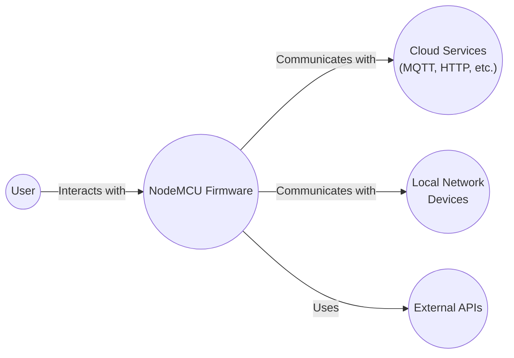
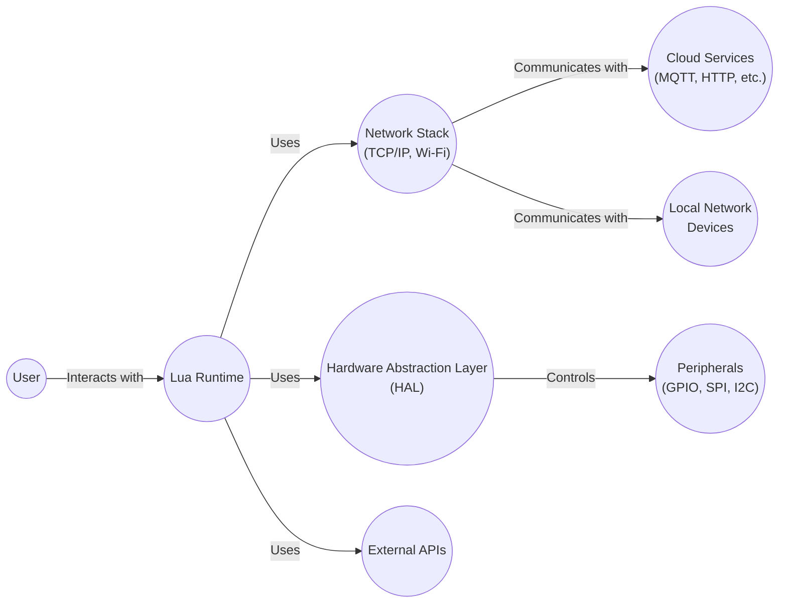
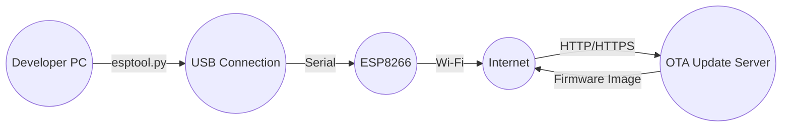
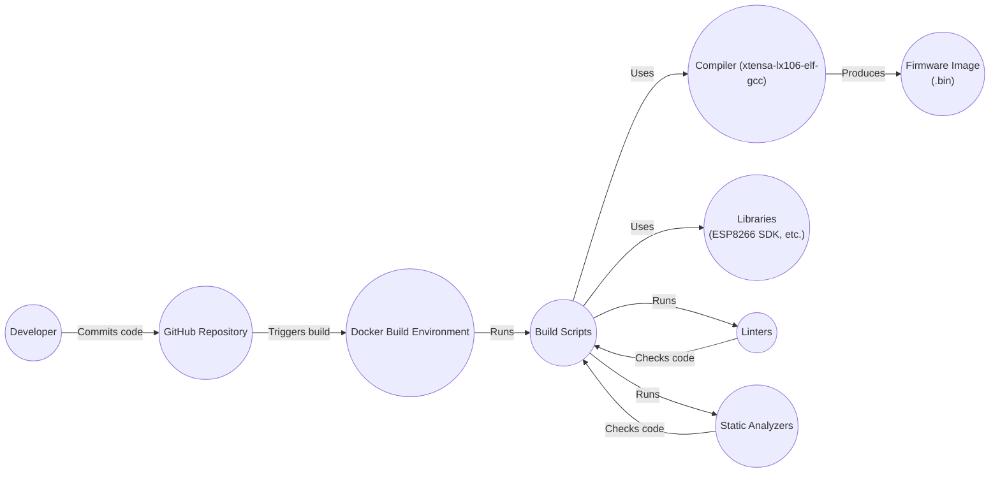

# Project Design Document: NodeMCU Firmware

## BUSINESS POSTURE

NodeMCU is an open-source Lua-based firmware for the ESP8266 Wi-Fi chip. It allows users to program the ESP8266 using a high-level scripting language, simplifying the development of IoT applications.

Priorities:

- Ease of use and rapid prototyping for IoT developers.
- Open-source and community-driven development.
- Support for a wide range of hardware modules and peripherals.
- Low resource consumption (memory, processing power).
- Stable and reliable operation.

Goals:

- Provide a user-friendly platform for developing IoT applications on the ESP8266.
- Foster a vibrant community of users and contributors.
- Maintain a comprehensive and up-to-date feature set.
- Ensure the firmware is robust and suitable for real-world deployments.

Business Risks:

- _Security vulnerabilities_: Given the firmware's use in IoT devices, security vulnerabilities could expose users to attacks, data breaches, or device hijacking. This is a critical risk due to the potential for widespread impact.
- _Lack of maintenance_: As an open-source project, its long-term viability depends on continued community support and contributions. A decline in activity could lead to unpatched bugs and security issues.
- _Fragmentation_: The wide range of supported hardware and modules could lead to fragmentation and compatibility issues, making it difficult to maintain a consistent user experience.
- _Competition_: The emergence of alternative platforms or frameworks could reduce the adoption and relevance of NodeMCU.
- _Supply chain attacks_: Compromised build tools or dependencies could introduce malicious code into the firmware.

## SECURITY POSTURE

Existing Security Controls:

- _security control_: The project uses GitHub for version control and issue tracking, which provides some level of access control and auditability. (Described in GitHub repository)
- _security control_: The firmware includes basic network security features like Wi-Fi Protected Access (WPA/WPA2) for securing wireless communication. (Described in documentation and source code)
- _security control_: Some modules may implement cryptographic functions (e.g., TLS/SSL for secure communication), although this is not universally enforced. (Described in documentation and source code of specific modules)

Accepted Risks:

- _accepted risk_: Limited built-in security features beyond basic network security. The firmware relies heavily on user-implemented security measures.
- _accepted risk_: Potential for vulnerabilities due to the use of C and Lua, which can be prone to memory safety issues and injection attacks if not carefully coded.
- _accepted risk_: Dependence on external libraries and modules, which may introduce their own security risks.
- _accepted risk_: The open-source nature of the project means that vulnerabilities may be publicly disclosed before patches are available.

Recommended Security Controls:

- _security control_: Implement a secure boot mechanism to verify the integrity of the firmware at startup.
- _security control_: Integrate a software bill of materials (SBOM) to track dependencies and identify potential vulnerabilities.
- _security control_: Establish a clear vulnerability disclosure and patching process.
- _security control_: Provide security guidelines and best practices for developers using the firmware.
- _security control_: Regularly conduct security audits and penetration testing.
- _security control_: Implement over-the-air (OTA) update mechanism with signature verification.

Security Requirements:

- _Authentication_:
    - The firmware should support secure authentication mechanisms for accessing the device and its services (e.g., password-based authentication, API keys).
    - Consider using secure password storage mechanisms (e.g., hashing and salting).
- _Authorization_:
    - Implement access control mechanisms to restrict access to sensitive resources and functionalities based on user roles or permissions.
- _Input Validation_:
    - Thoroughly validate all user inputs to prevent injection attacks (e.g., command injection, SQL injection, cross-site scripting).
    - Use a whitelist approach to allow only known-good input patterns.
- _Cryptography_:
    - Use strong cryptographic algorithms and protocols for secure communication (e.g., TLS 1.2 or later).
    - Securely manage cryptographic keys.
    - Implement secure random number generation.
    - If OTA updates are used, ensure they are digitally signed and verified before installation.

## DESIGN

### C4 CONTEXT

Elements Description:

- Element:
    - Name: User
    - Type: Person
    - Description: A person interacting with the NodeMCU device, either directly or through a network.
    - Responsibilities:
        - Configuring the NodeMCU device.
        - Sending commands and data to the device.
        - Receiving data and status updates from the device.
        - Developing and deploying applications to the device.
    - Security controls:
        - User authentication (if applicable).
        - Secure communication channels (e.g., HTTPS).

- Element:
    - Name: NodeMCU Firmware
    - Type: Software System
    - Description: The Lua-based firmware running on the ESP8266 Wi-Fi chip.
    - Responsibilities:
        - Executing user-defined scripts.
        - Managing network connections (Wi-Fi, Ethernet).
        - Interacting with hardware peripherals (GPIO, sensors, actuators).
        - Communicating with external services (cloud platforms, local devices).
    - Security controls:
        - Network security (WPA/WPA2).
        - Input validation.
        - Secure communication protocols (TLS/SSL, if implemented).
        - Access control (if implemented).

- Element:
    - Name: Cloud Services (MQTT, HTTP, etc.)
    - Type: External System
    - Description: Cloud-based services that the NodeMCU device may interact with, such as MQTT brokers, HTTP servers, or other IoT platforms.
    - Responsibilities:
        - Providing data storage and processing.
        - Enabling remote control and monitoring of the device.
        - Facilitating communication with other devices and systems.
    - Security controls:
        - Secure communication protocols (TLS/SSL).
        - Authentication and authorization mechanisms.
        - Data encryption at rest and in transit.

- Element:
    - Name: Local Network Devices
    - Type: External System
    - Description: Other devices on the local network that the NodeMCU device may interact with.
    - Responsibilities:
        - Exchanging data with the NodeMCU device.
        - Collaborating on tasks or processes.
    - Security controls:
        - Network security (firewalls, intrusion detection systems).
        - Secure communication protocols.
        - Authentication and authorization.

- Element:
    - Name: External APIs
    - Type: External System
    - Description: External APIs that NodeMCU firmware can use.
    - Responsibilities:
        - Providing additional functionality.
    - Security controls:
        - Secure communication protocols (TLS/SSL).
        - Authentication and authorization.

### C4 CONTAINER

Elements Description:

- Element:
    - Name: User
    - Type: Person
    - Description: A person interacting with the NodeMCU device.
    - Responsibilities:
        - Interacting with Lua scripts running on the device.
    - Security controls:
        - User authentication (if applicable).

- Element:
    - Name: Lua Runtime
    - Type: Container
    - Description: The environment that executes Lua scripts.
    - Responsibilities:
        - Parsing and executing Lua code.
        - Providing access to built-in functions and libraries.
        - Managing memory and resources.
    - Security controls:
        - Input validation.
        - Sandboxing (limited, if any).

- Element:
    - Name: Network Stack (TCP/IP, Wi-Fi)
    - Type: Container
    - Description: Handles network communication.
    - Responsibilities:
        - Establishing and managing Wi-Fi connections.
        - Implementing TCP/IP protocols.
        - Sending and receiving data over the network.
    - Security controls:
        - WPA/WPA2 encryption.
        - Network firewall (limited, if any).

- Element:
    - Name: Hardware Abstraction Layer (HAL)
    - Type: Container
    - Description: Provides an interface to the ESP8266 hardware.
    - Responsibilities:
        - Abstracting hardware-specific details.
        - Providing access to peripherals (GPIO, SPI, I2C).
    - Security controls:
        - None directly, relies on hardware security features.

- Element:
    - Name: Peripherals (GPIO, SPI, I2C)
    - Type: Hardware
    - Description: Physical components connected to the ESP8266.
    - Responsibilities:
        - Interacting with the physical world (sensors, actuators).
    - Security controls:
        - None directly, relies on external security measures.

- Element:
    - Name: Cloud Services (MQTT, HTTP, etc.)
    - Type: External System
    - Description: Cloud-based services.
    - Responsibilities:
        - Providing external services to the NodeMCU device.
    - Security controls:
        - Secure communication protocols (TLS/SSL).
        - Authentication and authorization.

- Element:
    - Name: Local Network Devices
    - Type: External System
    - Description: Other devices on the local network.
    - Responsibilities:
        - Interacting with the NodeMCU device.
    - Security controls:
        - Network security.
        - Secure communication protocols.

- Element:
    - Name: External APIs
    - Type: External System
    - Description: External APIs that NodeMCU firmware can use.
    - Responsibilities:
        - Providing additional functionality.
    - Security controls:
        - Secure communication protocols (TLS/SSL).
        - Authentication and authorization.

### DEPLOYMENT

Possible deployment solutions:

1.  Manual flashing using esptool.
2.  Over-the-air (OTA) updates.
3.  Using a dedicated flashing tool or platform.

Chosen solution: Manual flashing using esptool, followed by OTA updates.

Elements Description:

- Element:
    - Name: Developer PC
    - Type: Device
    - Description: The computer used to build and flash the firmware.
    - Responsibilities:
        - Building the firmware image.
        - Flashing the firmware to the ESP8266.
    - Security controls:
        - Secure development environment.
        - Code signing (if implemented).

- Element:
    - Name: ESP8266
    - Type: Device
    - Description: The target device running the NodeMCU firmware.
    - Responsibilities:
        - Running the firmware.
        - Connecting to the network.
        - Receiving and applying OTA updates.
    - Security controls:
        - Secure boot (if implemented).
        - Firmware verification (if implemented).

- Element:
    - Name: USB Connection
    - Type: Communication Channel
    - Description: The physical connection between the developer PC and the ESP8266.
    - Responsibilities:
        - Transferring data between the PC and the ESP8266.
    - Security controls:
        - None directly, relies on physical security.

- Element:
    - Name: Internet
    - Type: Network
    - Description: The global network used for OTA updates.
    - Responsibilities:
        - Providing connectivity between the ESP8266 and the OTA server.
    - Security controls:
        - Network security (firewalls, intrusion detection systems).

- Element:
    - Name: OTA Update Server
    - Type: Server
    - Description: A server that hosts firmware images for OTA updates.
    - Responsibilities:
        - Storing firmware images.
        - Providing firmware images to ESP8266 devices.
    - Security controls:
        - Secure server environment.
        - Code signing.
        - Access control.

### BUILD

The NodeMCU firmware build process involves several steps, from compiling the source code to creating a binary image that can be flashed onto the ESP8266. The project uses a Docker-based build environment to ensure consistency and reproducibility.

Security Controls in Build Process:

- _security control_: Dockerized build environment: Ensures a consistent and isolated build environment, reducing the risk of dependency conflicts and contamination from the host system.
- _security control_: Use of build scripts: Automates the build process, making it repeatable and less prone to human error.
- _security control_: Compiler warnings and errors: The build process should be configured to treat warnings as errors, ensuring that potential code quality issues are addressed.
- _security control_: Static analysis (limited): The project may use basic linters or static analysis tools to identify potential code quality and security issues.
- _security control_: Dependency management: Dependencies are managed, but a formal SBOM is recommended.

## RISK ASSESSMENT

Critical Business Processes:

- Providing a stable and reliable platform for IoT development.
- Maintaining a secure environment for connected devices.
- Fostering a healthy and active open-source community.

Data Sensitivity:

- User-defined scripts: May contain sensitive information (e.g., API keys, credentials). Sensitivity: High.
- Network configuration: Wi-Fi credentials and network settings. Sensitivity: High.
- Sensor data: Data collected by connected sensors may be sensitive depending on the application (e.g., location data, environmental data). Sensitivity: Variable, potentially high.
- Device metadata: Information about the device and its configuration. Sensitivity: Medium.

## QUESTIONS & ASSUMPTIONS

Questions:

- Are there any specific compliance requirements (e.g., GDPR, HIPAA) that need to be considered?
- What is the expected lifespan of devices running the firmware?
- What level of security expertise is expected from users of the firmware?
- What is the process for reporting and handling security vulnerabilities?
- Are there any plans to implement more robust security features in the future?
- Is there a mechanism for users to contribute to security improvements?
- What are the specific hardware configurations supported?
- Are there any known limitations or vulnerabilities in the current implementation?

Assumptions:

- _BUSINESS POSTURE_: The primary goal is to provide a user-friendly and functional platform for IoT development, with security being a secondary but important consideration.
- _BUSINESS POSTURE_: The project relies on community contributions for maintenance and development.
- _SECURITY POSTURE_: Users are expected to have some basic understanding of security principles and to implement appropriate security measures in their applications.
- _SECURITY POSTURE_: The firmware is primarily used in non-critical applications where the impact of a security breach is limited.
- _DESIGN_: The ESP8266 has limited resources (memory, processing power), which constrains the complexity of security features that can be implemented.
- _DESIGN_: The build process is automated and reproducible.
- _DESIGN_: OTA updates are a desirable feature, but their security implications must be carefully considered.
- _DESIGN_: The firmware is primarily used in environments with basic network security (e.g., WPA2-protected Wi-Fi).