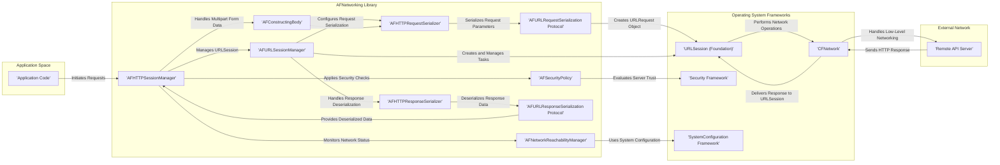

## Project Design Document: AFNetworking (Improved)

**1. Introduction**

This document provides an enhanced architectural design of the AFNetworking library, a widely adopted open-source networking framework for Apple's operating systems (iOS, macOS, watchOS, and tvOS). This detailed design serves as the foundation for subsequent threat modeling exercises, offering a clear understanding of the library's internal structure, data flow, and external interactions.

**2. Project Overview**

AFNetworking simplifies the complexities of making HTTP-based network requests and handling responses within Apple applications. Targeting developers who need robust and efficient networking capabilities, it provides a higher-level abstraction over the native networking APIs. Key features include:

*   Streamlined creation and management of network requests.
*   Automatic handling of request and response serialization/deserialization for common formats (JSON, XML, Plist, etc.).
*   Comprehensive authentication support (Basic, Digest, OAuth, etc.).
*   Robust network reachability monitoring and change notifications.
*   Support for background network sessions, allowing tasks to continue even when the app is in the background.
*   Advanced security features, including SSL/TLS certificate pinning for enhanced protection against man-in-the-middle attacks.

This design document focuses on the core networking functionalities and their interactions with the underlying operating system and external services, providing a granular view for security analysis.

**3. Architectural Overview**

AFNetworking's architecture is modular, with distinct components working together to manage network operations. The following diagram illustrates the key components and their interactions:

**4. Key Components (Detailed)**

*   **AFHTTPSessionManager:** This is the primary high-level interface for interacting with AFNetworking. It encapsulates an `URLSession` and provides convenient methods for executing common HTTP requests (GET, POST, PUT, DELETE, PATCH). It manages request and response serialization/deserialization based on configured serializers. It also handles security policy enforcement and network reachability monitoring.
*   **AFURLSessionManager:** A lower-level component directly managing the underlying `URLSession` object from the Foundation framework. It is responsible for creating and managing `URLSessionTask` instances (data, upload, download tasks). It handles delegate methods for session events and provides a foundation for the higher-level `AFHTTPSessionManager`.
*   **AFHTTPRequestSerializer:** This component is responsible for taking request parameters (e.g., dictionary of values) and converting them into a format suitable for sending in an HTTP request. It supports various serialization formats, including URL-encoded parameters, JSON, and Plist. It also handles setting appropriate HTTP headers based on the serialization type.
*   **AFHTTPResponseSerializer:** This component handles the reverse process of `AFHTTPRequestSerializer`. It takes the raw data received in an HTTP response and deserializes it into a usable format (e.g., `NSDictionary`, `NSArray`, `NSString`). It supports various content types and provides error handling for invalid or unexpected response formats.
*   **AFSecurityPolicy:** This crucial component implements server trust evaluation, allowing applications to verify the identity of the server they are communicating with. It supports various validation modes, including certificate pinning, where the application expects a specific certificate or a certificate from a specific set of trusted certificates. This helps prevent man-in-the-middle attacks.
*   **AFNetworkReachabilityManager:** This component monitors the network connectivity status of the device. It uses the SystemConfiguration framework to detect changes in network reachability (e.g., Wi-Fi connected, cellular connected, no network). It provides notifications to the application about network status changes.
*   **AFURLRequestSerialization Protocol:** This protocol defines the interface for serializing request parameters into an `URLRequest` object. Concrete implementations like `AFHTTPRequestSerializer` conform to this protocol, providing different strategies for request serialization.
*   **AFURLResponseSerialization Protocol:** This protocol defines the interface for deserializing response data. Concrete implementations like `AFJSONResponseSerializer`, `AFXMLParserResponseSerializer`, and `AFPropertyListResponseSerializer` conform to this protocol, handling different response content types.
*   **AFConstructingBody:** This component assists in creating the body of multipart form requests, allowing for the inclusion of files and other data in a structured manner.

**5. Data Flow (Detailed)**

The following steps describe the typical data flow for a network request initiated using AFNetworking:

1. The application code initiates a network request by calling a specific method on an `AFHTTPSessionManager` instance (e.g., `GET:parameters:success:failure:`, `POST:URLString:parameters:headers:constructingBodyWithBlock:progress:success:failure:`).
2. `AFHTTPSessionManager` retrieves its configured `AFHTTPRequestSerializer`.
3. The `AFHTTPRequestSerializer` serializes the provided request parameters (if any) into a format suitable for the HTTP request body or URL query parameters, based on the configured `Content-Type`.
4. The serialized data and other request details (URL, headers) are used to construct an `URLRequest` object.
5. `AFURLSessionManager` retrieves or creates an appropriate `URLSessionTask` (e.g., `URLSessionDataTask`, `URLSessionUploadTask`, `URLSessionDownloadTask`) using the created `URLRequest`.
6. Before the task is executed, the `AFSecurityPolicy` associated with the `AFHTTPSessionManager` might be consulted to pre-validate the server's trust if the server URL is known.
7. The `URLSessionTask` is started, and the request is handed off to the operating system's networking stack (`URLSession`, `CFNetwork`).
8. The operating system handles low-level network operations, including DNS resolution, TCP connection establishment, and TLS/SSL handshake (if the request is over HTTPS). The `Security Framework` is involved in the TLS/SSL process.
9. The remote server processes the request and sends back an HTTP response, including headers and a response body.
10. The operating system receives the response and delivers the raw response data and metadata (status code, headers) back to the `URLSession`.
11. `AFURLSessionManager` receives the response through its delegate methods.
12. `AFHTTPSessionManager` retrieves its configured `AFHTTPResponseSerializer` based on the response's `Content-Type` header.
13. The `AFHTTPResponseSerializer` deserializes the raw response data into a usable format. If deserialization fails, an error is generated.
14. The `AFSecurityPolicy` is applied to perform server trust evaluation based on the server's certificate chain. This might involve comparing the server's certificate against pinned certificates or relying on the system's trust store.
15. If the security policy evaluation is successful and deserialization is successful, the deserialized response data is passed back to the application code through the success completion handler.
16. If there are errors during the network request, response processing, or security evaluation, an error object is created and passed back to the application code through the failure completion handler.
17. Throughout the process, `AFNetworkReachabilityManager` might be monitoring the network status and notifying the application of any changes.

**6. External Dependencies**

AFNetworking relies heavily on the following frameworks provided by the operating system:

*   **Foundation Framework:** Provides fundamental networking classes like `URLSession`, `URLRequest`, `URLResponse`, `Data`, and various utility classes for data manipulation and threading.
*   **CFNetwork Framework:** A lower-level C-based networking framework that `URLSession` is built upon. It handles the core network transport protocols and socket management.
*   **Security Framework:** Provides APIs for handling security-related tasks, including certificate management, trust evaluation, and cryptographic operations used in TLS/SSL.
*   **SystemConfiguration Framework:** Used by `AFNetworkReachabilityManager` to monitor network interface changes and determine the current network reachability status.
*   **MobileCoreServices Framework (iOS):** May be used for determining MIME types and handling uniform type identifiers (UTIs) related to data encoding and file transfers.

While AFNetworking aims to be self-contained for core networking functionalities, applications using it might introduce additional third-party dependencies for specific needs.

**7. Security Considerations (Detailed)**

This section outlines potential security considerations and areas of focus for threat modeling:

*   **Transport Layer Security (TLS/SSL) Vulnerabilities:**
    *   **Weak Cipher Suites:** If the underlying `URLSession` or the server negotiate weak or outdated cipher suites, the communication might be vulnerable to eavesdropping or manipulation.
    *   **Protocol Downgrade Attacks:**  Attackers might try to force the connection to use an older, less secure TLS version.
    *   **Improper Certificate Validation:** If `AFSecurityPolicy` is not configured correctly or if custom validation logic is flawed, man-in-the-middle attacks could succeed.
    *   **Certificate Pinning Bypass:**  Vulnerabilities in the implementation of certificate pinning within `AFSecurityPolicy` could allow attackers to bypass the intended security checks.
*   **Data Serialization and Deserialization Issues:**
    *   **Insecure Deserialization:** If the application deserializes untrusted data without proper validation, it could lead to remote code execution or other vulnerabilities. This is particularly relevant when using formats like Plist or custom object serialization.
    *   **XML External Entity (XXE) Attacks:** If using XML serialization, improper configuration of the XML parser could allow attackers to include external entities, potentially leading to information disclosure or denial of service.
    *   **JSON Injection:** While less common in response deserialization, improper handling of JSON data could lead to vulnerabilities if the data is used to construct further requests or commands.
*   **Authentication and Authorization Weaknesses:**
    *   **Insecure Storage of Credentials:** If authentication credentials (e.g., API keys, tokens) are stored insecurely (e.g., hardcoded, in shared preferences without encryption), they could be compromised.
    *   **Insufficient Authentication:**  Lack of proper authentication mechanisms can allow unauthorized access to resources.
    *   **Broken Authorization:**  Flaws in the authorization logic on the server-side can lead to users accessing resources they shouldn't.
    *   **Session Management Issues:** Vulnerabilities in how sessions are managed (e.g., weak session IDs, lack of session expiration) can lead to session hijacking.
*   **Network Reachability and Denial of Service:**
    *   **Resource Exhaustion:**  Improper handling of network errors or retries could lead to excessive resource consumption, potentially causing a denial of service.
    *   **Man-in-the-Middle Attacks on Reachability Checks:** While less direct, manipulating network reachability information could potentially influence application behavior in unintended ways.
*   **Cookie Management Vulnerabilities:**
    *   **Insecure Cookie Storage:** If cookies are not stored securely, they could be accessed by malicious applications.
    *   **Cross-Site Scripting (XSS) via Cookies:** Although AFNetworking primarily handles outgoing requests, vulnerabilities in the application's handling of cookies received in responses could lead to XSS.
    *   **Cross-Site Request Forgery (CSRF):** If the application relies on cookies for authentication without proper CSRF protection, attackers could potentially make unauthorized requests on behalf of the user.
*   **Input Validation on Outgoing Requests:**
    *   **Injection Attacks:** If the application doesn't properly sanitize user input before including it in API requests, it could be vulnerable to injection attacks (e.g., SQL injection if the backend is vulnerable, command injection).
*   **Error Handling and Information Disclosure:**
    *   **Verbose Error Messages:**  Detailed error messages returned by the server or logged by the application could reveal sensitive information about the system or its configuration.

**8. Conclusion**

This improved design document provides a more detailed and comprehensive understanding of the AFNetworking library's architecture, data flow, and dependencies. The expanded security considerations section highlights key areas that require careful attention during threat modeling. This document serves as a valuable resource for identifying potential vulnerabilities and developing appropriate mitigation strategies for applications utilizing AFNetworking.