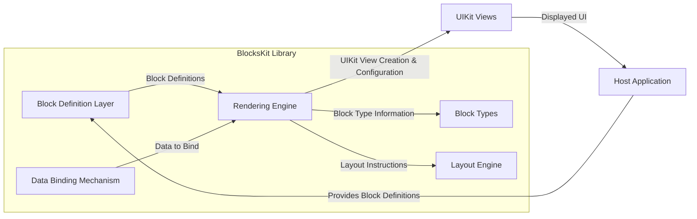
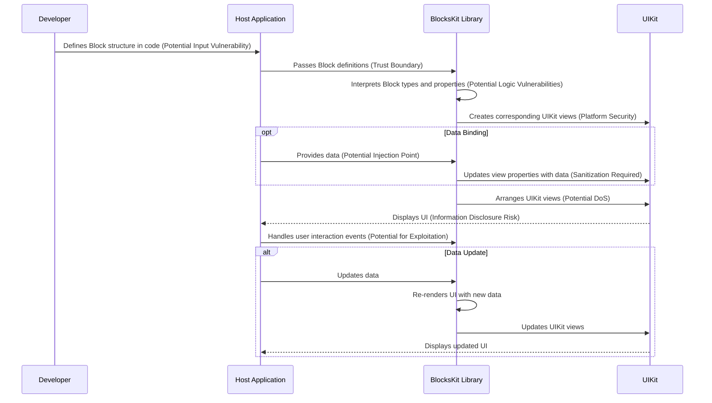

# Project Design Document: BlocksKit

**Version:** 1.1
**Date:** October 26, 2023
**Author:** AI Software Architect

## 1. Introduction

This document provides a detailed design overview of the BlocksKit project, a Swift library for building declarative user interfaces on Apple platforms. This document is specifically crafted to serve as a foundation for subsequent threat modeling activities, clearly outlining the system's architecture, components, and data flow with a focus on potential security implications.

### 1.1. Purpose

The primary purpose of this document is to provide a comprehensive architectural description of BlocksKit, explicitly tailored to facilitate effective threat modeling. It aims to clearly define the system's boundaries, components, and interactions, enabling security analysts to systematically identify potential vulnerabilities, attack vectors, and areas requiring security controls.

### 1.2. Scope

This document covers the core functionality of the BlocksKit library, focusing on its role in defining and rendering user interfaces within a host application. It includes the library's internal structure, its interaction with the host application environment (including data exchange and event handling), and its dependencies. This document does not delve into the specifics of individual example applications built using BlocksKit, but rather focuses on the library itself as a component.

### 1.3. Goals

*   Clearly define the architectural components of BlocksKit and their responsibilities.
*   Illustrate the data flow within the library and between the library and the host application, highlighting potential data transformation points.
*   Identify key areas and components that require focused attention during threat modeling, including trust boundaries and potential attack surfaces.
*   Provide a basis for understanding the library's security posture and potential vulnerabilities.

## 2. Overview

BlocksKit is a Swift library that empowers developers to construct user interfaces using a declarative paradigm, drawing inspiration from Slack's Block Kit. It offers a collection of composable UI components (referred to as "Blocks") that can be arranged to create intricate layouts. The library's core function is to translate these abstract block definitions into concrete, platform-native UIKit views for display within an iOS application. Understanding the translation process and the data involved is crucial for identifying potential security weaknesses.

### 2.1. Key Features

*   **Declarative UI Definition:** UI layouts are specified using a structured, code-centric approach, moving away from visual editors like Interface Builder or manual view instantiation. This definition process itself is a potential area for scrutiny.
*   **Composable Blocks:** The library provides a range of pre-built UI components (e.g., `TextBlock`, `ImageBlock`, `ButtonBlock`, `StackBlock`) that can be nested and combined to form complex UI structures. The properties and behavior of these blocks are key to understanding potential vulnerabilities.
*   **Data Binding:** Blocks can be dynamically populated with data, enabling reactive UI updates based on application state. The source and sanitization of this data are important security considerations.
*   **Platform Abstraction (UIKit Focused):** While the core concepts might be adaptable, the current implementation primarily targets iOS using UIKit. This context is important for understanding platform-specific security implications.
*   **Extensibility through Custom Blocks:** Developers have the ability to create custom Block types to extend the library's functionality. This extensibility introduces potential security risks if custom blocks are not implemented securely.

### 2.2. Target Users

The primary users of BlocksKit are iOS developers seeking a more declarative, maintainable, and potentially more secure way to build user interfaces within their applications. The security of the applications they build depends, in part, on the security of BlocksKit.

## 3. Architecture

The BlocksKit architecture can be conceptually divided into the following key components, each with potential security implications:

*   **"Block Definition Layer":** This layer encompasses the Swift code written by developers to define the structure and content of their UI using the provided Block types. This is the initial point of input and a potential area for malicious or malformed definitions.
*   **"Rendering Engine":** This is the core component responsible for interpreting the Block definitions and translating them into corresponding native UIKit views. Vulnerabilities in the rendering logic could lead to unexpected behavior or crashes.
*   **"Block Types":** These are the concrete Swift structs and classes representing individual UI components (e.g., `TextBlock`, `ImageBlock`, `StackBlock`). The implementation of each block type needs to be secure to prevent exploits.
*   **"Layout Engine":** This part of the rendering engine handles the arrangement and sizing of the generated UIKit views based on the Block definitions and layout properties. Issues in the layout engine could lead to UI denial-of-service or unexpected rendering.
*   **"Data Binding Mechanism":** This component manages the flow of data from the host application's data models to the Block instances and their corresponding views. This is a critical area for potential data injection vulnerabilities.
*   **"Host Application Integration Point":** This represents the interface and mechanisms through which the BlocksKit library is integrated and used within a developer's iOS application. The security of this integration point is crucial.

## 4. Data Flow

The typical data flow within a BlocksKit-powered application, with security considerations highlighted, involves the following steps:

1. **"Developer Defines UI (Potential Input Vulnerability)":** The developer uses the BlocksKit API to define the UI structure in their Swift code, creating instances of various Block types and configuring their properties. *Threat:* Malicious or malformed block definitions could be introduced at this stage, especially if the definitions are influenced by external sources.
2. **"Block Definitions Passed to Rendering Engine (Trust Boundary)":** The defined Block hierarchy is passed to the BlocksKit rendering engine. *Consideration:* This is a trust boundary. The rendering engine must validate the input to prevent unexpected behavior.
3. **"Rendering Engine Interprets Blocks (Potential Logic Vulnerabilities)":** The rendering engine iterates through the Block definitions, identifying the type of each Block and its associated properties. *Threat:* Vulnerabilities in the interpretation logic could be exploited.
4. **"UIKit Views are Created (Platform Security Considerations)":** For each Block, the rendering engine creates the corresponding native UIKit view (e.g., `UILabel` for `TextBlock`, `UIImageView` for `ImageBlock`). *Consideration:* The security of the underlying UIKit components is relevant here.
5. **"Data Binding (if applicable) - Potential Injection Point":** If a Block is bound to data, the data binding mechanism fetches the relevant data and updates the properties of the corresponding UIKit view. *Threat:* If the data source is untrusted or the data is not properly sanitized before being used to configure the UIKit view, data injection vulnerabilities (e.g., displaying malicious content) can occur.
6. **"Layout Engine Arranges Views (Potential DoS)":** The layout engine determines the position and size of each created UIKit view based on the layout properties specified in the Block definitions (e.g., within `StackBlock`). *Threat:*  Maliciously crafted layouts could potentially lead to excessive resource consumption, causing a denial of service.
7. **"UIKit Views Displayed (Information Disclosure Risk)":** The arranged UIKit views are added to the view hierarchy of the host application and displayed to the user. *Threat:*  Sensitive information might be unintentionally displayed if Block definitions or data binding are not handled carefully.
8. **"User Interaction (Potential for Exploitation)":** User interactions with the displayed views (e.g., tapping a button) trigger events that are handled by the host application. Blocks can define actions to be performed upon interaction. *Threat:*  If the actions associated with blocks are not properly secured, they could be exploited.
9. **"Data Updates (Repeat of Data Binding Risks)":** The host application may update the data that is bound to the Blocks, triggering a re-rendering process to reflect the changes in the UI. This reintroduces the data binding security considerations.

## 5. Security Considerations (Detailed for Threat Modeling)

This section outlines potential areas of security concern, categorized for a more structured threat modeling approach.

*   **Input Validation and Sanitization (STRIDE: Tampering, Information Disclosure, Denial of Service):**
    *   **Malicious Block Definitions:** If the application allows external sources to influence the Block definitions (e.g., through a remote server or user input), a malicious actor could craft Block structures that exploit vulnerabilities in the rendering engine, cause unexpected behavior (e.g., excessive resource consumption, UI glitches), or attempt to inject malicious code or content.
    *   **Data Injection through Data Binding:** If the data being bound to Blocks comes from untrusted sources, there's a risk of data injection attacks. For example, displaying unsanitized user-provided text in a `TextBlock` could lead to the display of misleading or harmful content.
*   **Logic Vulnerabilities (STRIDE: Tampering, Denial of Service):**
    *   **Rendering Engine Exploits:**  Bugs or vulnerabilities in the rendering engine's logic for interpreting and translating Block definitions could be exploited to cause crashes, unexpected UI behavior, or even potentially lead to code execution in certain scenarios (though less likely in a sandboxed iOS environment).
    *   **Layout Engine Issues:**  Flaws in the layout engine could be exploited to create layouts that consume excessive resources (CPU, memory), leading to denial-of-service conditions on the UI thread.
*   **Dependency Management (STRIDE: Tampering):**
    *   **Dependency Vulnerabilities:** BlocksKit likely relies on other Swift packages or system frameworks. Known vulnerabilities in these dependencies could be exploited if not properly managed and updated. Supply chain attacks targeting dependencies are a concern.
*   **Information Disclosure (STRIDE: Information Disclosure):**
    *   **Unintentional Data Exposure:** Care must be taken to ensure that sensitive information is not inadvertently exposed through the Block definitions or the rendered UI. For example, displaying sensitive data in a non-secure context or logging sensitive information during rendering.
*   **Denial of Service (DoS) (STRIDE: Denial of Service):**
    *   **Resource Exhaustion:** Maliciously crafted Block definitions or data binding patterns could potentially lead to excessive memory consumption or CPU usage during rendering, causing a denial of service for the UI.
*   **Insecure Handling of User Interactions (STRIDE: Tampering, Elevation of Privilege):**
    *   **Unvalidated Actions:** If actions associated with Blocks involve sensitive operations, proper authorization and input validation are crucial. Failing to do so could allow unauthorized actions to be performed.
*   **Custom Block Security (STRIDE: All):**
    *   **Vulnerabilities in Custom Implementations:** If developers create custom Blocks, they are responsible for the security of their implementations. Vulnerabilities in custom blocks could introduce significant security risks to the application.

## 6. Dependencies

BlocksKit's security posture is also influenced by its dependencies:

*   **Swift Standard Library:** Generally considered secure, but updates should be monitored.
*   **UIKit:**  A mature framework, but developers should be aware of any reported vulnerabilities and ensure they are using up-to-date versions of iOS.
*   **Foundation:** Similar to UIKit, staying updated is important.
*   **Potentially other third-party Swift packages:**  The security of these packages is critical. A thorough threat model should identify all third-party dependencies and assess their known vulnerabilities and security practices. Mechanisms for managing and updating these dependencies securely are essential.

## 7. Deployment

BlocksKit is typically deployed as a Swift package that developers integrate into their iOS projects using tools like Swift Package Manager, CocoaPods, or Carthage. The library code is compiled directly into the application binary. This means that any vulnerabilities in BlocksKit become part of the application's attack surface. Secure dependency management practices during deployment are crucial.

## 8. Future Considerations (Potential Extensions and Impact on Security)

Future development of BlocksKit could introduce new security considerations:

*   **Support for other Apple platforms (macOS, watchOS, tvOS):** Expanding to new platforms introduces new UI frameworks and potential platform-specific vulnerabilities that need to be considered.
*   **More advanced layout capabilities:**  More complex layout algorithms could introduce new vulnerabilities if not implemented securely, potentially leading to more sophisticated denial-of-service attacks.
*   **Server-Driven UI capabilities:**  Allowing the UI structure to be defined remotely (e.g., fetching Block definitions from a server) would significantly increase the attack surface and the risk of malicious Block definitions being introduced. Robust authentication, authorization, and input validation would be critical.
*   **Accessibility features:** While important for inclusivity, incorrect implementation of accessibility features could inadvertently expose information or create new attack vectors.

This document provides a detailed architectural overview of BlocksKit, specifically designed to facilitate thorough threat modeling. The identified components, data flows, and security considerations serve as a starting point for a more in-depth security analysis of the library and applications that utilize it. Further analysis should involve code reviews, penetration testing, and ongoing monitoring for vulnerabilities in BlocksKit and its dependencies.