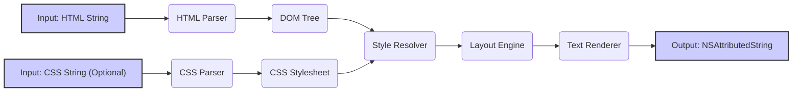

# Project Design Document: DTCoreText

**Version:** 1.1
**Date:** October 26, 2023
**Prepared By:** Gemini (AI Language Model)

## 1. Introduction

This document provides an enhanced and more detailed design overview of the DTCoreText project, an open-source Objective-C library for laying out and rendering HTML and CSS content to an attributed string. This document is specifically tailored to serve as a robust foundation for subsequent threat modeling activities.

## 2. Project Goals

*   Provide a robust and efficient mechanism for parsing and rendering HTML and CSS content within iOS and macOS applications.
*   Offer a high degree of customization and fine-grained control over the text rendering and layout process.
*   Support a broad range of HTML and CSS specifications and features commonly used in web content.
*   Maintain a balance between performance, memory efficiency, and feature completeness.
*   Provide a well-documented and maintainable codebase for developers.

## 3. Target Audience

*   iOS and macOS developers requiring the display of richly formatted text content derived from HTML and CSS sources.
*   Developers building applications that need to process and render snippets of web content or HTML-based documents.
*   Developers seeking a customizable and potentially more lightweight alternative to full-fledged web views (`UIWebView`, `WKWebView`) for specific text rendering needs.
*   Security engineers and researchers performing threat analysis and vulnerability assessments on applications utilizing DTCoreText.

## 4. Architecture Overview

DTCoreText operates as a library integrated directly into the application's process space. Its core function is to transform HTML and CSS input into an `NSAttributedString` suitable for display. The architecture can be conceptualized as a series of interconnected processing stages, each with specific responsibilities.

## 5. Data Flow

The data flow within DTCoreText follows a sequential process, transforming the input data through various stages:

*   **Input Acquisition:** The process begins with the library receiving an HTML string as primary input. Optionally, a separate CSS string can be provided to define styling rules. Input sources can include:
    *   Local file system access.
    *   Network responses from remote servers.
    *   Data entered by the user.
    *   Content retrieved from local databases or data stores.
*   **Parsing Phase:**
    *   **HTML Parsing:** The HTML parser analyzes the HTML string, breaking it down into a hierarchical structure represented by a Document Object Model (DOM) tree. This process involves tokenization and parsing of HTML tags and attributes. The parser might be based on `NSXMLParser` or a custom implementation.
    *   **CSS Parsing:** The CSS parser interprets the provided CSS string, creating a structured representation of the style rules, often referred to as a CSS stylesheet. This involves parsing selectors, properties, and values.
*   **Style Resolution:** The style resolver traverses the DOM tree, matching CSS selectors from the parsed stylesheet to the corresponding HTML elements. It calculates the final style properties for each element by considering:
    *   Matching CSS selectors based on specificity rules.
    *   Inheritance of styles from parent elements.
    *   Application of inline styles defined within HTML tags.
*   **Layout Engine:** The layout engine takes the styled DOM tree as input and performs the complex task of calculating the visual layout of the text content. This involves:
    *   Determining line breaks and text wrapping based on available width and font properties.
    *   Positioning inline and block-level elements according to CSS box model rules.
    *   Handling the placement and sizing of images and other embedded media.
    *   Implementing layout algorithms for tables (if supported) and lists.
*   **Rendering Phase:** The text renderer generates the final `NSAttributedString` based on the calculated layout. This involves:
    *   Creating attributed string ranges with the resolved font, color, and other text attributes.
    *   Drawing text glyphs and handling text shaping.
    *   Integrating rendered images and other media into the attributed string.
    *   Creating attributes for hyperlinks and other interactive elements, enabling tap gestures.
*   **Output Generation:** The resulting `NSAttributedString` is the final output of the DTCoreText library. This attributed string can then be directly used by standard UIKit or AppKit components like `UILabel`, `UITextView`, or `NSTextView` for display within the application's user interface.

## 6. Key Components

*   **HTML Parser (`DTHTMLParser`, potentially based on `NSXMLParser`):** Responsible for parsing the HTML input string and constructing the DOM tree representation. This component handles the complexities of HTML syntax and structure.
*   **CSS Parser (`DTCSSParser`):**  Responsible for parsing the CSS input string and creating a structured representation of the CSS rules (the stylesheet). This component understands CSS syntax, selectors, properties, and values.
*   **DOM Tree (`DTDOMDocument`, `DTHTMLElement`):**  A hierarchical representation of the HTML document structure, used as an intermediate data structure for style resolution and layout.
*   **CSS Stylesheet (`DTCSSStylesheet`):**  A collection of parsed CSS rules, organized for efficient lookup and application during style resolution.
*   **Style Resolver (`DTStyleResolver`):**  Traverses the DOM tree and applies the relevant CSS rules from the stylesheet to each HTML element, calculating the final style attributes.
*   **Layout Engine (`DTTextLayout`):**  Performs the core layout calculations, determining the position and size of text, images, and other elements within the rendered output. This likely involves classes for handling frames, lines, and element positioning.
*   **Text Renderer (`DTTextRenderer`):**  Generates the `NSAttributedString` with the appropriate attributes based on the layout information. This component interacts with Core Text frameworks for actual text rendering.
*   **Image Handler (`DTImageCache`, `DTImageLoader`):** Manages the loading, caching, and rendering of images referenced in the HTML. This might involve handling network requests and image decoding.
*   **Link Handler (`DTLinkAttribute`):**  Identifies and creates attributes for hyperlinks within the content, enabling interaction with links.
*   **List Handler (`DTListStyle`):**  Handles the specific layout and rendering of ordered and unordered lists, including bullet points and numbering.
*   **Table Handler (`DTTableLayout` - if supported):**  Components responsible for the complex layout calculations required for HTML tables.
*   **Font Manager (`DTFontDescriptor`):**  Manages the selection and application of fonts based on CSS font properties.

## 7. Dependencies

DTCoreText likely relies on the following frameworks and libraries provided by the operating system and potentially external sources:

*   **Foundation Framework (Apple):** Provides fundamental data types, collections, and operating system services essential for the library's operation.
*   **CoreGraphics Framework (Apple):** Used for low-level 2D drawing and rendering operations, particularly for image handling and potentially custom drawing.
*   **CoreText Framework (Apple):**  The primary framework used for advanced text layout and rendering, providing fine-grained control over glyph rendering and text shaping.
*   **libxml2 (Likely):** A widely used C library for parsing XML and HTML. DTCoreText likely leverages `libxml2` for its HTML parsing capabilities due to its robustness and performance.
*   **zlib (Potentially):** May be used for handling compressed data, especially if the library supports fetching HTML content over the network, where content might be compressed (e.g., gzip).
*   **MobileCoreServices/CoreServices Framework (Apple):**  Potentially used for handling Uniform Type Identifiers (UTIs) related to image formats and other media types.
*   **Third-party libraries (Potentially):** Depending on the specific features implemented, DTCoreText might incorporate other third-party libraries for tasks such as advanced CSS parsing or specific image format decoding.

## 8. Deployment Model

DTCoreText is deployed as a static library or framework that is directly linked into the application's binary during the build process. It operates entirely within the application's process and does not involve any separate server-side components or services.

## 9. Security Considerations (Detailed)

Given its role in processing and rendering potentially untrusted HTML and CSS content, DTCoreText presents several security considerations that are crucial for threat modeling:

*   **Cross-Site Scripting (XSS) Vulnerabilities:**
    *   **Improper HTML Sanitization:** Failure to properly sanitize or escape user-provided or externally sourced HTML content before rendering can allow malicious JavaScript code embedded within the HTML to be executed within the application's context.
    *   **Attribute Injection:**  Malicious HTML attributes (e.g., `onerror`, `onload`) containing JavaScript can be injected and executed if not properly handled.
    *   **DOM-Based XSS:** Vulnerabilities in the JavaScript code interacting with the rendered DOM could lead to DOM-based XSS.
*   **CSS Injection Attacks:**
    *   **Data Exfiltration:** Malicious CSS can be crafted to exfiltrate data by exploiting CSS selectors and pseudo-classes to infer information based on the presence or absence of elements.
    *   **UI Redressing (Clickjacking):**  CSS can be used to overlay deceptive UI elements on top of legitimate ones, tricking users into performing unintended actions.
    *   **Resource Consumption:**  Complex or poorly written CSS can cause excessive resource consumption during rendering, leading to denial-of-service conditions.
*   **Denial of Service (DoS) Attacks:**
    *   **Recursive Parsing:**  Crafted HTML with deeply nested or recursive structures can overwhelm the parser, leading to excessive CPU and memory usage.
    *   **Large Input Sizes:**  Processing extremely large HTML or CSS files can exhaust available memory and processing resources.
    *   **Resource-Intensive CSS:**  CSS rules with highly complex selectors or computationally expensive properties can slow down rendering and potentially lead to DoS.
*   **Integer Overflow/Underflow:**
    *   Vulnerabilities in the parsing, layout, or rendering algorithms, particularly when handling sizes, lengths, or counts, could lead to integer overflows or underflows, potentially causing crashes or enabling arbitrary code execution.
*   **Memory Corruption:**
    *   **Buffer Overflows/Underflows:**  Bugs in memory management, such as incorrect buffer size calculations during parsing or rendering, can lead to buffer overflows or underflows, potentially allowing for arbitrary code execution.
    *   **Use-After-Free:**  Improper handling of object lifetimes can lead to use-after-free vulnerabilities, where the application attempts to access memory that has already been freed.
*   **Resource Exhaustion:**
    *   Processing very large or deeply nested HTML documents can consume excessive memory, leading to application crashes or instability.
    *   Loading a large number of external resources (images, fonts) can exhaust network connections and memory.
*   **Insecure Handling of External Resources:**
    *   **Loading Arbitrary URLs:** If the library automatically loads external resources without proper validation, it could be vulnerable to Server-Side Request Forgery (SSRF) attacks or loading malicious content.
    *   **Insecure Protocols:**  Loading resources over insecure protocols (e.g., HTTP instead of HTTPS) can expose user data to interception.
    *   **Content Sniffing Issues:**  Incorrectly determining the MIME type of external resources could lead to security vulnerabilities.
*   **Information Disclosure:**
    *   **Error Messages:**  Verbose error messages during parsing or rendering could inadvertently reveal sensitive information about the application's internal state or file paths.
    *   **Timing Attacks:**  Variations in processing time for different inputs could potentially be exploited to infer information.

## 10. Security Architecture Considerations (Potential)

While a detailed internal security architecture would require source code analysis, we can infer potential security considerations:

*   **Input Validation and Sanitization:** The library likely implements mechanisms to validate and sanitize HTML and CSS input to prevent common injection attacks. The effectiveness of these mechanisms is critical.
*   **Memory Management Practices:**  The library's memory management techniques (e.g., ARC in Objective-C) play a crucial role in preventing memory corruption vulnerabilities.
*   **Error Handling:** Robust error handling is essential to prevent crashes and information disclosure.
*   **Resource Limits:**  The library might implement limits on the size of input data or the number of external resources to mitigate DoS attacks.
*   **Content Security Policy (CSP) Support (Potential):**  While not explicitly stated, the library might offer some level of support or integration with CSP to control the loading of external resources.

## 11. Future Considerations

*   Conduct a thorough review of the DTCoreText source code to identify specific security mechanisms and potential vulnerabilities.
*   Analyze the HTML and CSS parsing logic for weaknesses related to injection attacks and DoS.
*   Examine the layout and rendering algorithms for potential integer overflows or memory corruption issues.
*   Investigate the handling of external resources and the security measures implemented to prevent insecure loading.
*   Perform fuzz testing with a wide range of malformed and potentially malicious HTML and CSS inputs to uncover vulnerabilities.
*   Evaluate the library's adherence to secure coding practices and industry security standards.

This enhanced design document provides a more comprehensive understanding of the DTCoreText project's architecture and potential security considerations. This detailed information will be invaluable for conducting a thorough and effective threat modeling exercise.
