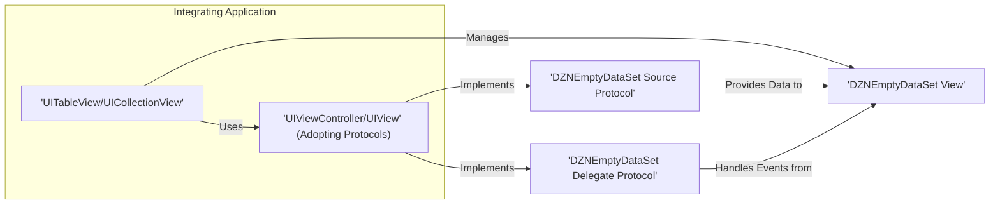
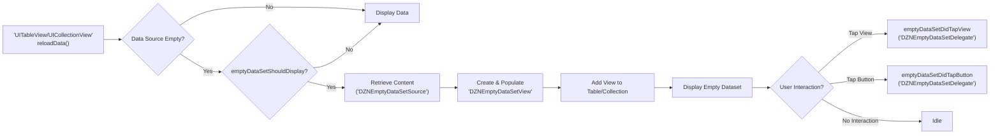

# Project Design Document: DZNEmptyDataSet

**Version:** 1.1
**Date:** October 26, 2023
**Author:** AI Software Architect

## 1. Introduction

This document provides an enhanced design overview of the DZNEmptyDataSet project, an open-source library for iOS development. This iteration aims to provide even greater clarity regarding the architecture, components, and data flow within the library, specifically to facilitate more effective threat modeling activities. It serves as a refined reference point for security analysis and the identification of potential vulnerabilities.

## 2. Project Overview

DZNEmptyDataSet is a focused and customizable library designed to improve the user experience in iOS applications. It offers a straightforward method for displaying informative placeholder views within `UITableView` and `UICollectionView` instances when they contain no data. This prevents users from encountering blank screens and provides opportunities for guidance or calls to action. The library integrates through well-defined delegate and data source protocols, ensuring a clean separation of concerns.

## 3. Goals

*   Precisely define the architecture and individual components of the DZNEmptyDataSet library with enhanced detail.
*   Clearly illustrate the data flow and interactions between the library and the integrating application.
*   Provide a robust foundation for identifying potential security threats and vulnerabilities, including specific examples.
*   Serve as an up-to-date and comprehensive reference for ongoing development, maintenance, and security assessments.

## 4. Target Audience

This document is intended for a technical audience, including:

*   Security engineers responsible for threat modeling, penetration testing, and security audits of iOS applications utilizing DZNEmptyDataSet.
*   Software developers contributing to the DZNEmptyDataSet library or integrating it into their iOS projects.
*   Software architects needing a detailed understanding of the library's design, integration mechanisms, and potential security implications.

## 5. Architectural Design

DZNEmptyDataSet functions as a presentation layer enhancement for `UITableView` and `UICollectionView`. It does not interact with the underlying data storage or retrieval mechanisms directly. Its core responsibility is to react to the data source's state and present a user-friendly interface when data is absent.

### 5.1. Key Components

*   **`DZNEmptyDataSetSource` Protocol:** This crucial protocol defines the contract through which the adopting view controller or view provides the visual and interactive content for the empty dataset view. Implementations of this protocol are responsible for supplying:
    *   `imageForEmptyDataSet:`: The `UIImage` to be displayed as a visual cue.
    *   `titleForEmptyDataSet:`: The primary `NSAttributedString` or `NSString` displayed as a heading.
    *   `descriptionForEmptyDataSet:`:  A more detailed `NSAttributedString` or `NSString` providing additional context.
    *   `buttonTitleForEmptyDataSet:forState:`: The title `NSAttributedString` or `NSString` for an optional interactive button, configurable for different control states.
    *   `buttonImageForEmptyDataSet:forState:`: The `UIImage` for an optional interactive button, configurable for different control states.
    *   `imageTintColorForEmptyDataSet:`: An optional `UIColor` to tint the provided image.
    *   `titleLabelAttributesForEmptyDataSet:`: An optional `NSDictionary` to customize the appearance of the title label.
    *   `descriptionLabelAttributesForEmptyDataSet:`: An optional `NSDictionary` to customize the appearance of the description label.
    *   `buttonTitleAttributesForEmptyDataSet:forState:`: An optional `NSDictionary` to customize the appearance of the button title for different states.
    *   `backgroundColorForEmptyDataSet:`: An optional `UIColor` to set the background color of the empty dataset view.
    *   `customViewForEmptyDataSet:`:  Allows the integration of a completely custom `UIView` for maximum flexibility.
    *   `verticalOffsetForEmptyDataSet:`:  A `CGFloat` to adjust the vertical positioning of the empty dataset view.
    *   `spaceHeightForEmptyDataSet:`: A `CGFloat` to control the vertical spacing between elements within the empty dataset view.
    *   `emptyDataSetShouldFadeIn:`: A `BOOL` indicating whether the empty dataset view should animate in.
    *   `emptyDataSetShouldBeForcedToDisplay:`: A `BOOL` to force the display of the empty dataset view regardless of the data source's emptiness.

*   **`DZNEmptyDataSetDelegate` Protocol:** This protocol defines optional methods that enable the adopting view controller or view to respond to user interactions and control the visibility and behavior of the empty dataset view. Key methods include:
    *   `emptyDataSetShouldDisplay:`: A `BOOL` indicating whether the empty dataset view should be displayed at all.
    *   `emptyDataSetShouldAllowTouch:`: A `BOOL` determining if the empty dataset view should respond to touch events.
    *   `emptyDataSetShouldAnimateImageView:`: A `BOOL` controlling whether the image view within the empty dataset should be animated.
    *   `emptyDataSetDidTapView:`:  A method invoked when the user taps on the empty dataset view.
    *   `emptyDataSetDidTapButton:`: A method invoked when the user taps the button within the empty dataset view.

*   **`UITableView` and `UICollectionView` Extensions:** DZNEmptyDataSet extends the functionality of `UITableView` and `UICollectionView` through Objective-C categories. This involves:
    *   **Method Swizzling of `reloadData`:** The library intercepts calls to `reloadData` to check the data source's state before the table or collection view updates its display. This is the primary trigger for showing the empty dataset view.
    *   **`emptyDataSetView` Property:**  A dynamically added property to `UITableView` and `UICollectionView` instances to hold and manage the `DZNEmptyDataSetView`.
    *   **Visibility and Layout Management:** The extensions handle the creation, addition, removal, and layout of the `DZNEmptyDataSetView` as a subview, ensuring it correctly overlays the table or collection view.

### 5.2. Component Diagram

## 6. Data Flow

The data flow in DZNEmptyDataSet is initiated by changes in the underlying data source of the `UITableView` or `UICollectionView`.

### 6.1. Initialization and Display Sequence

1. The integrating `UIViewController` or `UIView` conforms to the `DZNEmptyDataSetSource` protocol and optionally the `DZNEmptyDataSetDelegate` protocol. This involves implementing the required methods of the source protocol to provide content for the empty state.
2. When the `reloadData` method of the `UITableView` or `UICollectionView` is invoked, the swizzled implementation within DZNEmptyDataSet intercepts this call.
3. The library checks if the data source is empty by querying methods like `numberOfRows(inSection:)`.
4. If the data source is determined to be empty, the library calls the `emptyDataSetShouldDisplay:` method of the delegate (if implemented). If this method returns `true` (or is not implemented, defaulting to `true`), the process continues.
5. The library then calls the various methods of the `DZNEmptyDataSetSource` protocol implemented by the integrating view controller or view to retrieve the necessary content: image, title, description, button details, and styling attributes.
6. A `DZNEmptyDataSetView` instance is created and populated with the retrieved content.
7. The `DZNEmptyDataSetView` is added as a subview to the `UITableView` or `UICollectionView`, and its layout is managed to cover the bounds of the table or collection view.

### 6.2. User Interaction Flow

1. If the `emptyDataSetShouldAllowTouch:` method of the delegate returns `true` (or is not implemented, defaulting to `true`), the `DZNEmptyDataSetView` is configured to handle touch events.
2. When the user taps within the bounds of the `DZNEmptyDataSetView`, the `emptyDataSetDidTapView:` method of the delegate (if implemented) is called, allowing the integrating application to respond to the tap.
3. If the empty dataset view includes a button and the user taps this button, the `emptyDataSetDidTapButton:` method of the delegate (if implemented) is invoked, enabling the application to handle the button press.

### 6.3. Data Flow Diagram

## 7. Security Considerations

While DZNEmptyDataSet primarily operates within the presentation layer, several security considerations are relevant for developers integrating and maintaining applications using this library:

*   **Custom View Vulnerabilities:** If the `customViewForEmptyDataSet:` method is used to provide a completely custom view, the security of this custom view becomes the sole responsibility of the integrating developer. This custom view could potentially contain vulnerabilities such as:
    *   **Cross-Site Scripting (XSS):** If the custom view renders web content based on data not properly sanitized.
    *   **Memory Leaks or Excessive Resource Consumption:** If the custom view is poorly implemented, leading to denial-of-service (DoS) conditions on the client side.
    *   **Logic Bugs:**  Leading to unexpected behavior or potential security flaws within the application's logic.

*   **Resource Exhaustion through Complex Content:** While less likely, providing extremely complex or large assets (images, attributed strings) through the `DZNEmptyDataSetSource` protocol could theoretically lead to increased memory usage or rendering delays, potentially impacting performance and user experience, and in extreme cases, leading to crashes.

*   **Information Disclosure in Placeholders:** Developers must exercise caution when populating the empty dataset view with text or images. Avoid displaying sensitive information that should not be visible to the user in all states of the application, especially in non-production builds or environments.

*   **Potential for Method Swizzling Conflicts:** Although DZNEmptyDataSet's use of method swizzling is targeted, conflicts with other libraries that also utilize swizzling on `UITableView` or `UICollectionView` methods could lead to unexpected behavior or vulnerabilities. Thorough testing is crucial when integrating with other libraries that employ swizzling.

*   **Dependency Management:** While DZNEmptyDataSet has minimal direct dependencies, it's essential to ensure that the project integrating this library manages its overall dependencies effectively. Vulnerabilities in other dependencies could indirectly impact the application's security. Regularly updating dependencies is a crucial security practice.

*   **Insecure Data Handling in Delegate Methods:** If the delegate methods (`emptyDataSetDidTapView:`, `emptyDataSetDidTapButton:`) are implemented in a way that handles user interactions insecurely (e.g., directly using user input in web requests without sanitization), this could introduce vulnerabilities.

## 8. Future Considerations

*   **Enhanced Accessibility Features:**  Further improvements to ensure the empty dataset view is fully accessible according to WCAG guidelines, including better support for screen readers and keyboard navigation.
*   **More Granular Customization Options:**  Exploring the possibility of providing more fine-grained control over the layout and appearance of individual elements within the empty dataset view.
*   **Official SwiftUI Support:**  Investigating the development of a native SwiftUI implementation or a more seamless interoperability layer for SwiftUI-based applications.

## 9. Conclusion

This enhanced design document provides a more detailed and nuanced understanding of the DZNEmptyDataSet library's architecture, data flow, and security considerations. This information is crucial for security engineers to conduct thorough threat modeling and for developers to build secure and robust iOS applications. Continuous review and updates to this document will be necessary as the library evolves and new security challenges emerge.