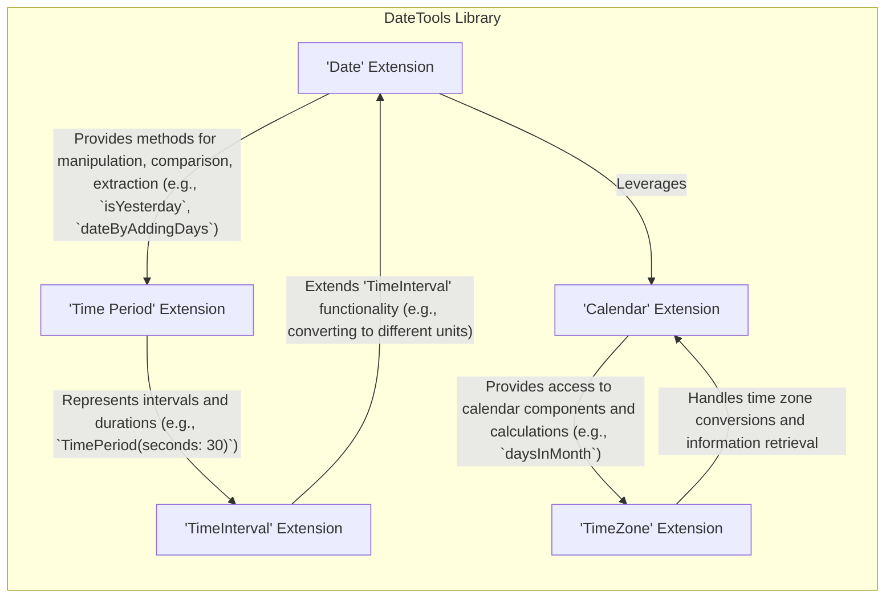
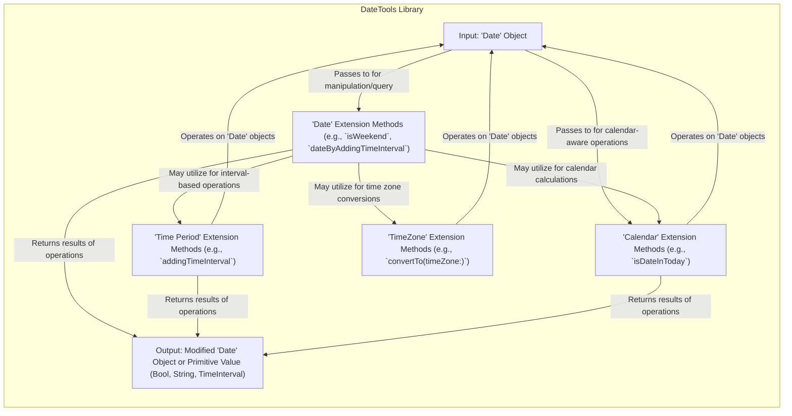

# Project Design Document: DateTools Swift Library

**Version:** 1.1
**Date:** October 26, 2023
**Author:** AI Software Architect

## 1. Project Overview

This document outlines the design of the DateTools Swift library, a curated collection of extensions and utility functions meticulously crafted to simplify and enhance date and time manipulation within Swift applications. Publicly hosted on GitHub at [https://github.com/MatthewYork/DateTools](https://github.com/MatthewYork/DateTools), this library empowers developers with a more intuitive and expressive approach to performing common date and time operations. This document serves as a foundational blueprint, detailing the library's architecture, constituent components, and the flow of data within its operations. This detailed understanding is paramount for subsequent threat modeling exercises.

## 2. Goals

* To furnish Swift developers with a suite of highly readable and convenient extensions seamlessly integrated into Swift's native `Date` and related types.
* To significantly simplify prevalent date and time manipulations, encompassing tasks such as the addition and subtraction of time intervals, precise date comparisons, and versatile date formatting.
* To introduce a more expressive and developer-friendly syntax for common date and time operations, moving beyond the sometimes verbose nature of standard Swift libraries.
* To demonstrably enhance developer productivity when engaged in the development of date and time-centric logic within Swift applications.

## 3. Non-Goals

* This project does not aim to supplant the fundamental `Foundation` framework's core date and time classes (`Date`, `Calendar`, and `TimeZone`). Instead, DateTools is intentionally designed to build upon and extend their capabilities.
* The library's scope explicitly excludes the provision of user interface elements or visual components intended for direct date and time selection by end-users.
* Handling extremely intricate or highly specialized time zone calculations that exceed the inherent capabilities of the underlying `Calendar` and `TimeZone` classes is outside the project's objectives.
* The library will not incorporate network-related functionalities for the purpose of fetching or synchronizing time data from external sources.

## 4. Target Audience

* Primarily, Swift developers actively engaged in building applications across Apple's various platforms, including iOS, macOS, watchOS, and tvOS, as well as server-side Swift development on Linux.
* Developers who actively seek a more user-centric and expressive methodology for interacting with dates and times within their Swift codebases.
* Developers specifically looking for a well-structured and maintained library that effectively augments the built-in date and time handling capabilities of Swift.

## 5. Architectural Overview

DateTools adopts an elegant architectural pattern, primarily implemented as a series of extensions to existing Swift types, most notably the fundamental `Date` struct. This design choice allows for seamless integration of the library's functionalities into existing Swift projects without necessitating substantial architectural overhauls. The library's extensions are thoughtfully organized into logical groupings, each dedicated to a specific facet of date and time manipulation.

## 6. Component Description

The DateTools library is logically segmented into the following key components, each implemented as a distinct Swift extension:

* **`Date` Extension:** This forms the core of the library, enriching the `Date` struct with a plethora of methods and computed properties. Key functionalities include:
    * **Comparison Methods:**  Functions for determining temporal relationships between dates (e.g., `isBefore(_:)`, `isAfter(_:)`, `isEqualTo(_:)`, `isToday`, `isYesterday`, `isTomorrow`).
    * **Manipulation Methods:** Functions for modifying dates by adding or subtracting specific time components (e.g., `dateByAddingYears(_:)`, `dateByAddingMonths(_:)`, `dateByAddingDays(_:)`, `dateByAddingHours(_:)`, `dateBySubtractingMinutes(_:)`).
    * **Component Extraction Properties:** Computed properties for readily accessing individual date components (e.g., `year`, `month`, `day`, `hour`, `minute`, `second`, `weekday`).
    * **Time Ago/Later Functionality:** Methods and properties for expressing time differences in human-readable formats (e.g., `timeAgoSinceNow()`, `timeUntilNow()`).
    * **Date Boundary Retrieval:** Methods for obtaining the start or end of various date units (e.g., `beginningOfDay`, `endOfWeek`, `beginningOfMonth`, `endOfYear`).
    * **Clamping Methods:** Functions to constrain a date within a specified range (e.g., `clamped(to:options:)`).

* **`Time Period` Extension:** This component likely introduces custom structures or extensions to represent time intervals or durations in a more semantically rich manner than the raw `TimeInterval`. It may offer functionalities such as:
    * **Initialization from Components:** Creating time periods using specific time units (e.g., `TimePeriod(minutes: 15, seconds: 30)`).
    * **Operations on Time Periods:** Performing arithmetic operations between time periods (e.g., adding or subtracting time periods).
    * **Comparison of Time Periods:**  Methods for comparing the duration of different time periods.
    * **Conversion to TimeInterval:**  Converting the custom time period representation back to a standard `TimeInterval`.

* **`Calendar` Extension:** This component provides extensions to the `Calendar` class, offering convenience methods for common calendar-related operations. Examples include:
    * **Retrieving Boundaries of Calendar Units:**  Methods to get the start or end date of a given calendar unit (e.g., `startOfDay(for:)`, `endOfMonth(for:)`).
    * **Checking Date Containment:** Methods to determine if a date falls within a specific calendar unit (e.g., `isDate(_:inSameDayAs:)`).
    * **Calculating Differences Between Dates:** Methods for calculating the difference between two dates in specific calendar units (e.g., `numberOfDays(from:to:)`).

* **`TimeZone` Extension:** This component extends the `TimeZone` class, potentially providing helper methods for:
    * **Converting Dates Between Time Zones:** Simplifying the process of converting a `Date` object from one time zone to another.
    * **Accessing Time Zone Information:**  Providing easier access to specific attributes of a time zone.

* **`TimeInterval` Extension:** This component extends the `TimeInterval` type, potentially adding convenience methods or computed properties for working with time intervals in a more intuitive way. This might include:
    * **Conversion to Human-Readable Units:**  Properties or methods to express a `TimeInterval` in terms of days, hours, minutes, etc.

## 7. Data Flow Diagram

The primary data element flowing through the DateTools library is the `Date` object. These objects are the subject of manipulation and comparison through the various extensions provided by the library.

**Data Flow Description:**

1. A `Date` object serves as the initial input to a DateTools method, typically invoked as an extension on the `Date` struct itself.
2. The method, residing within the relevant extension (`Date`, `Time Period`, `Calendar`, or `TimeZone`), performs operations on the input `Date` object.
3. These operations can involve:
    * Direct access and manipulation of the `Date` object's underlying representation.
    * Leveraging the functionalities provided by the core `Calendar` and `TimeZone` classes.
    * Creation or manipulation of `TimeInterval` values to represent durations.
4. The method ultimately returns either a newly modified `Date` object or a primitive value derived from the date operation, such as:
    * A `Bool` indicating the result of a comparison (e.g., whether a date is in the future).
    * A `String` representing a formatted date or a human-readable time difference.
    * A `TimeInterval` representing a duration.

## 8. Security Considerations (For Threat Modeling)

While DateTools is fundamentally a utility library focused on date and time manipulation and does not directly handle sensitive user data, it's crucial to consider potential security implications arising from how it manipulates and represents temporal information. These considerations are vital for effectively threat modeling applications that integrate and utilize DateTools:

* **Indirect Input Validation Vulnerabilities:** DateTools relies on the robustness of the `Date` initializer and the underlying `Calendar` to parse date strings or individual date components. Maliciously crafted or incorrectly formatted input strings passed to date creation methods *before* being processed by DateTools could lead to unexpected behavior, exceptions, or even denial-of-service conditions within the consuming application. Threat modeling should meticulously examine how the calling application sanitizes and validates initial date inputs.
* **Logic Errors Leading to Incorrect Temporal Calculations:**  Bugs or flaws in DateTools' internal logic for performing date and time calculations (e.g., adding intervals, determining the end of a month) could result in incorrect temporal values. This can have significant security ramifications in scenarios where precise date comparisons or deadlines are critical for security enforcement (e.g., access control based on time windows, expiration date handling for sensitive resources).
* **Time Zone Handling Exploits:**  Inconsistent or incorrect handling of time zones can introduce subtle but potentially severe security vulnerabilities, particularly in applications dealing with events, scheduling, or access control that span geographical boundaries. Threat modeling should rigorously analyze how DateTools interacts with the `TimeZone` class and identify potential edge cases or inconsistencies in time zone conversions that could be exploited. For example, an attacker might manipulate time zone data to gain unauthorized access during off-peak hours in a different region.
* **Locale-Specific Interpretation Issues:** While not typically a direct security vulnerability, improper handling of locale-specific date and time formats could lead to misinterpretations or display errors that might indirectly impact security-related information presented to the user. For instance, a date displayed in an unexpected format could mislead a user about the validity period of a token.
* **Potential for Resource Exhaustion:** Although less likely with typical date operations, poorly optimized or excessively complex date calculations involving extremely large time intervals or intricate calendar operations could theoretically lead to excessive CPU utilization or memory consumption, potentially causing a denial-of-service.
* **Indirect Dependency Vulnerabilities:** While DateTools itself aims to minimize external dependencies, the applications that depend on it will inevitably have their own dependency chains. Threat modeling should encompass the security posture of the entire application stack, including any transitive dependencies.
* **Limited Information Disclosure Risks:** While DateTools doesn't inherently store sensitive data, the unintentional exposure of overly precise date and time information (e.g., displaying timestamps with millisecond precision when only the date is relevant) could, in specific contexts, constitute a minor information disclosure risk.

## 9. Dependencies

DateTools is intentionally designed to be lightweight and primarily relies on the foundational components provided by the Swift standard library and the `Foundation` framework. Its core dependencies include:

* **`Foundation` Framework:** This framework provides the fundamental building blocks for date and time manipulation in Swift, including the `Date`, `Calendar`, `TimeZone`, and `TimeInterval` classes upon which DateTools is built.

The library strives to avoid introducing unnecessary external dependencies to maintain its simplicity and reduce the potential attack surface.

## 10. Deployment Considerations

DateTools is typically integrated into Swift projects using established dependency management tools:

* **Swift Package Manager (SPM):** This is the recommended and most common method for integrating DateTools into Swift projects. Developers simply add the DateTools repository URL to the `dependencies` array within their project's `Package.swift` manifest file. The build system then handles the download and linking of the library.
* **CocoaPods:** A widely used dependency manager for both Objective-C and Swift projects. Integration involves adding DateTools as a dependency within the project's `Podfile` and then running the `pod install` command.
* **Carthage:** Another dependency manager primarily used for macOS and iOS projects. Integration typically involves adding DateTools to the project's `Cartfile` and then running the `carthage update` command to build the framework. The developer then needs to manually link the built framework to their Xcode project.

Once successfully integrated, the extensions and utility functions provided by DateTools become readily available for use within the project's Swift codebase.

## 11. Future Considerations

* **Expansion of Formatting Capabilities:** While the primary focus remains on date and time manipulation, offering more comprehensive and localized date formatting options could further enhance the library's utility.
* **Enhanced Time Period Granularity:**  Potentially introducing support for more specialized time periods, such as business days or specific recurring intervals.
* **Improved Documentation and Code Examples:**  Continuously improving the clarity and comprehensiveness of the library's documentation and providing more illustrative code examples are crucial for developer adoption and ensuring correct usage.
* **Maintaining Backwards Compatibility:**  Careful consideration should be given to maintaining compatibility with older Swift versions to accommodate a wider range of users.
* **Exploring Potential Performance Optimizations:** Investigating opportunities to further optimize the performance of computationally intensive date and time operations.

This revised design document offers a more detailed and comprehensive understanding of the DateTools Swift library's architecture, components, and data flow. It serves as an enhanced resource for comprehending the library's inner workings and is essential for conducting thorough and effective threat modeling to proactively identify and mitigate potential security vulnerabilities in applications that leverage DateTools.