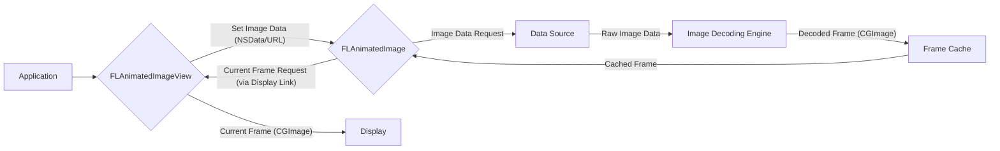

# Project Design Document: FLAnimatedImage

**Version:** 1.1
**Date:** October 26, 2023
**Author:** AI Software Architect

## 1. Introduction

This document provides an enhanced and more detailed design overview of the `FLAnimatedImage` library, an open-source iOS library for efficiently displaying animated GIFs and APNGs. This document is specifically tailored to serve as a robust foundation for subsequent threat modeling activities. It comprehensively outlines the library's architecture, key components, data flow, and dependencies, with a heightened focus on potential security implications.

## 2. Goals

* Provide a comprehensive and technically detailed description of the `FLAnimatedImage` library's internal workings.
* Clearly identify key components, their specific responsibilities, and their interactions.
* Detail the data flow within the library, highlighting data transformations and storage points.
* Proactively highlight potential areas of interest and specific concerns for security analysis and threat modeling.

## 3. Overview

`FLAnimatedImage` is engineered to overcome performance and memory management limitations often encountered when rendering animated images on iOS using the standard `UIImageView`. It achieves this through a combination of optimized techniques for decoding, caching, and rendering. The library offers a direct replacement for `UIImageView` in the form of `FLAnimatedImageView` and a core class, `FLAnimatedImage`, for managing the underlying animated image data. Key features include asynchronous decoding, frame caching, and precise timing control.

## 4. Architecture

The library's architecture comprises several interconnected components, each with specific responsibilities:

* **`FLAnimatedImage`:** The central orchestrator for managing animated image data. Key responsibilities include:
    * **Initialization:** Accepting image data (`NSData`) or a URL as input.
    * **Format Detection:** Determining if the data represents a GIF or APNG.
    * **Parsing:**  Analyzing the image data to extract metadata, including frame dimensions, delays, and color tables.
    * **Decoding Management:**  Orchestrating the decoding of individual frames, often performed asynchronously.
    * **Frame Caching:** Implementing a caching mechanism for decoded frames.
    * **Frame Access:** Providing methods to retrieve specific frames for rendering.
    * **Timing Control:** Managing the timing information for animation playback.
* **`FLAnimatedImageView`:** A specialized subclass of `UIImageView` designed to display animated images managed by an `FLAnimatedImage` instance. Its core functions are:
    * **Image Source Management:** Holding a reference to an `FLAnimatedImage` object.
    * **Display Link Integration:** Utilizing `CADisplayLink` for precise, screen-synchronized animation updates.
    * **Frame Selection:** Determining the correct frame to display based on the current animation time.
    * **Frame Rendering:** Setting the `image` property of the underlying `UIImageView` with the currently selected frame.
    * **Playback Controls:** Offering methods to start, stop, pause, and control the animation.
* **Frame Cache:** An internal, optimized cache within `FLAnimatedImage` for storing decoded image frames (`CGImage` objects). This is crucial for performance, preventing redundant decoding. Key aspects include:
    * **Storage Mechanism:** Likely uses an `NSCache` or a custom dictionary-based implementation.
    * **Eviction Policy:**  Likely employs a Least Recently Used (LRU) or similar strategy to manage memory usage when the cache reaches its capacity.
    * **Concurrency Control:**  Needs to be thread-safe to handle asynchronous decoding and frame access from the main thread.
* **Image Decoding Engine:** The module responsible for the actual decoding of raw image data into a bitmap format (`CGImage`). This involves:
    * **GIF Decoding:**  Parsing the LZW compression and rendering individual frames based on local and global color tables.
    * **APNG Decoding:** Handling the more complex APNG format, including different frame disposal methods and blend operations.
    * **Leveraging System Frameworks:**  Potentially utilizing `CGImageSource` and related APIs from the ImageIO framework.
* **Data Source Abstraction:** Represents the origin of the animated image data, providing flexibility in how images are loaded:
    * **`NSData`:** Direct in-memory representation of the image data.
    * **`URL`:** A pointer to a remote or local image resource. The library likely handles fetching data from URLs asynchronously.

## 5. Data Flow

The typical sequence of operations for displaying an animated image using `FLAnimatedImage` involves the following data flow:

Detailed steps:

1. The application instantiates `FLAnimatedImageView` and provides the animated image data, either as `NSData` or a `URL`.
2. `FLAnimatedImageView` creates or updates its associated `FLAnimatedImage` instance with the provided data source.
3. `FLAnimatedImage` initiates the process of fetching the raw image data from the `Data Source` if a `URL` is provided.
4. The `Image Decoding Engine` decodes the raw image data, frame by frame, potentially in a background thread.
5. Decoded frames (`CGImage` objects) are stored in the `Frame Cache`.
6. `FLAnimatedImageView` utilizes `CADisplayLink` to synchronize frame updates with the screen refresh rate.
7. On each display refresh, `FLAnimatedImageView` requests the appropriate frame from its `FLAnimatedImage` instance.
8. `FLAnimatedImage` retrieves the requested frame from the `Frame Cache`. If the frame is not yet cached, it might trigger on-demand decoding.
9. `FLAnimatedImageView` sets the retrieved `CGImage` as the `image` for its underlying `UIImageView`, causing it to be rendered on the display.

## 6. Security Considerations (Enhanced)

Building upon the initial thoughts, here are more specific security considerations:

* **Malicious Image Data (Input Validation & Resource Exhaustion):**
    * **DoS via Large Images:**  Crafted GIFs/APNGs with extremely high resolutions or frame counts can lead to excessive memory allocation and CPU usage during decoding and caching, potentially crashing the application or making it unresponsive. *Mitigation: Implement checks on image dimensions and frame counts before attempting to decode.*
    * **Infinite Loops/Processing Stalls:** Malformed image headers or frame data could cause the decoding engine to enter infinite loops or get stuck in processing, leading to resource exhaustion. *Mitigation: Implement robust error handling and timeouts during parsing and decoding.*
    * **Memory Bombs (e.g., LZW Stacking):**  Specifically crafted GIF data can exploit vulnerabilities in LZW decompression, leading to exponential memory allocation. *Mitigation: Employ secure and well-vetted decoding libraries and potentially implement safeguards against excessive decompression ratios.*
    * **Integer Overflows in Parsing:** Vulnerabilities in parsing the image header or frame metadata could lead to integer overflows, potentially resulting in buffer overflows or other memory corruption issues. *Mitigation: Use safe integer arithmetic and perform thorough bounds checking.*
* **Network Security (Data Integrity & Confidentiality):**
    * **MITM Attacks (Insecure Connections):** Loading images over unencrypted HTTP connections exposes the image data to interception and modification. An attacker could replace the intended image with malicious content. *Mitigation: Enforce HTTPS for all image URLs.*
    * **Server-Side Vulnerabilities (Indirect Risk):** If the image server is compromised, malicious images could be served, indirectly affecting applications using `FLAnimatedImage`. *Mitigation: Educate users about the risks of loading content from untrusted sources.*
* **Cache Poisoning (Data Integrity):**
    * **HTTP Cache Poisoning:** If the application relies on HTTP caching mechanisms, an attacker could potentially poison the cache with malicious image data, which would then be served to users. *Mitigation: Implement proper cache control headers and consider using content integrity checks.*
* **Memory Management Vulnerabilities:**
    * **Memory Leaks:** Improperly releasing allocated memory for decoded frames or other internal data structures can lead to memory leaks, eventually causing the application to crash. *Mitigation: Employ careful memory management practices, including ARC (Automatic Reference Counting) and proper deallocation of resources.*
    * **Use-After-Free:** Accessing memory that has already been freed can lead to unpredictable behavior and potential crashes. *Mitigation: Ensure proper object lifecycle management and avoid dangling pointers.*
* **Concurrency Issues:**
    * **Race Conditions in Caching:** If the frame cache is not properly synchronized, race conditions could occur when multiple threads access or modify the cache simultaneously, leading to data corruption. *Mitigation: Implement thread-safe caching mechanisms using locks or other synchronization primitives.*

## 7. Dependencies

`FLAnimatedImage` relies on the following core iOS frameworks:

* **Foundation:** Provides fundamental data types and utilities (e.g., `NSData`, `NSURL`, `NSError`).
* **UIKit:** Essential for UI elements (`UIImageView`), display synchronization (`CADisplayLink`), and image handling.
* **CoreGraphics:**  Used for low-level 2D rendering and image manipulation (`CGImage`, `CGContext`).
* **ImageIO:**  Provides comprehensive support for reading and writing various image formats, including GIF and APNG. This is likely the primary framework used for image decoding.

While `FLAnimatedImage` aims to be lightweight, it's crucial to be aware of the security implications within these underlying Apple frameworks as well.

## 8. Deployment

`FLAnimatedImage` is commonly integrated into iOS projects using popular dependency managers:

* **CocoaPods:** A widely used dependency manager for Objective-C and Swift projects.
* **Carthage:** A decentralized dependency manager that builds your dependencies and leaves you to integrate the binaries.
* **Swift Package Manager (SPM):** Apple's native dependency manager for Swift projects.

The integration process typically involves adding the library as a dependency in the project's configuration file and then importing the necessary headers or modules in the application code.

## 9. Future Considerations

* **Expanded Format Support:**  Adding support for newer animated image formats like WebP would necessitate incorporating new decoding logic and potentially introduce new vulnerabilities specific to those formats.
* **Advanced Caching Strategies:** Implementing more sophisticated caching mechanisms, such as disk caching, could introduce new security considerations related to data storage and access control.
* **Security Hardening:**  Future development could focus on proactive security measures, such as input sanitization and stricter validation of image data.
* **Regular Security Audits:**  Periodic security audits and penetration testing are essential to identify and address potential vulnerabilities as the library evolves.

This enhanced design document provides a more in-depth understanding of the `FLAnimatedImage` library's architecture and potential security considerations. This detailed information is crucial for conducting a comprehensive and effective threat model to identify vulnerabilities and develop appropriate mitigation strategies.