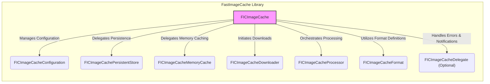
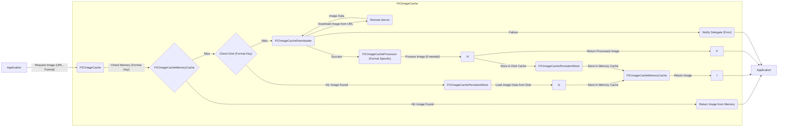

# Project Design Document: FastImageCache

**Version:** 1.1
**Date:** October 26, 2023
**Prepared By:** AI Software Architect

## 1. Introduction

This document provides an enhanced and more detailed design overview of the FastImageCache project, a library for efficiently caching images on iOS and macOS. This document serves as a robust foundation for subsequent threat modeling activities, offering a comprehensive understanding of the system's architecture, data flow, and key components, including potential security implications.

### 1.1. Purpose

The primary purpose of this document is to provide a clear, detailed, and improved description of the design of FastImageCache. This level of detail is essential to facilitate effective and thorough threat modeling, enabling security analysts to identify potential vulnerabilities and attack vectors.

### 1.2. Scope

This document covers the core functionality of the FastImageCache library as represented in the provided GitHub repository, with a focus on the intricacies of its image caching mechanisms, data storage, and retrieval processes. It delves deeper into the interactions between components and the lifecycle of cached images. While it still does not cover UI integration specifics, it provides more context on how the library interacts with the broader application environment.

### 1.3. Goals

* Provide an exceptionally clear and detailed description of the FastImageCache architecture, including the responsibilities and interactions of each component.
* Precisely identify key components and thoroughly explain their individual responsibilities and how they contribute to the overall functionality.
* Illustrate the flow of image data through the system with greater granularity, including decision points and potential error scenarios.
* Highlight potential areas of interest for security analysis with more specific examples and potential attack scenarios.

## 2. System Overview

FastImageCache is a sophisticated library engineered to significantly improve the performance and responsiveness of applications that display images. Its core strength lies in its multi-layered caching strategy, encompassing in-memory and on-disk storage, optimized for speed and efficiency. The library is designed to provide a seamless and highly efficient way to manage image loading and caching, drastically reducing redundant network requests, minimizing latency, and ultimately enhancing the user experience.

### 2.1. Key Features

* **Sophisticated Multi-Layered Caching:** Employs a hierarchical caching system, utilizing both a fast in-memory cache (typically `NSCache`) for frequently accessed images and a persistent on-disk cache for longer-term storage.
* **Non-Blocking Asynchronous Operations:**  Performs all network operations, disk I/O, and image processing asynchronously using techniques like Grand Central Dispatch (GCD) or `OperationQueue` to prevent blocking the main application thread and maintain UI responsiveness.
* **Highly Configurable Cache Policies:** Offers extensive customization options, allowing developers to fine-tune cache behavior, including setting maximum cache sizes (both memory and disk), defining expiration policies based on time or usage, and specifying custom storage locations.
* **Flexible Image Processing Pipeline:** Supports a robust image processing pipeline, enabling transformations such as resizing, cropping, applying filters, and format conversions before caching, optimizing storage and display.
* **Optimized Disk Storage Management:** Implements efficient strategies for managing disk space, including techniques for preventing fragmentation and ensuring fast read/write access to cached image files. It may use techniques like hashing and structured directories for organization.

## 3. System Architecture

The FastImageCache library is composed of several well-defined components that collaborate to deliver its image caching capabilities. Understanding the responsibilities and interactions of these components is crucial for threat modeling.

### 3.1. Component Diagram

### 3.2. Component Descriptions

* **`FICImageCache`:** The central orchestrator of the library. It provides the primary API for interacting with the cache, managing the overall caching process, coordinating the activities of other components, and handling requests for images. It holds the `FICImageCacheConfiguration` and acts as the entry point for most operations.
* **`FICImageCacheConfiguration`:**  A value object that encapsulates all the configuration parameters for the image cache. This includes critical settings such as the disk cache directory path, maximum memory and disk cache sizes (in bytes or number of items), cache expiration policies (e.g., time-to-live), and potentially options for encryption or data protection levels.
* **`FICImageCachePersistentStore`:**  Specifically responsible for managing the on-disk cache. This component handles the complexities of reading and writing image data to persistent storage, including file system operations, potentially using techniques like file hashing for integrity checks, and managing disk space according to the configured policies. It might also handle tasks like cleaning up expired or unused cached files.
* **`FICImageCacheMemoryCache`:** Manages the in-memory cache, typically implemented using `NSCache` or a similar mechanism. It stores recently accessed and frequently used images in volatile memory for extremely fast retrieval. This component is responsible for evicting images based on memory pressure or usage patterns to maintain optimal performance.
* **`FICImageCacheDownloader`:**  Dedicated to the asynchronous downloading of images from remote URLs. It typically leverages `URLSession` (or a similar networking framework) to perform network requests, handle responses, and manage potential network errors. This component might also implement logic for handling HTTP caching headers and authentication.
* **`FICImageCacheProcessor`:**  Responsible for performing any necessary image processing or transformations. This could include resizing images to specific dimensions, applying filters, adjusting image quality, or converting between different image formats. The processing steps are often defined by the `FICImageCacheFormat`.
* **`FICImageCacheFormat`:** Defines the specific format and processing rules for a particular type of cached image. This includes parameters like the desired image size, rendering style, compression level, and any specific transformations to be applied. Multiple formats can be registered with the `FICImageCache`, allowing for different caching strategies for different image types or use cases.
* **`FICImageCacheDelegate` (Optional):** An optional delegate protocol that allows the application to receive notifications about cache events, such as when an image is successfully cached, when a download fails, or when the cache is being purged. This provides a mechanism for the application to react to cache-related events.

## 4. Data Flow

The following provides a more detailed description of the typical flow of an image request through the FastImageCache library, highlighting key decision points and potential error scenarios.

### 4.1. Image Retrieval Flow

### 4.2. Detailed Steps

1. **Application Request:** The application initiates a request to the `FICImageCache` for an image, providing the image's URL and the desired `FICImageCacheFormat`. The format key is crucial for identifying the specific version of the image in the cache.
2. **Memory Cache Lookup:** `FICImageCache` first queries the `FICImageCacheMemoryCache` using a key derived from the image URL and the `FICImageCacheFormat`.
3. **Memory Cache Hit:** If a matching image is found in the memory cache, it is immediately returned to the application, providing the fastest retrieval path.
4. **Memory Cache Miss:** If the image is not found in memory, `FICImageCache` proceeds to check the `FICImageCachePersistentStore` (disk cache).
5. **Disk Cache Lookup:** `FICImageCachePersistentStore` attempts to locate the image data on disk using a key derived from the URL and format.
6. **Disk Cache Hit:** If the image is found on disk, `FICImageCachePersistentStore` loads the image data from the file system.
7. **Load and Store in Memory:** The loaded image data is then stored in the `FICImageCacheMemoryCache` to optimize future requests.
8. **Return from Disk Cache:** The image is returned to the application.
9. **Disk Cache Miss:** If the image is not found on disk, `FICImageCache` instructs the `FICImageCacheDownloader` to download the image from the specified URL.
10. **Image Download:** `FICImageCacheDownloader` initiates an asynchronous network request to the remote server.
11. **Download Success:** Upon successful download, the raw image data is passed to the `FICImageCacheProcessor`.
12. **Download Failure:** If the download fails (e.g., network error, HTTP error), the `FICImageCache` may notify its delegate (if set) about the error.
13. **Image Processing:** `FICImageCacheProcessor` applies any necessary transformations or processing steps defined by the `FICImageCacheFormat`. This step is crucial for ensuring the cached image matches the requested format.
14. **Disk Cache Storage:** The downloaded (and potentially processed) image data is stored persistently in the `FICImageCachePersistentStore`. The storage mechanism might involve creating a new file or overwriting an existing one.
15. **Memory Cache Storage:** The image is also stored in the `FICImageCacheMemoryCache` for immediate access in subsequent requests.
16. **Return Processed Image:** The processed image is returned to the requesting application.

## 5. Security Considerations

This section expands on the potential security concerns, providing more specific examples and potential attack scenarios based on the system's design. A dedicated threat model will further analyze these and other potential vulnerabilities in detail.

* **Data Integrity:**
    * **Disk Cache Tampering:** A malicious application or user with root access could potentially modify cached image files on disk, leading to the display of altered or malicious content within the application. This could be used for phishing attacks or to spread misinformation. Consider the impact if an attacker replaced legitimate images with offensive or harmful content.
    * **Network Interception (Man-in-the-Middle):** If image downloads are not exclusively performed over HTTPS, attackers on the network could intercept the traffic and potentially inject malicious or corrupted image data before it reaches the cache. This could lead to application crashes, unexpected behavior, or the display of malicious content.
* **Data Confidentiality:**
    * **Unauthorized Access to Disk Cache:** If sensitive images are cached without proper encryption or file permissions, other applications or users with access to the device's file system could potentially access and view these images, leading to privacy breaches. Consider scenarios where user profile pictures or other private images are exposed.
* **Availability:**
    * **Cache Poisoning:** An attacker could potentially force the caching of malicious or corrupted images by manipulating network responses or exploiting vulnerabilities in the cache update mechanism. This could lead to persistent display of incorrect or harmful content, even after the legitimate content is updated on the server.
    * **Denial of Service (DoS):** An attacker could repeatedly request a large number of unique, uncached images, forcing the library to perform numerous network requests and disk operations, potentially overwhelming the device's resources and leading to application slowdowns or crashes.
* **Network Security:**
    * **Man-in-the-Middle (MITM) Attacks:** As mentioned before, the lack of HTTPS enforcement during image downloads makes the application vulnerable to MITM attacks, where attackers can intercept and modify communication between the application and the image server.
* **Local Storage Security:**
    * **Insecure File Permissions:** Incorrectly configured file permissions for the disk cache directory could allow other applications or users to read, write, or delete cached image files, potentially compromising the integrity and availability of the cache.
    * **Insufficient Data Protection:**  The library might not be leveraging platform-specific data protection mechanisms (like iOS Data Protection) to protect cached data when the device is locked.
* **Image Processing Vulnerabilities:**
    * **Exploiting Image Processing Libraries:** If the `FICImageCacheProcessor` relies on external image processing libraries with known vulnerabilities, attackers could potentially craft malicious images that exploit these vulnerabilities, leading to crashes or even remote code execution.

## 6. Dependencies

The FastImageCache library relies on the following core system frameworks and potentially other external libraries:

* **Foundation Framework (iOS/macOS):** Provides fundamental utility classes, including `URLSession` for handling network requests, `FileManager` for file system operations, `NSCache` for the in-memory cache, and Grand Central Dispatch (GCD) for managing asynchronous tasks.
* **UIKit (iOS) / AppKit (macOS):** Used for representing and manipulating images (`UIImage`, `NSImage`), and potentially for accessing display-related information.
* **CoreGraphics (iOS/macOS):**  A low-level framework used for image manipulation and drawing, which might be used internally by the `FICImageCacheProcessor`.
* **libdispatch (Grand Central Dispatch):**  Essential for managing asynchronous operations, ensuring that network requests and disk I/O do not block the main thread.
* **Potential External Libraries:** Depending on the complexity of image processing, the library might depend on external image processing libraries (e.g., for advanced filtering or format support). The specific libraries would need to be identified through further code analysis.

## 7. Deployment

The FastImageCache library is typically integrated directly into iOS or macOS applications as a dependency, often using package managers like CocoaPods, Carthage, or Swift Package Manager. Developers include the library in their project and utilize its API within their application code to manage image caching. The library operates within the application's process sandbox and utilizes the application's designated local storage area for the disk cache.

## 8. Future Considerations

Potential future enhancements or modifications that could significantly impact the design and security posture of the FastImageCache library include:

* **End-to-End Encryption of Disk Cache:** Implementing robust encryption for the on-disk cache using platform-provided APIs (like `FileProtectionType`) to protect sensitive image data at rest. This would mitigate the risk of unauthorized access to cached images.
* **Secure Token Management and Handling:** If the image URLs require authentication (e.g., using API keys or OAuth tokens), implementing secure storage and handling of these credentials within the library is crucial to prevent unauthorized access to protected resources. Consider using the Keychain for secure storage.
* **Advanced and Configurable Cache Invalidation Strategies:** Implementing more sophisticated mechanisms for invalidating cached images based on server-side directives (e.g., using HTTP cache headers or push notifications) or time-based policies. This would ensure that the application displays the most up-to-date content.
* **Content Security Policy (CSP) Enforcement:**  Potentially integrating with CSP mechanisms to further restrict the sources from which images can be loaded, mitigating the risk of loading malicious images from untrusted sources.
* **Integrity Checks for Cached Files:** Implementing mechanisms to verify the integrity of cached image files (e.g., using checksums or digital signatures) to detect and prevent tampering.
* **Sandboxing and Isolation Improvements:** Exploring ways to further isolate the caching logic and data from the main application process to limit the impact of potential vulnerabilities.

This enhanced document provides a more detailed and comprehensive overview of the FastImageCache project's design. It serves as an improved and more valuable resource for understanding the system's architecture, data flow, and potential security considerations, which is crucial for conducting thorough and effective threat modeling activities.
