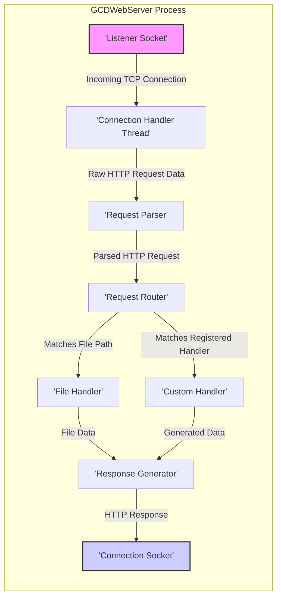
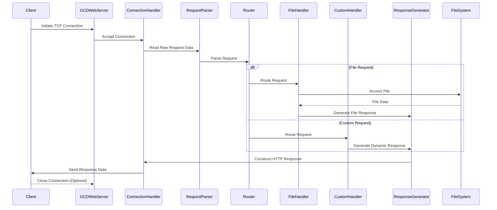

# Project Design Document: GCDWebServer

**Version:** 1.1
**Date:** October 26, 2023
**Author:** AI Software Architect

## 1. Introduction

This document provides an enhanced design overview of the GCDWebServer project, a lightweight, embedded HTTP server framework primarily designed for macOS and iOS, with potential for broader platform support. This document aims to provide a clear and comprehensive understanding of GCDWebServer's architecture, components, and data flow, serving as a foundation for subsequent threat modeling and security analysis. It expands upon the initial design by providing more detail and context.

## 2. Goals and Objectives

The primary goals of GCDWebServer are to:

* Offer a straightforward and efficient method for embedding a fully functional HTTP server within applications.
* Support standard HTTP methods including GET, POST, PUT, DELETE, HEAD, OPTIONS, and potentially others.
* Facilitate the serving of static files from the application bundle or file system.
* Enable the implementation of custom request handlers for dynamic content generation and application-specific logic.
* Maintain a lightweight footprint with minimal external dependencies to ease integration.
* Provide an intuitive API for developers to configure and manage the embedded server.

This design document aims to achieve the following objectives:

* Clearly delineate the architectural layers and key components of the GCDWebServer framework.
* Provide a detailed description of the data flow within the system for various HTTP request types and scenarios.
* Identify and elaborate on critical security considerations relevant to the design and operation of GCDWebServer.
* Offer insights into typical deployment scenarios and associated considerations.
* Serve as a robust and informative resource for conducting thorough threat modeling exercises.

## 3. Architectural Overview

GCDWebServer employs a multi-threaded architecture, leveraging Grand Central Dispatch (GCD) for managing concurrency and asynchronous operations. The core of the server listens for incoming network connections on a specified port and dispatches these connections to worker threads for independent processing. This design ensures responsiveness and the ability to handle multiple concurrent requests.

**Key Architectural Layers:**

* **Networking Layer:** This layer is responsible for all network-related operations. It includes the listening socket that accepts incoming TCP connections and the connection handler threads that manage individual client connections. GCD's asynchronous capabilities are heavily utilized here for non-blocking I/O.
* **Request Processing Layer:** This layer takes the raw HTTP request data and transforms it into a structured object. It handles the parsing of the request line, headers, and body. The request router then determines the appropriate handler based on the request URL and registered routes.
* **Handler Layer:** This layer contains the logic for processing requests. It includes built-in handlers like the file handler for serving static content and allows developers to register custom handlers for dynamic content generation and application-specific endpoints.
* **Response Generation Layer:** This layer takes the output from the handler and formats it into a valid HTTP response, including headers and the response body.

## 4. Component Description

This section provides a more detailed description of the key components within the GCDWebServer framework:

* **`GCDWebServer`:** This is the central class that manages the entire server lifecycle. It is responsible for:
    * Creating and binding the listening socket.
    * Starting and stopping the server.
    * Managing the pool of worker threads (typically GCD queues).
    * Registering request handlers.
    * Configuring server settings (e.g., port, Bonjour service).
* **`GCDWebServerConnection`:** An instance of this class is created for each incoming client connection. It is responsible for:
    * Managing the socket for a specific client.
    * Reading the incoming request data.
    * Writing the outgoing response data.
    * Handling connection keep-alive logic.
* **`GCDWebServerRequest`:** An abstract base class representing an incoming HTTP request. Concrete subclasses provide specific implementations for different request types, such as:
    * `GCDWebServerDataRequest`: Represents a request with a data body (e.g., POST requests).
    * `GCDWebServerFileRequest`: Represents a request where the body is a file.
    * It encapsulates information like the HTTP method, URL, headers, and parsed body.
* **`GCDWebServerResponse`:** An abstract base class representing an HTTP response. Concrete subclasses handle different response types:
    * `GCDWebServerDataResponse`: Represents a response with a data body.
    * `GCDWebServerFileResponse`: Represents a response serving a file.
    * `GCDWebServerStreamedResponse`: Represents a response where the body is streamed.
    * It includes the HTTP status code, headers, and the response body.
* **`GCDWebServerRequestParser`:** This component is responsible for parsing the raw HTTP request data received from the socket. It extracts:
    * The request method (GET, POST, etc.).
    * The request URL.
    * HTTP headers.
    * The request body (if present), handling different content types.
* **`GCDWebServerResponseWriter`:** This component takes a `GCDWebServerResponse` object and formats it into the raw HTTP response data that is sent back to the client. This includes:
    * Constructing the status line.
    * Adding HTTP headers.
    * Writing the response body.
* **`GCDWebServerHandler`:** An abstract protocol defining the interface for handling requests. Concrete implementations include:
    * `GCDWebServerFileHandler`: Serves static files from a specified directory on the file system. It handles MIME type detection and range requests.
    * Custom Handlers: Developers can create custom classes that conform to the `GCDWebServerHandler` protocol to implement specific application logic for handling requests to particular paths.
* **`GCDWebServerRouter`:** This component is responsible for mapping incoming requests to the appropriate `GCDWebServerHandler`. It typically uses a pattern-matching mechanism to match the request URL against registered handler paths.
* **`GCDWebServerAuthentication` (Optional):** This component provides mechanisms for authenticating clients. It might support:
    * Basic Authentication.
    * Digest Authentication.
    * Custom authentication schemes implemented by developers.
* **`GCDWebServerBodyParser` (Implicit within `GCDWebServerRequestParser`):** This functionality handles the parsing of the request body based on the `Content-Type` header. It supports common formats like:
    * `application/x-www-form-urlencoded`.
    * `multipart/form-data`.
    * Potentially others, depending on implementation details.

## 5. Data Flow

This section provides a more detailed breakdown of the data flow involved in processing an HTTP request within GCDWebServer:

1. **Client Connection:** A client initiates a TCP connection to the port on which `GCDWebServer` is listening.
2. **Connection Acceptance:** The `GCDWebServer` accepts the incoming connection and creates a new `GCDWebServerConnection` object to manage this specific client.
3. **Request Reception (within `GCDWebServerConnection`):** The `GCDWebServerConnection` reads raw bytes from the client's socket. This might involve multiple reads depending on the size of the request.
4. **Request Parsing (by `GCDWebServerRequestParser`):** The raw bytes are passed to the `GCDWebServerRequestParser`, which performs the following steps:
    * Parses the request line to determine the HTTP method and URL.
    * Parses the HTTP headers.
    * If a body is present (e.g., for POST or PUT requests), parses the body according to the `Content-Type` header.
5. **Request Object Creation:** The `GCDWebServerRequestParser` creates a concrete `GCDWebServerRequest` object (e.g., `GCDWebServerDataRequest`) containing the parsed information.
6. **Request Routing (by `GCDWebServerRouter`):** The `GCDWebServerRouter` examines the `GCDWebServerRequest`'s URL and other attributes to determine the appropriate `GCDWebServerHandler` to process the request. This involves matching the URL against registered handler paths.
7. **Handler Invocation:**
    * **File Handling (`GCDWebServerFileHandler`):** If the request maps to a file, the `GCDWebServerFileHandler` retrieves the requested file from the file system. It handles security checks to prevent path traversal.
    * **Custom Handling (Custom `GCDWebServerHandler`):** If a custom handler is matched, the `GCDWebServerRequest` is passed to the custom handler's `processRequest:` method. The custom handler executes application-specific logic.
8. **Response Generation:** The selected handler generates a `GCDWebServerResponse` object. This involves setting the HTTP status code, headers (including `Content-Type`), and the response body (either data or a file stream).
9. **Response Writing (by `GCDWebServerResponseWriter`):** The `GCDWebServerResponseWriter` takes the `GCDWebServerResponse` object and formats it into raw HTTP response data.
10. **Response Transmission (within `GCDWebServerConnection`):** The `GCDWebServerConnection` writes the raw response data back to the client's socket.
11. **Connection Management:** The `GCDWebServerConnection` handles connection persistence (HTTP Keep-Alive) if negotiated, or closes the connection.

## 6. Security Considerations

Security is a paramount concern when deploying any HTTP server. The following considerations are crucial for GCDWebServer:

* **Input Validation and Sanitization:**  Thoroughly validate and sanitize all input received from clients, including headers, URLs, and request bodies. This helps prevent various injection attacks such as:
    * **Cross-Site Scripting (XSS):** Prevent embedding malicious scripts in responses.
    * **Path Traversal:** Ensure users cannot request files outside the intended document root. Implement robust path canonicalization.
    * **HTTP Header Injection:** Prevent attackers from injecting arbitrary HTTP headers.
    * **Command Injection:** If the server interacts with system commands, sanitize input to avoid malicious command execution.
* **Authentication and Authorization:** Implement robust mechanisms to control access to resources:
    * **Authentication:** Verify the identity of the client (e.g., using Basic, Digest, or token-based authentication).
    * **Authorization:** Ensure authenticated users only access resources they are permitted to access.
* **Secure File Handling:** When serving files:
    * **Restrict Access:** Limit the directories from which files can be served.
    * **Prevent Directory Listing:** Disable directory listing if not intended.
    * **Handle Sensitive Files:** Ensure sensitive files are not inadvertently exposed.
* **TLS/SSL Encryption:** Enable HTTPS by configuring TLS/SSL certificates to encrypt communication between the client and server, protecting sensitive data in transit.
* **Cross-Origin Resource Sharing (CORS):** Configure CORS headers appropriately to control which origins are allowed to access resources on the server, preventing unauthorized cross-domain requests.
* **HTTP Method Security:** Ensure that handlers correctly handle different HTTP methods and that actions are only performed for the intended methods (e.g., data modification only for POST, PUT, DELETE).
* **Error Handling and Information Disclosure:** Handle errors gracefully and avoid exposing sensitive information in error messages or stack traces.
* **Denial of Service (DoS) Mitigation:** Implement strategies to mitigate DoS attacks:
    * **Rate Limiting:** Limit the number of requests from a single IP address.
    * **Request Size Limits:** Restrict the maximum size of incoming requests.
    * **Connection Limits:** Limit the number of concurrent connections.
* **Security Headers:** Implement security-related HTTP headers to enhance security:
    * **`Content-Security-Policy` (CSP):** Control the sources from which the browser is allowed to load resources.
    * **`Strict-Transport-Security` (HSTS):** Enforce HTTPS connections.
    * **`X-Frame-Options`:** Protect against clickjacking attacks.
    * **`X-Content-Type-Options`:** Prevent MIME sniffing vulnerabilities.
* **Logging and Monitoring:** Implement comprehensive logging of requests, errors, and security-related events for auditing and incident response.
* **Dependency Management:** Keep the GCDWebServer framework and any dependencies up-to-date to patch known security vulnerabilities.

## 7. Deployment Considerations

When deploying applications embedding GCDWebServer, consider the following:

* **Resource Constraints:** Be mindful of resource usage (CPU, memory, network) on the target device, especially for mobile or embedded deployments.
* **Configuration Management:** Provide a secure and manageable way to configure server settings (port, document root, TLS certificates, authentication).
* **Integration with Application Lifecycle:** Ensure the server starts and stops gracefully with the application lifecycle.
* **Platform-Specific Considerations:** Address any platform-specific security requirements or limitations.
* **Network Accessibility:** Determine if the server needs to be accessible only locally or from external networks and configure firewalls accordingly.
* **Security Audits:** Regularly conduct security audits and penetration testing to identify potential vulnerabilities in the deployed application.

## 8. Future Considerations

Potential future enhancements for GCDWebServer could include:

* **Enhanced Security Features:**
    * Built-in rate limiting and DoS protection mechanisms.
    * More advanced authentication and authorization options (e.g., OAuth 2.0 support).
    * Improved input validation and sanitization utilities.
* **Protocol Enhancements:**
    * Support for HTTP/2 for improved performance.
    * Built-in support for WebSockets for real-time communication.
* **Improved Routing Capabilities:**
    * More flexible routing options, such as regular expression matching and parameter extraction.
    * Support for middleware to handle cross-cutting concerns.
* **Plugin Architecture:**  Allow developers to extend the server's functionality through a plugin system.
* **Metrics and Monitoring:**  Provide built-in metrics and monitoring capabilities for performance analysis and debugging.

## 9. Conclusion

This enhanced design document provides a more detailed and comprehensive understanding of the GCDWebServer project. By elaborating on the architecture, components, data flow, and critically, the security considerations, this document serves as a valuable and improved resource for developers and security professionals involved in building and securing applications that utilize GCDWebServer. It provides a solid foundation for conducting thorough threat modeling and ensuring the secure operation of embedded HTTP servers.