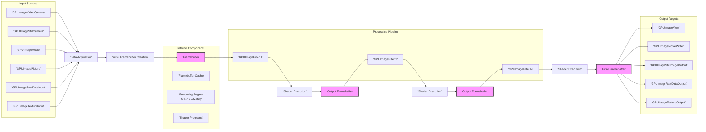

# Project Design Document: GPUImage

**Version:** 1.1
**Date:** October 26, 2023
**Author:** AI Software Architect

## 1. Introduction

This document provides an enhanced architectural design of the GPUImage project, an open-source iOS and macOS framework for GPU-based image and video processing. This revised document offers a more detailed perspective, specifically tailored to facilitate comprehensive threat modeling activities. It aims to provide a deeper understanding of the system's components, data flow, and potential attack surfaces.

## 2. Goals

*   Provide a refined and more detailed architectural description of the GPUImage framework.
*   Elaborate on the interactions between key components with greater specificity.
*   Offer a more granular depiction of the data flow within the framework, highlighting critical stages.
*   Identify potential areas of security concern with more concrete examples to better inform future threat modeling efforts.

## 3. Scope

This document covers the core architectural design of the GPUImage framework as represented in the provided GitHub repository. It focuses on the software components and their interactions within the application's runtime environment, including a more detailed look at internal processes. It does not delve into the specifics of individual filter implementations' internal algorithms but focuses on their interfaces and data handling. The underlying operating system details are considered only in terms of their direct interaction with GPUImage's interfaces and resource utilization.

## 4. Target Audience

This document is intended for:

*   Security engineers performing detailed threat modeling and security assessments.
*   Developers actively contributing to or maintaining the GPUImage project, requiring a deeper understanding of its architecture.
*   Software architects seeking a comprehensive understanding of the framework's design principles and internal workings.

## 5. Architectural Overview

GPUImage employs a modular, graph-based architecture for real-time image and video processing on iOS and macOS. The framework's strength lies in its ability to construct complex processing pipelines by connecting various processing units (filters) in a directed acyclic graph (DAG). The fundamental concepts are "sources" that provide image/video data and "targets" that consume and process this data. The framework heavily leverages the GPU's parallel processing capabilities for optimal performance.

## 6. Key Components

*   **Input Sources:** These components are responsible for providing the initial image or video data to the processing pipeline.
    *   `GPUImageVideoCamera`:  Manages the device's camera hardware, capturing live video frames. This involves interacting with the operating system's camera APIs.
    *   `GPUImageStillCamera`:  Specifically designed for capturing single still images from the device's camera.
    *   `GPUImageMovie`:  Handles the decoding of video frames from a movie file stored locally or remotely. This involves interaction with media decoding libraries.
    *   `GPUImagePicture`:  Loads still images from various sources, including local files, network URLs, or in-memory data.
    *   `GPUImageRawDataInput`:  Allows developers to feed raw pixel data (e.g., from custom image processing routines) directly into the GPUImage pipeline. Requires careful management of pixel formats and memory layout.
    *   `GPUImageTextureInput`:  Accepts existing OpenGL textures as input, enabling interoperability with other graphics rendering systems.

*   **Image Processing Filters:** These are the core processing units that apply various effects to the image or video data.
    *   Base Class (`GPUImageFilter`): Defines the interface and common functionality for all filters, including input/output handling and shader management.
    *   Concrete Filter Implementations: A diverse set of classes (e.g., `GPUImageGrayscaleFilter`, `GPUImageGaussianBlurFilter`, `GPUImageSobelEdgeDetectionFilter`) each implementing specific image processing algorithms using GPU shaders.
    *   Custom Filters: Developers can create custom filters by subclassing `GPUImageFilter` and providing their own vertex and fragment shaders.
    *   Filter Chains: Filters can be chained together, with the output of one filter serving as the input for the next, forming complex processing pipelines.

*   **Output Targets:** These components receive the processed image or video data from the pipeline and handle its output.
    *   `GPUImageView`:  Displays the processed image or video on the screen using `GLKit` or `UIKit` views. Manages the rendering loop and presentation of the final output.
    *   `GPUImageMovieWriter`:  Encodes the processed video frames into a movie file (e.g., MP4). This involves interaction with video encoding libraries and file system operations.
    *   `GPUImageStillImageOutput`:  Captures a processed still image at a specific point in the pipeline.
    *   `GPUImageRawDataOutput`:  Provides access to the processed pixel data in raw format (e.g., for further processing or analysis). Requires careful handling of pixel formats and memory access.
    *   `GPUImageTextureOutput`:  Makes the processed output available as an OpenGL texture, allowing it to be used as input for other OpenGL-based rendering operations.

*   **Framebuffer Management:** This crucial component handles the allocation, management, and recycling of OpenGL framebuffers.
    *   `GPUImageFramebufferCache`:  Implements a caching mechanism to efficiently reuse framebuffers, reducing the overhead of frequent allocation and deallocation, especially in real-time processing scenarios.
    *   Framebuffer Allocation and Deallocation:  Manages the creation and destruction of framebuffer objects in the OpenGL context.

*   **Rendering Engine:** This is the underlying mechanism that executes the shader programs on the GPU.
    *   OpenGL ES / Metal Context:  Provides the interface to the GPU's rendering capabilities.
    *   Command Queue Management:  Handles the submission of rendering commands to the GPU.
    *   Texture Management:  Manages the creation, updating, and binding of textures used in the processing pipeline.

*   **Shader Programs:** These define the actual image processing algorithms executed on the GPU.
    *   Vertex Shaders:  Handle the processing of vertex data, determining the geometry of the rendered output.
    *   Fragment Shaders:  Operate on individual pixels (fragments), applying the core image processing logic. Written in GLSL (OpenGL Shading Language) or Metal Shading Language.
    *   Shader Compilation and Linking:  The process of compiling the shader source code and linking it into executable programs on the GPU.

*   **Filter Chain Management & Data Routing:** This encompasses the logic for connecting sources, filters, and targets and managing the flow of data between them.
    *   Target-Source Relationships:  Objects register themselves as targets of sources or as sources for other targets.
    *   Data Transfer Mechanisms:  Efficiently transfers image data (represented as textures or framebuffers) between processing stages.

## 7. Data Flow

The data flow within GPUImage can be broken down into the following detailed steps:

1. **Input Acquisition:** An input source (e.g., `GPUImageVideoCamera`) captures or loads image/video data. This often involves interacting with system APIs for camera access or file reading.
2. **Initial Framebuffer Creation:** The input source or the first filter in the processing chain creates an OpenGL framebuffer object to hold the initial image or video frame data.
3. **Data Transfer to Framebuffer:** The acquired image or video data is uploaded to the newly created framebuffer, typically as a texture.
4. **Filter Input Processing:** The first filter in the chain receives the input framebuffer (or texture).
5. **Shader Execution Preparation:** The filter's associated vertex and fragment shader programs are prepared for execution on the GPU. This may involve setting uniforms (parameters) for the shaders.
6. **GPU Processing (Shader Execution):** The rendering engine executes the filter's shader program. The fragment shader operates on each pixel of the input framebuffer, performing the defined image processing operations.
7. **Output Framebuffer Rendering:** The output of the shader program is rendered to a new framebuffer. The `GPUImageFramebufferCache` is often used to retrieve or create this output framebuffer.
8. **Data Transfer to Next Stage:** The output framebuffer (containing the processed data) is then passed as input to the next filter in the chain, or to an output target.
9. **Iterative Filtering:** Steps 4-8 are repeated for each filter in the processing pipeline.
10. **Final Output Rendering:** The output of the last filter in the chain is rendered to the framebuffer associated with the output target.
11. **Output Handling:** The output target (e.g., `GPUImageView`, `GPUImageMovieWriter`) processes the final framebuffer. `GPUImageView` renders the framebuffer to the screen. `GPUImageMovieWriter` encodes the framebuffer content into a video file. `GPUImageRawDataOutput` retrieves the raw pixel data from the framebuffer.

## 8. Security Considerations (For Threat Modeling)

This section provides more specific examples of potential vulnerabilities for threat modeling:

*   **Input Validation Vulnerabilities:**
    *   **Malicious Media File Exploits:**  `GPUImageMovie` and `GPUImagePicture` could be vulnerable to buffer overflows, integer overflows, or arbitrary code execution if processing maliciously crafted media files with unexpected or malformed headers, metadata, or encoded data.
    *   **Camera Data Injection (Less Likely):** While less common at the framework level, vulnerabilities in the underlying camera APIs or device drivers could potentially allow for the injection of manipulated or malicious data streams.
    *   **Raw Data Input Exploits:** `GPUImageRawDataInput` is highly susceptible to buffer overflows or out-of-bounds memory access if the provided raw pixel data does not match the expected dimensions, format, or size. Lack of proper validation can lead to crashes or potentially arbitrary code execution.

*   **Filter Vulnerabilities:**
    *   **Shader Algorithm Flaws:**  Bugs in the GLSL or Metal shader code of specific filters could lead to incorrect processing, visual artifacts, or, in some cases, information leakage if sensitive data is inadvertently exposed.
    *   **Resource Exhaustion through Filter Combinations:**  Specific sequences of filters with certain parameter settings might consume excessive GPU memory or processing time, leading to denial-of-service conditions or application freezes.
    *   **Integer Overflows in Shader Calculations:**  Mathematical operations within shaders, if not carefully implemented, could lead to integer overflows, resulting in unexpected behavior or potential security issues.

*   **Shader Compilation and Execution Vulnerabilities:**
    *   **(Low Risk) Shader Injection:** While highly unlikely in the standard usage of GPUImage, if there were any unforeseen pathways allowing external, untrusted input to directly influence the shader compilation process, it could potentially lead to the execution of malicious code on the GPU.
    *   **Exploiting OpenGL/Metal Driver Bugs:**  Crafted shader code, even if not intentionally malicious, could trigger vulnerabilities in the underlying graphics drivers, potentially leading to crashes or system-level exploits.

*   **Output Handling Vulnerabilities:**
    *   **Sensitive Data Exposure:** If the processed image or video data contains sensitive information, vulnerabilities in output targets like `GPUImageMovieWriter` (e.g., insecure file permissions) or `GPUImageRawDataOutput` (e.g., improper handling of data buffers) could lead to data leaks.
    *   **Buffer Overflows in Output Buffers:**  Writing processed data to output buffers in components like `GPUImageRawDataOutput` without proper bounds checking could result in buffer overflows, potentially leading to crashes or memory corruption.

*   **Dependency Vulnerabilities:**
    *   Vulnerabilities in the underlying system frameworks (UIKit, GLKit, AVFoundation, CoreMedia) could be indirectly exploitable through GPUImage if the framework relies on the vulnerable functionality. Regular updates and awareness of dependency vulnerabilities are crucial.

*   **Memory Management Vulnerabilities:**
    *   **Framebuffer Management Issues:** Improper management of the `GPUImageFramebufferCache` or manual framebuffer allocation/deallocation could lead to memory leaks (gradual resource exhaustion) or use-after-free vulnerabilities (accessing memory that has already been freed), potentially causing crashes or exploitable conditions.

*   **Configuration and Control Vulnerabilities:**
    *   **Insecure Filter Parameter Handling:** If filter parameters or the processing pipeline can be controlled by external, untrusted input (e.g., through a network interface), insufficient sanitization or validation of these parameters could lead to unexpected behavior, crashes, or even the ability to trigger filter vulnerabilities.

## 9. Dependencies

*   **Foundation:** Provides fundamental utility classes and data types.
*   **UIKit (iOS) / AppKit (macOS):** Essential for user interface elements, event handling, and application lifecycle management.
*   **GLKit:** Offers helper classes for working with OpenGL ES rendering contexts and operations.
*   **AVFoundation:** Framework for working with audiovisual assets, including camera access and video encoding/decoding.
*   **CoreMedia:** Provides lower-level interfaces for managing media data and timing.
*   **QuartzCore:** For advanced graphics and animation capabilities.
*   **OpenGL ES (iOS) / OpenGL (macOS) / Metal:** The core graphics APIs used for GPU-accelerated rendering and computation.

## 10. Deployment

GPUImage is typically integrated into iOS and macOS applications as a static or dynamic framework. Developers include the framework in their Xcode projects and utilize its classes and methods to implement real-time image and video processing features within their applications.

## 11. Future Considerations

*   **Enhanced Metal API Utilization:** Increased adoption of the Metal API could bring performance benefits but also introduce new security considerations specific to Metal's features and potential vulnerabilities.
*   **Support for External Filter Plugins:** If the framework were to support loading external or dynamically generated filter plugins, this would significantly expand the attack surface and necessitate robust security measures for plugin verification and sandboxing.
*   **Cloud-Based Processing Extensions:**  If GPUImage were extended to process media from cloud storage or stream processed data to cloud services, new security challenges related to network communication security, authentication, authorization, and data protection in transit and at rest would need to be addressed.
*   **Machine Learning Integration:**  Incorporating machine learning models for image analysis or processing could introduce vulnerabilities related to model poisoning or adversarial attacks.
