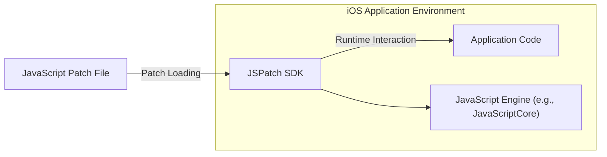
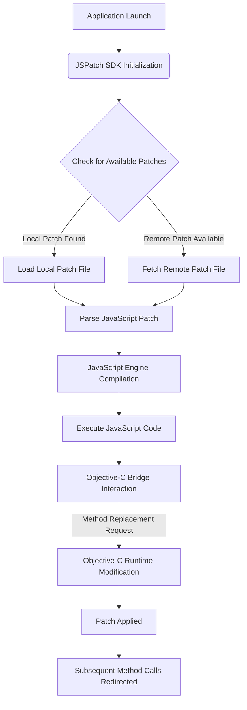

## Project Design Document: JSPatch (Improved)

**1. Introduction**

This document provides an enhanced architectural design of the JSPatch project, an open-source library enabling dynamic patching of running Objective-C applications on iOS using JavaScript. This improved version aims to offer a more detailed and nuanced understanding of the system's components, interactions, and data flow, serving as a robust foundation for subsequent threat modeling activities.

**2. Goals**

*   Clearly and comprehensively define the architecture and components of JSPatch.
*   Elaborate on the interactions and dependencies between different parts of the system.
*   Provide a more granular description of key data flows and processing steps.
*   Offer sufficient and specific detail for effective and targeted threat modeling.

**3. Scope**

This document focuses on the core mechanisms of JSPatch, specifically the loading, interpretation, and application of JavaScript patches to modify Objective-C code at runtime. It encompasses the following aspects in detail:

*   The integration of the JSPatch SDK within an iOS application and its lifecycle.
*   The role and operation of the embedded JavaScript engine.
*   The intricate mechanism facilitating communication and interaction between JavaScript and Objective-C (the bridge).
*   The precise process of applying patches to existing Objective-C classes and methods, including the underlying runtime manipulations.

This document explicitly excludes:

*   In-depth implementation specifics of the chosen JavaScript engine (though its capabilities are considered).
*   The workflow and tools involved in creating and managing JavaScript patch files.
*   The network protocols and infrastructure used for delivering patch files (although security implications related to this are addressed).
*   Specific application-level code or business logic where JSPatch might be employed.

**4. System Overview**

JSPatch functions by embedding a JavaScript engine directly within the iOS application's runtime environment. It establishes a bidirectional communication bridge that allows JavaScript code to interact with the underlying Objective-C runtime. Patches, authored in JavaScript, define modifications to existing Objective-C classes and methods. Upon loading and execution, JSPatch dynamically alters the application's behavior by applying these JavaScript-defined changes to the Objective-C runtime.

*   **iOS Application Environment:** The runtime environment of the iOS application where JSPatch is integrated and operates.
*   **Application Code:** The original Objective-C code of the iOS application.
*   **JSPatch SDK:** The integrated library responsible for the entire patching lifecycle: loading, parsing, executing, and applying JavaScript patches.
*   **JavaScript Engine (e.g., JavaScriptCore):** The component responsible for interpreting and executing the JavaScript code contained within the patch files. JavaScriptCore is the typical engine on iOS.
*   **JavaScript Patch File:** A file containing JavaScript code that specifies the modifications (patches) to be applied to the Objective-C codebase.

**5. Component Details**

*   **JSPatch SDK:**
    *   **Initialization and Configuration:** The SDK is initialized early in the application lifecycle, often during `application:didFinishLaunchingWithOptions:`. This involves setting up the JavaScript engine, initializing the bridge, and potentially configuring options for patch loading and error handling.
    *   **Patch Loading Mechanisms:** The SDK provides various methods for loading JavaScript patch files:
        *   Loading from local file system paths.
        *   Loading from resources bundled within the application.
        *   Fetching from remote URLs (HTTP/HTTPS).
        *   Loading from in-memory strings.
    *   **JavaScript Engine Management:** The SDK manages the lifecycle of the embedded JavaScript engine, including its initialization and any necessary cleanup.
    *   **Objective-C Bridge Implementation:** This is a core component, facilitating seamless interaction between JavaScript and Objective-C. It provides functionalities such as:
        *   **Object Proxying:**  Allows JavaScript to access and manipulate Objective-C objects as if they were native JavaScript objects.
        *   **Method Invocation:** Enables JavaScript to call methods on Objective-C objects, including class methods and instance methods.
        *   **Class and Method Definition (Limited):** Provides mechanisms for JavaScript to define new methods within existing Objective-C classes or even create new classes (with limitations on inheritance and complex features).
        *   **Method Replacement (Swizzling):** The primary mechanism for patching. The bridge allows JavaScript to replace the implementation (`IMP`) of existing Objective-C methods with JavaScript functions. This often involves runtime manipulation techniques like method swizzling.
        *   **Block Handling:** Enables the passing and execution of Objective-C blocks within JavaScript.
        *   **Exception Handling:** Provides mechanisms for catching and handling exceptions that occur in either the JavaScript or Objective-C runtime.
    *   **Patch Execution and Application:**  The SDK executes the JavaScript code within the loaded patch files. The bridge then translates these JavaScript instructions into modifications of the Objective-C runtime.
    *   **Error Reporting and Handling:** The SDK includes mechanisms for catching and reporting errors that occur during patch loading, JavaScript execution, or bridge interactions. This might involve logging errors, displaying alerts (in development builds), or triggering fallback mechanisms.
    *   **Security Features (Potentially):**  Depending on the specific implementation or extensions, the SDK might include features like:
        *   Checksum verification of patch files.
        *   Encryption of patch files.
        *   Mechanisms for authenticating the source of remote patches.

*   **JavaScript Engine (e.g., JavaScriptCore):**
    *   **JavaScript Parsing and Compilation:**  Parses the JavaScript code from the patch files and compiles it into bytecode for efficient execution.
    *   **Runtime Environment:** Provides the runtime environment for executing the JavaScript code, including memory management and garbage collection.
    *   **API for Embedding:** Offers APIs that the JSPatch SDK uses to interact with the engine, such as evaluating JavaScript code, creating JavaScript contexts, and managing JavaScript objects.

*   **JavaScript Patch File:**
    *   **Structure and Syntax:**  Written in standard JavaScript, leveraging the specific APIs exposed by the JSPatch bridge to interact with the Objective-C runtime.
    *   **Patch Definitions:** Contains JavaScript code that defines the modifications to be applied. This typically involves:
        *   Identifying the target Objective-C class and method to be patched.
        *   Providing a new JavaScript function that will replace the original Objective-C method's implementation.
        *   Using bridge APIs to access and manipulate Objective-C objects and call other Objective-C methods if needed.

**6. Data Flow (Detailed)**

The detailed data flow for applying a JSPatch involves several key steps and interactions:

1. **Application Launch:** The iOS application is launched by the user or the system.
2. **JSPatch SDK Initialization:** The JSPatch SDK is initialized, setting up the JavaScript engine and the communication bridge.
3. **Check for Available Patches:** The SDK checks for available patches based on its configuration. This might involve checking local storage, querying a remote server, or using other configured sources.
4. **Load Local Patch File:** If a patch is found locally, the SDK reads the patch file into memory.
5. **Fetch Remote Patch File:** If configured to fetch remote patches, the SDK initiates a network request to retrieve the patch file from the specified URL.
6. **Parse JavaScript Patch:** The loaded JavaScript patch file is parsed to understand its structure and the JavaScript code it contains.
7. **JavaScript Engine Compilation:** The parsed JavaScript code is passed to the JavaScript engine, which compiles it into an executable format.
8. **Execute JavaScript Code:** The compiled JavaScript code is executed by the JavaScript engine. This code contains instructions to interact with the Objective-C runtime via the bridge.
9. **Objective-C Bridge Interaction:** The JavaScript code uses the JSPatch bridge APIs to request modifications to the Objective-C runtime. This often involves specifying the target class and method to be patched and providing the new JavaScript implementation.
10. **Objective-C Runtime Modification:** The bridge translates the JavaScript requests into calls to the Objective-C runtime APIs. This is where the actual patching happens, typically by replacing the original method's `IMP` with a pointer to a function that executes the JavaScript implementation.
11. **Patch Applied:** The Objective-C runtime is successfully modified, and the patch is considered applied.
12. **Subsequent Method Calls Redirected:** When the patched Objective-C method is called subsequently, the execution is redirected to the JavaScript implementation provided in the patch.

**7. Security Considerations (Detailed)**

This section expands on the initial security considerations, providing more specific details and potential attack vectors.

*   **Malicious Patch Injection:**
    *   **Local Injection:** An attacker gaining access to the device's file system could replace legitimate patch files with malicious ones.
    *   **Remote Injection (Man-in-the-Middle):** If remote patch fetching uses insecure protocols (HTTP) or lacks proper certificate validation (certificate pinning), an attacker could intercept the communication and inject a malicious patch.
    *   **Compromised Server:** If the server hosting the patch files is compromised, attackers could replace legitimate patches with malicious ones, affecting all applications downloading from that server.
    *   **Consequences:**  Malicious patches can execute arbitrary code within the application's context, potentially leading to:
        *   Data exfiltration: Stealing sensitive user data or application data.
        *   Privilege escalation: Performing actions with elevated privileges.
        *   Remote control: Allowing the attacker to remotely control the application and potentially the device.
        *   Denial of service: Crashing the application or making it unusable.

*   **Code Injection via JavaScript Bridge Vulnerabilities:**
    *   **Bridge API Exploits:** Vulnerabilities in the JSPatch bridge implementation could allow attackers to craft specific JavaScript payloads that bypass security checks or directly manipulate the Objective-C runtime in unintended ways.
    *   **JavaScript Engine Vulnerabilities:** While less directly related to JSPatch's code, vulnerabilities in the underlying JavaScript engine could be exploited through carefully crafted patches.
    *   **Consequences:** Similar to malicious patch injection, this could lead to arbitrary code execution, data breaches, and other security compromises.

*   **Data Exposure through Patching:**
    *   **Modification of Data Handling Logic:** Malicious patches could alter how the application handles sensitive data, potentially logging it, sending it to unauthorized servers, or bypassing encryption mechanisms.
    *   **Bypassing Security Checks:** Patches could be used to disable or circumvent security checks and validations within the application.
    *   **Consequences:** Exposure of sensitive user data, financial information, or other confidential data.

*   **Authentication and Authorization Weaknesses:**
    *   **Lack of Patch Authentication:** If remote patch fetching doesn't properly authenticate the source of the patches, attackers could serve malicious patches.
    *   **Weak Authentication Mechanisms:**  Using weak or easily compromised authentication methods for patch servers.
    *   **Consequences:**  Application of unauthorized and potentially malicious patches.

*   **Patch Integrity Issues:**
    *   **Tampering with Patches:** Without mechanisms to verify the integrity of patch files (e.g., checksums, digital signatures), attackers could modify patches in transit or at rest.
    *   **Consequences:** Application of tampered patches with unpredictable or malicious behavior.

*   **Impact on Code Signing and Security Scans:**
    *   **Invalidating Code Signatures:** Dynamically patching code can potentially invalidate the application's code signature, which could be detected by the operating system or security scanning tools, raising red flags.
    *   **Bypassing Static Analysis:** Patches applied at runtime can bypass static analysis security tools that examine the application's code before execution.
    *   **Consequences:**  Reduced effectiveness of traditional security measures and potential warnings from the operating system.

**8. Deployment Considerations (Expanded)**

The method of deploying JSPatch and its associated patch files significantly impacts the security posture and update strategy of the application.

*   **Bundled Patches:**
    *   **Pros:** Simple to implement, no network dependency at runtime.
    *   **Cons:** Requires a new app store release to update patches, less dynamic, potential for including outdated or vulnerable patches in the initial release.
    *   **Security Implications:**  The security of these patches relies on the security of the development and build process.

*   **Remote Patch Delivery:**
    *   **Pros:** Allows for dynamic updates without app store releases, enables quick fixes for bugs or security vulnerabilities.
    *   **Cons:** Introduces network dependencies, potential for man-in-the-middle attacks if not secured properly.
    *   **Security Implications:** Requires robust security measures for the patch server and the communication channel (HTTPS with certificate pinning is crucial). Authentication and authorization of patch downloads are essential.

*   **Local Storage (Downloaded or Side-loaded):**
    *   **Pros:** Can be used for targeted updates or for development/testing purposes.
    *   **Cons:**  Increased risk of malicious patch injection if the device is compromised or if patches are downloaded from untrusted sources.
    *   **Security Implications:** Requires careful consideration of how patches are obtained and stored to prevent unauthorized modification.

**9. Future Considerations**

*   **Enhanced Security Measures:**
    *   Implementing robust patch signing and verification mechanisms using digital signatures.
    *   Exploring encryption of patch files to protect their content during transit and at rest.
    *   Developing more granular control over patch application, potentially allowing for selective patching or rollback capabilities.
    *   Integrating with mobile device management (MDM) solutions for secure patch distribution and management in enterprise environments.

*   **Improved Error Handling and Rollback:**
    *   Implementing more sophisticated error detection and reporting for patch application failures.
    *   Developing mechanisms to automatically rollback to previous versions of patches in case of errors.
    *   Providing developers with tools to test patches in a controlled environment before deploying them to production.

*   **Advanced Monitoring and Logging:**
    *   Adding comprehensive logging of patch loading, application, and any errors encountered.
    *   Implementing monitoring capabilities to detect suspicious patching activity or potential security breaches.
    *   Integrating with security information and event management (SIEM) systems for centralized security monitoring.

This improved design document provides a more detailed and comprehensive understanding of the JSPatch architecture, highlighting key components, data flows, and security considerations. This enhanced information will be invaluable for conducting a thorough and effective threat model to identify potential vulnerabilities and design appropriate security mitigations.
