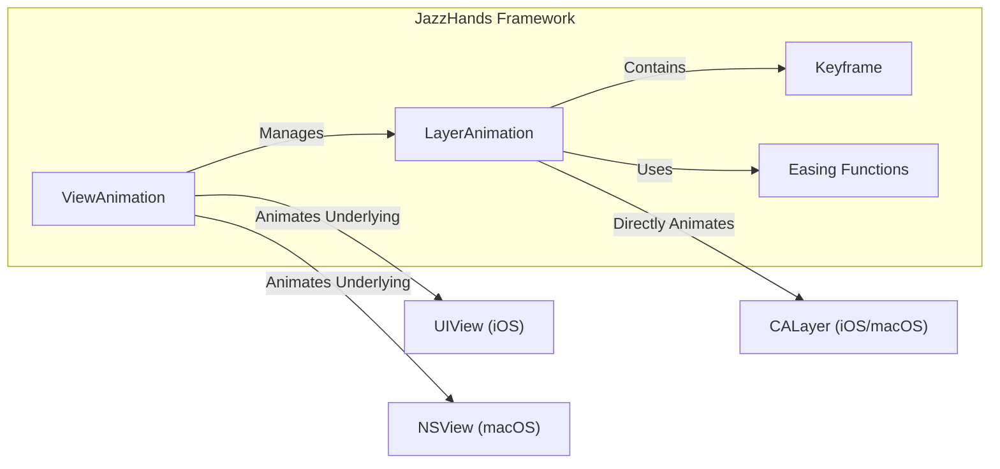
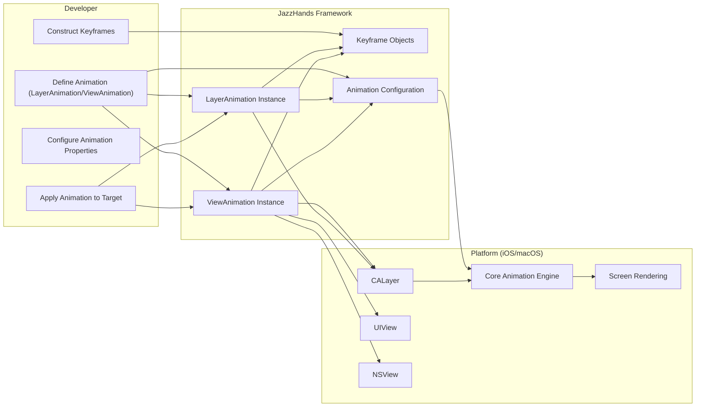

# Project Design Document: JazzHands - Keyframe-Based Animation Framework

**Version:** 1.1
**Date:** October 26, 2023
**Author:** AI Software Architect

## 1. Introduction

This document provides an enhanced and detailed design overview of the JazzHands project, a keyframe-based animation framework for iOS and macOS. This document serves as a robust foundation for understanding the system's architecture, components, and data flow, which is crucial for subsequent threat modeling activities. This revision aims to provide greater clarity and depth compared to the initial design.

## 2. Project Overview

JazzHands is an open-source library designed to simplify the creation and management of complex, keyframe-based animations within iOS and macOS applications. It offers a declarative approach to defining animations, promoting maintainability and readability compared to traditional imperative animation techniques. The library primarily focuses on animating properties of `CALayer` and `UIView`/`NSView` objects.

## 3. Goals

* Provide a highly declarative and intuitive syntax for defining keyframe animations.
* Significantly simplify the creation of intricate and precisely synchronized animations across multiple layers or views.
* Offer a flexible and extensible architecture that allows developers to introduce custom animation behaviors and property types.
* Integrate seamlessly and efficiently with the existing Apple ecosystem, specifically UIKit and AppKit frameworks.
* Minimize the performance overhead associated with complex animations.

## 4. Target Audience

This document is intended for a broad technical audience, including:

* Security engineers responsible for identifying and mitigating potential threats.
* Software developers who will be using or contributing to the JazzHands library.
* System architects needing a comprehensive understanding of the library's design and integration points within larger applications.
* Quality assurance engineers involved in testing the functionality and robustness of the library.

## 5. System Architecture

JazzHands employs a modular and object-oriented architecture, primarily built around the concepts of `LayerAnimation` and `ViewAnimation`. These objects serve as blueprints for animations, encapsulating the animation's definition and providing the necessary mechanisms to apply these animations to specific layers or views.

### 5.1. Core Components

* **`LayerAnimation`:**
    * The fundamental building block for animating `CALayer` properties.
    * Holds a structured collection of `Keyframe` objects that dictate the animation's progression over time.
    * Internally manages the precise timing and interpolation between defined keyframes.
    * Supports a wide range of animatable `CALayer` properties, including `position`, `transform`, `opacity`, `backgroundColor`, and more.
    * Provides mechanisms for setting animation attributes like duration, repeat count, and autoreverse behavior.
* **`ViewAnimation`:**
    * A higher-level abstraction built upon `LayerAnimation`, specifically designed for animating `UIView` (iOS) or `NSView` (macOS) properties.
    * Internally leverages `LayerAnimation` to manipulate the underlying `CALayer` associated with the view.
    * Offers convenience methods and properties tailored for animating view-specific attributes such as `frame`, `bounds`, `alpha`, and `center`.
    * Simplifies the process of animating views by handling the interaction with the underlying layer.
* **`Keyframe`:**
    * Represents a specific state of an animatable property at a designated point in time within the animation sequence.
    * Contains a `time` value (typically a fraction between 0 and 1) indicating when this state should be reached.
    * Stores the `value` of the animated property at that specific time. The data type of this value depends on the property being animated.
    * Can optionally include an `easing` function to control the interpolation behavior leading up to this keyframe.
* **Animation Player (Implicitly Core Animation):**
    * The underlying animation engine is the Core Animation framework provided by iOS and macOS.
    * JazzHands acts as a configuration layer, translating its declarative animation definitions into the imperative commands understood by Core Animation.
    * JazzHands configures and triggers Core Animation to perform the actual rendering of the animations.
* **Easing Functions (or Timing Functions):**
    * Define the rate of change of an animated property between keyframes, influencing the perceived smoothness and feel of the animation.
    * JazzHands likely provides a set of pre-defined easing functions (e.g., linear, ease-in, ease-out, ease-in-out).
    * May allow for the use of custom easing functions, potentially using cubic Bezier curves.

### 5.2. High-Level Diagram

### 5.3. Data Flow

The typical lifecycle of an animation using JazzHands involves these key stages:

1. **Animation Definition:** A developer instantiates `LayerAnimation` or `ViewAnimation` objects, specifying the target layer or view and the properties to be animated.
2. **Keyframe Construction:** For each animation, a series of `Keyframe` objects are created and added to the animation object. Each `Keyframe` defines a specific state of the animated property at a given time.
3. **Animation Configuration:**  Properties of the animation, such as duration, repeat count, and easing functions, are configured.
4. **Animation Application:** The `apply(to:)` method of the `LayerAnimation` or `ViewAnimation` is called, providing the target `CALayer`, `UIView`, or `NSView`.
5. **Core Animation Integration:** JazzHands translates the declarative animation definition into the necessary Core Animation objects (e.g., `CAKeyframeAnimation`).
6. **Animation Execution and Rendering:** Core Animation takes over, performing the actual animation rendering on the screen based on the provided configuration.

## 6. Detailed Design

### 6.1. `LayerAnimation` Details

* **Properties:**
    * `animationDuration`:  A `TimeInterval` representing the total duration of the animation.
    * `keyframes`: An ordered array of `Keyframe` objects defining the animation sequence.
    * `timingFunction`: An optional `CAMediaTimingFunction` (or a custom equivalent) to control the pacing of the entire animation.
    * `autoreverses`: A `Bool` indicating whether the animation should play in reverse upon completion.
    * `repeatCount`: An integer specifying the number of times the animation should repeat. A value of 0 indicates infinite repetition.
    * `fillMode`: A `CAMediaTimingFillMode` value determining how the animation affects the property before it begins and after it finishes (e.g., `forwards`, `backwards`).
    * `animatedKeyPath`: A `String` representing the specific `CALayer` property to be animated (e.g., `"position"`, `"transform.scale.x"`).
* **Methods:**
    * `apply(to layer: CALayer)`: Configures and adds the corresponding Core Animation object to the specified `CALayer`.
    * `caAnimation() -> CAAnimation`: Returns the underlying `CAAnimation` object that can be directly manipulated or added to a layer.

### 6.2. `ViewAnimation` Details

* **Properties:**
    * Inherits core animation properties from `LayerAnimation` (e.g., `animationDuration`, `repeatCount`).
    * May provide convenience properties specific to `UIView`/`NSView` animation (e.g., `frame`, `alpha`, `center`). These often map to underlying `CALayer` properties.
* **Methods:**
    * `apply(to view: UIView)` (iOS) / `apply(to view: NSView)` (macOS):  Applies the animation to the target view by manipulating its underlying layer.
    * Internally creates and manages a `LayerAnimation` instance associated with the view's layer.

### 6.3. `Keyframe` Details

* **Properties:**
    * `time`: A `CGFloat` value between 0.0 and 1.0, representing the normalized time at which this keyframe's value should be reached.
    * `value`: An `Any` type representing the target value of the animated property at this keyframe. The actual type must match the animated property's expected type.
    * `timingFunction`: An optional `CAMediaTimingFunction` (or custom equivalent) to define the easing for the interval *leading up to* this keyframe. This allows for fine-grained control over animation pacing.

### 6.4. Easing Functions

* Likely implemented as concrete instances or factory methods that return `CAMediaTimingFunction` objects.
* May include standard easing functions like:
    * `linear`
    * `easeIn`
    * `easeOut`
    * `easeInOut`
* Could also support custom easing using control points for cubic Bezier curves.

## 7. Security Considerations (Detailed)

This section expands on the initial security considerations, providing a more in-depth analysis of potential threats.

* **Malicious Animation Data from Untrusted Sources:**
    * **Resource Exhaustion (DoS):**  Crafted animation data with an extremely large number of keyframes, excessively long durations, or very high repeat counts could consume significant CPU and GPU resources, leading to UI unresponsiveness, application freezes, or even crashes.
    * **Unexpected UI Manipulation:** Maliciously designed animations could manipulate UI elements in deceptive or harmful ways, potentially misleading users or obscuring critical information. This could be used for phishing attacks or to create confusion.
    * **Memory Pressure:**  Animations with very large data sets (e.g., complex path animations with many points) could lead to excessive memory allocation, potentially causing memory warnings or crashes, especially on resource-constrained devices.
* **Vulnerabilities in Dependency Frameworks (Core Animation, UIKit/AppKit):**
    * Security flaws within Core Animation or the UI frameworks could be indirectly exploitable through JazzHands if it relies on vulnerable APIs or behaviors. Keeping dependencies updated is crucial.
* **Data Integrity (If Animation Data is Persisted):**
    * If applications using JazzHands store animation definitions (e.g., in user settings or downloaded content), the storage mechanism must be secure to prevent tampering. Malicious modification of animation data could lead to unexpected or harmful behavior. Consider using secure storage mechanisms and data integrity checks.
* **Code Injection (Low Likelihood but Possible):**
    * While less likely given the declarative nature of the library, vulnerabilities in how JazzHands processes or interprets animation data could theoretically be exploited for code injection if it involves dynamic code execution or unsafe string parsing. Thorough input validation and sanitization are important.
* **Integer Overflow/Underflow:**  Careless handling of animation parameters like duration or repeat counts could potentially lead to integer overflow or underflow issues, resulting in unexpected behavior or even crashes.
* **Timing Attacks (Less Relevant for UI):** While generally less of a concern for UI animations, if animation timing is tied to sensitive operations, there's a theoretical possibility of timing attacks to infer information. This is highly unlikely in the context of typical UI animations.

## 8. Assumptions and Constraints

* **Secure Development Practices:** It is assumed that the development of JazzHands adheres to secure coding principles, including input validation, proper error handling, and avoidance of known vulnerabilities.
* **Reliance on Platform Security:** JazzHands relies on the security mechanisms provided by the underlying iOS and macOS platforms.
* **Client-Side Focus:** The primary focus of JazzHands is on client-side animation. Security considerations are primarily related to the application using the library.
* **No Inherent Network Communication:**  JazzHands itself is assumed not to have any built-in network communication capabilities. However, applications using it might fetch animation data from remote sources, which introduces separate security considerations for those applications.
* **Well-Defined Animation Properties:** It's assumed that the properties being animated have well-defined types and ranges, reducing the risk of unexpected behavior due to invalid data types.

## 9. Future Considerations

* **Advanced Animation Capabilities:** Explore adding support for more complex animation types, such as spring animations, physics-based animations, and animation composition.
* **Performance Optimization and Profiling Tools:** Develop tools and techniques for analyzing and optimizing the performance of JazzHands animations, especially for complex scenarios.
* **Enhanced Testing and Validation:** Implement comprehensive unit, integration, and performance tests to ensure the library's reliability and security. Consider fuzzing techniques to identify potential vulnerabilities in animation data processing.
* **Sandboxing Considerations:** If JazzHands is used in sandboxed environments (e.g., within web views), ensure it adheres to the sandbox restrictions and doesn't introduce any security vulnerabilities.

This improved design document provides a more detailed and nuanced understanding of the JazzHands project, particularly regarding its architecture and potential security considerations. This enhanced information will be invaluable for conducting thorough threat modeling and ensuring the security of applications utilizing this powerful animation framework.