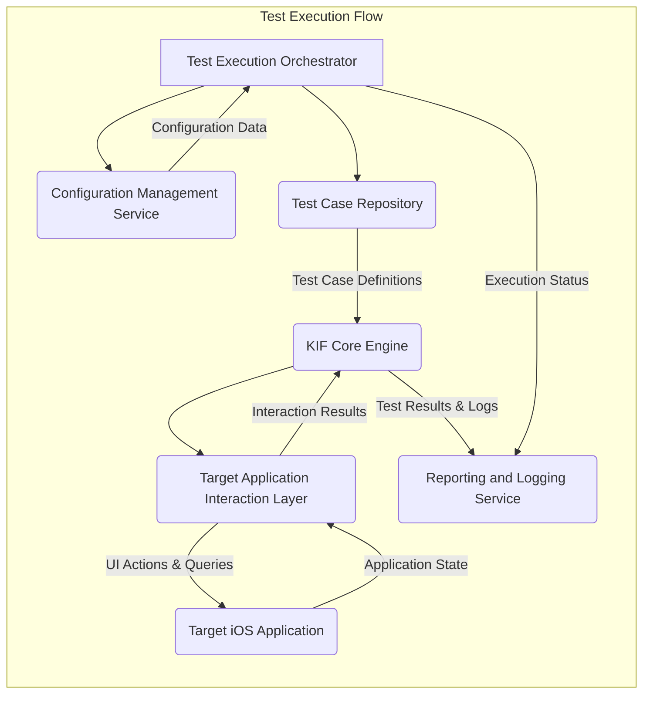

# Project Design Document: KIF Framework

**Version:** 1.1
**Date:** October 26, 2023
**Author:** AI Software Architect

## 1. Introduction

This document provides an enhanced architectural design of the KIF (Keep It Functional) framework, based on the information available at [https://github.com/kif-framework/KIF](https://github.com/kif-framework/KIF). This design is intended to serve as a robust foundation for subsequent threat modeling activities. It elaborates on the key components, their interactions, and the overall data flow within the framework, providing more granular detail.

## 2. Goals

The primary goals of this enhanced design document are to:

*   Provide a more detailed definition of the major components of the KIF framework.
*   Offer a clearer illustration of the interactions and data flow between these components, including specific data types.
*   Identify key technologies, dependencies, and potential integration points.
*   Strengthen the basis for understanding the system's architecture for comprehensive security analysis.

## 3. Architectural Overview

KIF is a functional testing framework primarily targeting iOS applications, enabling the creation and execution of automated UI tests. The architecture is structured around the following core components, with a clearer delineation of their responsibilities:

*   **Test Case Repository:**  The storage mechanism for test scenarios, potentially including metadata and versioning.
*   **KIF Core Engine:** The central component responsible for test interpretation, execution orchestration, and interaction management.
*   **Target Application Interaction Layer:**  A dedicated layer for communication and interaction with the iOS application under test, abstracting the underlying UI testing frameworks.
*   **Test Execution Orchestrator:**  Manages the lifecycle of test executions, including setup, execution, and teardown.
*   **Reporting and Logging Service:**  A service dedicated to collecting, processing, and presenting test results and execution logs.
*   **Configuration Management Service:**  A service responsible for managing the framework's configuration parameters and settings.

## 4. Component Details

### 4.1. Test Case Repository

*   **Description:**  The persistent storage for test case definitions and related assets.
*   **Functionality:**
    *   Stores test scenarios, potentially in a structured format (e.g., files, database).
    *   May include metadata about test cases (e.g., author, creation date, tags).
    *   Potentially supports version control for test cases.
*   **Data Stored:** Test case definitions (likely in a KIF-specific format), metadata (author, tags, etc.), potentially associated media (screenshots).
*   **Potential Technologies:** File system (e.g., `.kif` files, YAML, JSON), potentially a lightweight database.

### 4.2. KIF Core Engine

*   **Description:** The central processing unit that drives the test execution.
*   **Functionality:**
    *   Parses and interprets test case definitions from the Test Case Repository.
    *   Translates abstract test steps into concrete actions for the Target Application Interaction Layer.
    *   Manages the execution flow and state of individual tests.
    *   Handles assertions and verification of expected outcomes.
    *   Communicates with the Reporting and Logging Service.
*   **Data Processed:** Test case definitions, application state information, assertion results.
*   **Potential Technologies:**  Likely implemented in Objective-C or Swift, leveraging core iOS frameworks.

### 4.3. Target Application Interaction Layer

*   **Description:**  An abstraction layer facilitating interaction with the target iOS application.
*   **Functionality:**
    *   Provides a consistent interface for the KIF Core Engine to interact with the application.
    *   Utilizes Apple's UI testing APIs (`XCTest`, `UI Testing`) to perform actions.
    *   Handles the translation of KIF commands into platform-specific UI interactions.
    *   Abstracts away the complexities of the underlying UI testing framework.
*   **Data Exchanged:**  Commands to perform UI actions (e.g., tap, enter text), queries for UI element properties, application state information.
*   **Potential Technologies:**  Wrappers around Apple's UI Testing framework, potentially using design patterns like Adapter or Facade.

### 4.4. Test Execution Orchestrator

*   **Description:**  Manages the overall lifecycle of test executions.
*   **Functionality:**
    *   Initiates test runs based on user requests or scheduled triggers.
    *   Loads test cases from the Test Case Repository.
    *   Invokes the KIF Core Engine to execute individual tests.
    *   Manages the test execution environment (e.g., simulator selection, device connection).
    *   Collects and aggregates test results from the KIF Core Engine.
    *   Triggers reporting through the Reporting and Logging Service.
*   **Data Managed:** Test execution configurations, test suite definitions, execution status.
*   **Potential Technologies:**  Command-line interface (CLI), potentially integrated with CI/CD pipelines, task scheduling mechanisms.

### 4.5. Reporting and Logging Service

*   **Description:**  Provides comprehensive feedback on test execution.
*   **Functionality:**
    *   Receives test results and logs from the KIF Core Engine.
    *   Formats and stores test results (pass/fail status, execution time, error messages).
    *   Generates reports in various formats (e.g., console output, HTML, JUnit XML).
    *   Captures detailed logs of test execution steps and system events.
    *   May include the ability to capture screenshots or videos.
*   **Data Processed:** Test results, log messages, screenshots, videos.
*   **Potential Technologies:**  Standard logging libraries (e.g., `os_log`), custom reporting modules, integration with reporting platforms.

### 4.6. Configuration Management Service

*   **Description:**  Manages the configuration settings for the KIF framework.
*   **Functionality:**
    *   Provides a mechanism to configure framework parameters (e.g., target application bundle ID, simulator settings, reporting options).
    *   May support different configuration sources (e.g., configuration files, environment variables, command-line arguments).
    *   Provides access to configuration settings for other components.
*   **Data Managed:** Framework configuration parameters, environment settings, reporting configurations.
*   **Potential Technologies:**  Property list files (`.plist`), JSON files, YAML files, environment variable access, command-line argument parsing libraries.

## 5. Data Flow

The following diagram illustrates the detailed data flow during a test execution:

**Explanation of the Data Flow:**

1. The **Test Execution Orchestrator** initiates the test execution, potentially retrieving configuration settings from the **Configuration Management Service**.
2. The **Test Execution Orchestrator** retrieves **Test Case Definitions** from the **Test Case Repository**.
3. The **KIF Core Engine** receives the **Test Case Definitions** and begins interpreting the test steps.
4. For each test step, the **KIF Core Engine** sends **UI Actions & Queries** to the **Target Application Interaction Layer**.
5. The **Target Application Interaction Layer** translates these into platform-specific actions on the **Target iOS Application**.
6. The **Target iOS Application** responds, and the **Target Application Interaction Layer** captures the **Application State**.
7. The **Target Application Interaction Layer** sends **Interaction Results** back to the **KIF Core Engine**.
8. The **KIF Core Engine** evaluates the results and sends **Test Results & Logs** to the **Reporting and Logging Service**.
9. The **Test Execution Orchestrator** also sends overall **Execution Status** to the **Reporting and Logging Service**.

## 6. Key Technologies and Dependencies

This section provides a more comprehensive list of likely technologies and dependencies:

*   **Programming Languages:** Objective-C, Swift (for KIF Core, Interaction Layer, and potentially parts of the Orchestrator and Reporting).
*   **UI Testing Framework:** Apple's `XCTest` and UI Testing framework (within the Interaction Layer).
*   **Build Tools:** Xcode build system, potentially Fastlane for automation.
*   **Operating System:** macOS (for development and execution).
*   **Execution Environment:** iOS Simulators or physical iOS devices.
*   **Logging Libraries:** `os_log`, potentially third-party logging frameworks.
*   **Reporting Libraries/Formats:**  Potentially libraries for generating HTML or JUnit reports.
*   **Configuration Management Libraries:** Libraries for parsing property lists, JSON, or YAML.
*   **CI/CD Integration:**  Potential integration with CI/CD platforms like Jenkins, GitHub Actions, or GitLab CI.
*   **Dependency Management:** CocoaPods or Swift Package Manager for managing external dependencies.

## 7. Security Considerations (Pre-Threat Modeling)

This section expands on the initial security considerations, providing more specific examples:

*   **Test Case Security:**
    *   **Integrity:** Protecting test case definitions from unauthorized modification. Use version control and access controls.
    *   **Confidentiality:**  Securing sensitive data within test cases (e.g., API keys, credentials). Avoid storing sensitive data directly; use secure vaults or placeholders.
    *   **Malicious Code Injection:** Preventing the introduction of malicious code within test case definitions that could be executed by the KIF Core Engine. Implement input validation and sanitization.
*   **Access Control:**
    *   **Test Case Repository Access:**  Controlling who can read, write, and modify test cases. Implement role-based access control.
    *   **Test Execution Access:**  Restricting who can trigger test executions.
    *   **Report Access:**  Securing access to test reports, especially if they contain sensitive information.
*   **Data Security:**
    *   **Sensitive Data Handling:**  Properly handling and protecting sensitive data used during testing (e.g., user credentials, personal information). Use encryption at rest and in transit where necessary.
    *   **Log Data Security:**  Ensuring that logs do not inadvertently expose sensitive information. Implement log scrubbing or masking.
*   **Dependency Management:**
    *   **Vulnerability Scanning:** Regularly scanning dependencies for known vulnerabilities.
    *   **Supply Chain Security:**  Ensuring the integrity and trustworthiness of third-party libraries.
*   **Reporting Security:**
    *   **Unauthorized Access:**  Protecting test reports from unauthorized viewing or modification. Implement authentication and authorization.
    *   **Data Leakage:**  Preventing sensitive information from being inadvertently included in reports.
*   **Communication Security:**
    *   **Secure Communication Channels:** If KIF interacts with external services (e.g., for reporting or data retrieval), ensure secure communication using HTTPS or other appropriate protocols.
*   **Environment Security:**
    *   **Secure Test Environments:**  Ensuring that test execution environments (simulators, devices) are secure and isolated.
    *   **Configuration Security:**  Protecting configuration files and settings from unauthorized access or modification.

## 8. Assumptions and Constraints

The following assumptions and constraints remain relevant, with added detail:

*   **Target Platform:** The primary target platform is iOS, implying reliance on Apple's ecosystem and tools.
*   **UI Testing Focus:** KIF is primarily focused on UI-based functional testing, although it might have capabilities for other types of testing.
*   **Open Source Nature:** The project's open-source nature allows for community contributions and scrutiny but also requires careful attention to security.
*   **GitHub Repository:** The GitHub repository serves as the primary source of information and code.
*   **Development Language:**  The core of KIF is likely developed using Objective-C and/or Swift.

## 9. Future Considerations

*   Detailed interface specifications for communication between components.
*   Consideration of extensibility and plugin architecture.
*   Strategies for handling asynchronous operations and complex UI interactions.
*   Mechanisms for integrating with different types of test data sources.

This enhanced design document provides a more detailed and comprehensive understanding of the KIF framework's architecture. It offers a stronger foundation for the subsequent threat modeling process, enabling a more thorough and effective identification and analysis of potential security vulnerabilities.