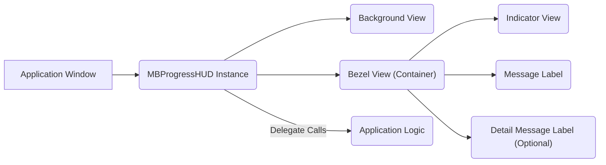
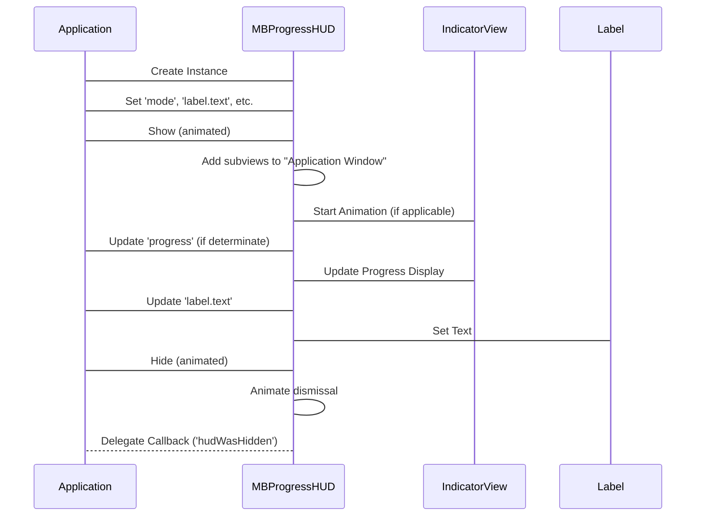

# Project Design Document: MBProgressHUD

**Version:** 1.1
**Date:** October 26, 2023
**Author:** AI Software Architect

## 1. Introduction

This document details the design of the MBProgressHUD library, a widely used open-source component for displaying activity indicators in iOS and macOS applications. It provides visual feedback to users during ongoing processes. This document focuses on the library's architecture and data flow to facilitate effective threat modeling.

MBProgressHUD overlays the application's UI with a modal view containing an activity indicator (spinner, progress bar, etc.) and an optional message. This prevents user interaction with the underlying UI until the indicator is dismissed.

This document covers:

*   Goals and Non-Goals
*   Architectural Overview
*   Component Breakdown
*   Data Flow Analysis
*   Deployment Context

## 2. Goals and Non-Goals

### 2.1. Goals

*   Clearly describe the MBProgressHUD library's internal structure.
*   Identify the key components and their interactions within the library.
*   Illustrate the flow of data and control within MBProgressHUD.
*   Provide a solid foundation for identifying potential security vulnerabilities during threat modeling exercises.
*   Document the intended integration and usage patterns of the library.

### 2.2. Non-Goals

*   Provide a line-by-line code explanation.
*   Offer performance tuning recommendations.
*   List every configurable option or API method.
*   Analyze the security of applications that *integrate* MBProgressHUD; the focus is solely on the library itself.

## 3. Architectural Overview

MBProgressHUD operates as a visual overlay within the application's window. Its primary function is to manage the presentation and animation of progress indicators and associated messages.

The following diagram illustrates the high-level architecture:

Key architectural elements:

*   **MBProgressHUD Instance:** The central object responsible for the HUD's lifecycle, appearance, and behavior. It manages the subviews and their interactions.
*   **Application Window:** The top-level window of the iOS or macOS application where the HUD is presented.
*   **Background View:** An optional semi-transparent or blurred view covering the underlying application content, potentially blocking user interaction.
*   **Bezel View (Container):** A styled container view that holds the indicator and labels, typically centered on the screen.
*   **Indicator View:** Displays the visual progress indicator. This can be a standard `UIActivityIndicatorView`, a `UIProgressView`, or a custom view.
*   **Message Label:** Displays the primary message text.
*   **Detail Message Label (Optional):** Displays an optional secondary message.
*   **Delegate Calls:** A mechanism for MBProgressHUD to notify the application about events like the HUD being hidden.

## 4. Component Breakdown

This section details the responsibilities and key characteristics of each major component within MBProgressHUD.

### 4.1. MBProgressHUD Class

*   **Responsibilities:**
    *   Manages the creation and lifecycle of the HUD's view hierarchy.
    *   Handles presentation and dismissal animations.
    *   Updates the displayed message, detail message, and progress value.
    *   Controls the animation of the indicator view.
    *   Manages user interaction blocking (or allowing passthrough).
    *   Implements the delegate pattern for communication.
    *   Performs UI updates on the main thread.
*   **Key Attributes:**
    *   `mode`:  Determines the type of indicator (e.g., `MBProgressHUDModeIndeterminate`, `MBProgressHUDModeDeterminate`).
    *   `label.text`: The main message string.
    *   `detailsLabel.text`: The optional detail message string.
    *   `progress`: The current progress value (0.0 to 1.0).
    *   `delegate`: An object conforming to the `MBProgressHUDDelegate` protocol.
    *   `bezelView`:  Provides styling for the container (background color, corner radius, etc.).
    *   `backgroundView`: Provides styling for the background overlay.
    *   `removeFromSuperViewOnHide`: A boolean indicating whether the HUD should be removed from its superview when hidden.
*   **Security Considerations:**
    *   Improper handling of the `delegate` can lead to unexpected behavior if the delegate is deallocated prematurely.
    *   The `label.text` and `detailsLabel.text` properties should be sanitized if they display user-provided content to prevent potential injection vulnerabilities (though MBProgressHUD itself doesn't directly handle user input).

### 4.2. Background View

*   **Responsibilities:**
    *   Provides a visual backdrop for the HUD, often dimming or blurring the underlying content.
    *   Optionally intercepts touch events to prevent interaction with the application behind the HUD.
*   **Implementation:** Typically a `UIView` with a background color and alpha, or a `UIVisualEffectView` for blur effects.
*   **Security Considerations:**
    *   The transparency or blur level could potentially reveal sensitive information from the underlying UI if not configured carefully.

### 4.3. Bezel View (Container)

*   **Responsibilities:**
    *   Acts as a container for the indicator and label views.
    *   Provides a visually distinct area for the HUD's content.
    *   Applies styling such as background color, corner radius, and shadow.
*   **Implementation:** A `UIView` subclass with custom drawing or styling properties.
*   **Security Considerations:**
    *   Styling properties, if dynamically controlled by external input (unlikely in typical usage), could potentially be manipulated for malicious purposes (e.g., obscuring other UI elements).

### 4.4. Indicator View

*   **Responsibilities:**
    *   Visually represents the ongoing operation.
    *   Animates to indicate activity.
    *   Displays progress for determinate modes.
*   **Implementation:** Can be a `UIActivityIndicatorView` for indeterminate progress, a `UIProgressView` for determinate progress, or a custom `UIView` subclass.
*   **Security Considerations:**
    *   The visual representation itself doesn't typically pose a direct security risk.

### 4.5. Message Label and Detail Message Label

*   **Responsibilities:**
    *   Display textual information to the user.
    *   Format the text according to the HUD's style.
*   **Implementation:** `UILabel` instances.
*   **Security Considerations:**
    *   As mentioned before, if these labels display user-provided content, proper sanitization is crucial in the application code *using* MBProgressHUD. MBProgressHUD itself doesn't perform sanitization.

### 4.6. Delegate (Conforming to `MBProgressHUDDelegate`)

*   **Responsibilities:**
    *   Receives notifications about the HUD's lifecycle events (e.g., when it will show, did show, will hide, did hide).
    *   Allows the application to perform actions in response to these events.
*   **Implementation:** An object, usually a view controller or other application component, that implements the methods defined in the `MBProgressHUDDelegate` protocol.
*   **Security Considerations:**
    *   Weak references or improper management of the delegate can lead to crashes or unexpected behavior if the delegate is deallocated prematurely.

## 5. Data Flow Analysis

The primary data flow within MBProgressHUD involves updating the visual elements based on application state and user interaction (indirectly, through dismissal). All UI updates occur on the main thread.

Key data flow paths:

1. **Showing the HUD:**
    *   Application code instantiates `MBProgressHUD`.
    *   Application sets properties like `mode`, `label.text`, `detailsLabel.text`, and `progress`.
    *   Application calls a show method (e.g., `show(animated:)`).
    *   `MBProgressHUD` adds its view hierarchy to the application's window.
    *   The `Indicator View` starts animating (if applicable).

2. **Updating Progress (Determinate Mode):**
    *   Application code updates the `progress` property of the `MBProgressHUD` instance.
    *   `MBProgressHUD` updates the `Indicator View` to reflect the new progress value.

3. **Updating Messages:**
    *   Application code updates the `label.text` or `detailsLabel.text` properties.
    *   `MBProgressHUD` updates the corresponding `UILabel` instances.

4. **Hiding the HUD:**
    *   Application code calls a hide method (e.g., `hide(animated:)` or `hide(animated:afterDelay:)`).
    *   `MBProgressHUD` initiates the dismissal animation.
    *   Optionally, the delegate's `hudWasHidden(_:)` method is called, passing the `MBProgressHUD` instance.
    *   If `removeFromSuperViewOnHide` is true, the HUD is removed from its superview.

## 6. Deployment Context

MBProgressHUD is typically integrated into iOS and macOS projects using dependency management tools or by directly including the source files.

*   **Integration Methods:**
    *   **Manual Integration:** Copying the `MBProgressHUD.h` and `MBProgressHUD.m` (or Swift equivalent) files into the project.
    *   **CocoaPods:** Adding `pod 'MBProgressHUD'` to the `Podfile` and running `pod install`.
    *   **Swift Package Manager:** Adding the repository URL as a package dependency in Xcode.

*   **Runtime Environment:** The library executes within the application's process. UI updates are performed on the main thread.

*   **Dependencies:** MBProgressHUD has minimal external dependencies, primarily relying on standard UIKit/AppKit frameworks.

This design document provides a detailed overview of the MBProgressHUD library's architecture and data flow, serving as a valuable resource for subsequent threat modeling activities. Understanding the components and their interactions is crucial for identifying potential security vulnerabilities.