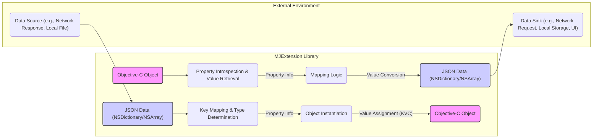

# Project Design Document: MJExtension Library

**Version:** 1.1
**Date:** October 26, 2023
**Author:** AI Software Architect

## 1. Introduction

This document details the design of the MJExtension library, an Objective-C framework facilitating the conversion between Objective-C objects and JSON data. It aims to provide a clear understanding of the library's architecture, functionalities, and data flow to serve as a basis for threat modeling.

## 2. Goals

*   Clearly articulate the architecture and functionality of the MJExtension library.
*   Identify and describe the key components and their interactions within the library.
*   Visually represent the data flow during serialization and deserialization processes.
*   Establish a foundation for identifying potential security vulnerabilities through subsequent threat modeling exercises.

## 3. Overview

MJExtension is an Objective-C library designed to streamline the serialization of Objective-C objects into JSON format and the deserialization of JSON data back into Objective-C objects. It leverages Objective-C's runtime introspection capabilities to automatically map JSON keys to corresponding object properties, reducing boilerplate code. The library supports a wide range of data types and offers customization options for handling specific scenarios, such as ignoring properties or defining custom key mappings. Its primary use case is in iOS and macOS development where data exchange with web services or local storage often involves JSON.

## 4. Functional Description

MJExtension's core functionality is centered around two primary operations, both heavily reliant on Objective-C's runtime features:

*   **Object to JSON Conversion (Serialization):** This process transforms an Objective-C object into its JSON representation (typically an `NSDictionary` or `NSArray`).
    *   The library utilizes Objective-C runtime methods (like `class_copyPropertyList`) to inspect the properties of the input object.
    *   For each eligible property, the library retrieves its value using Key-Value Coding (KVC).
    *   The retrieved Objective-C values are then converted into their corresponding JSON types (e.g., `NSString` to JSON string, `NSNumber` to JSON number, nested objects are recursively processed).
    *   The resulting JSON structure is built based on the object's property names (or custom mappings) and their converted values.
    *   Configuration options, such as specifying ignored properties or providing custom property-to-key mappings, are applied during this stage.

*   **JSON to Object Conversion (Deserialization):** This process takes JSON data (typically an `NSDictionary` or `NSArray`) and instantiates an Objective-C object, populating its properties with values from the JSON.
    *   The library identifies the target Objective-C class for deserialization.
    *   It iterates through the keys present in the input JSON data.
    *   For each key, the library attempts to find a matching property in the target Objective-C class (using property names or custom key mappings).
    *   The JSON value associated with the key is converted to the appropriate Objective-C type for the corresponding property. This might involve creating new instances of other objects for nested structures.
    *   Key-Value Coding (KVC) is used to set the values of the object's properties.
    *   Customization options, such as handling specific data types or providing custom key-to-property mappings, are applied during this process.

## 5. Data Flow Diagram

**Data Flow Description:**

*   **Serialization (Object to JSON):**
    *   An "Objective-C Object" is the starting point.
    *   "Property Introspection & Value Retrieval" uses Objective-C runtime features to get information about the object's properties and their values.
    *   "Mapping Logic" determines how properties map to JSON keys based on naming conventions or custom configurations.
    *   "Value Conversion" transforms Objective-C values into their JSON equivalents.
    *   "JSON Data (NSDictionary/NSArray)" is the resulting JSON representation.
    *   The JSON data is then sent to a "Data Sink (e.g., Network Request, Local Storage, UI)".

*   **Deserialization (JSON to Object):**
    *   "JSON Data (NSDictionary/NSArray)" is received from a "Data Source (e.g., Network Response, Local File)".
    *   "Key Mapping & Type Determination" identifies the target Objective-C properties based on the JSON keys and determines the expected data types.
    *   "Object Instantiation" creates an instance of the target Objective-C class.
    *   "Value Assignment (KVC)" uses Key-Value Coding to set the properties of the newly created object with the values from the JSON data.
    *   The resulting "Objective-C Object" is populated with data from the JSON.

## 6. Key Components

*   **Property Introspection Module:** This component utilizes the Objective-C runtime to inspect the properties of objects, including their names, types, and attributes.
*   **Key Mapping Engine:** This component handles the mapping between Objective-C property names and JSON keys. It supports default mapping (e.g., using the property name directly) and allows for custom mappings defined by the developer.
*   **Type Conversion Handlers:** This set of components is responsible for converting values between Objective-C types and their corresponding JSON representations (and vice-versa). It includes handlers for standard data types (strings, numbers, booleans, arrays, dictionaries) and provides mechanisms for handling custom type conversions.
*   **Object Instantiation Logic:** During deserialization, this component creates instances of the target Objective-C classes. It handles the creation of nested objects as needed based on the structure of the JSON data.
*   **Value Assignment Mechanism (KVC):** MJExtension heavily relies on Key-Value Coding (KVC) to get and set the values of object properties during both serialization and deserialization.
*   **Configuration Options:** This encompasses the various settings and customizations developers can apply, such as ignoring specific properties, providing custom key mappings, or defining custom type conversion logic.

## 7. Security Considerations (For Threat Modeling)

This section outlines potential security considerations relevant for threat modeling the MJExtension library.

*   **Deserialization of Untrusted Data:**
    *   **Type Confusion:** Maliciously crafted JSON could attempt to assign values of incorrect types to object properties, potentially leading to unexpected behavior, crashes, or vulnerabilities if the application doesn't handle type mismatches gracefully. For example, a string could be provided where an integer is expected.
    *   **Denial of Service (DoS) via Resource Exhaustion:**  Extremely large or deeply nested JSON structures could consume excessive memory or processing time during deserialization, potentially leading to a denial of service.
    *   **Unintended Object Instantiation:** If the application relies on MJExtension to deserialize data into specific object types, a malicious actor could potentially manipulate the JSON to force the instantiation of unexpected or harmful object types, especially if custom class mapping is involved.
    *   **Property Injection/Manipulation:** While KVC provides access control, vulnerabilities could arise if the application logic incorrectly assumes the integrity of deserialized data. Malicious JSON could attempt to set properties to unexpected values, potentially bypassing security checks or altering application state.
*   **Information Disclosure during Serialization:**
    *   **Accidental Inclusion of Sensitive Data:** If objects being serialized contain sensitive information that is not intended to be exposed (e.g., passwords, API keys), and proper filtering or exclusion mechanisms are not in place, this data could be included in the JSON output.
*   **Integer Overflow/Underflow:** When deserializing JSON numbers into Objective-C integer types, if the JSON values exceed the maximum or minimum values for the target integer type, it could lead to integer overflow or underflow, potentially causing unexpected behavior or security vulnerabilities in subsequent calculations.
*   **Vulnerabilities in Custom Transformation Blocks:** If developers implement custom transformation blocks for serialization or deserialization, vulnerabilities in these custom blocks could be introduced, such as insecure data handling or potential code injection if the input data is not properly sanitized within the block.

## 8. Assumptions and Constraints

*   The library operates within the context of an Objective-C runtime environment.
*   Input JSON data is assumed to adhere to standard JSON syntax.
*   Developers are expected to define their Objective-C classes appropriately for mapping with JSON data.
*   Custom transformation blocks, if used, are assumed to be implemented securely by the developers.
*   The security of the application using MJExtension also depends on how the deserialized data is subsequently used and validated.

## 9. Future Considerations

*   **Enhanced Input Validation:**  Potentially adding more robust input validation mechanisms during deserialization to mitigate risks associated with malicious JSON.
*   **Security Audits and Best Practices:**  Regular security audits and documentation of best practices for using MJExtension securely.
*   **Consideration of Secure Coding Practices:**  Ensuring the library itself adheres to secure coding practices to prevent vulnerabilities within its core logic.
*   **Support for More Granular Control over Serialization/Deserialization:** Providing developers with more fine-grained control over which properties are serialized/deserialized and how.

This improved design document provides a more detailed and refined understanding of the MJExtension library, specifically focusing on aspects relevant to threat modeling. The enhanced descriptions of functionality, data flow, and key components, along with the more specific security considerations, will be valuable for identifying and mitigating potential security risks.
