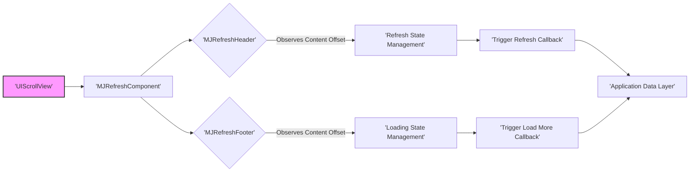
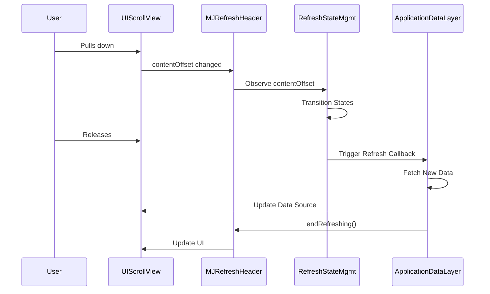
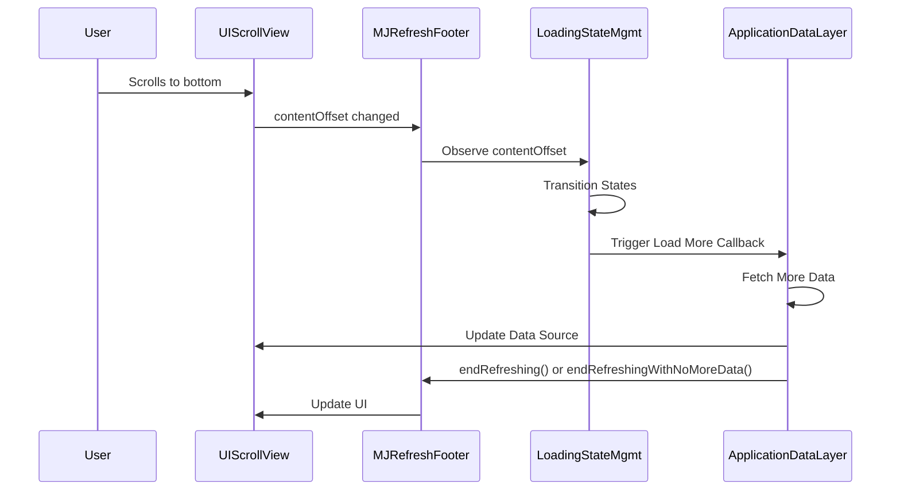

# Project Design Document: MJRefresh

**Version:** 1.1
**Date:** October 26, 2023
**Author:** AI Software Architect

## 1. Introduction

This document provides an enhanced design overview of the MJRefresh library, an open-source component available on GitHub at [https://github.com/CoderMJLee/MJRefresh](https://github.com/CoderMJLee/MJRefresh). This revised document aims to provide a more detailed description of the library's architecture, key components, and data flow to facilitate more in-depth threat modeling activities. MJRefresh is a widely adopted iOS library that simplifies the implementation of pull-to-refresh and infinite scrolling functionalities within `UITableView` and `UICollectionView` in iOS applications.

## 2. Goals and Objectives

The core goals of MJRefresh are to:

* Offer a straightforward and developer-friendly API for integrating pull-to-refresh and infinite scrolling.
* Enable customization of the user experience through diverse refresh and loading indicator styles.
* Maintain a lightweight and performant design to minimize impact on UI responsiveness.
* Support various refresh and loading behaviors, catering to different application needs.
* Ensure seamless integration into existing and new iOS projects.

## 3. Architectural Overview

MJRefresh functions as a collection of UIKit extensions and specialized views that augment the capabilities of `UIScrollView` and its subclasses, notably `UITableView` and `UICollectionView`. It achieves its functionality by observing changes in the scroll view's `contentOffset` and dynamically managing the addition and lifecycle of refresh header and footer views.

Here's a more detailed architectural diagram:

**Key Components (Detailed):**

* **`UIScrollView` Extension:** MJRefresh extends the `UIScrollView` class, adding properties and methods essential for managing refresh headers and footers. This extension serves as the primary interface for developers to incorporate MJRefresh into their applications. It introduces methods like `mj_header` and `mj_footer` to associate the refresh components.
* **`MJRefreshComponent`:** This is an abstract base class that provides the foundational logic and properties shared by both refresh headers and footers. It handles common tasks like observing the scroll view, managing state, and providing callback mechanisms.
* **`MJRefreshHeader`:** An abstract base class for all pull-to-refresh header views, inheriting from `MJRefreshComponent`. It encapsulates the core logic for handling pull-down gestures and managing the refresh lifecycle.
    * **Concrete Header Implementations:**
        * **`MJRefreshNormalHeader`:** A standard text-based refresh header with an activity indicator.
        * **`MJRefreshGifHeader`:** Allows for animated GIF images to be used as the refresh indicator, offering greater visual customization.
        * **Custom Headers:** Developers can create their own custom header implementations by subclassing `MJRefreshHeader`.
* **`MJRefreshFooter`:** An abstract base class for all load-more footer views, also inheriting from `MJRefreshComponent`. It manages the logic for detecting when the user has scrolled to the bottom and triggering the load-more action.
    * **Concrete Footer Implementations:**
        * **`MJRefreshAutoNormalFooter`:** Automatically triggers loading when the user scrolls to the bottom.
        * **`MJRefreshBackNormalFooter`:** Requires the user to pull up slightly to trigger loading.
        * **`MJRefreshBackGifFooter`:** Similar to `MJRefreshGifHeader`, allowing GIF animations for the load-more indicator.
        * **Custom Footers:** Developers can create custom footer implementations by subclassing `MJRefreshFooter`.
* **Refresh State Management:** This component within `MJRefreshHeader` manages the various states of the refresh process, including:
    * **Idle:** The default state.
    * **Pulling:** When the user is pulling down but hasn't reached the threshold.
    * **WillRefresh:** When the user has pulled down enough and releases, preparing to refresh.
    * **Refreshing:** When the refresh action is being performed.
    * **NoMoreData:** (Potentially managed here or in the footer, depending on implementation).
* **Loading State Management:** This component within `MJRefreshFooter` manages the states of the load-more process:
    * **Idle:** The default state.
    * **Pulling:** (For back-pulling footers).
    * **WillRefresh:** (For back-pulling footers).
    * **Loading:** When the load-more action is being performed.
    * **NoMoreData:** Indicates that there is no more data to load.
    * **Hidden:** The footer can be hidden when there's no need to load more.
* **Trigger Refresh Callback:** A closure or target-action mechanism defined by the developer that is executed when the refresh header is triggered. This callback is where the application initiates the fetching of new data.
* **Trigger Load More Callback:** A closure or target-action mechanism provided by the developer that is executed when the load-more footer is triggered. This callback initiates the fetching of additional data.
* **Application Data Layer:** This represents the application's code responsible for data fetching, processing, and management. MJRefresh acts as a UI trigger for this layer, without directly interacting with the data itself.

## 4. Data Flow (Enhanced)

The data flow within MJRefresh involves the interaction between user gestures, the library's components, and the application's data handling logic.

**4.1 Pull-to-Refresh Flow (Detailed):**

1. **User Initiates Refresh:** The user performs a pull-down gesture on the `UIScrollView`.
2. **Content Offset Change Notification:** The `UIScrollView`'s `contentOffset` property changes, and this change is observed by the associated `MJRefreshHeader`.
3. **State Transition Logic:** The `MJRefreshHeader`'s `Refresh State Management` logic evaluates the change in `contentOffset` and the user's interaction. Based on predefined thresholds and states, it transitions through states like `Pulling` and `WillRefresh`.
4. **Triggering Refresh:** Upon release after sufficient pull-down, the `Refresh State Management` transitions to the `Refreshing` state and executes the "Trigger Refresh Callback" defined by the application developer. This callback typically involves a method call to the `Application Data Layer`.
5. **Data Fetching:** The `Application Data Layer` receives the trigger and initiates the process of fetching new data from a local or remote source.
6. **Data Update and UI Refresh:** Once the new data is retrieved, the application updates the data source of the `UITableView` or `UICollectionView`. This update triggers a UI refresh, displaying the new data.
7. **Ending Refresh:** The application, upon successful data retrieval (or failure), calls the `endRefreshing()` method on the `MJRefreshHeader`.
8. **State Reset and UI Update:** The `MJRefreshHeader` transitions back to the `Idle` state, and its UI is updated to reflect the completion of the refresh operation (e.g., the loading indicator is hidden).

**4.2 Infinite Scrolling Flow (Detailed):**

1. **User Scrolls to Bottom:** The user scrolls towards the bottom of the `UIScrollView`.
2. **Content Offset Monitoring:** The `MJRefreshFooter` monitors the `contentOffset` to detect when the user is approaching or has reached the bottom of the scrollable content.
3. **State Transition based on Scroll Position:** The `Loading State Management` within `MJRefreshFooter` transitions states based on the `contentOffset`. For auto-triggering footers, reaching the bottom initiates the loading process. For back-pulling footers, a slight pull-up might be required.
4. **Triggering Load More:** When the conditions for loading more data are met, the `Loading State Management` executes the "Trigger Load More Callback" provided by the application.
5. **Data Fetching:** The `Application Data Layer` receives the callback and initiates the process of fetching additional data, typically appending it to the existing dataset.
6. **Data Update and UI Refresh:** The application updates the data source of the `UITableView` or `UICollectionView` with the newly fetched data, triggering a UI update.
7. **Ending Load More:** The application calls a method on the `MJRefreshFooter` to signal the completion of the load-more operation:
    * `endRefreshing()`: Indicates successful loading and resets the footer state.
    * `endRefreshingWithNoMoreData()`: Indicates that all available data has been loaded.
8. **State Reset and UI Update:** The `MJRefreshFooter` updates its state and UI accordingly (e.g., hides the loading indicator, displays "No More Data" if applicable).

## 5. Security Considerations (More Specific)

While MJRefresh primarily focuses on UI enhancements, its interaction with the application's data flow introduces potential security considerations:

* **Data Integrity Vulnerabilities (Indirect):** MJRefresh relies on the application's data layer to fetch and provide data. If the application's data fetching logic is compromised (e.g., vulnerable API endpoints, lack of input validation), MJRefresh could inadvertently display or trigger actions based on malicious data.
* **Resource Exhaustion Attacks (Amplified):** If the application's data fetching logic is inefficient or vulnerable to abuse, a malicious user could repeatedly trigger refresh or load-more actions, potentially leading to excessive resource consumption on the backend servers or the client device (battery drain, network congestion).
* **UI Redressing/Spoofing (Potential):** While less likely with standard implementations, vulnerabilities in custom header or footer views could potentially be exploited to overlay misleading UI elements, leading to phishing or other forms of UI redressing attacks.
* **Denial of Service (Indirect via Application Logic):** If the application's refresh or load-more callbacks perform expensive operations without proper safeguards, a malicious user could trigger these actions repeatedly, causing the application to become unresponsive.
* **Information Disclosure (Through Timing or Error Handling):** If the application's data fetching logic or the handling of refresh/load-more completion states leaks sensitive information through timing differences or error messages, an attacker might be able to exploit this.
* **Insecure Customizations:** Developers implementing custom header or footer views need to be mindful of security best practices. Vulnerabilities in custom drawing code or event handling could introduce security risks.

**Note:** A dedicated threat modeling exercise, utilizing frameworks like STRIDE or PASTA, will provide a more granular analysis of potential threats and inform specific mitigation strategies.

## 6. Deployment

MJRefresh is commonly integrated into iOS application projects as a dependency using various dependency management tools:

* **CocoaPods:** Developers add `pod 'MJRefresh'` to their `Podfile` and run `pod install`. This is a widely used method for Objective-C and Swift projects.
* **Carthage:** By adding `github "CoderMJLee/MJRefresh"` to their `Cartfile` and running `carthage update`. Carthage builds dynamic frameworks.
* **Swift Package Manager (SPM):** By adding the repository URL (`https://github.com/CoderMJLee/MJRefresh`) as a package dependency in Xcode. This is the native dependency manager for Swift projects.
* **Manual Integration:** Developers can also manually download the source code and add the necessary files to their Xcode project. This method is less common due to the benefits of dependency management tools.

The choice of deployment method often depends on the project's existing setup and the developer's preferences.

## 7. Assumptions and Constraints

* **Primary Target Platform:** iOS. While potentially adaptable, its core design is centered around UIKit.
* **Core Language:** Primarily Objective-C, although it can be used in Swift projects.
* **UIKit Framework Dependency:** MJRefresh is tightly integrated with Apple's UIKit framework and its components (`UIScrollView`, `UITableView`, `UICollectionView`).
* **Data Handling Responsibility:** MJRefresh does not handle the actual fetching, caching, or persistence of data. This is the responsibility of the integrating application.
* **Customization Limits:** While offering customization, the fundamental logic and behavior are defined by the library. Extensive deviations might require forking or creating custom components.

## 8. Future Considerations

* **Full Swift Migration:** A complete migration to Swift could offer improved performance, safety, and maintainability, aligning with the modern iOS development landscape.
* **Enhanced Accessibility Support:** Further improvements to ensure the refresh and loading indicators are fully accessible to users with disabilities, adhering to accessibility guidelines.
* **More Granular Customization Options:** Providing developers with even finer-grained control over the appearance, animation, and behavior of refresh and footer views.
* **Asynchronous Image Handling:** For GIF-based indicators, more robust asynchronous image loading and caching mechanisms could be implemented.
* **Combine/SwiftUI Integration:** Exploring potential integrations or adaptations for use with Apple's Combine framework and SwiftUI.

This improved document provides a more detailed and nuanced understanding of the MJRefresh library's design, offering a stronger foundation for comprehensive threat modeling activities. The added details about component responsibilities, data flow specifics, and more concrete security considerations should be valuable for identifying potential vulnerabilities and developing appropriate mitigation strategies.
