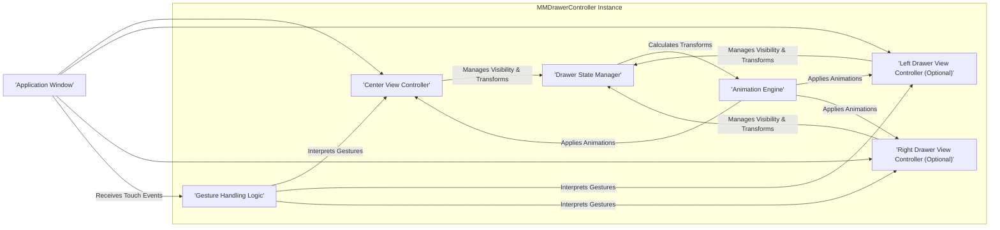

# Project Design Document: MMDrawerController

**Version:** 1.1
**Date:** October 26, 2023
**Author:** AI Software Architect

## 1. Introduction

This document provides an enhanced design overview of the `MMDrawerController` iOS library. This library facilitates the implementation of drawer-based navigation interfaces, a common UI pattern in mobile applications. This document aims to clearly articulate the architecture, components, and data flow within the library, with a specific focus on providing the necessary information for effective threat modeling. This version expands on the initial design to provide greater detail and clarity for security analysis.

## 2. Goals and Objectives

The primary goal of `MMDrawerController` is to provide a flexible and customizable solution for implementing drawer navigation in iOS applications. Key objectives include:

*   Providing a robust container view controller (`MMDrawerController`) that manages the presentation and lifecycle of a central content view controller and optional left and/or right drawer view controllers.
*   Enabling performant and visually appealing transitions between the center view and the drawer views, offering various animation styles.
*   Offering extensive configuration options to customize the appearance and behavior of the drawer, including drawer widths, animation durations, gesture sensitivity, and shadow effects.
*   Providing a well-defined and easy-to-use API for developers to seamlessly integrate drawer navigation into their iOS applications.
*   Maintaining a clear separation of concerns between the drawer management logic and the content displayed within the center and drawer view controllers.

## 3. Architecture Overview

The `MMDrawerController` library employs a container view controller pattern, with the `MMDrawerController` acting as the central orchestrator. It manages the view hierarchy and coordinates the interactions between the center and drawer view controllers.

**Key Components:**

*   **`MMDrawerController`:** The core container view controller. It holds references to the center and drawer view controllers, manages their lifecycles, and orchestrates the drawer transitions.
*   **Center View Controller:** The primary content view controller displayed when the drawers are closed. This is the main interface the user interacts with.
*   **Left Drawer View Controller (Optional):** The view controller displayed when the left drawer is opened. Typically used for primary navigation or application settings.
*   **Right Drawer View Controller (Optional):** The view controller displayed when the right drawer is opened. Often used for secondary actions, contextual information, or user profiles.
*   **Drawer State Manager:** Internal logic within `MMDrawerController` responsible for maintaining the current state of the drawers (open, closed, opening, closing, enabled, disabled) and managing transitions between these states.
*   **Gesture Handling Logic:**  The part of `MMDrawerController` that manages and interprets user touch events and gestures (e.g., pan, tap) to initiate or control drawer opening and closing.
*   **Animation Engine:**  The component responsible for applying visual transformations (translation, scaling, opacity changes) to the center and drawer views to create the animated drawer opening and closing effects.

## 4. Component Details

This section provides a more granular description of the key components, focusing on their responsibilities, interactions, and potential security implications.

*   **`MMDrawerController`:**
    *   **Responsibilities:**
        *   Acts as the root view controller for the drawer-based interface, managing the view hierarchy.
        *   Stores references to the center, left, and right view controllers.
        *   Manages the overall state of the drawers, including whether they are open, closed, or in transition.
        *   Provides methods for programmatically opening and closing drawers.
        *   Handles user interactions through gesture recognizers to control drawer visibility.
        *   Offers extensive configuration options for customizing drawer behavior (e.g., drawer width, animation type, opening/closing velocity).
        *   Manages the enabling and disabling of user interaction for the center view controller when drawers are open.
        *   Coordinates with the Drawer State Manager and Animation Engine to execute drawer transitions.
        *   May implement delegate methods to notify other parts of the application about drawer state changes.
    *   **Key Interactions:**
        *   Receives user input events from the application's window.
        *   Delegates gesture recognition to its internal Gesture Handling Logic.
        *   Instructs the Drawer State Manager to update the drawer's state.
        *   Triggers the Animation Engine to apply visual transformations.
        *   Notifies its child view controllers about relevant state changes (e.g., `viewWillAppear:`, `viewDidAppear:`).
        *   May interact with application-level state management or navigation components.

*   **Center View Controller:**
    *   **Responsibilities:**
        *   Displays the primary content and functionality of the application.
        *   Handles user interactions within its own view hierarchy.
        *   May interact with the `MMDrawerController` to programmatically control drawer visibility.
        *   Manages its own internal data and state.
    *   **Key Interactions:**
        *   Displayed and managed by the `MMDrawerController`.
        *   May receive notifications or delegate calls from the `MMDrawerController` regarding drawer state.
        *   May trigger actions that cause the `MMDrawerController` to open or close drawers.

*   **Left/Right Drawer View Controllers:**
    *   **Responsibilities:**
        *   Display secondary content, such as navigation menus, settings, or contextual information.
        *   Handle user interactions within the drawer.
        *   May communicate with the center view controller or other parts of the application based on user actions within the drawer.
    *   **Key Interactions:**
        *   Displayed and managed by the `MMDrawerController`.
        *   May send notifications or use delegation to communicate with the center view controller or other components.
        *   Their visibility is controlled by the `MMDrawerController`.

*   **Drawer State Manager (Internal):**
    *   **Responsibilities:**
        *   Maintains the current state of the drawers (e.g., `MMDrawerOpenSide`, `MMDrawerAnimationState`).
        *   Manages the transitions between different drawer states.
        *   Determines the appropriate visual transformations based on the current state and animation settings.
        *   May enforce constraints on drawer behavior (e.g., preventing simultaneous opening of both drawers).
    *   **Key Interactions:**
        *   Receives instructions from the `MMDrawerController` to update the drawer state.
        *   Provides information about the current drawer state to other components, particularly the Animation Engine.

*   **Gesture Handling Logic (Internal):**
    *   **Responsibilities:**
        *   Attaches gesture recognizers (e.g., `UIPanGestureRecognizer`, `UITapGestureRecognizer`) to the relevant views.
        *   Interprets touch events and determines if they correspond to drawer opening or closing gestures.
        *   Calculates the progress of the drawer opening/closing based on the gesture.
        *   Communicates the detected gestures and their parameters to the `MMDrawerController`.
    *   **Key Interactions:**
        *   Receives raw touch events from the application's window.
        *   Sends interpreted gesture information to the `MMDrawerController`.

*   **Animation Engine (Internal):**
    *   **Responsibilities:**
        *   Applies visual transformations (translation, scaling, alpha changes) to the center and drawer views.
        *   Manages the timing and easing of the animations.
        *   Uses Core Animation or other animation techniques to create smooth transitions.
    *   **Key Interactions:**
        *   Receives transformation parameters from the Drawer State Manager.
        *   Directly manipulates the `transform` and `alpha` properties of the relevant `UIView` objects.

## 5. Data Flow

The data flow within `MMDrawerController` is primarily driven by user interactions and the management of the drawer's visual state.

1. **User Interaction:** A user initiates an action to open or close a drawer (e.g., by swiping from the edge of the screen or tapping a button).
2. **Event Handling:** The application's window receives the touch event.
3. **Gesture Recognition:** The Gesture Handling Logic within `MMDrawerController`'s view hierarchy detects and interprets the user's gesture.
4. **Gesture Information:** The Gesture Handling Logic sends information about the detected gesture (e.g., pan velocity, direction) to the `MMDrawerController`.
5. **State Update Request:** The `MMDrawerController`, based on the gesture information, requests the Drawer State Manager to update the drawer's state.
6. **State Update:** The Drawer State Manager updates the internal state of the drawers.
7. **Transformation Calculation:** The Drawer State Manager calculates the necessary visual transformations (translation, scale, opacity) for the center and drawer views based on the new state and animation parameters.
8. **Animation Application:** The Animation Engine receives the transformation parameters and applies them to the views, animating the drawer's movement.
9. **View Rendering:** The updated view hierarchy is rendered on the screen, reflecting the drawer's new position and appearance.
10. **Notification (Optional):** The `MMDrawerController` may notify the center and drawer view controllers (via delegate methods or notifications) about the state change, allowing them to perform any necessary updates to their content or behavior.

**Key Data Passed Between Components:**

*   **Touch Events:** Raw touch data passed from the application's window to the Gesture Handling Logic.
*   **Gesture Parameters:** Information about recognized gestures (e.g., translation, velocity) passed from the Gesture Handling Logic to the `MMDrawerController`.
*   **Drawer State Information:** Data representing the current state of the drawers (open/closed, side, animation state) managed by the Drawer State Manager and accessed by other components.
*   **Transformation Values:** Calculated transformation values (translation, scale, alpha) passed from the Drawer State Manager to the Animation Engine.
*   **Configuration Settings:**  Parameters like drawer width, animation duration, and gesture sensitivity configured by the developer and used by various components within `MMDrawerController`.

## 6. Security Considerations

This section outlines potential security considerations relevant to the design and functionality of `MMDrawerController`.

*   **Data Exposure in Drawer Views:**  Sensitive information displayed in the left or right drawer views could be exposed if the device is left unattended or if an attacker gains physical access. Developers must implement appropriate authorization checks and data masking for sensitive content within drawers.
*   **UI Redress/Clickjacking Potential:** While less likely within the library itself, improper implementation by developers could lead to UI redress vulnerabilities. For example, if the drawer animation or interaction obscures critical UI elements in the center view, users might be tricked into performing unintended actions.
*   **State Management Vulnerabilities:**  Although internal, vulnerabilities in the Drawer State Manager could potentially lead to unexpected UI behavior or denial-of-service if an attacker could somehow manipulate the drawer state externally (e.g., through memory corruption, though highly improbable in a sandboxed iOS environment).
*   **Information Disclosure through Animations:**  While a low-severity risk, overly revealing animations during drawer transitions could potentially leak information about the content within the drawers to onlookers.
*   **Gesture Recognition Manipulation:**  While difficult, vulnerabilities in the Gesture Handling Logic could theoretically be exploited to trigger unintended drawer actions or bypass security measures if an attacker could inject or manipulate touch events.
*   **Insecure Configuration:**  Developers might misconfigure `MMDrawerController`, for example, by allowing drawers to be opened from anywhere on the screen, potentially interfering with other UI elements or creating unexpected interactions.
*   **Dependency Vulnerabilities:**  If `MMDrawerController` relies on other libraries, vulnerabilities in those dependencies could indirectly affect the security of applications using `MMDrawerController`.
*   **Lack of Input Sanitization:** While primarily a UI component, if `MMDrawerController` were to handle any user-provided input (which is unlikely in its core functionality), a lack of input sanitization could lead to vulnerabilities.
*   **Side Channel Attacks (Timing Attacks):**  Subtle differences in the timing of drawer animations or state transitions could potentially leak information, although this is a highly theoretical and difficult-to-exploit risk in this context.

## 7. Assumptions and Constraints

*   It is assumed that developers integrating `MMDrawerController` will adhere to secure coding practices and implement appropriate security measures within their center and drawer view controllers, especially when handling sensitive data.
*   The library relies on the security mechanisms provided by the underlying iOS platform, including sandboxing and code signing.
*   The scope of this design document is limited to the `MMDrawerController` library itself and does not encompass the security of the applications that integrate it or the data they handle.
*   `MMDrawerController` is primarily a UI presentation library and does not handle authentication, authorization, data encryption, or network communication directly. These aspects are the responsibility of the integrating application.
*   The library assumes a standard iOS environment and may not function correctly or securely in jailbroken or compromised environments.

This improved design document provides a more detailed and nuanced understanding of the `MMDrawerController` library's architecture and functionality, making it a more effective resource for identifying and analyzing potential security threats. The expanded component details, refined data flow, and more comprehensive security considerations offer a solid foundation for subsequent threat modeling activities.
