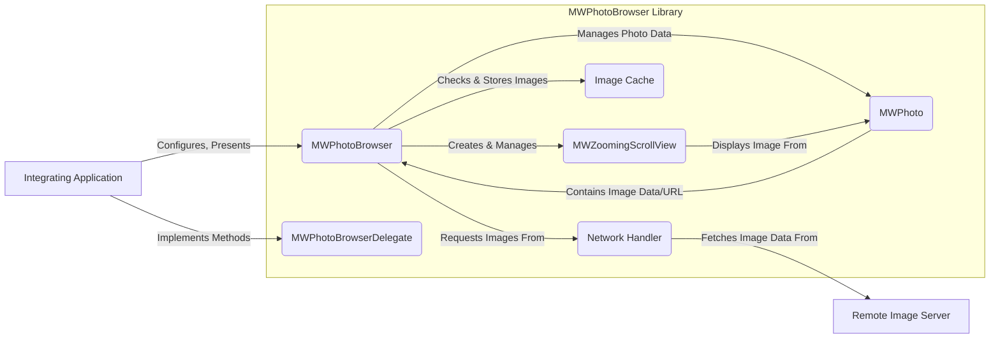

# Project Design Document: MWPhotoBrowser

**Version:** 1.1
**Date:** October 26, 2023
**Author:** AI Software Architect

## 1. Introduction

This document provides an enhanced design overview of the MWPhotoBrowser iOS library, an open-source project available on GitHub at [https://github.com/mwaterfall/MWPhotoBrowser](https://github.com/mwaterfall/MWPhotoBrowser). This revised document aims to provide a clearer and more detailed articulation of the library's architecture, components, and data flow, specifically tailored for subsequent threat modeling activities. The information presented is based on the publicly available source code and documentation of the project.

## 2. Goals

The primary goals of this design document are to:

*   Provide a comprehensive and unambiguous understanding of the MWPhotoBrowser library's internal structure and functionality.
*   Clearly identify key components, their specific responsibilities, and their interactions.
*   Precisely describe the flow of data within the library, with a focus on image loading, caching, and display processes.
*   Sharpen the focus on potential areas of interest for security analysis, vulnerability identification, and threat modeling.

## 3. Overview

MWPhotoBrowser is an iOS library designed to present a user-friendly interface for browsing collections of images. It supports displaying both locally stored images and images fetched from remote URLs. Key features include zoom and pan functionality, optional captions for images, and customizable action buttons. The library is intended for seamless integration into existing iOS applications, offering a reusable component for displaying image galleries.

**Target Audience:**

*   iOS developers integrating MWPhotoBrowser into their mobile applications.
*   Security engineers, architects, and threat modelers assessing the security posture of applications utilizing MWPhotoBrowser.

## 4. Architectural Design

MWPhotoBrowser employs a design pattern that leans towards Model-View-ViewModel (MVVM), although elements of Model-View-Controller (MVC) are also present, particularly in the view controller's role.

### 4.1. Key Components

*   **`MWPhotoBrowser`:** The central `UIViewController` responsible for orchestrating the image browsing experience. Its responsibilities include:
    *   Managing the collection of `MWPhoto` objects.
    *   Handling user navigation between photos (swiping).
    *   Creating and managing `MWZoomingScrollView` instances for each photo.
    *   Displaying and managing the toolbar (with actions and page indicators).
    *   Acting as the delegate and data source for the underlying scroll view.
*   **`MWPhoto`:** A model object encapsulating the data for a single photo. It holds:
    *   A reference to the `UIImage` for local images.
    *   A `URL` string for remote images.
    *   An optional caption string.
    *   A placeholder image (optional).
    *   Methods for retrieving the image (handling both local and remote sources).
*   **`MWPhotoBrowserDelegate`:** A protocol defining methods that the integrating application implements to provide data and handle events:
    *   Providing the number of photos.
    *   Returning individual `MWPhoto` objects at specific indices.
    *   Handling user actions triggered from the photo browser.
*   **`MWZoomingScrollView`:** A specialized `UIScrollView` subclass responsible for:
    *   Displaying a single image.
    *   Implementing zoom and pan gestures.
    *   Managing image tiling for large images (for performance).
    *   Handling double-tap gestures for zooming.
*   **Image Caching Mechanism:**  The library likely utilizes a caching mechanism to store downloaded remote images. This could involve:
    *   In-memory caching for recently viewed images.
    *   Disk-based caching for persistent storage.
    *   Potentially leveraging external libraries like `SDWebImage` or `Kingfisher`. The specifics of this are critical for security analysis.
*   **Network Handler:**  Responsible for fetching remote images from URLs. This involves:
    *   Initiating network requests (likely using `URLSession`).
    *   Handling network responses (success, errors, redirects).
    *   Decoding image data.
    *   Potentially handling authentication or authorization if required by the remote server.

### 4.2. Data Flow

The following details the data flow within MWPhotoBrowser during image display:

1. The integrating application instantiates `MWPhotoBrowser`.
2. The application provides photo data to `MWPhotoBrowser` either by:
    *   Setting an array of `MWPhoto` objects directly.
    *   Implementing the `MWPhotoBrowserDelegate` protocol, allowing the browser to request `MWPhoto` objects as needed.
3. When `MWPhotoBrowser` is presented, it initializes its user interface, including the main scroll view and individual `MWZoomingScrollView` instances.
4. For each photo to be displayed:
    *   `MWPhotoBrowser` retrieves the corresponding `MWPhoto` object.
    *   If the `MWPhoto` represents a local image:
        *   The `UIImage` is accessed directly.
    *   If the `MWPhoto` represents a remote image:
        *   The `MWPhoto` object's URL is used.
        *   The **Image Cache** is checked for the image at that URL.
        *   If found in the cache, the cached image is retrieved and displayed.
        *   If not found in the cache, the **Network Handler** initiates a request to the remote URL.
        *   Upon successful retrieval:
            *   The image data is decoded.
            *   The image is displayed in the `MWZoomingScrollView`.
            *   The image is likely stored in the **Image Cache**.
        *   If the retrieval fails, an error might be displayed, or a placeholder image used.
5. `MWZoomingScrollView` displays the image and handles user interactions like zooming and panning.
6. Captions from the `MWPhoto` object are displayed (if available).
7. User navigation (swiping) triggers the loading and display of the next or previous photo, repeating the process from step 4.

### 4.3. Component Diagram (Mermaid)

## 5. Security Considerations

This section details potential security considerations relevant to MWPhotoBrowser, providing a basis for threat modeling.

*   **Remote Image Loading (Network Communication):**
    *   **Cleartext Transmission (HTTP):** If remote image URLs use HTTP, communication is vulnerable to eavesdropping (data interception) and manipulation (MITM attacks). Attackers could replace legitimate images with malicious content. **Mitigation:** Enforce HTTPS for all remote image URLs within the integrating application.
    *   **Untrusted Certificate Authorities:** If the underlying network library doesn't properly validate SSL/TLS certificates, attackers could use self-signed or compromised certificates to perform MITM attacks. **Mitigation:** Ensure the integrating application and the network library used by MWPhotoBrowser perform proper certificate validation.
    *   **Server-Side Vulnerabilities & Malicious Content:** The security of the remote image server is paramount. A compromised server could serve malicious images containing exploits or inappropriate content. **Mitigation:** Implement robust security measures on the image server and perform content validation.
    *   **Denial of Service (DoS):** An attacker could provide URLs to extremely large images, potentially causing excessive memory consumption and crashing the application. **Mitigation:** Implement checks on image size or use techniques like progressive loading.
    *   **DNS Spoofing/Cache Poisoning:** If the DNS resolution process is compromised, the application might connect to a malicious server instead of the intended image server. **Mitigation:** Employ secure DNS practices and consider certificate pinning for critical servers.
*   **Image Caching:**
    *   **Cache Poisoning:** An attacker might be able to inject malicious images into the cache, which would then be displayed to users even if the original server is secure. This could happen if the cache key generation is predictable or if there are vulnerabilities in the caching mechanism. **Mitigation:** Use robust cache key generation and ensure the caching mechanism is secure.
    *   **Information Disclosure:** If the cache is not properly secured (e.g., world-readable files on disk), sensitive information or previews of private images could be exposed. **Mitigation:** Secure the cache storage location with appropriate file permissions.
    *   **Cache Overflow/DoS:** Filling the cache with a large number of images could consume excessive storage space or memory. **Mitigation:** Implement cache eviction policies and limits.
*   **Input Validation (Image URLs):**
    *   **Malformed URLs:**  Improper handling of malformed URLs could lead to crashes or unexpected behavior. **Mitigation:** Implement robust URL parsing and validation.
    *   **Server-Side Request Forgery (SSRF) (Indirect):** While less direct, if the application using MWPhotoBrowser constructs URLs based on user input without proper sanitization, it could potentially lead to SSRF if those URLs are then processed by the library. **Mitigation:** The integrating application must sanitize and validate any user-provided data used to construct image URLs.
*   **Memory Management:**
    *   **Large Image Handling:** Displaying very large images without proper downsampling or tiling can lead to excessive memory usage and crashes. **Mitigation:** Ensure `MWZoomingScrollView` and the underlying image decoding handle large images efficiently.
    *   **Memory Leaks:** Bugs in the library could cause memory leaks, leading to performance degradation and potential crashes over time. **Mitigation:** Thorough code reviews and testing are necessary to identify and fix memory leaks.
*   **Data Handling (Captions and Metadata):**
    *   **Cross-Site Scripting (XSS) (Indirect):** If captions or other metadata are sourced from untrusted sources and not properly sanitized by the integrating application before being passed to `MWPhotoBrowser`, displaying this data in a web view or other context could lead to XSS vulnerabilities. **Mitigation:** The integrating application must sanitize any untrusted data before passing it to the library.
*   **Dependencies:**
    *   **Vulnerabilities in Third-Party Libraries:** If MWPhotoBrowser relies on external libraries for image loading, caching, or other functionalities, vulnerabilities in those libraries could directly impact the security of applications using MWPhotoBrowser. **Mitigation:** Regularly update dependencies and monitor for known vulnerabilities. Use dependency scanning tools.

## 6. Deployment

MWPhotoBrowser is typically integrated into iOS applications using dependency managers like CocoaPods or Carthage, or as a Git submodule. The integrating application then instantiates and presents the `MWPhotoBrowser` view controller as needed to display image galleries.

## 7. Dependencies

MWPhotoBrowser likely depends on the following Apple frameworks:

*   `UIKit`
*   `Foundation`
*   `QuartzCore`

Common optional dependencies for enhanced functionality include:

*   **`SDWebImage`:** A popular library for asynchronous image downloading and caching.
*   **`Kingfisher`:** Another widely used library for image downloading and caching.

The specific dependencies and their versions should be documented for each release of the integrating application to facilitate vulnerability management.

## 8. Future Considerations

Potential future enhancements and their security implications:

*   **Enhanced Security Features:** Direct integration of features like certificate pinning within the library could improve security for remote image loading.
*   **Improved Input Validation:** More comprehensive validation of image URLs and metadata within the library itself could reduce the burden on integrating applications.
*   **Content Security Policy (CSP) for Captions:** If captions are rendered in a web context, considering CSP could mitigate XSS risks.
*   **Regular Security Audits:** Periodic security audits and penetration testing can help identify and address potential vulnerabilities.

This enhanced design document provides a more detailed and security-focused overview of the MWPhotoBrowser library, intended to be a valuable resource for threat modeling and security assessments.