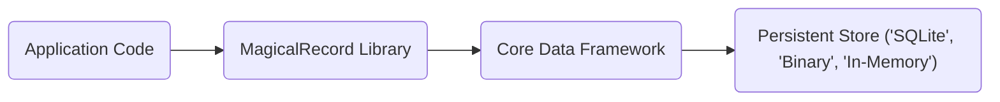
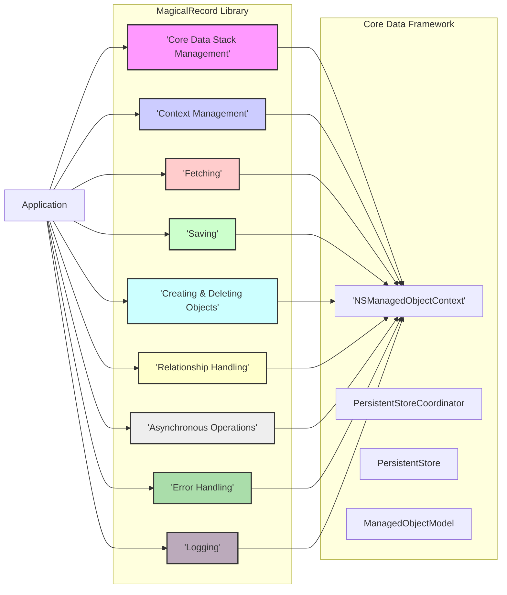

# Project Design Document: MagicalRecord

**Version:** 1.1
**Date:** October 26, 2023
**Author:** AI Software Architect

## 1. Introduction

This document provides an enhanced design overview of the MagicalRecord library, an Objective-C library designed to simplify interactions with Apple's Core Data framework. This detailed design aims to offer a comprehensive understanding of the library's architecture, internal components, and data flow mechanisms. This in-depth knowledge is essential for conducting thorough threat modeling and identifying potential security vulnerabilities.

## 2. Goals and Objectives

The primary goal of MagicalRecord is to abstract the complexities and reduce the amount of boilerplate code typically associated with direct Core Data usage. Key objectives include:

*   Providing a more developer-friendly and intuitive API for common Core Data operations (fetching, saving, creating, deleting).
*   Significantly reducing the verbosity and complexity of standard Core Data interactions.
*   Abstracting away some of the intricacies of Core Data's concurrency model, making concurrent data access easier to manage.
*   Improving the overall readability and maintainability of code that interacts with the Core Data layer.
*   Offering convenience methods for common tasks, such as finding the first or last object matching specific criteria.

## 3. System Architecture

MagicalRecord operates as a layer built on top of the standard Core Data framework, acting as a facilitator and simplifying its usage. It does not replace Core Data but rather provides a more accessible interface.

### 3.1. High-Level Architecture

*   **'Application Code'**: Represents the developer's application logic that utilizes the MagicalRecord library for data persistence operations.
*   **'MagicalRecord Library'**: The core component of this project, offering a simplified and more convenient API for interacting with the underlying Core Data framework.
*   **'Core Data Framework'**: Apple's native framework responsible for managing the application's data model, including object lifecycle and persistence. MagicalRecord leverages this framework.
*   **'Persistent Store'**: The underlying storage mechanism where the application's data is physically stored. Common options include SQLite databases, binary files, or in-memory stores for temporary data.

### 3.2. Component-Level Architecture

MagicalRecord is internally organized into several distinct components, each responsible for a specific set of functionalities. These components work in concert to provide the library's overall capabilities.

*   **'Core Data Stack Management'**: This component is responsible for the initialization and management of the Core Data stack. This includes setting up the `NSPersistentContainer` (or its predecessors), loading the `NSManagedObjectModel`, creating the `NSPersistentStoreCoordinator`, and adding the `NSPersistentStore`. It simplifies the often verbose setup process.
*   **'Context Management'**: Provides utilities for easily obtaining and managing `NSManagedObjectContext` instances. This includes access to the main thread context and the creation of background contexts for performing operations concurrently without blocking the main thread.
*   **'Fetching'**: Offers a simplified API for retrieving data from the persistent store. This includes methods for fetching single objects based on attributes, retrieving all objects of a specific entity, and performing more complex queries using `NSPredicate` and `NSSortDescriptor`.
*   **'Saving'**: Streamlines the process of saving changes made to managed objects. It handles saving changes within the appropriate context and propagating those changes up to the persistent store coordinator and ultimately to the persistent store. It offers both synchronous and asynchronous saving options.
*   **'Creating & Deleting Objects'**: Provides convenient methods for creating new instances of managed objects for a specific entity and for deleting existing managed objects from a given context.
*   **'Relationship Handling'**: Offers utility methods to simplify the management of relationships between managed objects. This includes adding, removing, and accessing related objects.
*   **'Asynchronous Operations'**: Facilitates performing Core Data operations on background threads to prevent blocking the main application thread, improving responsiveness and user experience. This often involves the use of private queue contexts.
*   **'Error Handling'**: Provides mechanisms for handling errors that may occur during Core Data operations, offering a more consistent and potentially simplified approach compared to directly handling Core Data errors.
*   **'Logging'**: Includes logging capabilities (potentially configurable) to aid in debugging and understanding the library's behavior and interactions with Core Data.

## 4. Data Flow

The typical data flow when utilizing MagicalRecord for data persistence follows these steps:

1. **Initialization Phase:** The application initializes the Core Data stack through MagicalRecord's setup methods, typically specifying the name of the data model. This sets up the necessary infrastructure for data operations.
2. **Data Retrieval (Fetching):** The application uses MagicalRecord's fetching methods (e.g., `MR_findFirstByAttribute:withValue:`, `MR_findAll`, `MR_findByAttribute:withValue:`) to retrieve managed objects from the persistent store. These methods internally construct and execute `NSFetchRequest` objects.
3. **Data Creation:** When new data needs to be persisted, the application utilizes MagicalRecord's creation methods (e.g., `MR_createEntity`) to instantiate new managed objects within a specific `NSManagedObjectContext`.
4. **Data Modification:** After fetching or creating managed objects, the application modifies the properties of these objects as needed. These changes are tracked within the `NSManagedObjectContext`.
5. **Data Persistence (Saving):** To persist the changes, the application calls MagicalRecord's saving methods (e.g., `MR_saveToPersistentStoreAndWait`, `MR_saveToPersistentStoreWithCompletion:`). This triggers the saving of the current context, which propagates the changes to the persistent store coordinator and ultimately writes them to the persistent store.
6. **Data Deletion:** When data needs to be removed, the application uses MagicalRecord's deletion methods (e.g., `MR_deleteEntity:`, `MR_truncateAll`) to mark managed objects for deletion within a context. These deletions are then persisted during the save operation.

## 5. Security Considerations (Detailed for Threat Modeling)

While MagicalRecord simplifies Core Data interactions, it's crucial to be aware of potential security implications that need to be addressed during development and threat modeling:

*   **Persistent Store Security (Data at Rest):**
    *   **Lack of Built-in Encryption:** MagicalRecord itself does not provide built-in encryption for the persistent store. If sensitive data is stored, developers *must* implement encryption at the file system level (e.g., using iOS Data Protection) or leverage Core Data's encryption options (if configured). Failure to do so can lead to information disclosure if the device is compromised.
    *   **Insecure File Permissions:** The permissions on the persistent store file (e.g., SQLite database) must be appropriately set to prevent unauthorized access by other applications or processes on a jailbroken device.
*   **Data Validation and Integrity:**
    *   **No Implicit Validation:** MagicalRecord does not enforce data validation. Developers are responsible for implementing validation logic before saving data to prevent data corruption, inconsistencies, or exploitation of vulnerabilities through malformed data.
    *   **Potential for Data Tampering:** Without proper validation and integrity checks, data stored using MagicalRecord could be tampered with, leading to incorrect application behavior or security breaches.
*   **Access Control and Authorization:**
    *   **Application-Level Responsibility:** MagicalRecord does not provide built-in access control mechanisms. The application logic itself must handle user authentication and authorization to ensure that only authorized users can access and modify specific data.
    *   **Risk of Unauthorized Access:** If access control is not properly implemented, unauthorized users or components might be able to read or modify sensitive data.
*   **Indirect SQL Injection Risks:**
    *   **Predicate Construction:** While MagicalRecord abstracts away direct SQL queries, constructing `NSPredicate` objects using string formatting with unsanitized user input can create vulnerabilities similar to SQL injection. Malicious input could be injected into the predicate, potentially leading to unintended data access or manipulation.
    *   **Importance of Sanitization:** Developers must ensure that any user-provided data used in predicate construction is properly sanitized and escaped to prevent injection attacks.
*   **Data Integrity and Concurrency:**
    *   **Race Conditions:** While MagicalRecord simplifies concurrency, improper handling of concurrent access to managed object contexts can still lead to race conditions and data corruption. Developers need to understand and correctly utilize MagicalRecord's concurrency features.
    *   **Transaction Management:** Ensuring data integrity often relies on the correct use of Core Data transactions. While MagicalRecord simplifies saving, developers still need to be mindful of transaction boundaries, especially in complex scenarios.
*   **Information Disclosure through Logging:**
    *   **Sensitive Data in Logs:** If logging is enabled (either through MagicalRecord's logging or general application logging), developers need to be cautious about logging sensitive data, which could inadvertently expose it.
    *   **Secure Logging Practices:** Implement secure logging practices, ensuring that sensitive information is not logged or is appropriately redacted.
*   **Denial of Service (DoS) Potential:**
    *   **Inefficient Queries:** While not a direct vulnerability in MagicalRecord itself, poorly written or excessively complex fetch requests executed through MagicalRecord can lead to performance issues and potentially a denial of service if the application becomes unresponsive due to resource exhaustion.
    *   **Resource Exhaustion:**  Excessive creation or manipulation of managed objects without proper memory management could also lead to resource exhaustion and DoS.

## 6. Deployment

MagicalRecord is typically integrated into iOS, macOS, tvOS, or watchOS applications as a third-party library. Common deployment methods include:

*   **CocoaPods:**  Specify the dependency `pod 'MagicalRecord'` in the `Podfile` and run `pod install`.
*   **Carthage:** Add `github "magicalpanda/MagicalRecord"` to the `Cartfile` and run `carthage update`.
*   **Swift Package Manager (SPM):** Add the repository URL (`https://github.com/magicalpanda/MagicalRecord.git`) as a package dependency in Xcode.
*   **Manual Integration:**  Download the source code and manually add the necessary `.h` and `.m` files to the project.

## 7. Technologies Used

*   **Objective-C:** The primary programming language in which the MagicalRecord library is written.
*   **Core Data:** Apple's foundational framework for managing the application's data model and persistence.
*   **Foundation Framework:** Provides essential base classes and services used by MagicalRecord.

## 8. Assumptions and Constraints

*   It is assumed that developers using MagicalRecord possess a fundamental understanding of Core Data concepts and principles.
*   MagicalRecord's functionality is inherently constrained by the capabilities and limitations of the underlying Core Data framework.
*   The ultimate security of data managed by MagicalRecord depends significantly on how developers utilize the library and configure the Core Data stack and persistent store. MagicalRecord simplifies usage but does not inherently guarantee security.
*   This design document provides a general overview of MagicalRecord's architecture and is not an exhaustive description of every method, class, or potential edge case within the library.
*   The focus of this document is on providing information relevant to understanding the system for threat modeling purposes.

This enhanced design document provides a more detailed and comprehensive understanding of the MagicalRecord library, particularly focusing on aspects relevant to security considerations and threat modeling. This information will be crucial for identifying potential vulnerabilities and developing appropriate mitigation strategies.