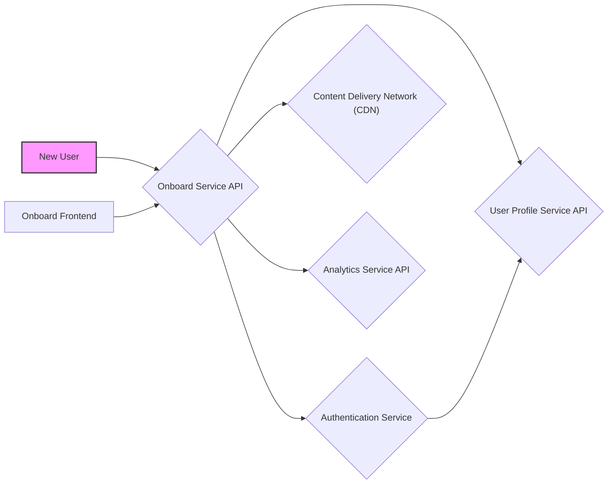
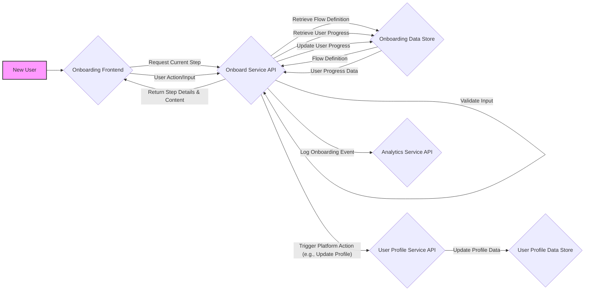

# Project Design Document: Onboard - User Onboarding System

**Version:** 1.1
**Date:** October 26, 2023
**Author:** AI Software Architect

## 1. Project Overview

This document details the design for "Onboard," a system dedicated to enhancing the user onboarding experience for our platform. Building upon the insights gained from the GitHub repository ([https://github.com/mamaral/Onboard](https://github.com/mamaral/Onboard)), we understand the project's core objective is to provide a structured and intuitive pathway for new users to become proficient with the platform's features and functionalities. This design document serves as the foundational blueprint for the system's development and will be instrumental in subsequent threat modeling exercises.

## 2. Goals and Objectives

The primary goals driving the development of the Onboard system are:

*   **Elevated User Experience:** To create an onboarding process that is clear, intuitive, engaging, and enjoyable for new users.
*   **Accelerated User Activation:** To effectively guide users towards key features and functionalities, thereby fostering higher engagement and platform adoption rates.
*   **Minimized Time to Value:** To enable users to quickly grasp the platform's benefits and achieve their initial objectives with minimal friction.
*   **Robust Scalability and Maintainability:** To architect a system capable of adapting to future platform evolutions and ensuring ease of maintenance and updates.
*   **Stringent Security:** To guarantee the onboarding process is secure, safeguarding user data and maintaining the integrity of the system.

## 3. Target Audience

This design document is specifically intended for:

*   **Development Team Members:** To provide a comprehensive understanding of the system architecture, component interactions, and implementation details.
*   **Security Engineers and Architects:** To facilitate thorough threat modeling and the identification of potential security vulnerabilities.
*   **Product Management and Owners:** To offer a clear understanding of the system's capabilities, planned features, and development roadmap.
*   **Key Stakeholders:** To provide a high-level overview of the project's scope, objectives, and design principles.

## 4. High-Level Architecture

The Onboard system will be seamlessly integrated within the existing platform ecosystem. A refined high-level architecture is illustrated below:

**Description of Components:**

*   **New User:**  An individual accessing the platform for the first time and requiring guidance through the onboarding process.
*   **Onboard Service API:** The central component responsible for orchestrating the onboarding flow, managing steps, tracking user progress, and triggering relevant actions. This acts as the backend logic.
*   **Authentication Service:**  Manages user authentication and authorization, ensuring only verified users can access and progress through the onboarding process.
*   **User Profile Service API:**  Provides interfaces for accessing and managing user profile information, including onboarding status, preferences, and completion metrics.
*   **Content Delivery Network (CDN):**  Hosts static assets such as images, videos, and instructional documents utilized within the onboarding experience, optimizing delivery speed and reducing server load.
*   **Analytics Service API:**  Collects and processes data on user behavior during onboarding, enabling tracking of completion rates, identification of drop-off points, and measurement of overall onboarding effectiveness.
*   **Onboard Frontend:** The user-facing interface, likely a web application or integrated component within the platform's UI, responsible for presenting onboarding steps and collecting user input.

## 5. Detailed Design

### 5.1. Components

*   **Onboarding Frontend:**
    *   **Purpose:** To provide the interactive user interface for the onboarding journey. This may consist of a series of web pages, embedded modals, or in-application guidance overlays.
    *   **Functionality:**
        *   Dynamically renders onboarding steps and associated instructions based on data received from the Onboard Backend API.
        *   Collects necessary user information through forms and interactive elements during specific onboarding stages.
        *   Provides visual cues for progress tracking, such as progress bars or step indicators.
        *   Handles user interactions (e.g., button clicks, form submissions) and communicates these actions to the Onboard Backend API.
        *   Adapts the onboarding flow based on user input and platform context.
    *   **Technology Considerations:**  Likely implemented using standard web technologies (HTML, CSS, JavaScript) and potentially a modern JavaScript framework or library (e.g., React, Angular, Vue.js). Consideration for accessibility (WCAG compliance) is important.

*   **Onboard Backend API:**
    *   **Purpose:** To manage the core business logic and data persistence for the onboarding process. It acts as the central orchestrator and data provider.
    *   **Functionality:**
        *   Defines and manages the structure of onboarding flows, including the sequence of steps, dependencies between steps, and branching logic.
        *   Persistently tracks the progress of individual users through their assigned onboarding flow.
        *   Provides secure API endpoints for the Onboarding Frontend to request step details, submit user actions, and retrieve onboarding status.
        *   Integrates with other platform services, such as the Authentication Service for user verification and the User Profile Service API for updating user attributes.
        *   Triggers automated actions based on onboarding milestones, such as sending welcome emails, unlocking specific platform features, or initiating follow-up tasks.
        *   Implements robust error handling and logging mechanisms.
    *   **Technology Considerations:**  Could be developed using various backend technologies (e.g., Node.js with Express, Python with Django or Flask, Java with Spring Boot, Go). A RESTful API architecture is a likely choice for communication with the frontend. Consideration for scalability and performance is crucial.

*   **Onboarding Data Store:**
    *   **Purpose:** To persistently store all data related to the onboarding process, ensuring data integrity and availability.
    *   **Functionality:**
        *   Stores definitions of various onboarding flows, including step configurations and dependencies.
        *   Maintains user-specific onboarding progress data, including completed steps and timestamps.
        *   Stores configuration settings for the onboarding system, such as default flows and display preferences.
        *   May store temporary data related to active onboarding sessions.
    *   **Technology Considerations:**  Could be a relational database (e.g., PostgreSQL, MySQL) for structured data or a NoSQL database (e.g., MongoDB, Cassandra) if flexibility and scalability are paramount. The choice depends on the complexity of the data model and performance requirements.

*   **Onboarding Content Management System (CMS) (Optional but Recommended):**
    *   **Purpose:** To provide a user-friendly interface for managing and updating the content displayed during the onboarding process. This promotes agility and reduces development dependencies for content changes.
    *   **Functionality:**
        *   Allows non-technical content creators to easily create, edit, and manage onboarding text, images, videos, and other media.
        *   Provides version control and rollback capabilities for onboarding content.
        *   May offer features for content scheduling and targeting.
        *   Integrates with the CDN for efficient content delivery to end-users.
    *   **Technology Considerations:**  Could be a dedicated headless CMS (e.g., Contentful, Strapi) or leverage the platform's existing content management infrastructure if available and suitable.

### 5.2. Data Flow

A more detailed representation of the data flow during a typical onboarding session is as follows:

**Detailed Description of Data Flow:**

1. **New User Initiates Onboarding:** A new user accesses the platform and is directed to the Onboarding Frontend.
2. **Request Current Step:** The Onboarding Frontend sends a request to the Onboard Service API to retrieve the details of the current onboarding step for the user.
3. **Retrieve Flow Definition:** The Onboard Service API queries the Onboarding Data Store to retrieve the definition of the relevant onboarding flow.
4. **Flow Definition Returned:** The Onboarding Data Store returns the flow definition to the Onboard Service API.
5. **Retrieve User Progress:** The Onboard Service API retrieves the user's current progress within the onboarding flow from the Onboarding Data Store.
6. **User Progress Data Returned:** The Onboarding Data Store returns the user's progress data.
7. **Return Step Details & Content:** The Onboard Service API combines the flow definition and user progress to determine the current step and retrieves the associated content (potentially from the CDN or CMS) before sending the details back to the Onboarding Frontend.
8. **User Action/Input:** The user interacts with the Onboarding Frontend, providing input or completing an action required by the current step.
9. **Validate Input:** The Onboard Service API validates the user's input to ensure data integrity and security.
10. **Update User Progress:** Upon successful validation, the Onboard Service API updates the user's progress in the Onboarding Data Store.
11. **Trigger Platform Action:** Based on the completed step, the Onboard Service API may trigger actions in other platform services, such as updating the user's profile via the User Profile Service API.
12. **Log Onboarding Event:** The Onboard Service API sends data about the user's interaction (e.g., step completion, time spent) to the Analytics Service API for tracking and analysis.

### 5.3. Security Considerations

Security is a fundamental aspect of the Onboard system design. Key considerations include:

*   **Robust Authentication and Authorization:**
    *   Utilize the platform's existing Authentication Service to verify user identities before granting access to the onboarding process.
    *   Implement role-based access control (RBAC) to restrict access to onboarding management functionalities (e.g., creating or modifying flows) to authorized administrators.
    *   Employ secure session management techniques to protect user sessions.
*   **Comprehensive Data Validation and Sanitization:**
    *   Implement rigorous input validation on the Onboard Backend API to prevent injection attacks (e.g., SQL injection, cross-site scripting).
    *   Sanitize all user-provided data before storing it in the Onboarding Data Store to mitigate the risk of stored XSS.
*   **Secure Communication Channels:**
    *   Enforce HTTPS for all communication between the Onboarding Frontend and the Onboard Backend API to encrypt data in transit.
    *   Utilize secure communication protocols (e.g., TLS) for communication between the Onboard Service API and other internal platform services.
*   **Strict Data Privacy and Compliance:**
    *   Collect only the minimum necessary user data required for the onboarding process.
    *   Adhere to relevant data privacy regulations (e.g., GDPR, CCPA) regarding the collection, storage, and processing of user data.
    *   Implement appropriate data encryption at rest for sensitive onboarding data.
*   **Protection Against Onboarding Manipulation:**
    *   Implement server-side logic to prevent users from bypassing or skipping onboarding steps in an unintended manner.
    *   Employ mechanisms to ensure the integrity of the onboarding flow and prevent unauthorized modifications.
*   **API Security Best Practices:**
    *   Implement rate limiting on API endpoints to prevent abuse and denial-of-service attacks.
    *   Utilize API keys or other authentication mechanisms for internal service-to-service communication.
    *   Regularly review and update API dependencies to address known vulnerabilities.
*   **Regular Security Audits and Penetration Testing:**
    *   Conduct periodic security audits and penetration testing to identify and address potential vulnerabilities in the Onboard system.

## 6. Deployment

The deployment strategy for the Onboard system will align with the platform's existing infrastructure and deployment practices. Potential options include:

*   **Cloud-Native Deployment:** Deploying the components on a cloud platform (e.g., AWS, Azure, GCP) leveraging services such as:
    *   **Containerization (Docker):** Packaging the Onboard Backend API and Onboarding Frontend into Docker containers for consistent and portable deployments.
    *   **Orchestration (Kubernetes):** Utilizing Kubernetes for managing and scaling the containerized components.
    *   **Serverless Functions (e.g., AWS Lambda, Azure Functions):**  Potentially deploying parts of the Onboard Backend API as serverless functions for scalability and cost efficiency.
    *   **Managed Databases:** Utilizing managed database services (e.g., AWS RDS, Azure SQL Database) for the Onboarding Data Store.
*   **Integration with Existing CI/CD Pipeline:** Seamlessly integrating the deployment process for the Onboard system into the platform's existing Continuous Integration and Continuous Delivery (CI/CD) pipeline to automate builds, tests, and deployments.
*   **Infrastructure as Code (IaC):** Defining and managing the infrastructure required for the Onboard system using tools like Terraform or CloudFormation to ensure consistency and repeatability.
*   **CDN Integration:**  Leveraging a Content Delivery Network (CDN) to efficiently distribute static assets for the Onboarding Frontend, improving performance and reducing latency for users globally.

## 7. Future Considerations

*   **Personalized and Adaptive Onboarding:**  Dynamically tailoring the onboarding flow and content based on user roles, industry, stated goals, or observed behavior within the platform.
*   **Interactive Tutorials and In-App Guidance:**  Integrating interactive tutorials, tooltips, and guided walkthroughs directly within the platform interface to provide contextual help.
*   **Gamification and Progress Tracking Enhancements:**  Implementing more sophisticated progress tracking mechanisms, badges, points, and other gamified elements to increase user engagement and motivation.
*   **A/B Testing and Optimization of Onboarding Flows:**  Developing the capability to A/B test different onboarding flows and content variations to identify and implement the most effective strategies.
*   **Integration with Support and Knowledge Base Resources:**  Providing seamless access to relevant help documentation, FAQs, and support channels directly within the onboarding experience.
*   **Multilingual Support:**  Localizing the onboarding content and interface to support multiple languages.
*   **Onboarding Analytics Dashboard:**  Creating a dedicated dashboard to visualize key onboarding metrics, track user progress, and identify areas for improvement.

This revised design document provides a more detailed and comprehensive blueprint for the Onboard system. It will serve as a valuable resource for the development team, security engineers, and other stakeholders throughout the project lifecycle. The next critical step is to conduct a thorough threat modeling exercise based on this design to proactively identify and mitigate potential security risks.
