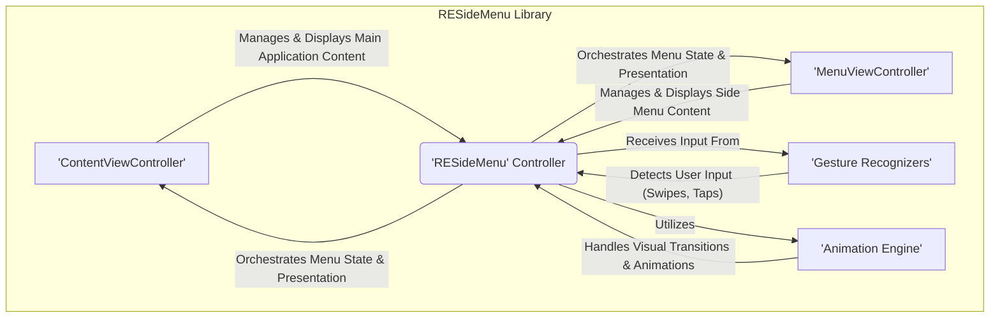

## Project Design Document: RESideMenu (Improved)

**1. Introduction**

This document provides an enhanced and more detailed design overview of the RESideMenu project, an open-source iOS library facilitating the implementation of responsive side menu navigation. The primary goal of this document is to offer a comprehensive understanding of the library's architecture, components, and data flow, specifically tailored to support a thorough and effective threat modeling exercise.

**2. Project Overview**

RESideMenu is a widely adopted iOS library designed to simplify the integration of interactive side menu navigation (often referred to as hamburger menus or drawer menus) into iOS applications. It abstracts away the complexities of menu presentation, animation, and user interaction management, providing developers with a convenient and visually appealing solution for application navigation.

**3. Goals of this Document**

*   Present a clear, detailed, and technically accurate architectural overview of the RESideMenu library.
*   Thoroughly identify and describe the key components within the library and their interdependencies.
*   Elucidate the flow of data and control within the library in response to user interactions and internal events.
*   Serve as a robust and informative foundation for conducting a comprehensive threat modeling exercise, enabling the identification of potential security vulnerabilities.
*   Document the design in a structured and easily understandable format, specifically optimized for security analysis.

**4. Scope**

This document focuses exclusively on the internal architecture, functionality, and interactions within the RESideMenu library itself. The scope explicitly excludes:

*   The implementation specifics of individual iOS applications that integrate and utilize the RESideMenu library.
*   The underlying iOS operating system, its frameworks, or the hardware of the device on which the library operates.
*   Network communication protocols, data storage mechanisms, or any backend services associated with applications using RESideMenu.
*   Specific, known security vulnerabilities or exploits within the library (these will be the subject of the subsequent threat modeling process).

**5. Architectural Overview**

RESideMenu's architecture leans towards a Model-View-Controller (MVC) or a similar pattern, effectively separating concerns related to data, presentation, and user interaction. The core components collaborate to deliver the side menu functionality.

**6. Data Flow (Detailed)**

The data flow within RESideMenu is primarily driven by user interactions and the resulting changes in the menu's state.

*   **User Initiated Actions:**
    *   User gestures (e.g., swiping near the edge of the screen, tapping a button to toggle the menu) are captured by the `Gesture Recognizers`.
    *   These recognized gestures are translated into events that are passed to the `RESideMenu` controller.
*   **State Transition Logic:**
    *   The `RESideMenu` controller maintains the current state of the menu (e.g., `isMenuVisible`, `menuPosition`).
    *   Upon receiving a gesture event, the controller's internal logic determines the next state of the menu (e.g., opening, closing, staying open).
    *   This logic might involve checking constraints, animation states, and user preferences.
*   **View Updates and Animation:**
    *   Based on the determined state change, the `RESideMenu` controller instructs the `Animation Engine` to perform the necessary visual transitions.
    *   This involves updating the `transform` or `frame` properties of the `ContentViewController` and `MenuViewController` to achieve the sliding or revealing effect.
    *   Animation parameters like duration and easing are managed by the `Animation Engine`.
*   **Content Switching (Application Integration):**
    *   When a user interacts with an item within the `MenuViewController` (e.g., tapping a navigation link), the `MenuViewController` typically uses a delegate pattern or closure to notify the `RESideMenu` controller or a higher-level component in the application.
    *   The application then handles this event, often by updating the content displayed within the `ContentViewController`. This data flow is managed by the integrating application, not directly by RESideMenu.
*   **Configuration Data:**
    *   The `RESideMenu` controller can be configured with properties like the menu width, animation duration, and whether to allow panning gestures. This configuration data influences the behavior and presentation of the menu.

**7. Key Components (In-Depth)**

*   **RESideMenu Controller:**
    *   The central orchestrator of the side menu functionality.
    *   Holds references to the `ContentViewController` and `MenuViewController`.
    *   Manages the overall state of the side menu (open, closed, animating).
    *   Receives and processes events from `Gesture Recognizers`.
    *   Delegates animation tasks to the `Animation Engine`.
    *   Provides programmatic methods for opening, closing, and toggling the menu.
    *   Often implements delegate protocols (e.g., `RESideMenuDelegate`) to communicate state changes and events to the containing application.
    *   May store configuration settings related to menu appearance and behavior.
*   **ContentViewController:**
    *   The view controller responsible for displaying the primary content of the application.
    *   Its view is manipulated by the `RESideMenu` controller to reveal or hide the side menu.
    *   Typically a custom view controller provided by the developer integrating the library.
    *   May have its user interaction enabled or disabled based on the menu's state.
*   **MenuViewController:**
    *   The view controller that presents the content of the side menu (e.g., navigation options, settings).
    *   Also typically a custom view controller provided by the developer.
    *   Contains the UI elements (e.g., `UITableView`, `UICollectionView`, buttons) that represent the menu items.
    *   Handles user interactions within the menu and communicates these actions to the application.
*   **Gesture Recognizers:**
    *   Standard UIKit components (e.g., `UIScreenEdgePanGestureRecognizer`, `UITapGestureRecognizer`).
    *   Attached to the relevant views (typically the main content view) to detect user gestures intended to interact with the side menu.
    *   Configured with specific directions, touch counts, and sensitivity levels to trigger menu actions.
    *   The `RESideMenu` controller acts as the target for these gesture recognizers.
*   **Animation Engine:**
    *   Responsible for the visual transitions of the side menu.
    *   Likely utilizes Core Animation frameworks or `UIViewPropertyAnimator` for smooth and customizable animations.
    *   Handles the translation, scaling, and potentially fading of the `ContentViewController` and `MenuViewController` during menu transitions.
    *   May allow customization of animation parameters like duration, timing functions (e.g., ease-in-out).

**8. Security Considerations (Enhanced for Threat Modeling)**

Considering the architecture and data flow, potential security considerations for threat modeling include:

*   **Gesture Hijacking:** Could malicious code intercept or simulate touch events intended for the `Gesture Recognizers` to trigger unintended menu actions or bypass security checks within the application?
*   **State Manipulation Vulnerabilities:** Could an attacker force the `RESideMenu` controller into an invalid or unexpected state, leading to UI inconsistencies, denial of service, or the exposure of sensitive information?
*   **Animation Logic Exploits:** Are there potential vulnerabilities in the `Animation Engine` that could be exploited to cause excessive resource consumption, UI freezes, or display misleading information?
*   **Delegate/Block Injection:** If the `RESideMenu` relies on delegates or blocks for communication, could a malicious component within the application intercept or manipulate these communication channels to execute unauthorized code or access sensitive data?
*   **Input Validation on Configuration:** While RESideMenu's direct input is limited, are there any configuration options that, if set to extreme or invalid values, could lead to unexpected behavior or resource exhaustion?
*   **View Hierarchy Manipulation:** Could an attacker manipulate the view hierarchy in a way that interferes with the intended behavior of RESideMenu or overlays malicious UI elements?
*   **Information Disclosure through UI:** Could the state of the menu or the animation transitions inadvertently reveal sensitive information about the application's structure or user activity?
*   **Race Conditions in State Updates:** Are there potential race conditions in how the menu state is updated in response to user input or programmatic changes, which could lead to inconsistent UI or unexpected behavior?

**9. Deployment Model**

RESideMenu is commonly integrated into iOS applications using the following dependency management tools and methods:

*   **CocoaPods:** Declared as a dependency in the `Podfile` and installed using the `pod install` command.
*   **Carthage:** Specified in the `Cartfile` and integrated into the project by building dependencies with Carthage and linking the framework.
*   **Swift Package Manager (SPM):** Added as a package dependency within Xcode by providing the repository URL.
*   **Manual Integration:** The source files of the RESideMenu library can be directly downloaded and added to the Xcode project.

After integration, developers typically instantiate the `RESideMenu` controller, setting its `contentViewController` and `menuViewController` properties to their respective view controllers. The `RESideMenu` controller then becomes the root view controller or a child view controller in the application's navigation hierarchy.

**10. Assumptions and Constraints**

*   The underlying iOS operating system and its core frameworks are assumed to be secure and functioning as documented.
*   The security of the application that integrates RESideMenu is the ultimate responsibility of the application developer. This document focuses solely on the potential vulnerabilities within the RESideMenu library itself.
*   RESideMenu operates primarily on the client-side and does not inherently involve network communication or server-side interactions. Any security implications arising from network communication are outside the scope of this document.
*   The threat model will primarily focus on potential vulnerabilities within the library's code, its interaction with the iOS environment, and potential misuse by a malicious application or attacker with control over the device.
