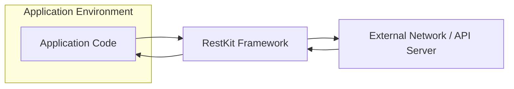
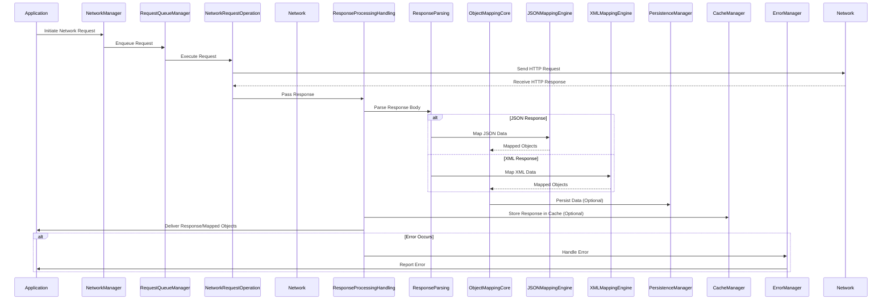

# Project Design Document: RestKit

**Version:** 1.1
**Date:** October 26, 2023
**Author:** AI Software Architect

## 1. Introduction

This document provides an enhanced and more detailed design overview of the RestKit framework, an Objective-C library designed to streamline interactions with RESTful web services. This revised document aims to offer a deeper understanding of RestKit's architecture, internal components, and data flow, specifically tailored to facilitate comprehensive threat modeling activities.

## 2. Goals and Objectives

The primary goals of RestKit are to:

*   Significantly simplify the consumption and interaction process with RESTful APIs within Objective-C applications.
*   Offer a robust and adaptable mechanism for mapping data between JSON or XML formats and Objective-C objects.
*   Abstract the complexities inherent in network communication, encompassing request construction, response parsing, and error management.
*   Provide functionalities for data persistence, including integration with Core Data, and caching strategies.
*   Offer a flexible architecture that can accommodate various authentication schemes.

## 3. System Architecture

### 3.1. High-Level Architecture



*   **Application Code:** The developer's application code that leverages the RestKit framework to communicate with external web services.
*   **RestKit Framework:** The core library responsible for managing all aspects of RESTful interactions, from request creation to data mapping.
*   **External Network / API Server:** The remote web service that the application interacts with over the network.

### 3.2. Detailed Architecture

```mermaid
graph LR
    subgraph "RestKit Framework Internal Structure"
        direction LR
        subgraph "Object Mapping Subsystem"
            style OMC fill:#f9f,stroke:#333,stroke-width:2px
            OMC["Object Mapping Core"]
            MM["Managed Object Mapping"]
            JM["JSON Mapping Engine"]
            XM["XML Mapping Engine"]
            DT["Data Transformation"]
        end
        subgraph "Networking Subsystem"
            style NL fill:#ccf,stroke:#333,stroke-width:2px
            NM["Network Manager"]
            RQM["Request Queue Manager"]
            NCO["Network Request Operation"]
            RPH["Response Processing & Handling"]
            AUTH["Authentication Handling"]
        end
        subgraph "Data Persistence Subsystem"
            style DPS fill:#ffc,stroke:#333,stroke-width:2px
            PM["Persistence Manager"]
            CDI["Core Data Integration Layer"]
            LOC["Local Storage Abstraction"]
        end
        subgraph "Caching Subsystem"
            style CS fill:#cfc,stroke:#333,stroke-width:2px
            CM["Cache Manager"]
            CSC["Cache Storage"]
            CC["Cache Control Logic"]
        end
        subgraph "Error Handling Subsystem"
            style EHS fill:#fcc,stroke:#333,stroke-width:2px
            EM["Error Manager"]
            LE["Logging & Error Reporting"]
        end
        subgraph "Request & Response Infrastructure"
            style RRI fill:#eee,stroke:#333,stroke-width:2px
            RQB["Request Building"]
            RSP["Response Parsing"]
            HDM["Header Management"]
        end
    end

    A["Application Code"] --> NM
    NM --> RQM
    RQM --> NCO
    NCO --> "External Network"
    "External Network" --> RPH
    RPH --> RSP
    RSP --> OMC
    OMC --> JM
    OMC --> XM
    OMC --> MM
    OMC --> DT
    OMC --> PM
    PM --> CDI
    PM --> LOC
    NM --> AUTH
    AUTH --> "Authentication Credentials Store"
    NM --> CM
    CM --> CSC
    CM --> CC
    RPH --> EM
    EM --> LE
    NM --> RQB
    RPH --> HDM
    RQB --> HDM
```

*   **Object Mapping Subsystem:**  This subsystem is responsible for the transformation of data between the application's object model and the data formats used by web services.
    *   **Object Mapping Core (OMC):** Provides the foundational classes and logic for defining and executing object mappings.
    *   **Managed Object Mapping (MM):**  Specifically handles the mapping of data to and from Core Data managed objects, facilitating seamless integration with the persistence framework.
    *   **JSON Mapping Engine (JM):**  Dedicated to handling the mapping of data in JSON format.
    *   **XML Mapping Engine (XM):**  Dedicated to handling the mapping of data in XML format.
    *   **Data Transformation (DT):**  Provides mechanisms for transforming data values during the mapping process (e.g., date formatting).
*   **Networking Subsystem:** Manages all aspects of network communication.
    *   **Network Manager (NM):**  The primary entry point for initiating network requests, responsible for configuring request parameters and managing the request lifecycle.
    *   **Request Queue Manager (RQM):**  Manages the queuing and execution of network requests, allowing for control over concurrency.
    *   **Network Request Operation (NCO):** Represents an individual network request, encapsulating the request details and handling the actual network communication.
    *   **Response Processing & Handling (RPH):**  Responsible for processing responses received from the server, including status code checks and data parsing.
    *   **Authentication Handling (AUTH):**  Manages the authentication process, including applying authentication credentials to requests.
*   **Data Persistence Subsystem:** Provides functionalities for storing and retrieving data.
    *   **Persistence Manager (PM):**  Coordinates data persistence operations, providing an abstraction layer for different storage mechanisms.
    *   **Core Data Integration Layer (CDI):**  Handles the integration with Apple's Core Data framework for persistent storage of mapped objects.
    *   **Local Storage Abstraction (LOC):**  Provides an abstraction for other local storage mechanisms if needed.
*   **Caching Subsystem:** Implements caching mechanisms to improve performance and reduce network load.
    *   **Cache Manager (CM):**  Manages the caching of network responses based on configured policies.
    *   **Cache Storage (CSC):**  The actual storage mechanism for cached data (e.g., in-memory, disk).
    *   **Cache Control Logic (CC):**  Implements the logic for determining when to cache responses and when to retrieve them from the cache.
*   **Error Handling Subsystem:** Provides a centralized mechanism for handling errors that occur during network communication or data mapping.
    *   **Error Manager (EM):**  Manages and propagates errors, providing a consistent way to handle exceptions.
    *   **Logging & Error Reporting (LE):**  Handles logging of errors and potentially reporting them.
*   **Request & Response Infrastructure:** Provides supporting functionalities for request and response handling.
    *   **Request Building (RQB):**  Responsible for constructing the HTTP request, including headers and body.
    *   **Response Parsing (RSP):**  Handles the parsing of the response body based on the content type (JSON, XML).
    *   **Header Management (HDM):**  Manages the setting and processing of HTTP headers.

## 4. Data Flow

The typical data flow for a request initiated using RestKit involves the following sequence of steps:

1. **Application Request Initiation:** The application code initiates a request by interacting with the `Network Manager`, specifying the target resource URL, the desired HTTP method (GET, POST, PUT, DELETE, etc.), and any necessary request parameters or request body data.
2. **Request Configuration and Preparation:** The `Network Manager` configures the request, potentially retrieving authentication credentials from the designated store via the `Authentication Handling` component. The `Request Building` component constructs the HTTP request message, including headers.
3. **Request Queuing:** The `Request Operation Manager` manages the queue of pending network requests, ensuring efficient execution and potentially managing concurrency limits.
4. **Network Transmission:** The `Network Request Operation` executes the network request, sending it to the remote API server over the network using the underlying networking capabilities of the operating system.
5. **Response Reception:** The API server processes the request and sends a response back to the application.
6. **Response Handling and Processing:** The `Response Processing & Handling` component receives the response. It first checks the HTTP status code to determine the success or failure of the request.
7. **Authentication Challenge Handling:** If the response indicates an authentication challenge, the `Authentication Handling` component may attempt to refresh credentials or prompt the user for authentication.
8. **Response Parsing:** The `Response Parsing` component parses the response body based on the declared content type (e.g., JSON or XML).
9. **Object Mapping:** The parsed data is then passed to the `Object Mapping Core`. Based on the configured `RKResponseDescriptor`, the appropriate mapping engine (`JSON Mapping Engine` or `XML Mapping Engine`) transforms the raw data into instances of Objective-C objects. If the mapping involves Core Data entities, the `Managed Object Mapping` component is utilized. Data transformations might be applied by the `Data Transformation` component.
10. **Caching (Optional):** If caching is enabled and the response is cacheable according to the configured `Cache Control Logic`, the `Cache Manager` stores the response data in the `Cache Storage`.
11. **Persistence (Optional):** If the response data is intended for persistent storage (typically involving Core Data), the `Persistence Manager` and `Core Data Integration Layer` handle the saving of the mapped objects to the persistent store.
12. **Response Delivery to Application:** The mapped objects (or an error object in case of failure) are delivered back to the application code through a completion handler or delegate method.
13. **Error Handling:** If any errors occur during any stage of the process (e.g., network connectivity issues, parsing errors, mapping failures), the `Error Manager` intercepts the error, potentially logs it via `Logging & Error Reporting`, and provides error information back to the application.



## 5. Key Components

*   **RKObjectManager:** The central class responsible for managing interactions with RESTful resources. It orchestrates network requests, response handling, and object mapping based on configured request and response descriptors.
*   **RKRequestDescriptor:** Defines the criteria for matching outgoing requests, specifying the HTTP method, path pattern, and the object class to be serialized as the request body. It also dictates how the request should be prepared.
*   **RKResponseDescriptor:** Defines how incoming responses should be processed. It specifies the HTTP status codes, MIME types, and the `RKMapping` to be applied to the response body.
*   **RKMapping:** An abstract base class for defining data mappings. Concrete subclasses like `RKAttributeMapping` and `RKRelationshipMapping` specify how individual attributes and relationships should be mapped.
*   **RKAttributeMapping:** Maps individual attributes from the remote data structure to properties of the local Objective-C object.
*   **RKRelationshipMapping:** Defines relationships between objects, specifying how nested data structures should be mapped to establish object relationships.
*   **RKRoute:** Defines URL patterns for resources, allowing for the generation of URLs based on object attributes.
*   **RKReachabilityObserver:** Monitors the network reachability status, allowing the application to react to changes in network connectivity.

## 6. Security Considerations

This section details security considerations relevant to the design and usage of the RestKit framework, highlighting potential vulnerabilities and recommended mitigation strategies:

*   **Transport Layer Security (TLS):** RestKit relies on the underlying `NSURLSession` for network communication.
    *   **Enforce HTTPS:** Ensure that all communication with remote servers occurs over HTTPS to encrypt data in transit and prevent eavesdropping. This should be a default configuration.
    *   **Certificate Pinning:** Implement certificate pinning to validate the server's SSL certificate against a known set of certificates, mitigating man-in-the-middle attacks where attackers present fraudulent certificates.
    *   **TLS Version Control:**  Configure the minimum acceptable TLS version to avoid using older, potentially vulnerable versions of the protocol.
*   **Authentication and Authorization:** RestKit supports various authentication schemes.
    *   **Secure Credential Storage:**  Avoid storing sensitive authentication credentials directly in the application code. Utilize secure storage mechanisms provided by the operating system's keychain or secure enclave.
    *   **Token-Based Authentication (OAuth 2.0, JWT):** Prefer token-based authentication mechanisms, which minimize the need to transmit credentials with every request. Ensure proper token validation and secure storage.
    *   **Input Validation:** Validate all user inputs on the client-side before sending them to the server to prevent injection attacks. However, always perform server-side validation as the primary defense.
*   **Data Handling and Validation:**
    *   **Server-Side Validation:**  Emphasize the importance of robust server-side data validation to prevent malicious or malformed data from being processed.
    *   **Output Encoding:** When displaying data received from the server, ensure proper output encoding to prevent cross-site scripting (XSS) vulnerabilities.
    *   **Secure Local Storage:** If sensitive data is persisted locally using RestKit's integration with Core Data or other mechanisms, ensure that appropriate encryption is applied to the local data store.
*   **Error Handling and Information Disclosure:**
    *   **Avoid Verbose Error Messages:**  Do not expose sensitive information in error messages returned to the client. Generic error messages should be used, with detailed logging performed on the server-side.
*   **Dependency Management:**
    *   **Regular Updates:** Keep RestKit and its dependencies updated to the latest versions to patch known security vulnerabilities. Utilize dependency management tools to streamline this process.
    *   **Vulnerability Scanning:**  Incorporate vulnerability scanning tools into the development pipeline to identify potential security issues in dependencies.
*   **Man-in-the-Middle (MITM) Attacks:**
    *   **Strict Transport Security (HSTS):**  Encourage the use of HSTS on the server-side to instruct clients to only communicate over HTTPS.
*   **Replay Attacks:**
    *   **Nonce and Timestamp Usage:** For sensitive operations, consider implementing mechanisms to prevent replay attacks, such as using nonces (unique, random values) and timestamps in requests.
*   **Denial of Service (DoS) Attacks:**
    *   **Rate Limiting:** While RestKit itself doesn't prevent DoS, server-side rate limiting is crucial. Implement appropriate timeouts on the client-side to handle slow or unresponsive servers gracefully.
*   **Injection Vulnerabilities:**
    *   **Parameterization:** When constructing URLs or request bodies dynamically, use parameterized queries or prepared statements to prevent SQL injection or other injection vulnerabilities on the server-side.

## 7. Deployment Considerations

Deploying applications that utilize RestKit involves standard iOS and macOS application deployment procedures. Key considerations include:

*   **Framework Integration:** RestKit is typically integrated using dependency managers like CocoaPods or Carthage, or as a Git submodule. Ensure proper integration and linking of the framework.
*   **Binary Size:** Be mindful of the framework's impact on the application's binary size, especially for mobile applications. Consider using build settings to optimize the final binary.
*   **Dependency Conflicts:**  Carefully manage dependencies to avoid conflicts with other libraries used in the project.
*   **Backward Compatibility:** When updating RestKit, review the release notes for any breaking changes that might require code modifications.

## 8. Future Considerations

*   **Swift Interoperability:**  Improving Swift interoperability or considering a Swift-native alternative could be beneficial for modern iOS and macOS development.
*   **Asynchronous Programming Enhancements:** Exploring deeper integration with modern asynchronous programming patterns like `async/await` in Swift.
*   **Metrics and Monitoring:**  Adding built-in support for metrics and monitoring of network requests could aid in debugging and performance analysis.
*   **GraphQL Support:**  Considering support for GraphQL APIs in addition to REST.

This enhanced design document provides a more granular and detailed overview of the RestKit framework, specifically focusing on aspects relevant to threat modeling. The detailed architecture, data flow diagrams, and comprehensive security considerations aim to equip security professionals and developers with the necessary information to identify and mitigate potential security vulnerabilities.