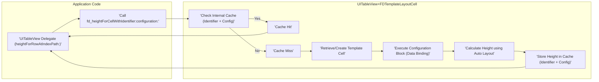

# Project Design Document: UITableView-FDTemplateLayoutCell

**Version:** 1.1
**Date:** October 26, 2023
**Author:** AI Software Architect

## 1. Introduction

This document provides an enhanced and detailed design overview of the `UITableView-FDTemplateLayoutCell` project. This library is engineered to optimize the calculation of `UITableViewCell` heights, particularly when dealing with dynamic content. The primary goal of this document is to offer a comprehensive understanding of the project's architecture, internal components, and the flow of data, thereby establishing a robust foundation for subsequent threat modeling and security analysis.

## 2. Project Overview

The `UITableView-FDTemplateLayoutCell` library effectively tackles a common performance challenge in iOS development: the potentially inefficient calculation of `UITableViewCell` heights in scenarios involving dynamic content. Traditional methods can lead to performance bottlenecks, especially in table views with a large number of cells or intricate layouts. This library introduces an optimized approach by employing template cells and sophisticated caching mechanisms to significantly enhance performance.

**Key Goals:**

*   **Highly Efficient Height Calculation:** To provide a performant and optimized method for determining the precise height of `UITableViewCell` instances.
*   **Robust Dynamic Content Support:** To seamlessly handle cells with dynamically changing content and varying layout requirements.
*   **Simplified Integration:** To offer a clear and intuitive API that facilitates easy integration into existing `UITableView` implementations with minimal effort.
*   **Reduced Development Overhead:** To minimize the amount of boilerplate code developers need to write for managing dynamic cell height calculations.

## 3. Architecture and Design

The core functionality of the library is encapsulated within the `FDTemplateLayoutCell` category, which extends the capabilities of the standard `UITableView` class. This extension introduces new methods specifically designed for the efficient calculation of cell heights.

**Key Components:**

*   **`UITableView+FDTemplateLayoutCell` Category:** This category augments the `UITableView` class with specialized methods for calculating cell heights.
    *   `fd_heightForCellWithIdentifier:configuration:`: This is the central method for calculating cell height. It accepts a cell identifier (typically a reuse identifier) and a configuration block as input.
    *   **Internal Caching Subsystem:**  A sophisticated system responsible for storing calculated cell heights to prevent redundant computations. This cache is typically keyed by a combination of the cell identifier and a representation of the configuration data.
    *   **Template Cell Management:**  Internally manages the creation and reuse of template cell instances.
*   **Template Cell:** A dedicated instance of the `UITableViewCell` (or its specific subclass) is utilized as a template to perform the necessary layout calculations. This template cell is dynamically configured with the data relevant to a particular row.
*   **Configuration Block:** A closure (block of code) provided by the developer. This block is responsible for configuring the template cell with the specific data required for a given row in the table view. This typically involves setting the values of labels, image views, and other subviews within the cell.
*   **Caching Mechanism:** The library employs a multi-layered caching strategy to store calculated cell heights. The cache keys typically include the cell's reuse identifier and a representation of the data used to configure the cell (e.g., a hash of the relevant data model). This ensures that the correct height is retrieved for cells with identical content.

**Detailed Interaction Flow:**

1. The `tableView:heightForRowAtIndexPath:` delegate method of the `UITableView` is invoked by the system when the table view needs to determine the height of a specific row.
2. Within the `tableView:heightForRowAtIndexPath:` method, the developer calls the `fd_heightForCellWithIdentifier:configuration:` method provided by the library.
3. The library's internal caching subsystem is queried to check if a previously calculated height exists for the given cell identifier and the current configuration.
    *   **Cache Hit:** If a matching entry is found in the cache, the stored height value is immediately returned, bypassing the need for recalculation.
    *   **Cache Miss:** If no matching entry is found, the library proceeds with the height calculation process.
4. The library retrieves or creates a template cell instance based on the provided cell identifier. This might involve dequeuing a reusable cell or instantiating a new one.
5. The provided configuration block is executed. This block configures the template cell with the data relevant to the current row being processed.
6. The library leverages the Auto Layout engine on the template cell to calculate its intrinsic content size. This involves laying out the subviews of the template cell based on the provided data and constraints. The resulting height represents the required height for the cell.
7. The calculated height is then stored in the cache, associated with the cell identifier and a representation of the configuration data (e.g., a hash of the data used in the configuration block). This ensures that subsequent requests for cells with the same configuration can be served from the cache.
8. The calculated height is returned to the `tableView:heightForRowAtIndexPath:` method.
9. The `UITableView` utilizes the returned height value to correctly layout the corresponding row within the table view.

## 4. Data Flow Diagram

## 5. Security Considerations

While the primary focus of `UITableView-FDTemplateLayoutCell` is on enhancing UI performance, it is crucial to address potential security implications that may arise from its integration into larger applications.

**Detailed Security Concerns:**

*   **Resource Exhaustion (Denial of Service):**
    *   **Unbounded Cache Growth:** If the configuration data used for generating cache keys is not carefully managed or if there's a large variability in the data, the cache could grow excessively, leading to significant memory consumption and potential application crashes due to memory pressure. Consider scenarios where a malicious data source provides unique data for each row.
    *   **CPU Intensive Layout Calculations:**  Maliciously crafted or extremely complex cell layouts within the configuration block could lead to excessive CPU utilization during height calculations. This could result in UI freezes, application unresponsiveness, and potentially drain device battery. Imagine a cell with an extremely deep view hierarchy and complex constraints.
*   **Data Integrity:**
    *   **Cache Poisoning (Low Probability, High Impact):** Although unlikely under normal circumstances, if an attacker could somehow manipulate the cached height values (e.g., by exploiting a memory corruption vulnerability elsewhere in the application), it could lead to incorrect UI rendering, potentially obscuring critical information or leading to unexpected user interactions. This would require a significant compromise of the application's runtime environment.
*   **Information Disclosure (Indirect):**
    *   **Timing Side-Channel Attacks (Very Low Risk):** In highly sensitive applications, subtle variations in the time taken to calculate cell heights based on different underlying data could theoretically be exploited to infer information about the data. This is a very sophisticated attack vector with a low practical risk for most applications using this library.
*   **Dependency Chain Vulnerabilities:**
    *   The library itself might depend on other third-party libraries or system frameworks. Vulnerabilities present in these dependencies could indirectly impact the security of applications utilizing `UITableView-FDTemplateLayoutCell`. It's crucial to keep all dependencies updated.
*   **Configuration Block Security:**
    *   **Unvalidated Data Handling:** If the configuration block directly uses data from untrusted sources without proper validation or sanitization, it could introduce vulnerabilities such as cross-site scripting (if the cell displays web content) or other data injection issues.

**Robust Mitigation Strategies:**

*   **Proactive Cache Management:**
    *   Implement a robust strategy for managing the cache size. This could involve setting maximum cache limits based on memory usage or the number of cached entries.
    *   Consider implementing a cache eviction policy (e.g., Least Recently Used - LRU) to remove less frequently accessed entries.
    *   Utilize a secure hashing mechanism to generate cache keys from configuration data to prevent excessive storage of large data objects and ensure key integrity.
*   **Input Validation and Sanitization within Configuration Blocks:**
    *   Developers must rigorously validate and sanitize any data used within the configuration block, especially if the data originates from external or untrusted sources. This helps prevent unexpected behavior and potential security vulnerabilities.
*   **Regular Dependency Updates and Security Audits:**
    *   Maintain up-to-date versions of the `UITableView-FDTemplateLayoutCell` library and all its dependencies to benefit from bug fixes and security patches.
    *   Conduct periodic security audits and code reviews of the application's implementation of `UITableView-FDTemplateLayoutCell` to proactively identify potential vulnerabilities and areas for improvement.
*   **Performance Monitoring and Anomaly Detection:**
    *   Continuously monitor the application's performance metrics, including memory usage, CPU utilization, and rendering times, to detect any anomalies that might indicate a security issue or resource exhaustion attack.
*   **Secure Coding Practices:**
    *   Adhere to secure coding principles when implementing the configuration blocks. Avoid using potentially unsafe APIs or making assumptions about the trustworthiness of the data being processed.
*   **Consider Asynchronous Calculation with Safeguards:**
    *   If implementing asynchronous height calculation, ensure proper synchronization and thread safety to prevent race conditions or data corruption. Implement timeouts or resource limits to prevent runaway calculations.

## 6. Assumptions and Constraints

*   **Responsible Developer Implementation:** It is assumed that developers integrating the library will implement the configuration block correctly, handle data securely, and are aware of potential performance implications of complex cell layouts.
*   **Reliance on Auto Layout:** The library's accuracy depends on the correct and efficient use of Auto Layout constraints within the cell's content view. Incorrectly configured constraints can lead to inaccurate height calculations.
*   **Main Thread Considerations:** While the library aims for efficiency, complex layout calculations performed within the configuration block can still impact the main thread's responsiveness.
*   **Target Platform:** The library is specifically designed for iOS development and the `UIKit` framework.

## 7. Future Considerations

*   **Enhanced Asynchronous Height Calculation:** Further explore and refine asynchronous height calculation mechanisms to minimize main thread impact, potentially using background queues with appropriate priority management.
*   **Adaptive Caching Strategies:** Investigate more intelligent and adaptive caching strategies that can dynamically adjust cache behavior based on memory pressure, usage patterns, or other runtime conditions.
*   **Seamless Integration with Modern Data Sources:**  Ensure optimal compatibility and integration with modern `UITableView` data source patterns, such as `UICollectionViewDiffableDataSource` adapted for `UITableView`.
*   **Formal Security Audits and Penetration Testing:** Conduct formal security audits and penetration testing by security experts to identify and address potential vulnerabilities in the library itself.

## 8. Conclusion

`UITableView-FDTemplateLayoutCell` offers a significant advantage in optimizing `UITableView` performance, particularly when dealing with dynamic cell heights. A thorough understanding of its architecture, data flow, and potential security considerations is paramount for developers integrating this library into their applications. By diligently implementing the recommended mitigation strategies and adhering to secure coding practices, developers can effectively leverage the performance benefits of this library while minimizing potential security risks. This enhanced design document provides a more detailed and comprehensive foundation for future threat modeling activities, enabling security professionals to analyze potential attack vectors and vulnerabilities with greater precision and context.