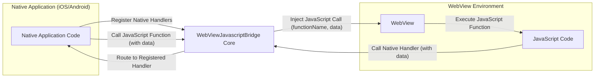
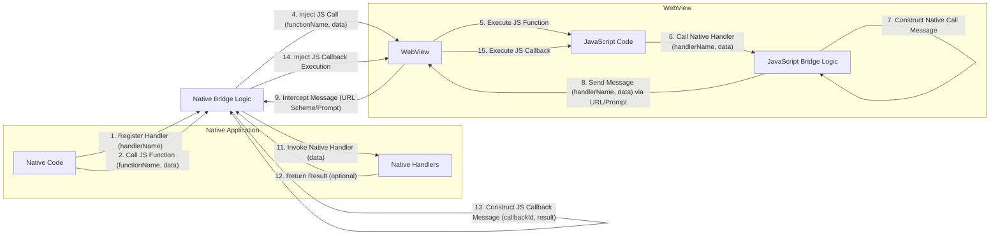

# Project Design Document: WebViewJavascriptBridge

**Version:** 1.1
**Date:** October 26, 2023
**Author:** AI Software Architect

## 1. Introduction

This document provides an enhanced and detailed design overview of the WebViewJavascriptBridge project. This library is crucial for enabling seamless, bidirectional communication between the native code of a mobile application (on iOS and Android platforms) and JavaScript code executing within an embedded WebView. The primary objective of this document is to offer a comprehensive understanding of the bridge's architecture, its constituent components, and the intricate flow of data across the native and JavaScript environments. This detailed design serves as a critical foundation for subsequent threat modeling exercises, allowing for a thorough analysis of potential security vulnerabilities.

## 2. Goals

*   To provide a precise and easily understandable description of the WebViewJavascriptBridge architecture, suitable for both technical and security audiences.
*   To clearly identify all key components involved in the communication process and meticulously define their interactions.
*   To comprehensively describe the data flow mechanisms and the structure of messages exchanged between the native and JavaScript environments.
*   To serve as a definitive reference point for security professionals to identify and analyze potential security vulnerabilities during threat modeling sessions.
*   To document the design in a clear, consistent, and maintainable format, adhering to best practices for software architecture documentation.

## 3. Non-Goals

*   This document does not delve into the specific implementation details of the WebViewJavascriptBridge library's source code.
*   It will not provide platform-specific implementation details (iOS or Android) beyond what is necessary to understand the general bridge architecture and communication flow. The focus remains on the core bridge concepts.
*   Performance benchmarking, optimization strategies, or detailed resource utilization analysis are outside the scope of this document.
*   This document is not intended to be a user manual, API reference, or a tutorial for using the WebViewJavascriptBridge library.

## 4. High-Level Architecture

The WebViewJavascriptBridge facilitates bidirectional communication, acting as a conduit for messages between the native application and the JavaScript code within the WebView. This interaction allows native functionalities to be triggered from JavaScript and vice versa.

**Components:**

*   **Native Application Code:** This encompasses the platform-specific code written in languages like Swift or Objective-C for iOS, and Kotlin or Java for Android. This code initializes the WebView, sets up the bridge, and implements the native handlers.
*   **WebView:** A core component provided by the mobile operating system responsible for rendering web content. It includes a JavaScript engine that executes JavaScript code.
*   **JavaScript Code:** The JavaScript code residing within the WebView that interacts with the native application through the bridge. This code can invoke native functionalities and receive data from the native side.
*   **WebViewJavascriptBridge Core:** This is the central library responsible for managing the communication channels, message serialization, and routing between the native and JavaScript environments. It handles the complexities of bridging the two different execution contexts.

## 5. Detailed Design

The WebViewJavascriptBridge enables two primary modes of communication: invoking JavaScript functions from native code and invoking native handlers from JavaScript code.

### 5.1. Native to JavaScript Communication Flow

This describes the process by which native application code triggers the execution of JavaScript functions within the WebView.

*   **Native Handler Registration (Native):**
    - The native application registers specific handlers (methods or functions) with the bridge. Each handler is associated with a unique name or identifier. These registered handlers are the entry points for JavaScript code to invoke native functionalities.

*   **Initiating JavaScript Function Call (Native):**
    - When the native application needs to execute a JavaScript function, it uses the bridge's API to initiate the call. This involves specifying the name of the target JavaScript function and any associated data (arguments) to be passed.

*   **Message Construction (Bridge):**
    - The bridge constructs a message object containing the necessary information for the JavaScript call. This message typically includes:
        -   `functionName`: A string representing the name of the JavaScript function to be called.
        -   `data`: An object or primitive containing the arguments to be passed to the JavaScript function. This data is serialized for transmission.
        -   `callbackId` (Optional): A unique identifier generated by the native side. If a callback is expected from the JavaScript function, this ID is used to correlate the response.

*   **JavaScript Code Injection (Bridge to WebView):**
    - The bridge injects JavaScript code into the currently loaded WebView. This injected code is responsible for intercepting the message and executing the target JavaScript function. Common injection techniques include:
        -   **URL Scheme Manipulation:**  Constructing and loading a special URL that, when intercepted by the WebView, triggers the execution of the injected JavaScript.
        -   **`evaluateJavascript` (Android) / `stringByEvaluatingJavaScriptFromString:` (iOS):** Directly executing JavaScript code within the WebView's context.

*   **JavaScript Function Execution (WebView):**
    - The injected JavaScript code receives the message. It parses the message to extract the `functionName` and `data`.
    - It then locates and executes the JavaScript function with the specified name, passing the provided `data` as arguments.

*   **Callback Handling (Optional):**
    - If a `callbackId` was included in the original message, the JavaScript function can send a response back to the native code. This response includes the `callbackId` and any data to be returned. This communication follows the JavaScript to Native communication flow.

### 5.2. JavaScript to Native Communication Flow

This describes the process by which JavaScript code within the WebView triggers the execution of native handlers registered with the bridge.

*   **Native Handler Registration (Native):**
    - As described in section 5.1, native handlers are registered with the bridge, each with a unique name.

*   **Initiating Native Handler Call (JavaScript):**
    - When JavaScript code needs to invoke a native handler, it uses the bridge's JavaScript API. This involves specifying the name of the target native handler and any associated data to be passed.

*   **Message Construction (JavaScript Bridge):**
    - The bridge in the JavaScript environment constructs a message object containing the information for the native handler call. This message typically includes:
        -   `handlerName`: A string representing the name of the native handler to be called.
        -   `data`: An object or primitive containing the arguments to be passed to the native handler. This data is serialized.
        -   `callbackId` (Optional): A unique identifier generated by the JavaScript side. If a callback is expected from the native handler, this ID is used to correlate the response.

*   **Message Transmission (WebView to Native):**
    - The bridge employs a mechanism to transmit the message from the WebView's JavaScript context to the native application. Common techniques include:
        -   **Custom URL Scheme Interception:** The JavaScript code changes the `window.location.href` to a custom URL scheme (e.g., `my-app://bridge?message=...`). The native application's WebView delegate intercepts this URL, allowing the bridge to extract the message.
        -   **`prompt()` Hooking:**  JavaScript can trigger a `prompt()` call with the message as the argument. The native application's WebView delegate can intercept these `prompt()` calls.
        -   **Console Logging Interception:**  JavaScript can log the message to the console, and the native application can intercept these console messages.

*   **Message Processing (Native Bridge):**
    - The native bridge receives the transmitted message. It parses the message to extract the `handlerName`, `data`, and optional `callbackId`.

*   **Native Handler Invocation (Native):**
    - The native bridge looks up the registered native handler associated with the received `handlerName`.
    - It then invokes the registered handler, passing the extracted `data` as arguments.

*   **Callback Handling (Optional):**
    - If a `callbackId` was included in the original message, the native handler can send a response back to the JavaScript code. This response includes the `callbackId` and any data to be returned. This communication follows the Native to JavaScript communication flow.

## 6. Data Flow Diagram

## 7. Security Considerations (For Threat Modeling)

This section outlines potential security vulnerabilities and attack vectors that should be thoroughly examined during threat modeling activities.

*   **JavaScript Injection Attacks:**
    - **Vulnerability:** If the native application constructs JavaScript code dynamically using unsanitized input before injecting it into the WebView, an attacker could inject malicious scripts.
    - **Attack Vector:** Exploiting this vulnerability could allow attackers to execute arbitrary JavaScript code within the WebView, potentially stealing sensitive data, manipulating the UI, or performing actions on behalf of the user.
    - **Example:**  A native function that takes user input and directly embeds it into a JavaScript call without proper encoding.

*   **Arbitrary Native Code Execution:**
    - **Vulnerability:** If the bridge allows JavaScript to call arbitrary native handlers without proper authorization checks or input validation, it could lead to the execution of unintended native code.
    - **Attack Vector:** Attackers could craft malicious JavaScript calls to invoke sensitive native functionalities, potentially compromising the device or accessing protected resources.
    - **Example:** A JavaScript call that directly triggers a native function to install an application or access device sensors without user consent.

*   **Data Tampering and Integrity Issues:**
    - **Vulnerability:** Data exchanged between the native and JavaScript environments might be susceptible to tampering if not protected during transmission.
    - **Attack Vector:** Attackers intercepting the communication channel could modify messages, leading to incorrect data processing or unauthorized actions.
    - **Example:** Modifying the parameters of a financial transaction being passed from JavaScript to the native application.

*   **Information Disclosure:**
    - **Vulnerability:** Sensitive information could be unintentionally exposed through the communication channel or through error messages.
    - **Attack Vector:** Attackers could eavesdrop on the communication or analyze error logs to gain access to confidential data.
    - **Example:**  Passing API keys or user credentials directly in the message payload without encryption.

*   **Cross-Site Scripting (XSS) Exploitation via Bridge Interaction:**
    - **Vulnerability:** While the bridge itself isn't directly vulnerable to traditional web XSS, vulnerabilities in the web content loaded in the WebView can be exploited to interact with the bridge in unintended ways.
    - **Attack Vector:** An attacker exploiting an XSS vulnerability could use the bridge to call native functions or send data to the native application, bypassing normal security boundaries.
    - **Example:**  Malicious JavaScript injected via XSS calling a native handler to access device location.

*   **Insecure Handling of Custom URL Schemes or `prompt()` Calls:**
    - **Vulnerability:** If the native application doesn't properly validate or sanitize data received through custom URL schemes or `prompt()` calls used for message transmission, it could be vulnerable to injection attacks.
    - **Attack Vector:** Attackers could craft malicious URLs or `prompt()` messages to inject code or manipulate the native application's behavior.
    - **Example:**  Injecting shell commands into a native function that processes data received from a custom URL scheme.

*   **Man-in-the-Middle (MITM) Attacks:**
    - **Vulnerability:** Communication between the native application and the WebView might be susceptible to interception if the device is compromised or the network is insecure.
    - **Attack Vector:** Attackers could eavesdrop on the communication to steal sensitive information or modify messages in transit.
    - **Mitigation:** While the bridge itself doesn't directly implement encryption, ensuring HTTPS for web content and potentially encrypting message payloads can mitigate this.

*   **Replay Attacks:**
    - **Vulnerability:** If messages are not properly identified or time-stamped, attackers might be able to capture and replay previously sent messages to perform unauthorized actions.
    - **Mitigation:** Implementing nonce-based or timestamp-based mechanisms can help prevent replay attacks.

## 8. Future Considerations

*   **Adoption of a Standardized Message Format:** Transitioning to a well-defined and widely adopted message format like JSON Schema could enhance interoperability, validation, and security.
*   **Implementation of End-to-End Encryption:** Exploring options for encrypting the message payload exchanged between the native and JavaScript environments to protect sensitive data from eavesdropping.
*   **Fine-grained Permission Control for Native Handlers:** Implementing a more robust permission system to control which JavaScript code can invoke specific native handlers, reducing the attack surface.
*   **Enhanced Input Validation and Sanitization:** Implementing stricter input validation and sanitization mechanisms on both the native and JavaScript sides to prevent injection attacks.
*   **Improved Error Handling and Security Logging:** Implementing more detailed and secure error handling and logging mechanisms to aid in debugging and security incident analysis. This should avoid logging sensitive information.
*   **Consideration of Alternative Communication Mechanisms:** Evaluating newer or more secure communication mechanisms provided by the platform, if applicable, while maintaining backward compatibility.

This improved design document provides a more detailed and security-focused overview of the WebViewJavascriptBridge architecture. It serves as a valuable resource for understanding the system's inner workings and identifying potential security vulnerabilities during threat modeling exercises.