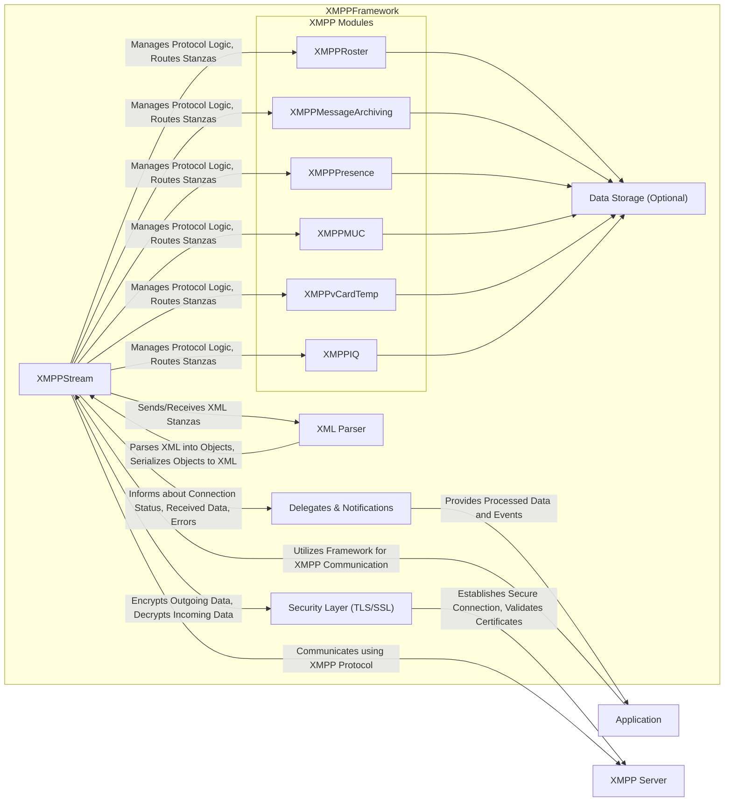
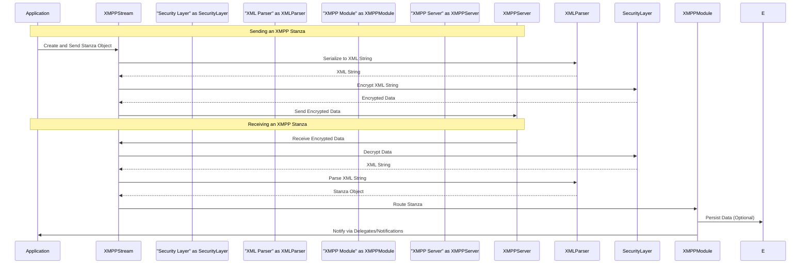

## Project Design Document: XMPPFramework (Improved)

**1. Introduction**

This document provides a detailed architectural design of the XMPPFramework, an Objective-C framework designed to facilitate the implementation of the Extensible Messaging and Presence Protocol (XMPP) in applications. This document is specifically crafted to serve as a foundation for subsequent threat modeling activities. It meticulously outlines the framework's key components, data flows, and inherent security considerations to enable a thorough assessment of potential vulnerabilities and attack vectors.

**1.1. Purpose**

The primary purpose of this document is to provide a comprehensive and granular understanding of the XMPPFramework's architecture. This detailed view is essential for effective threat modeling, allowing security analysts and developers to identify potential weaknesses, understand attack surfaces, and develop appropriate mitigation strategies. This document aims to be the definitive resource for understanding the framework's internal workings from a security perspective.

**1.2. Scope**

This document comprehensively covers the core architectural components and the intricate data flows within the XMPPFramework. It focuses specifically on the framework itself, its internal mechanisms, and its interactions with external entities such as XMPP servers and the applications that integrate it. The scope includes the framework's handling of network communication, data parsing, security protocols, and management of XMPP protocol elements. This document does not delve into the specific implementation details of individual applications built using the framework, but rather focuses on the framework as a reusable component.

**2. Overview**

The XMPPFramework is engineered to streamline the development of robust XMPP clients on Apple platforms, including iOS, macOS, watchOS, and tvOS. It offers a well-structured and modular implementation of the XMPP protocol, abstracting away the complexities of connection management, XML parsing, security negotiations, and the implementation of various XMPP Extensions (XEPs). By leveraging this framework, application developers can concentrate on crafting their application's unique user interface and core logic, relying on the XMPPFramework to handle the underlying intricacies of XMPP communication. The framework aims to be a reliable and secure foundation for building XMPP-enabled applications.

**3. Architectural Design**

The XMPPFramework adopts a layered architecture, promoting modularity, maintainability, and a clear separation of concerns. This design facilitates independent development and testing of individual components. Key components include:

*   **"XMPPStream"**: This is the central orchestrator of the framework, responsible for managing the entire lifecycle of the connection to the XMPP server. Its responsibilities include:
    *   Establishing and maintaining the underlying socket connection.
    *   Negotiating TLS/SSL for secure communication, including certificate validation.
    *   Handling XMPP stream negotiation and authentication procedures.
    *   Managing the sending and receiving of raw XML data.
    *   Dispatching received stanzas to the appropriate modules.
*   **"XML Parser"**: This component is responsible for processing incoming and outgoing XMPP stanzas, which are structured as XML documents. It handles:
    *   Parsing raw XML data received from the server into structured objects.
    *   Serializing XMPP stanza objects into XML strings for transmission.
    *   Protecting against malformed XML and potential XML injection vulnerabilities.
*   **"Security Layer (TLS/SSL)"**: This layer provides secure communication channels by implementing TLS/SSL protocols. Its key functions are:
    *   Encrypting outgoing data to protect confidentiality.
    *   Decrypting incoming data.
    *   Verifying the identity of the XMPP server through certificate validation.
    *   Negotiating secure connection parameters.
*   **"XMPP Modules"**: This is a collection of independent, specialized modules that implement specific aspects of the XMPP protocol and various XMPP Extensions (XEPs). Each module focuses on a particular area of functionality, such as:
    *   **"XMPPRoster"**: Manages the user's contact list (roster), including adding, removing, and updating contacts, and handling roster pushes from the server.
    *   **"XMPPMessageArchiving"**: Handles the storage and retrieval of sent and received messages, often with support for server-side archiving.
    *   **"XMPPPresence"**: Manages the user's online status (presence), including broadcasting availability and subscribing to the presence of other users.
    *   **"XMPPMUC"**: Facilitates Multi-User Chat (MUC) functionality, enabling users to participate in group conversations.
    *   **"XMPPvCardTemp"**: Manages user profile information (vCards), allowing users to share personal details.
    *   **"XMPPIQ"**: Handles Information/Query (IQ) stanzas, which are used for request-response interactions with the server and other entities.
*   **"Data Storage (Optional)"**: Some modules may utilize local storage mechanisms (e.g., Core Data, SQLite, file system) to persist data. This includes:
    *   Storing the user's roster.
    *   Caching message archives.
    *   Persisting user preferences or settings.
    *   Security considerations for data at rest are relevant here.
*   **"Delegates & Notifications"**: The framework employs delegates and notifications to communicate events and data changes to the integrating application. This allows the application to react to events such as:
    *   Receiving a new message.
    *   Changes in roster status.
    *   Connection status updates.
    *   Errors encountered during communication.

**4. Data Flow**

Understanding the flow of data through the XMPPFramework is crucial for identifying potential points of vulnerability. The following outlines the typical data flow for sending and receiving XMPP stanzas:

**4.1. Sending an XMPP Stanza:**

1. The **"Application"** initiates the sending process by creating an XMPP stanza object (e.g., `XMPPMessage`, `XMPPPresence`, `XMPPIQ`) representing the data to be sent.
2. The **"Application"** passes the stanza object to the **"XMPPStream"**.
3. **"XMPPStream"** utilizes the **"XML Parser"** to serialize the stanza object into a well-formed XML string.
4. The **"XMPPStream"** then passes the XML string to the **"Security Layer (TLS/SSL)"**.
5. The **"Security Layer"** encrypts the XML string using the established TLS/SSL connection to ensure confidentiality during transmission.
6. **"XMPPStream"** sends the encrypted XML data over the underlying socket connection to the **"XMPP Server"**.

**4.2. Receiving an XMPP Stanza:**

1. The **"XMPPStream"** receives raw data from the socket connection established with the **"XMPP Server"**.
2. The **"XMPPStream"** passes the received data to the **"Security Layer"**.
3. The **"Security Layer"** decrypts the data using the established TLS/SSL session, revealing the underlying XML string.
4. **"XMPPStream"** passes the decrypted XML string to the **"XML Parser"**.
5. The **"XML Parser"** parses the XML data, converting it back into an XMPP stanza object.
6. **"XMPPStream"** analyzes the stanza object and routes it to the appropriate **"XMPP Module"** based on the stanza's type and content (e.g., a message stanza is routed to the `XMPPMessageArchiving` module, a presence stanza to `XMPPPresence`, etc.).
7. The designated **"XMPP Module"** processes the received stanza, potentially updating its internal state, interacting with **"Data Storage"** (if applicable), and performing any necessary logic.
8. Finally, the **"XMPP Module"** notifies the **"Application"** about the received stanza and any relevant data changes through **"Delegates & Notifications"**.

**5. Security Considerations**

Security is a paramount concern in the design of the XMPPFramework. Several key aspects are crucial for maintaining the confidentiality, integrity, and availability of communication:

*   **Transport Layer Security (TLS/SSL) Vulnerabilities**:
    *   **Threat:** Man-in-the-middle attacks, eavesdropping.
    *   **Consideration:** The framework's reliance on TLS/SSL necessitates robust implementation, including proper certificate validation (avoiding insecure trust policies), support for strong cipher suites, and protection against downgrade attacks. Vulnerabilities in the underlying TLS/SSL libraries could also impact the framework.
*   **Authentication and Authorization Weaknesses**:
    *   **Threat:** Unauthorized access to user accounts, impersonation.
    *   **Consideration:** The framework supports various XMPP authentication mechanisms. Secure storage of user credentials within the application using platform-provided mechanisms (like Keychain) is critical. The framework's implementation of authentication protocols must be robust against brute-force attacks and other credential compromise techniques. Proper authorization checks on the server-side are also essential.
*   **XML Parsing Vulnerabilities**:
    *   **Threat:** Denial of service, information disclosure, remote code execution (less likely but possible depending on the parser).
    *   **Consideration:** The framework's XML parser must be resilient against malformed XML data, XML bombs, and XML injection attacks. Regular updates to the XML parsing library are necessary to patch known vulnerabilities. Input validation before parsing can also mitigate risks.
*   **Data Validation and Input Sanitization Issues**:
    *   **Threat:** Cross-site scripting (XSS) in chat applications, injection attacks if data is used in other contexts.
    *   **Consideration:** The framework should implement validation of incoming data, such as JIDs and message bodies, to prevent injection attacks. Applications using the framework must also sanitize data before displaying it to users to prevent XSS vulnerabilities.
*   **Resource Exhaustion Attacks**:
    *   **Threat:** Denial of service.
    *   **Consideration:** The framework needs to be designed to handle a large volume of incoming data and connections without exhausting resources. Rate limiting and proper resource management are important considerations.
*   **Privacy of User Data**:
    *   **Threat:** Unauthorized access to personal information.
    *   **Consideration:** When storing data locally (e.g., message archives, roster), the framework and the application using it must employ secure storage mechanisms and adhere to privacy best practices. Encryption of local data at rest should be considered.
*   **Security of XMPP Extensions (XEPs)**:
    *   **Threat:** Vulnerabilities introduced by specific extensions.
    *   **Consideration:** The security implications of each implemented XMPP Extension (XEP) need to be carefully evaluated. Some extensions might introduce new attack vectors if not implemented securely. The framework should ideally allow applications to selectively enable or disable extensions.
*   **Dependency Management and Third-Party Libraries**:
    *   **Threat:** Vulnerabilities in external libraries used by the framework.
    *   **Consideration:** The security of any third-party libraries or dependencies used by the framework needs to be continuously monitored. Regular updates to these dependencies are crucial to address known vulnerabilities.

**6. Deployment Considerations**

The security of applications utilizing the XMPPFramework is also influenced by deployment choices:

*   **Secure Key Storage**: Applications must utilize secure storage mechanisms provided by the operating system (e.g., Keychain on Apple platforms) for sensitive information like user passwords, API keys, and private keys used for end-to-end encryption.
*   **App Transport Security (ATS)**: On Apple platforms, enabling and properly configuring ATS is crucial to enforce secure network connections and prevent accidental use of insecure protocols.
*   **Code Signing**: Proper code signing ensures the integrity and authenticity of the application, preventing tampering and ensuring users are running the intended version.
*   **Sandboxing**: Utilizing the operating system's sandboxing mechanisms helps isolate the application and limit the potential damage from security breaches by restricting access to system resources.
*   **Regular Updates**: Keeping the application and the underlying operating system up-to-date is essential to patch security vulnerabilities.

**7. Future Considerations**

*   **Integration of End-to-End Encryption**: Explore and implement support for modern end-to-end encryption protocols like OMEMO or OpenPGP to provide stronger confidentiality guarantees for message content.
*   **Regular Security Audits and Penetration Testing**: Conduct periodic security assessments by independent experts to identify potential vulnerabilities and weaknesses in the framework's design and implementation.
*   **Automated Security Testing**: Implement automated security testing practices, including static and dynamic analysis, to continuously assess the framework's security posture.
*   **Improved Error Handling and Security Logging**: Enhance error handling and logging mechanisms to provide more detailed information for debugging and security incident analysis, while ensuring sensitive information is not inadvertently logged.
*   **Content Security Policy (CSP) for Web-Based XMPP Clients**: If the framework is used in conjunction with web-based clients, consider implementing Content Security Policy to mitigate XSS attacks.

This document provides a comprehensive architectural overview of the XMPPFramework, specifically tailored for threat modeling. It serves as a starting point for a more in-depth security analysis to identify and mitigate potential risks.