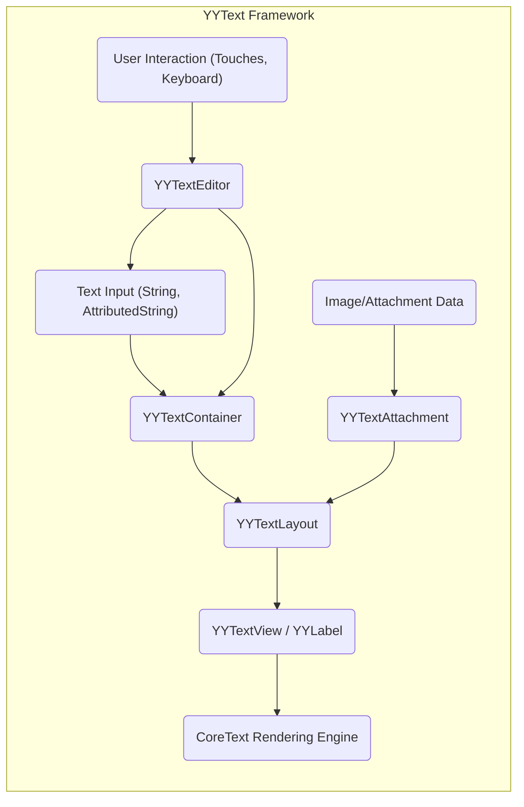
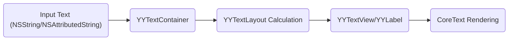
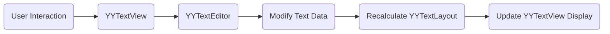
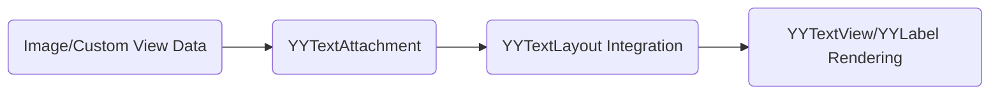

# Project Design Document: YYText - iOS Text Framework

**Version:** 1.1
**Date:** October 26, 2023
**Author:** AI Software Architect

## 1. Introduction

This document provides an enhanced design overview of the YYText iOS framework. Its primary purpose is to clearly describe the architecture, key components, and data flow within the framework to facilitate effective threat modeling. This document serves as a foundational resource for security analysis and development efforts related to YYText.

## 2. Project Overview

YYText is a robust and versatile text framework for iOS, extending the capabilities of standard UIKit text components. It offers advanced features for rendering and editing rich text, including sophisticated styling, layout management, and support for interactive elements.

*   **Project Repository:** [https://github.com/ibireme/YYText](https://github.com/ibireme/YYText)
*   **Primary Goal:** To deliver a high-performance, adaptable, and feature-rich solution for text rendering and editing within iOS applications.

## 3. Goals and Objectives of this Document

*   To provide a precise and thorough understanding of YYText's architectural design and its constituent components.
*   To clearly delineate the critical data flows and interactions that occur within the framework.
*   To establish a robust foundation for conducting comprehensive and targeted threat modeling activities.
*   To serve as a valuable reference for developers integrating YYText and security analysts evaluating its security posture.

## 4. Target Audience

*   Security engineers and analysts responsible for performing threat modeling and security assessments.
*   Software developers who are integrating and utilizing the YYText framework in their iOS applications.
*   Software architects seeking a detailed understanding of the framework's internal design and operation.

## 5. Scope

This document encompasses the essential architectural components and data flow pathways within the YYText framework. The focus is on aspects directly relevant to identifying potential security vulnerabilities. The following areas are within the scope:

*   The complete text rendering pipeline, from input to display.
*   Mechanisms for text layout and management of text containers.
*   Handling of embedded images and other attachments within the text.
*   Functionalities related to text editing and manipulation.
*   Key data structures employed for representing and managing text content.

The following areas are explicitly excluded from the scope of this document:

*   Detailed implementation specifics of individual methods and functions.
*   In-depth analysis of performance optimization techniques implemented within the framework.
*   Granular examination of external dependencies beyond their general function (though significant dependencies will be noted).

## 6. High-Level Architecture

**Description of Components:**

*   **Text Input (String, AttributedString):** Represents the initial text data to be processed. This can be a standard `NSString` for plain text or an `NSAttributedString` to include styling and formatting information.
*   **YYTextContainer:** Defines the geometric boundaries and layout constraints for the text area. Properties include size, padding, and exclusion paths for wrapping text around other elements.
*   **YYTextLayout:** The central component responsible for calculating the precise layout of the text within the provided `YYTextContainer`. This involves complex operations like line breaking, glyph positioning, and the integration of embedded attachments.
*   **YYTextView / YYLabel:** These are the view classes responsible for visually presenting the laid-out text. `YYTextView` extends `UIView` and provides interactive editing capabilities, while `YYLabel` is a subclass of `UIView` optimized for static text display.
*   **CoreText Rendering Engine:** The underlying text rendering framework provided by iOS, which YYText leverages for the actual drawing of text glyphs and handling complex text features.
*   **Image/Attachment Data:** Represents external resources, such as images or custom `UIView` instances, that are intended to be embedded within the text content.
*   **YYTextAttachment:**  Manages the data and properties associated with embedded attachments, including their size, alignment, and the actual data or view to be displayed.
*   **User Interaction (Touches, Keyboard):** Represents user-initiated events, such as touch gestures and keyboard input, that drive interaction with the text view, particularly during editing.
*   **YYTextEditor:**  Handles the logic for text editing operations within a `YYTextView`. This includes processing user input to insert, delete, and modify text, as well as managing text selection and cursor positioning.

## 7. Key Components and Data Flow

### 7.1. Text Rendering Pipeline

1. **Input Acquisition:** The process begins with the provision of text data, either as a simple `NSString` or a styled `NSAttributedString`.
2. **Container Association:** The input text and its associated attributes are linked to a `YYTextContainer`, which specifies the region where the text will be rendered and its layout constraints.
3. **Layout Computation:** The `YYTextLayout` object takes the text content and the `YYTextContainer` as input. It performs intricate calculations to determine the optimal arrangement of the text within the container, considering factors such as line breaking rules, word wrapping, and the placement and sizing of any embedded attachments.
4. **Visual Presentation:** The `YYTextView` or `YYLabel` utilizes the pre-calculated layout information from the `YYTextLayout` object to draw the text onto the screen using the CoreText rendering engine. This involves drawing individual glyphs for each character and managing the rendering of any included attachments at their designated locations within the text flow.

### 7.2. Text Editing

1. **User Input Capture:** User interactions, such as touch events and keyboard input, are detected and captured by the `YYTextView`.
2. **Editor Processing:** The `YYTextEditor` component takes over to manage the editing process. It interprets the user's input actions and translates them into modifications of the underlying text data.
3. **Layout Recomputation:** Following any changes to the text content, the `YYTextLayout` must be recalculated to accurately reflect the modifications and ensure the text is still laid out correctly within the container.
4. **Display Refresh:** The `YYTextView` is then redrawn to present the updated text layout to the user.

### 7.3. Image and Attachment Handling

1. **Attachment Definition:** Images or custom view instances intended for embedding within the text are represented by `YYTextAttachment` objects. These objects encapsulate the attachment's data and properties.
2. **Layout Integration:** During the text layout calculation phase, the `YYTextLayout` component takes into account the presence of attachments, reserving space for them and determining their correct positioning within the text flow based on their properties.
3. **Visual Rendering:** The `YYTextView` or `YYLabel` is responsible for rendering the attachments at their designated locations within the displayed text. This involves drawing the image or embedding the custom view.

### 7.4. Data Structures

*   **`NSAttributedString`:** The fundamental data structure for representing rich text. It stores the textual content along with associated attributes that define the text's appearance (e.g., font, color, style).
*   **`YYTextContainer`:** An object that defines the geometric constraints and layout properties of the area where text will be rendered.
*   **`YYTextLayout`:** A complex object that holds the results of the text layout calculations. This includes detailed information about each line of text, the position of glyphs, and the placement of attachments.
*   **`YYTextLine`:** Represents a single line of text within the overall layout, containing information about the characters and their positioning on that line.
*   **`YYGlyphInfo`:** Contains specific details about individual glyphs (rendered characters) within the text.
*   **`YYTextAttachment`:** An object that encapsulates the data and properties of an embedded attachment, such as an image or a custom view.

## 8. Security Considerations (Pre-Threat Modeling)

Based on the framework's architecture and functionalities, several potential security considerations warrant further investigation during threat modeling:

*   **Malicious Attributed Strings:**  Improper parsing or handling of specially crafted attributed strings could lead to unexpected behavior, crashes, or even potential code execution. This includes scenarios involving excessively long strings, unusual or malformed attribute dictionaries, or attempts to exploit vulnerabilities in the underlying CoreText rendering engine.
*   **Resource Exhaustion through Complex Layouts:** Processing extremely large text documents or layouts with a high degree of complexity (e.g., numerous embedded attachments, intricate styling) could potentially consume excessive memory or CPU resources, leading to denial-of-service conditions on the client device.
*   **Memory Safety Issues:** Given that YYText is implemented in Objective-C and interacts with C-based APIs like CoreText, there is a potential for memory management errors such as memory leaks, dangling pointers, or buffer overflows if memory is not managed correctly. This is particularly relevant in areas involving manual memory management or interactions with lower-level APIs.
*   **Vulnerabilities in Attachment Handling:** If attachments (images or custom views) are loaded from untrusted or external sources (e.g., via network requests), there is a risk of vulnerabilities related to processing malicious image formats (e.g., image parsing vulnerabilities) or the execution of unintended code within custom view attachments if they are not properly sandboxed.
*   **Regular Expression Denial of Service (ReDoS):** If YYText utilizes regular expressions for text processing, searching, or validation (though not explicitly detailed in the high-level architecture, it's a common practice), there is a potential risk of ReDoS attacks if poorly constructed regular expressions are used, allowing an attacker to cause excessive CPU consumption by providing specially crafted input strings.
*   **Text Injection Vulnerabilities:** If user-provided text or attachment descriptions are directly incorporated into the rendering process without proper sanitization or encoding, it could potentially lead to unexpected behavior or even cross-site scripting (XSS)-like vulnerabilities if the rendered content is displayed in a web view or similar context.
*   **Integer Overflow/Underflow in Layout Calculations:** Complex calculations related to text layout, especially when dealing with extremely large text or unusual container configurations, could potentially lead to integer overflow or underflow conditions if not handled with appropriate bounds checking and validation.

## 9. Assumptions and Constraints

*   It is assumed that the underlying iOS operating system and its core frameworks, such as CoreText and UIKit, are inherently secure and functioning as intended.
*   This document provides a logical architectural overview and does not delve into the implementation details of every single class or method within the YYText framework.
*   The analysis is based on the understanding of the general principles of the YYText framework and may not reflect the specifics of every possible configuration or customization.
*   The assessment assumes the use of a reasonably current and stable version of the YYText framework.

## 10. Future Considerations

*   Developing more detailed sequence diagrams to illustrate the interactions between specific classes during key operations like text rendering and editing would provide a deeper understanding.
*   Conducting a thorough review of the memory management practices within YYText, including the use of ARC (Automatic Reference Counting) and manual memory management, would be beneficial for identifying potential memory safety issues.
*   Performing a detailed analysis of any external dependencies utilized by YYText, including their versions and known vulnerabilities, is crucial for a comprehensive security assessment.
*   Investigating the framework's handling of different text encodings and its resilience to malformed or unexpected encoding formats would be a valuable area of future analysis.

This improved document offers a more detailed and refined understanding of the YYText framework's design, providing a stronger foundation for conducting thorough and effective threat modeling activities. The identified components, data flows, and preliminary security considerations serve as key starting points for identifying and mitigating potential vulnerabilities within the framework.