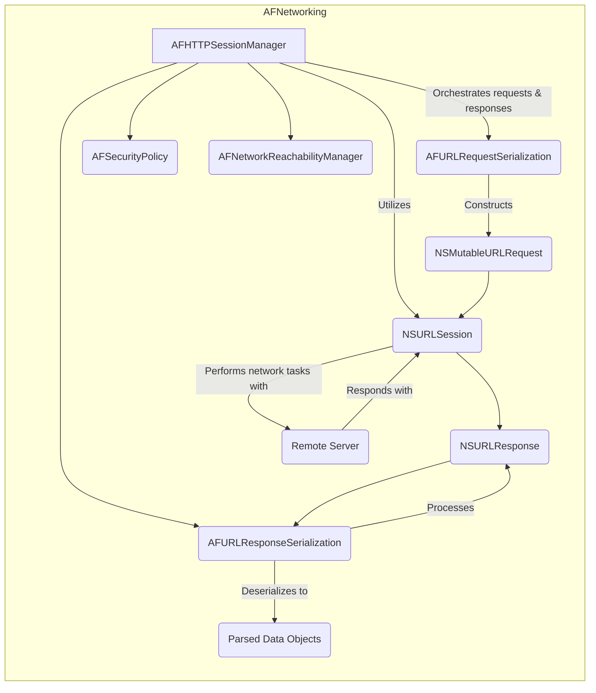
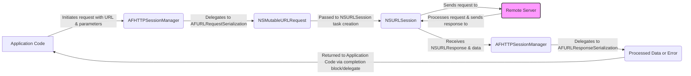

## Project Design Document: AFNetworking (Improved)

**1. Introduction**

This document provides an enhanced design overview of AFNetworking, a widely adopted networking library for Apple's operating systems (iOS, macOS, watchOS, tvOS). The primary objective is to furnish a clear and detailed understanding of AFNetworking's architecture, components, and data flow, specifically for the purpose of effective threat modeling. This document meticulously outlines the library's core functionalities and interactions, highlighting potential areas of interest for security analysis and risk assessment.

**2. Goals and Objectives**

AFNetworking aims to achieve the following key objectives:

* **Abstraction and Simplification:** To abstract away the complexities of low-level networking APIs, providing developers with a more intuitive and easier-to-use interface.
* **Robustness and Reliability:** To offer a dependable and stable foundation for network communication within applications.
* **High-Level API over `NSURLSession`:** To build upon the robust foundation of Apple's `NSURLSession` framework, providing a higher level of abstraction and convenience.
* **Comprehensive Data Handling:** To facilitate the seamless handling of various data formats commonly encountered in network communication, including JSON, XML, and property lists.
* **Secure Communication:** To offer built-in mechanisms for establishing secure connections using HTTPS and implementing advanced security measures like certificate pinning.
* **Asynchronous Operations:** To enable non-blocking network operations through the use of completion blocks and delegate patterns, ensuring a responsive user experience.
* **Network Awareness:** To provide tools for monitoring network reachability and notifying applications of changes in network connectivity.

**3. High-Level Architecture**

AFNetworking's architecture is centered around the `AFHTTPSessionManager`, which orchestrates network operations. It leverages various specialized components to handle different aspects of the networking process.

**4. Detailed Design**

This section provides a detailed breakdown of AFNetworking's core components and their responsibilities:

* **AFHTTPSessionManager:**
    * The central coordinating class responsible for managing network sessions and executing requests.
    * Internally manages an instance of `NSURLSession` for performing the actual network communication.
    * Provides methods for initiating various types of HTTP requests (GET, POST, PUT, DELETE, PATCH, etc.).
    * Delegates the creation of `NSURLRequest` objects to `AFURLRequestSerialization`.
    * Delegates the processing of server responses to `AFURLResponseSerialization`.
    * Enforces security policies defined by `AFSecurityPolicy`.
    * Utilizes `AFNetworkReachabilityManager` to monitor network connectivity.
    * Supports file uploads and downloads.
    * Delivers results asynchronously via completion blocks and delegate methods.

* **AFURLRequestSerialization:**
    * Responsible for serializing request parameters into a format suitable for transmission over HTTP.
    * Supports various request body formats, including `application/x-www-form-urlencoded`, `application/json`, and `multipart/form-data`.
    * Handles URL encoding of parameters.
    * Creates and configures `NSMutableURLRequest` objects with appropriate HTTP methods, headers, and body data.

* **AFURLResponseSerialization:**
    * Responsible for processing the raw data received from the server's response.
    * Deserializes the response data into usable objects based on the `Content-Type` header.
    * Supports common response formats such as JSON, XML, property lists, and image data.
    * Provides error handling for cases where the response data is invalid or cannot be deserialized.

* **AFSecurityPolicy:**
    * Enforces security policies for server trust evaluation during secure (HTTPS) connections.
    * Offers different levels of trust validation, allowing for customization based on security requirements.
    * Supports certificate pinning, enabling the validation of specific server certificates or public keys to prevent man-in-the-middle attacks.
    * Allows for disabling default security checks (use with extreme caution).

* **AFNetworkReachabilityManager:**
    * Monitors the device's network reachability status.
    * Provides notifications when the network connection status changes (e.g., from connected to disconnected, or between Wi-Fi and cellular).
    * Allows applications to adapt their behavior based on the availability of a network connection.

* **NSURLSession:**
    * Apple's fundamental framework for performing network requests.
    * Provides a comprehensive and flexible API for handling various networking tasks.
    * AFNetworking leverages `NSURLSession` for the underlying network communication.

* **NSMutableURLRequest:**
    * Represents a mutable request to be sent to a server.
    * Contains all the necessary information for a network request, including the URL, HTTP method, headers, and request body.

* **NSURLResponse:**
    * Represents the server's response to a network request.
    * Contains information about the response, such as the HTTP status code, headers, and the expected data length.

**5. Data Flow (Detailed)**

The following outlines the detailed steps involved in a typical network request initiated using AFNetworking:

Detailed Steps:

* **Request Initiation:** The application code initiates a network request by calling a specific method on an `AFHTTPSessionManager` instance, providing the target URL and any necessary parameters.
* **Request Serialization:** `AFHTTPSessionManager` utilizes its `requestSerializer` (an instance of `AFURLRequestSerialization`) to construct an `NSMutableURLRequest` object. This involves:
    * Setting the appropriate HTTP method (GET, POST, etc.).
    * Encoding the provided parameters into the request body or URL query string, based on the configured content type.
    * Adding any necessary HTTP headers.
* **Task Creation:** The `NSMutableURLRequest` is then passed to the underlying `NSURLSession` to create a data task, upload task, or download task, depending on the nature of the request.
* **Request Transmission:** The `NSURLSession` sends the request to the specified remote server.
* **Server Processing:** The remote server receives the request, processes it, and generates an HTTP response.
* **Response Reception:** The `NSURLSession` receives the server's response, including the `NSURLResponse` object (containing status codes and headers) and the raw response data.
* **Response Handling:** The `NSURLSession` passes the `NSURLResponse` and the response data back to the `AFHTTPSessionManager`.
* **Response Deserialization:** `AFHTTPSessionManager` utilizes its `responseSerializer` (an instance of `AFURLResponseSerialization`) to process the raw response data. This involves:
    * Inspecting the `Content-Type` header of the response.
    * Deserializing the data into a corresponding object (e.g., `NSDictionary` for JSON, `XMLDocument` for XML).
    * Handling potential errors during deserialization.
* **Completion Handling:** The processed data (or an error object if deserialization failed or a network error occurred) is then passed back to the application code through the completion block or delegate method that was provided when the request was initiated.

**6. Security Considerations (Enhanced for Threat Modeling)**

The following security considerations are crucial for threat modeling applications using AFNetworking:

* **Transport Layer Security (TLS/SSL):**
    * **Enforcement:** Is HTTPS enforced for all sensitive data transmission? Are there any exceptions, and are they justified?
    * **Server Trust Evaluation:** How is server trust validated? Are the default settings sufficient, or is custom validation required?
    * **Certificate Pinning:** Is certificate pinning implemented to prevent man-in-the-middle attacks? Are both certificate and public key pinning considered? Is the pinning configuration robust and up-to-date?
    * **TLS Version Negotiation:** What TLS versions are supported and preferred? Are older, potentially vulnerable versions disabled?
    * **Cipher Suite Selection:** Are strong and secure cipher suites configured and prioritized?

* **Data Serialization and Deserialization Vulnerabilities:**
    * **Format-Specific Attacks:** Are there potential vulnerabilities associated with the supported data formats (e.g., JSON injection, XML External Entity (XXE) attacks, insecure deserialization in Plists)?
    * **Error Handling:** How are deserialization errors handled? Could malformed data lead to crashes, exceptions, or unexpected behavior that could be exploited?
    * **Input Sanitization:** While AFNetworking handles deserialization, is the application performing adequate input sanitization before sending data and after receiving it?

* **Input Validation on the Client-Side:**
    * **Request Parameter Validation:** Are request parameters validated on the client-side before being sent to the server? This can prevent sending malformed or malicious data.
    * **Header Injection:** Are there any mechanisms to prevent injection of malicious data into HTTP headers?

* **Error Handling and Information Disclosure:**
    * **Error Message Sensitivity:** Are error messages returned by the server or handled by AFNetworking overly verbose, potentially revealing sensitive information about the application's internal workings or the server-side infrastructure?
    * **Logging Practices:** Are sensitive data or error details logged in a way that could be accessible to unauthorized parties?

* **Dependency Management and Vulnerability Scanning:**
    * **AFNetworking Vulnerabilities:** Is the application using the latest stable version of AFNetworking with known security vulnerabilities patched?
    * **Third-Party Dependencies:** Are there any transitive dependencies with known vulnerabilities? Regular dependency scanning is essential.

* **Cookie and Session Management:**
    * **Secure and HTTPOnly Flags:** Are cookies marked with the `Secure` and `HTTPOnly` flags where appropriate to mitigate certain attack vectors?
    * **Session Fixation/Hijacking:** Are there measures in place to prevent session fixation or hijacking vulnerabilities?
    * **Cookie Storage:** How are cookies stored on the device, and are there any security implications?

* **Request and Response Tampering:**
    * **Integrity Checks:** Are there mechanisms in place (beyond HTTPS) to ensure the integrity of requests and responses, especially when dealing with sensitive data?

* **Network Reachability Exploitation:**
    * **Denial of Service:** Could manipulating network reachability status lead to a denial-of-service-like condition within the application?

**7. Deployment Considerations**

AFNetworking is typically integrated into Apple platform applications using dependency management tools such as:

* **CocoaPods:** A dependency manager for Swift and Objective-C Cocoa projects.
* **Carthage:** A decentralized dependency manager for Cocoa.
* **Swift Package Manager:** Apple's built-in dependency manager for Swift projects.

The library is linked directly into the application's binary during the build process. Consider the security implications of the chosen dependency management method and ensure the integrity of the downloaded library.

**8. Future Considerations**

Potential future enhancements and considerations for AFNetworking include:

* **Adoption of Modern Networking APIs:** Exploring the integration with or migration towards more recent Apple networking APIs like `URLSession`'s newer features or potential future replacements.
* **Enhanced Security Defaults:**  Strengthening default security configurations and providing clearer guidance on secure configuration options.
* **Improved Logging and Debugging Tools:**  Offering more robust logging and debugging capabilities for diagnosing network issues and security vulnerabilities.
* **Performance Optimizations:**  Continuously evaluating and implementing performance improvements for network operations.
* **Support for Emerging Protocols:**  Considering support for new and emerging network protocols as they become relevant.

This improved design document provides a more comprehensive and detailed understanding of AFNetworking's architecture and security considerations, making it a valuable resource for threat modeling and security analysis. By carefully considering these aspects, developers can build more secure and resilient applications.