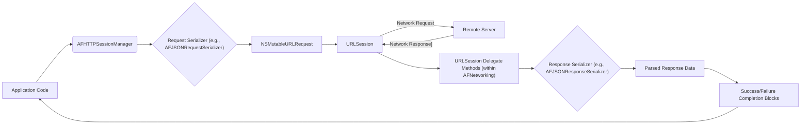

# Project Design Document: AFNetworking (Improved)

**1. Introduction**

This document provides an enhanced architectural design of the AFNetworking library, an open-source networking framework for Apple platforms (iOS, macOS, watchOS, and tvOS). The primary goal is to offer a clear and detailed understanding of the library's structure, component interactions, and data flow, specifically tailored for effective threat modeling. This document will serve as a crucial input for identifying potential security vulnerabilities and assessing associated risks.

**2. Goals and Objectives**

*   Provide a precise and easily understandable description of the AFNetworking library's architecture and its constituent parts.
*   Clearly illustrate the journey of data during typical network operations initiated by the library.
*   Pinpoint critical interfaces and communication pathways between different components within AFNetworking.
*   Offer sufficient technical detail to facilitate comprehensive threat identification and subsequent risk evaluation.
*   Act as a definitive reference for security audits, vulnerability assessments, and future development planning with security in mind.

**3. System Architecture**

AFNetworking employs a layered architecture, abstracting the complexities of network communication provided by Apple's Foundation framework. This design simplifies common networking tasks for developers while offering a structured approach to managing network operations.

*   **Application Integration Layer:** This is where the application code directly interacts with AFNetworking to initiate and manage network requests and process responses.
*   **AFNetworking Core Layer:** This layer encompasses the primary classes and modules of the library. It manages network sessions, constructs and processes requests and responses, handles security aspects, and performs data serialization/deserialization.
*   **Foundation Framework Abstraction Layer:** AFNetworking leverages and builds upon Apple's Foundation framework, particularly classes within `URLSession`, `URLRequest`, and `URLResponse` for the fundamental network communication mechanisms.
*   **Operating System Networking Subsystem:** The Foundation framework interacts with the underlying operating system's networking stack to establish connections, transmit data, and manage network protocols.

**4. Data Flow (Detailed)**

The following diagram illustrates the detailed data flow for a typical network request initiated using AFNetworking. Node names are enclosed in quotes for Mermaid syntax compliance.

**Step-by-Step Data Flow Description:**

*   **"Application Code"** initiates a network operation by calling a method on an instance of **"AFHTTPSessionManager"** (or a similar manager class).
*   The **"AFHTTPSessionManager"** utilizes a **"Request Serializer (e.g., AFJSONRequestSerializer)"** to transform the provided request parameters into a suitable format for network transmission (e.g., JSON, URL-encoded form data).
*   The **"Request Serializer (e.g., AFJSONRequestSerializer)"** generates an **"NSMutableURLRequest"** object, encapsulating the request details (URL, headers, body, etc.).
*   The **"NSMutableURLRequest"** is passed to an **"URLSession"** object (managed internally by `AFHTTPSessionManager`) to initiate the network request.
*   The **"URLSession"** interacts with the operating system's networking subsystem to transmit the **"Network Request"** to the **"Remote Server"**.
*   The **"Remote Server"** processes the request and generates a **"Network Response"**.
*   The **"URLSession"** receives the **"Network Response"**.
*   **"URLSession Delegate Methods (within AFNetworking)"** are invoked to handle various stages of the response lifecycle (e.g., receiving headers, data).
*   A **"Response Serializer (e.g., AFJSONResponseSerializer)"** is used to parse the raw response data into a more usable format (e.g., JSON objects, images, strings).
*   The **"Response Serializer (e.g., AFJSONResponseSerializer)"** produces **"Parsed Response Data"**.
*   Finally, the appropriate **"Success/Failure Completion Blocks"** (defined by the application code) are executed, providing the **"Parsed Response Data"** or an error indication back to the **"Application Code"**.

**5. Key Components (Categorized)**

This section details the significant classes and components within the AFNetworking library, grouped by their primary function:

*   **Core Networking Management:**
    *   `AFURLSessionManager`: The foundational class responsible for managing `URLSession` instances and handling the lifecycle of network tasks.
    *   `AFHTTPSessionManager`: A specialized subclass of `AFURLSessionManager`, providing convenient methods and default configurations for making standard HTTP requests.
    *   `AFSecurityPolicy`:  Enforces security measures by managing server trust evaluation, including certificate pinning.
    *   `AFNetworkReachabilityManager`: Monitors the device's network connectivity status and provides notifications of changes.
*   **Request Construction and Serialization:**
    *   `AFHTTPRequestSerializer`:  Serializes request parameters into standard HTTP formats (e.g., query string parameters, form data).
    *   `AFJSONRequestSerializer`: Serializes request parameters into JSON format for the request body.
    *   `AFPropertyListRequestSerializer`: Serializes request parameters into a property list format.
*   **Response Handling and Deserialization:**
    *   `AFHTTPResponseSerializer`: Provides basic HTTP response handling, including status code validation.
    *   `AFJSONResponseSerializer`: Deserializes JSON-formatted response data into Foundation objects (e.g., `NSDictionary`, `NSArray`).
    *   `AFImageResponseSerializer`: Deserializes image data into `UIImage` (iOS) or `NSImage` (macOS) objects.
    *   `AFPropertyListResponseSerializer`: Deserializes response data in property list format.
    *   `AFXMLParserResponseSerializer`: Deserializes XML response data using `NSXMLParser`.
    *   `AFCompoundResponseSerializer`: Allows combining multiple response serializers to handle different content types.
*   **Security and Trust Evaluation:**
    *   `AFSecurityPolicy`:  Central component for implementing server trust evaluation, including techniques like certificate pinning and domain validation.
*   **Task Management (Built upon `URLSession`):**
    *   `NSURLSessionDataTask`: Represents a task that retrieves data from a specified URL.
    *   `NSURLSessionUploadTask`: Represents a task that uploads data to a specified URL.
    *   `NSURLSessionDownloadTask`: Represents a task that downloads a file from a specified URL.
*   **Platform-Specific Extensions:**
    *   `UIImageView+AFNetworking` (iOS): Provides asynchronous image loading capabilities for `UIImageView` instances.
    *   `NSImageView+AFNetworking` (macOS): Provides asynchronous image loading capabilities for `NSImageView` instances.

**6. Security Considerations for Threat Modeling**

This section highlights potential security considerations relevant for threat modeling, focusing on areas where vulnerabilities might arise:

*   **Transport Layer Security (TLS) Misconfiguration:**
    *   **Threat:** Weak TLS configuration or failure to enforce HTTPS can lead to man-in-the-middle attacks, allowing eavesdropping and data manipulation.
    *   **Component:** `AFSecurityPolicy`, `URLSession`.
    *   **Mitigation:** Ensure `AFSecurityPolicy` is configured to enforce strong TLS versions and cipher suites.
*   **Insufficient Certificate Pinning:**
    *   **Threat:** Lack of or improper certificate pinning can make the application vulnerable to attacks involving compromised Certificate Authorities.
    *   **Component:** `AFSecurityPolicy`.
    *   **Mitigation:** Implement robust certificate pinning using `AFSecurityPolicy`, carefully managing the pinned certificates.
*   **Input Validation Failures (Server Responses):**
    *   **Threat:**  The application might be vulnerable to attacks if it doesn't properly validate data received from the server, potentially leading to crashes, unexpected behavior, or even remote code execution in some scenarios (though less likely directly within AFNetworking).
    *   **Component:** Application code interacting with deserialized data.
    *   **Mitigation:** Implement thorough input validation on all data received from the server after deserialization by AFNetworking.
*   **Vulnerabilities in Data Serialization/Deserialization:**
    *   **Threat:**  Using vulnerable or misconfigured serializers could expose the application to attacks if the server sends malicious data designed to exploit weaknesses in the serialization process.
    *   **Component:** `AFHTTPRequestSerializer`, `AFJSONRequestSerializer`, `AFHTTPResponseSerializer`, `AFJSONResponseSerializer`, etc.
    *   **Mitigation:** Use well-vetted serializers and be aware of potential vulnerabilities in specific serialization formats. Avoid deserializing data from untrusted sources without careful scrutiny.
*   **Insecure Credential Management:**
    *   **Threat:** If the application uses AFNetworking to handle authentication, insecure storage or transmission of credentials can lead to unauthorized access.
    *   **Component:** Application code using AFNetworking for authentication.
    *   **Mitigation:** Employ secure storage mechanisms (e.g., Keychain) and ensure credentials are only transmitted over HTTPS. AFNetworking itself doesn't handle credential storage.
*   **Dependency Vulnerabilities:**
    *   **Threat:**  Using outdated versions of AFNetworking or its dependencies can expose the application to known security vulnerabilities.
    *   **Component:** The entire AFNetworking library.
    *   **Mitigation:** Regularly update AFNetworking to the latest stable version and monitor for security advisories.
*   **Exposure of Sensitive Information via Network Requests:**
    *   **Threat:**  Accidentally including sensitive data in request URLs or headers can lead to information leakage.
    *   **Component:** Application code constructing requests using AFNetworking.
    *   **Mitigation:** Carefully review all network requests to ensure no sensitive information is unnecessarily included in URLs or headers. Use appropriate HTTP methods and request bodies for sensitive data.
*   **Improper Handling of Network Reachability:**
    *   **Threat:** While not a direct vulnerability in AFNetworking, incorrect handling of network reachability status could lead to denial-of-service or unexpected application behavior if not implemented carefully.
    *   **Component:** Application code using `AFNetworkReachabilityManager`.
    *   **Mitigation:** Implement robust logic for handling network connectivity changes and avoid making security-sensitive decisions solely based on reachability status.

**7. Deployment Considerations**

AFNetworking is typically integrated into Apple platform applications using dependency management tools such as:

*   **CocoaPods:** A widely used dependency manager for Objective-C and Swift projects.
*   **Carthage:** A decentralized dependency manager for macOS and iOS.
*   **Swift Package Manager (SPM):** Apple's native dependency manager for Swift projects.

Alternatively, the source code can be manually included in the project. Care should be taken to ensure the integrity of the library during the integration process.

**8. Future Considerations**

*   **Adoption of Swift Concurrency:**  Exploring and potentially adopting Swift's modern concurrency features (async/await) for improved asynchronous operation management.
*   **Further Modularity and Abstraction:**  Potentially breaking down the library into smaller, more focused modules to enhance maintainability and reduce the attack surface.
*   **Continued Security Audits and Updates:**  Regularly conducting security audits and promptly addressing any identified vulnerabilities to maintain a secure and reliable networking framework.

This improved design document provides a more detailed and security-focused overview of the AFNetworking library's architecture and components. This information is intended to be a valuable resource for security professionals and developers involved in threat modeling and securing applications that utilize AFNetworking.