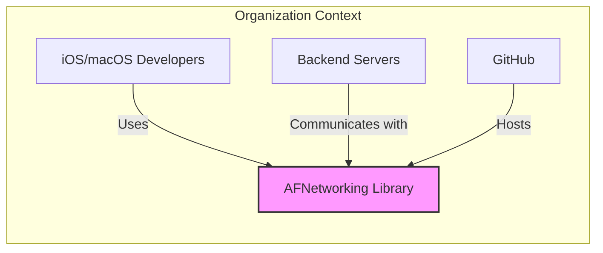
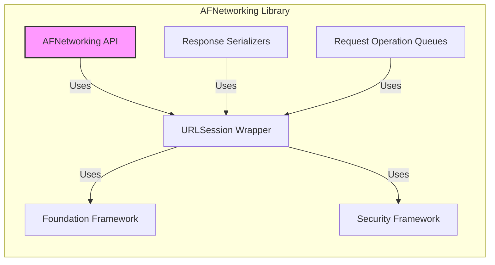
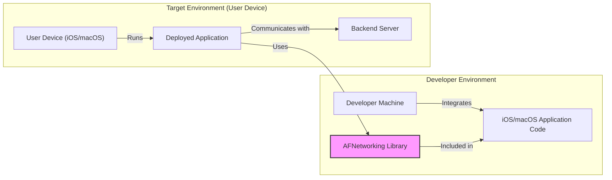
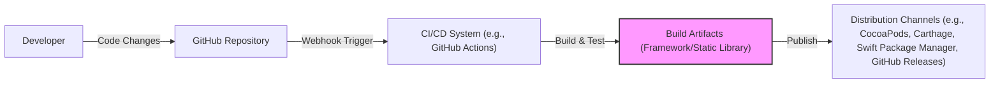

# BUSINESS POSTURE

This project, AFNetworking, is a foundational networking library for iOS, macOS, watchOS, and tvOS. Its primary business goal is to provide a robust, reliable, and easy-to-use networking solution for Apple platform developers. By simplifying complex networking tasks, AFNetworking aims to increase developer productivity and reduce the time and effort required to build network-enabled applications.

The key business priorities are:
- Maintainability: Ensuring the library is easy to update, debug, and extend to meet evolving networking needs and platform changes.
- Reliability: Providing a stable and dependable networking layer that minimizes bugs and unexpected behavior in applications using the library.
- Performance: Optimizing network operations for speed and efficiency to deliver a smooth user experience in applications.
- Community Support: Fostering a strong community around the library to encourage contributions, provide support, and ensure its continued relevance.

The most important business risks associated with AFNetworking are:
- Security Vulnerabilities: If vulnerabilities are discovered in AFNetworking, applications using the library could become susceptible to attacks, leading to data breaches, service disruptions, or reputational damage for both the library and its users.
- Library Instability: Bugs or regressions in the library could cause crashes or unexpected behavior in applications, negatively impacting user experience and developer trust.
- Lack of Maintenance: If the library is not actively maintained and updated to support new platform features and security best practices, it could become outdated and less secure, leading developers to seek alternative solutions.
- Supply Chain Risks: Compromises in the build or distribution process of the library could introduce malicious code, affecting all applications that depend on it.

# SECURITY POSTURE

Existing security controls for the AFNetworking project are primarily those inherent in open-source development on GitHub:

- security control: Code Review - Pull requests are reviewed by maintainers before being merged into the main branch. (Implemented via GitHub Pull Request process)
- security control: Issue Tracking - Security issues can be reported via GitHub issues. (Implemented via GitHub Issues)
- security control: Publicly Available Code - The source code is open and auditable by the community. (Implemented via GitHub Repository)

Accepted risks for the project include:
- accepted risk: Reliance on Community Contributions - Security vulnerabilities might be introduced by community contributions if not thoroughly reviewed.
- accepted risk: Open Source Visibility - Public knowledge of vulnerabilities before patches are available could increase exploitation risk.
- accepted risk: Dependency Vulnerabilities - Vulnerabilities in third-party dependencies could affect AFNetworking.

Recommended security controls to implement:
- recommended security control: Dependency Scanning - Implement automated dependency scanning to identify and address vulnerabilities in third-party libraries used by AFNetworking.
- recommended security control: Static Application Security Testing (SAST) - Integrate SAST tools into the CI/CD pipeline to automatically detect potential security flaws in the code.
- recommended security control: Security Testing - Conduct regular security testing, including penetration testing and vulnerability assessments, to proactively identify and remediate security weaknesses.
- recommended security control: Security Champions - Designate security champions within the development team to promote security awareness and best practices.
- recommended security control: Security Policy - Publish a clear security policy outlining how security vulnerabilities are handled, reported, and disclosed.
- recommended security control: Software Bill of Materials (SBOM) - Generate and maintain an SBOM for each release to track dependencies and facilitate vulnerability management for users.

Security requirements for AFNetworking:

- Authentication:
  - Requirement: AFNetworking itself does not handle user authentication. It should provide mechanisms to easily integrate with various authentication schemes (e.g., OAuth 2.0, API keys) implemented by the consuming application.
  - Implementation: The library provides request authorization headers and delegate methods to allow users to implement custom authentication logic.

- Authorization:
  - Requirement: AFNetworking does not enforce authorization policies. It should facilitate the transmission of authorization tokens or credentials provided by the consuming application to backend services.
  - Implementation: Similar to authentication, the library allows users to set custom headers and handle server responses related to authorization.

- Input Validation:
  - Requirement: AFNetworking should perform input validation on data received from network requests to prevent common vulnerabilities like injection attacks and data corruption. This includes validating response status codes, content types, and data formats.
  - Implementation: The library includes response serializers that perform basic validation of response types and status codes. Further validation of data content is typically handled by the consuming application.

- Cryptography:
  - Requirement: AFNetworking should support secure communication protocols like HTTPS by default to protect data in transit. It should also provide APIs for applications to implement end-to-end encryption if required.
  - Implementation: AFNetworking leverages the underlying operating system's networking APIs (URLSession), which handle HTTPS encryption. The library also supports custom security policies and certificate pinning for enhanced security.

# DESIGN

## C4 CONTEXT

Context Diagram Elements:

- Element:
  - Name: iOS/macOS Developers
  - Type: Person
  - Description: Software developers building applications for Apple platforms (iOS, macOS, watchOS, tvOS).
  - Responsibilities: Use AFNetworking to simplify network communication in their applications. Integrate the library into their projects and configure it for their specific needs.
  - Security controls: Responsible for securely using the library within their applications, including handling authentication, authorization, and data validation at the application level.

- Element:
  - Name: AFNetworking Library
  - Type: Software System
  - Description: A networking library for Apple platforms that simplifies common networking tasks.
  - Responsibilities: Provide a robust and easy-to-use API for making network requests, handling responses, and managing network operations. Ensure secure and efficient network communication.
  - Security controls: Implement secure coding practices, address vulnerabilities, and provide features that facilitate secure network communication for users (e.g., HTTPS support).

- Element:
  - Name: Backend Servers
  - Type: Software System
  - Description: Remote servers that applications communicate with to retrieve or send data.
  - Responsibilities: Provide APIs and services that applications consume. Securely process requests and responses.
  - Security controls: Implement server-side security controls, including authentication, authorization, input validation, and secure data storage.

- Element:
  - Name: GitHub
  - Type: Platform
  - Description: A web-based platform for version control and collaboration, hosting the AFNetworking project repository.
  - Responsibilities: Host the source code, manage issues and pull requests, facilitate collaboration among developers, and provide infrastructure for releases.
  - Security controls: GitHub implements security controls for code hosting, access management, and vulnerability scanning.

## C4 CONTAINER

Container Diagram Elements:

- Element:
  - Name: AFNetworking API
  - Type: Library Component
  - Description: The public API of the AFNetworking library, providing classes and methods for developers to interact with.
  - Responsibilities: Expose a simplified and developer-friendly interface for network operations. Handle request construction, response processing, and error handling.
  - Security controls: Input validation on API parameters, secure coding practices in API implementation.

- Element:
  - Name: URLSession Wrapper
  - Type: Library Component
  - Description: A component that wraps and simplifies the use of Apple's URLSession framework, providing the core networking functionality.
  - Responsibilities: Manage network sessions, handle data transfer, and interact with the underlying operating system's networking stack. Implement features like request retries, caching, and background tasks.
  - Security controls: Leverage the security features of URLSession, such as HTTPS support and certificate validation. Implement secure handling of network connections and data streams.

- Element:
  - Name: Foundation Framework
  - Type: External Library (Operating System)
  - Description: Apple's Foundation framework, providing fundamental classes and services, including URLSession.
  - Responsibilities: Provide core networking capabilities, data management, and system services.
  - Security controls: Security controls are managed by Apple as part of the operating system.

- Element:
  - Name: Security Framework
  - Type: External Library (Operating System)
  - Description: Apple's Security framework, providing cryptographic services and security-related APIs.
  - Responsibilities: Provide cryptographic functions, certificate management, and secure storage.
  - Security controls: Security controls are managed by Apple as part of the operating system.

- Element:
  - Name: Response Serializers
  - Type: Library Component
  - Description: Components responsible for processing and validating server responses, converting data into usable formats (JSON, XML, etc.).
  - Responsibilities: Parse response data, validate content types and status codes, and handle errors. Prevent deserialization vulnerabilities.
  - Security controls: Input validation of response data, secure deserialization practices.

- Element:
  - Name: Request Operation Queues
  - Type: Library Component
  - Description: Manages the execution of network requests, providing features like concurrency control and request prioritization.
  - Responsibilities: Schedule and execute network requests efficiently. Manage request dependencies and cancellations.
  - Security controls: Rate limiting and request throttling to prevent abuse.

## DEPLOYMENT

AFNetworking is a library, not a standalone application. Its deployment context is within the applications that use it.

Deployment Architecture: Library Integration

Deployment Diagram Elements:

- Element:
  - Name: Developer Machine
  - Type: Environment
  - Description: The development computer used by iOS/macOS developers.
  - Responsibilities: Used for writing code, integrating libraries like AFNetworking, building and testing applications.
  - Security controls: Developer machine security practices, code repository access controls.

- Element:
  - Name: iOS/macOS Application Code
  - Type: Software Component
  - Description: The application code developed by the developer, which includes and utilizes the AFNetworking library.
  - Responsibilities: Implement application logic, use AFNetworking for network communication, handle user interactions.
  - Security controls: Application-level security controls, secure coding practices, input validation, authentication, authorization.

- Element:
  - Name: AFNetworking Library
  - Type: Software Library
  - Description: The AFNetworking library, integrated into the application.
  - Responsibilities: Provide networking functionalities to the application.
  - Security controls: Library-level security controls as described in previous sections.

- Element:
  - Name: User Device (iOS/macOS)
  - Type: Environment
  - Description: End-user devices running iOS or macOS operating systems.
  - Responsibilities: Execute the deployed application, run the AFNetworking library, and communicate with backend servers.
  - Security controls: Device-level security controls provided by the operating system, application sandboxing.

- Element:
  - Name: Deployed Application
  - Type: Software System
  - Description: The application running on the user's device, incorporating AFNetworking.
  - Responsibilities: Provide application functionalities to the user, utilize network communication via AFNetworking.
  - Security controls: Application-level security controls, leveraging device and library security features.

- Element:
  - Name: Backend Server
  - Type: Software System
  - Description: Remote server that the application communicates with.
  - Responsibilities: Provide data and services to the application.
  - Security controls: Server-side security controls.

## BUILD

Build Process Diagram:

Build Process Description:

1. Developer: Developers write code and commit changes to the GitHub repository.
2. GitHub Repository: Hosts the source code of AFNetworking.
3. CI/CD System: A CI/CD system (e.g., GitHub Actions) is triggered by code changes (e.g., push, pull request).
4. Build & Test: The CI/CD system automatically builds the library, runs unit tests, and potentially performs static analysis and security scans.
5. Build Artifacts: The build process produces build artifacts, typically a framework or static library for iOS/macOS.
6. Distribution Channels: The build artifacts are published to distribution channels like CocoaPods, Carthage, Swift Package Manager, and GitHub Releases, making the library available to developers.

Security Controls in Build Process:

- security control: Automated Build Process - Using CI/CD systems ensures a consistent and repeatable build process, reducing the risk of manual errors or malicious modifications. (Implemented via GitHub Actions or similar)
- security control: Source Code Management - Using Git and GitHub provides version control, audit trails, and access controls for the source code. (Implemented via GitHub)
- security control: Static Analysis Security Testing (SAST) - Integrate SAST tools into the CI/CD pipeline to automatically scan the code for potential security vulnerabilities during the build process. (Recommended)
- security control: Dependency Scanning - Integrate dependency scanning tools to check for vulnerabilities in third-party dependencies used during the build. (Recommended)
- security control: Code Signing - Sign the build artifacts to ensure integrity and authenticity, verifying that the library comes from a trusted source. (Implemented via Xcode and Apple Developer Program)
- security control: Access Control - Restrict access to the CI/CD system and build infrastructure to authorized personnel. (Implemented via CI/CD platform access controls)
- security control: Build Environment Security - Harden the build environment to prevent unauthorized access or modification. (Implemented via secure configuration of CI/CD agents)

# RISK ASSESSMENT

Critical Business Process: Secure and reliable network communication in applications built by developers using AFNetworking. Protecting the integrity and confidentiality of data transmitted by these applications is paramount.

Data to Protect: AFNetworking itself does not store or process application data directly. However, it facilitates the transmission of data, which can include sensitive information depending on the application using the library.

Data Sensitivity: The sensitivity of data transmitted via AFNetworking depends entirely on the applications using it. It can range from publicly available data to highly sensitive personal or financial information. The library must be designed and maintained to ensure that it does not introduce vulnerabilities that could compromise the confidentiality, integrity, or availability of this data.

# QUESTIONS & ASSUMPTIONS

BUSINESS POSTURE:
- Question: What is the target audience for AFNetworking? Is it primarily individual developers, small teams, or large enterprises?
  - Assumption: The target audience is broad, encompassing individual developers to larger teams and companies building iOS/macOS applications.
- Question: What are the key performance indicators (KPIs) for the success of AFNetworking?
  - Assumption: KPIs include library adoption rate, developer satisfaction, issue resolution time, and security vulnerability reports.

SECURITY POSTURE:
- Question: Are there any existing security policies or guidelines for the AFNetworking project?
  - Assumption: Currently, formal security policies are likely limited to standard open-source project practices.
- Question: What is the current process for handling security vulnerability reports?
  - Assumption: Vulnerability reports are likely handled through GitHub issues and private communication with maintainers.
- Question: Are there any plans to implement a formal security testing program?
  - Assumption: No formal security testing program is explicitly mentioned, but it is a recommended improvement.

DESIGN:
- Question: What are the dependencies of AFNetworking, and are they regularly reviewed for security vulnerabilities?
  - Assumption: Dependencies are primarily Apple's Foundation and Security frameworks, which are assumed to be generally secure but should still be considered in dependency scanning.
- Question: Is there any specific focus on data privacy in the design of AFNetworking?
  - Assumption: Data privacy is primarily the responsibility of the applications using AFNetworking, but the library should avoid practices that could unintentionally compromise user privacy.
- Question: What are the performance considerations in the design, and how do they impact security?
  - Assumption: Performance is a key design consideration, and security measures should be implemented without significantly degrading performance.