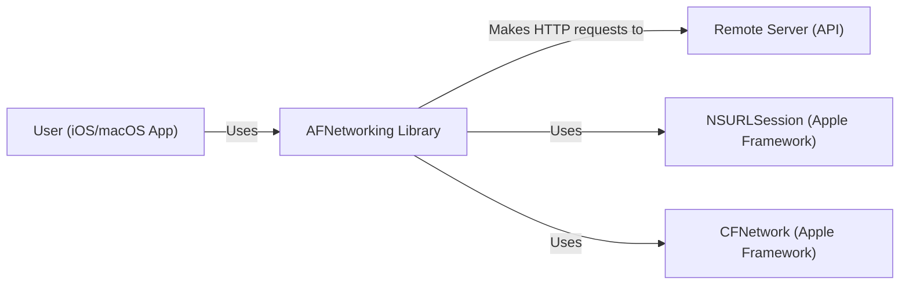
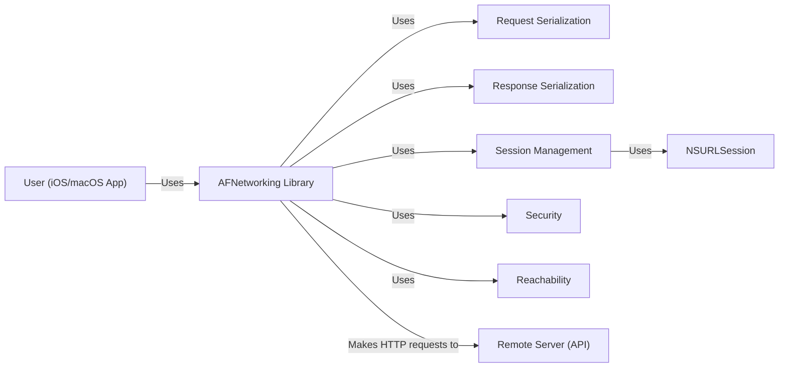
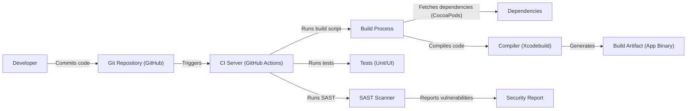

# BUSINESS POSTURE

Business Priorities and Goals:

*   Provide a robust and reliable networking library for iOS and macOS developers.
*   Simplify common networking tasks, such as making HTTP requests and handling responses.
*   Offer a clean and easy-to-use API.
*   Maintain high performance and efficiency.
*   Ensure compatibility with the latest Apple platforms and technologies.
*   Foster a strong community and ecosystem around the library.

Most Important Business Risks:

*   Security vulnerabilities in the library could expose applications using it to attacks.
*   Performance issues or bugs could negatively impact the user experience of applications.
*   Lack of compatibility with new OS versions or technologies could limit adoption.
*   Inadequate documentation or support could hinder developer adoption.
*   Competition from other networking libraries could reduce market share.

# SECURITY POSTURE

Existing Security Controls:

*   security control: The library uses Apple's `NSURLSession` and `CFNetwork` APIs, which provide built-in security features like TLS/SSL. (Described in Apple's documentation and AFNetworking's source code).
*   security control: The library supports various authentication methods, including Basic, Digest, and NTLM. (Described in AFNetworking's documentation and source code).
*   security control: The library provides mechanisms for validating server certificates. (Described in AFNetworking's documentation and source code).
*   security control: The library includes features for handling cookies securely. (Described in AFNetworking's documentation and source code).
*   security control: The library has a history of addressing reported security vulnerabilities. (Refer to the project's GitHub issues and commit history).

Accepted Risks:

*   accepted risk: The library relies on the underlying security of Apple's networking frameworks. Any vulnerabilities in those frameworks could impact AFNetworking.
*   accepted risk: Developers using the library are responsible for implementing appropriate security practices in their own applications, such as input validation and data sanitization.
*   accepted risk: The library's default settings may not be suitable for all security contexts. Developers may need to customize the configuration for specific needs.

Recommended Security Controls:

*   security control: Implement automated security scanning of the codebase (SAST) to identify potential vulnerabilities.
*   security control: Conduct regular security audits and penetration testing.
*   security control: Provide clear and comprehensive security documentation for developers.
*   security control: Establish a vulnerability disclosure program to encourage responsible reporting of security issues.
*   security control: Implement a Content Security Policy (CSP) if the library is used in a web context.

Security Requirements:

*   Authentication:
    *   Support for standard authentication protocols (Basic, Digest, OAuth 2.0, API Keys).
    *   Secure storage of credentials (e.g., using Keychain on iOS/macOS).
    *   Protection against brute-force attacks.
*   Authorization:
    *   Mechanism for verifying user permissions to access resources.
    *   Support for role-based access control (RBAC) if applicable.
*   Input Validation:
    *   Validation of all input data from external sources (e.g., server responses).
    *   Protection against common injection attacks (e.g., SQL injection, cross-site scripting).
*   Cryptography:
    *   Use of strong, industry-standard cryptographic algorithms (e.g., TLS 1.3 for secure communication).
    *   Secure key management practices.
    *   Protection against known cryptographic attacks.

# DESIGN

## C4 CONTEXT

Element List:

*   User (iOS/macOS App):
    *   Name: User (iOS/macOS App)
    *   Type: Person
    *   Description: A user interacting with an iOS or macOS application that utilizes AFNetworking.
    *   Responsibilities: Initiates network requests through the application.
    *   Security controls: Relies on the application's security measures and AFNetworking's security features.

*   AFNetworking Library:
    *   Name: AFNetworking Library
    *   Type: Software System
    *   Description: A networking library for iOS and macOS development.
    *   Responsibilities: Provides a high-level interface for making HTTP requests, handling responses, and managing network operations.
    *   Security controls: Uses NSURLSession and CFNetwork for secure communication, supports various authentication methods, provides certificate validation, and handles cookies securely.

*   Remote Server (API):
    *   Name: Remote Server (API)
    *   Type: Software System
    *   Description: A remote server or API that the application communicates with.
    *   Responsibilities: Provides data and services to the application.
    *   Security controls: Should implement appropriate security measures, such as TLS/SSL, authentication, and authorization.

*   NSURLSession (Apple Framework):
    *   Name: NSURLSession (Apple Framework)
    *   Type: Software System
    *   Description: Apple's framework for handling URL-based network requests.
    *   Responsibilities: Provides the underlying implementation for network communication.
    *   Security controls: Implements TLS/SSL, certificate validation, and other security features.

*   CFNetwork (Apple Framework):
    *   Name: CFNetwork (Apple Framework)
    *   Type: Software System
    *   Description: A lower-level Apple framework for network programming.
    *   Responsibilities: Provides foundational networking capabilities.
    *   Security controls: Implements core networking security features.

## C4 CONTAINER

Element List:

*   User (iOS/macOS App):
    *   Name: User (iOS/macOS App)
    *   Type: Person
    *   Description: A user interacting with an iOS or macOS application that utilizes AFNetworking.
    *   Responsibilities: Initiates network requests through the application.
    *   Security controls: Relies on the application's security measures and AFNetworking's security features.

*   AFNetworking Library:
    *   Name: AFNetworking Library
    *   Type: Software System
    *   Description: A networking library for iOS and macOS development.
    *   Responsibilities: Provides a high-level interface for making HTTP requests, handling responses, and managing network operations.
    *   Security controls: Uses NSURLSession and CFNetwork for secure communication, supports various authentication methods, provides certificate validation, and handles cookies securely.

*   Request Serialization:
    *   Name: Request Serialization
    *   Type: Component
    *   Description: Handles the serialization of request data into various formats (e.g., JSON, XML).
    *   Responsibilities: Converts application data into a format suitable for transmission over the network.
    *   Security controls: May perform input validation to prevent injection attacks.

*   Response Serialization:
    *   Name: Response Serialization
    *   Type: Component
    *   Description: Handles the deserialization of response data from various formats (e.g., JSON, XML).
    *   Responsibilities: Converts network data into application data.
    *   Security controls: May perform input validation and data sanitization.

*   Session Management:
    *   Name: Session Management
    *   Type: Component
    *   Description: Manages network sessions and tasks.
    *   Responsibilities: Creates, configures, and manages NSURLSession instances.
    *   Security controls: Configures security settings for NSURLSession, such as TLS/SSL and certificate validation.

*   Security:
    *   Name: Security
    *   Type: Component
    *   Description: Handles security-related aspects, such as authentication and authorization.
    *   Responsibilities: Manages authentication credentials, performs certificate pinning, and handles security challenges.
    *   Security controls: Implements authentication protocols, manages secure storage of credentials, and validates server certificates.

*   Reachability:
    *   Name: Reachability
    *   Type: Component
    *   Description: Monitors network reachability.
    *   Responsibilities: Detects changes in network connectivity.
    *   Security controls: None directly, but informs the application about network availability.

*   Remote Server (API):
    *   Name: Remote Server (API)
    *   Type: Software System
    *   Description: A remote server or API that the application communicates with.
    *   Responsibilities: Provides data and services to the application.
    *   Security controls: Should implement appropriate security measures, such as TLS/SSL, authentication, and authorization.

*   NSURLSession:
    *   Name: NSURLSession
    *   Type: Framework
    *   Description: Apple framework.
    *   Responsibilities: Provides the underlying implementation for network communication.
    *   Security controls: Implements TLS/SSL, certificate validation, and other security features.

## DEPLOYMENT

Possible Deployment Solutions:

1.  CocoaPods: A dependency manager for Swift and Objective-C Cocoa projects.
2.  Carthage: A decentralized dependency manager for Cocoa.
3.  Swift Package Manager: Apple's built-in package manager for Swift.
4.  Manual Integration: Directly adding the AFNetworking source code to the project.

Chosen Solution (CocoaPods):

Element List:

*   Developer:
    *   Name: Developer
    *   Type: Person
    *   Description: A developer writing code for an iOS or macOS application.
    *   Responsibilities: Writes code that uses AFNetworking and manages dependencies.
    *   Security controls: Follows secure coding practices.

*   iOS/macOS App:
    *   Name: iOS/macOS App
    *   Type: Software System
    *   Description: The application being developed.
    *   Responsibilities: Uses AFNetworking for network communication.
    *   Security controls: Relies on AFNetworking's security features and the developer's secure coding practices.

*   Podfile:
    *   Name: Podfile
    *   Type: Configuration File
    *   Description: A file that specifies the dependencies for a CocoaPods project.
    *   Responsibilities: Lists AFNetworking as a dependency.
    *   Security controls: None directly, but ensures the correct version of AFNetworking is used.

*   CocoaPods:
    *   Name: CocoaPods
    *   Type: Dependency Manager
    *   Description: A dependency manager for Cocoa projects.
    *   Responsibilities: Downloads and integrates AFNetworking into the project.
    *   Security controls: Fetches dependencies from trusted sources (e.g., GitHub).

*   AFNetworking Source Code:
    *   Name: AFNetworking Source Code
    *   Type: Code
    *   Description: The source code of the AFNetworking library.
    *   Responsibilities: Provides networking functionality.
    *   Security controls: Implements security features as described previously.

*   App Workspace:
    *   Name: App Workspace
    *   Type: Development Environment
    *   Description: The Xcode workspace that includes the application and its dependencies.
    *   Responsibilities: Combines the application code and AFNetworking.
    *   Security controls: None directly.

*   App Binary:
    *   Name: App Binary
    *   Type: Executable
    *   Description: The compiled application binary.
    *   Responsibilities: Runs on the iOS/macOS device.
    *   Security controls: Relies on the security features of the operating system and the compiled code.

*   iOS/macOS Device:
    *   Name: iOS/macOS Device
    *   Type: Device
    *   Description: The device on which the application is running.
    *   Responsibilities: Executes the application.
    *   Security controls: Provides operating system-level security features.

## BUILD

Build Process Description:

1.  Developer commits code to the Git repository (GitHub).
2.  The commit triggers a CI build on a CI server (e.g., GitHub Actions).
3.  The CI server runs a build script.
4.  The build process fetches dependencies (e.g., using CocoaPods).
5.  The build process compiles the code using a compiler (e.g., Xcodebuild).
6.  The compiler generates a build artifact (e.g., an app binary).
7.  The CI server runs tests (unit tests and UI tests).
8.  The CI server runs a SAST scanner to identify potential security vulnerabilities.
9.  The SAST scanner reports any found vulnerabilities.

Security Controls in Build Process:

*   security control: Dependency Management (CocoaPods): Ensures that the correct versions of dependencies are used and fetched from trusted sources.
*   security control: Automated Build (CI): Provides a consistent and reproducible build process.
*   security control: Testing (Unit/UI Tests): Helps to identify bugs and regressions.
*   security control: SAST Scanner: Automatically scans the codebase for potential security vulnerabilities.
*   security control: Code Signing: The app binary should be code-signed with a valid certificate to ensure its authenticity and integrity.

# RISK ASSESSMENT

Critical Business Processes to Protect:

*   User data privacy and security.
*   Application functionality and availability.
*   Reputation and trust of the application and the AFNetworking library.

Data to Protect and Sensitivity:

*   User credentials (usernames, passwords, API keys): Highly sensitive.
*   Personal data (names, email addresses, etc.): Sensitive, subject to privacy regulations (e.g., GDPR, CCPA).
*   Financial data (payment information): Highly sensitive, subject to PCI DSS compliance.
*   Application data (any data processed or transmitted by the application): Sensitivity depends on the specific application.
*   Network traffic: Should be protected using TLS/SSL to prevent eavesdropping and tampering.

# QUESTIONS & ASSUMPTIONS

Questions:

*   Are there any specific compliance requirements (e.g., HIPAA, PCI DSS) that the applications using AFNetworking need to meet?
*   What are the specific threat models for the applications using AFNetworking?
*   What level of security testing (e.g., penetration testing) is performed on applications using AFNetworking?
*   Are there any specific security configurations or best practices that developers using AFNetworking should follow?

Assumptions:

*   BUSINESS POSTURE: The primary goal is to provide a reliable and secure networking library for iOS/macOS developers.
*   SECURITY POSTURE: Developers using AFNetworking are responsible for implementing appropriate security practices in their own applications.
*   DESIGN: AFNetworking relies on Apple's underlying networking frameworks (NSURLSession and CFNetwork) for secure communication.
*   DESIGN: The most common deployment method is via CocoaPods.
*   DESIGN: Build process is automated using CI environment.