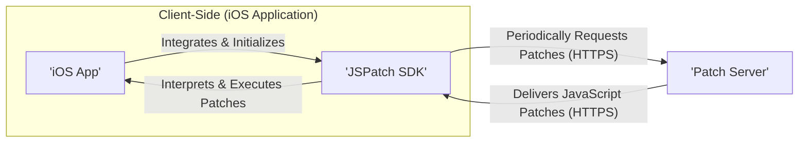

# Project Design Document: JSPatch

**Version:** 1.1
**Date:** October 26, 2023
**Author:** AI Architecture Expert

## 1. Introduction

This document provides an enhanced design overview of the JSPatch project (available at [https://github.com/bang590/jspatch](https://github.com/bang590/jspatch)). JSPatch is a framework enabling dynamic patching of running Objective-C iOS applications using JavaScript. This document details the system's architecture, key components, data flow, and security considerations, providing a robust foundation for subsequent threat modeling activities. This revision aims to provide greater clarity and depth compared to the initial version.

## 2. Goals and Objectives

The primary goals of JSPatch are:

* **Expedited Hotfixing:**  Enable developers to rapidly address bugs and implement minor updates in deployed iOS applications, reducing the need for full App Store release cycles.
* **Real-time Dynamic Updates:** Provide a mechanism for modifying application behavior, user interface elements, and even data handling on the fly, without requiring app restarts in some cases.
* **Lightweight and Performant Patching:** Offer a solution that minimizes the performance overhead on the application and the device.
* **Controlled Rollouts (Potential Future Enhancement):**  Facilitate the ability to deploy patches to specific user segments or application versions for staged rollouts and A/B testing.

## 3. Architecture Overview

The JSPatch system comprises the following core components and their interactions:

**Components:**

* **iOS Application:** The native iOS application that integrates the JSPatch SDK to enable dynamic patching capabilities.
* **JSPatch SDK:** A library embedded within the iOS application, responsible for managing the lifecycle of patch requests, downloads, interpretation, and execution.
* **Patch Server:** A remote server infrastructure responsible for securely hosting and serving JavaScript patch files to authorized applications.

**Interactions:**

1. Upon launch or at predefined intervals, the **'iOS App'** through the **'JSPatch SDK'**, initiates a secure request (ideally over HTTPS) to the **'Patch Server'**.
2. The **'Patch Server'**, upon receiving a valid request, responds by delivering the appropriate JavaScript patch file, also ideally over HTTPS.
3. The **'JSPatch SDK'** receives the JavaScript patch.
4. The **'JSPatch SDK'** utilizes a JavaScript engine to interpret the received code and then executes it within the context of the **'iOS App'**, leveraging its bridging capabilities to interact with the Objective-C runtime and modify the application's behavior.

## 4. Component Details

### 4.1. iOS Application

* **Responsibility:** The application requiring patching and the host environment for the JSPatch SDK.
* **Functionality:**
    * **SDK Initialization:** Initializes the JSPatch SDK during the application's lifecycle.
    * **Patch Server Configuration:** Stores and provides the URL or endpoint of the Patch Server to the JSPatch SDK.
    * **Patch Check Triggering:**  May initiate patch checks based on application lifecycle events, timers, or user actions.
    * **Execution Context:** Provides the runtime environment where the patched JavaScript code is executed and interacts with the native application.
* **Key Considerations:**
    * The specific points within the application's lifecycle where the JSPatch SDK is initialized and patch checks are triggered.
    * The security context and permissions under which the patched code operates.
    * Mechanisms for handling potential errors or exceptions during patch application to prevent application crashes or unexpected behavior.

### 4.2. JSPatch SDK

* **Responsibility:** The core logic for fetching, interpreting, and applying JavaScript patches to the running iOS application.
* **Functionality:**
    * **Secure Network Communication:** Establishes secure connections (HTTPS) with the Patch Server to request and receive patch files.
    * **Local Caching:**  May implement caching mechanisms to store previously downloaded patches, reducing network requests and improving performance. Cache invalidation strategies are crucial here.
    * **JavaScript Engine Integration:** Embeds or utilizes the device's JavaScript engine (typically JavaScriptCore on iOS) to interpret the downloaded JavaScript code.
    * **Objective-C Bridge:** Provides a secure and well-defined API that allows the interpreted JavaScript code to interact with and modify Objective-C objects, classes, and methods within the application's runtime. This bridge is a critical security boundary.
    * **Patch Application and Management:** Executes the JavaScript code, which uses JSPatch's specific API to implement the desired patching logic. This includes mechanisms for replacing method implementations, adding new properties, and more.
    * **Error Handling and Reporting:**  Includes mechanisms for handling errors during patch download, interpretation, and execution, potentially logging errors or providing feedback (though sensitive information should be avoided in logs).
    * **Patch Validation (Potential Enhancement):** Could include features for verifying the integrity and authenticity of downloaded patches (e.g., using digital signatures).
* **Key Considerations:**
    * Ensuring all network communication is encrypted using HTTPS to prevent MITM attacks.
    * The security of the JavaScript engine and any potential vulnerabilities within it.
    * The design and security of the Objective-C bridge API to prevent unintended or malicious access to native functionalities.
    * Implementing robust mechanisms for validating and sanitizing patches before execution to prevent malicious code injection.
    * Managing the performance impact of JavaScript interpretation and bridge interactions.

### 4.3. Patch Server

* **Responsibility:** Securely stores, manages, and serves JavaScript patch files to authorized iOS applications.
* **Functionality:**
    * **Secure Storage:**  Stores JavaScript patch files in a secure manner, protecting them from unauthorized access and modification.
    * **Authenticated Delivery:**  Serves patch files to requesting iOS applications, potentially requiring authentication or authorization to ensure only legitimate applications receive patches.
    * **Versioning and Management:**  Manages different versions of patches, allowing for targeted deployments based on application version, user segments, or other criteria. Provides mechanisms for rolling back patches if issues arise.
    * **Access Control:** Implements access control mechanisms to restrict who can upload, modify, and deploy patches.
    * **Logging and Monitoring:**  Logs requests for patches, deliveries, and any errors, providing valuable information for auditing and troubleshooting.
* **Key Considerations:**
    * The overall security of the server infrastructure, including operating system hardening, network security, and physical security.
    * Secure storage mechanisms for patch files, potentially including encryption at rest.
    * Robust authentication and authorization mechanisms to prevent unauthorized access and modification of patches.
    * Ensuring high availability and scalability to handle requests from a large number of devices.
    * Implementing comprehensive logging and monitoring for security auditing and issue detection.

## 5. Data Flow

The following diagram illustrates the detailed data flow involved in the JSPatch patching process, emphasizing security aspects:

**Detailed Steps:**

1. The **'iOS App'**, through the integrated **'JSPatch SDK'**, initiates a patch check by sending a secure HTTPS request to the configured Patch Server URL. This request typically includes information about the application version, build number, and potentially user segment information.
2. The **'JSPatch SDK'** constructs and sends a secure request to the **'Patch Server'**.
3. The **'Patch Server: Receive & Authenticate Request'** receives the request and performs authentication and authorization checks to ensure the request is coming from a legitimate application instance.
4. The **'Patch Server: Retrieve Patch File'** locates the appropriate JavaScript patch file based on the information provided in the request (e.g., application version).
5. The **'Patch Server'** securely delivers the JavaScript patch file back to the **'JSPatch SDK'** in the **'iOS App'** via an HTTPS response. The **'JSPatch SDK'** may perform initial verification of the patch (e.g., checking a digital signature if implemented).
6. The **'JSPatch SDK: JavaScript Engine'** interprets the received JavaScript code.
7. The interpreted JavaScript code interacts with the **'iOS App'** through the **'JSPatch SDK'**'s secure Objective-C bridge to apply the patches, resulting in **'iOS App: Modified Behavior'**.

## 6. Security Considerations

This section provides a more detailed examination of potential security risks associated with the JSPatch system and potential mitigation strategies:

* **Man-in-the-Middle (MITM) Attacks:**
    * **Risk:** Attackers could intercept communication between the iOS application and the Patch Server if HTTPS is not strictly enforced or if certificate validation is not properly implemented. This allows for the injection of malicious JavaScript code.
    * **Mitigation:** Enforce HTTPS for all communication. Implement proper certificate pinning within the JSPatch SDK to prevent attackers from using forged certificates.
* **Compromised Patch Server:**
    * **Risk:** If the Patch Server is compromised, attackers can replace legitimate patches with malicious ones, potentially leading to widespread compromise of user devices.
    * **Mitigation:** Implement robust security measures for the Patch Server, including strong access controls, regular security audits, intrusion detection systems, and secure software development practices. Consider using code signing for patches.
* **Malicious Patches:**
    * **Risk:** Even with a secure server, malicious insiders or compromised developer accounts could upload harmful JavaScript patches.
    * **Mitigation:** Implement a multi-stage approval process for patch deployments. Utilize code reviews and static analysis tools on patch code. Consider implementing a "kill switch" mechanism to disable patching in case of a security incident.
* **Code Injection Vulnerabilities in JSPatch SDK:**
    * **Risk:** Vulnerabilities in the JSPatch SDK's JavaScript bridge could allow attackers to execute arbitrary Objective-C code beyond the intended patching capabilities, potentially gaining full control of the device.
    * **Mitigation:** Conduct thorough security audits and penetration testing of the JSPatch SDK. Follow secure coding practices during SDK development. Implement input validation and sanitization within the bridge.
* **Lack of Patch Validation:**
    * **Risk:** Without proper validation, the JSPatch SDK could accept and execute tampered patches.
    * **Mitigation:** Implement digital signatures for patch files and verify these signatures within the JSPatch SDK before execution. Use checksums or other integrity checks.
* **Replay Attacks:**
    * **Risk:** Attackers could intercept and resend older, potentially vulnerable patches.
    * **Mitigation:** Implement nonces or timestamps in patch requests and responses to prevent replay attacks.
* **Denial of Service (DoS) Attacks on Patch Server:**
    * **Risk:** Attackers could flood the Patch Server with requests, making it unavailable for legitimate patch deliveries.
    * **Mitigation:** Implement rate limiting, request throttling, and potentially DDoS mitigation services for the Patch Server.
* **Information Disclosure:**
    * **Risk:** Overly verbose error messages or logging on the Patch Server or within the JSPatch SDK could reveal sensitive information.
    * **Mitigation:** Carefully review logging configurations and error handling to avoid exposing sensitive data.
* **Privilege Escalation:**
    * **Risk:**  Malicious JavaScript code could exploit vulnerabilities in the Objective-C bridge to gain access to functionalities or data it shouldn't, leading to privilege escalation within the application.
    * **Mitigation:** Design the Objective-C bridge with the principle of least privilege. Carefully control the APIs exposed to JavaScript. Implement security checks within the bridge.
* **Side-Channel Attacks:**
    * **Risk:**  Information leakage through timing differences or resource consumption during patch processing.
    * **Mitigation:** While challenging, consider techniques to reduce variability in execution time and resource usage.

## 7. Deployment Considerations

* **Secure Patch Server Infrastructure:** Requires a robust and hardened server infrastructure with regular security patching and monitoring.
* **Content Delivery Network (CDN) with HTTPS:**  Utilizing a CDN with enforced HTTPS can improve performance and security of patch delivery, especially for geographically distributed users. Ensure the CDN configuration is secure.
* **Robust Patch Management System:** Implement a system for managing patch versions, tracking deployments, and facilitating rollbacks. This system should have strong access controls.
* **Comprehensive Monitoring and Logging:** Implement detailed logging and monitoring on both the client-side (JSPatch SDK) and server-side to detect anomalies and potential security incidents. Securely store and analyze these logs.
* **Secure Key Management:** If patch signing is implemented, secure key management practices are crucial.
* **Regular Security Audits and Penetration Testing:** Conduct periodic security assessments of the entire JSPatch system, including the SDK, server infrastructure, and deployment processes.

## 8. Future Considerations

* **Enhanced Patch Signing and Verification:** Implement a robust digital signature scheme for patch files, ensuring authenticity and integrity. Explore using code signing certificates.
* **Granular and Dynamic Patch Targeting:** Develop more sophisticated mechanisms for targeting patches to specific user segments, device types, or application states, allowing for more controlled and efficient deployments.
* **Advanced Security Auditing and Integrity Checks within the SDK:** Implement runtime integrity checks within the JSPatch SDK to detect tampering or unauthorized modifications.
* **Integration with Mobile Threat Defense (MTD) Solutions:** Explore integrating with MTD solutions to provide an additional layer of security by detecting and preventing malicious patching attempts.
* **Formal Security Reviews of Patch Code:** Implement a mandatory security review process for all patch code before deployment.
* **Consideration of Alternative Patching Mechanisms:** Continuously evaluate alternative or complementary patching technologies to address potential limitations or security concerns with the current approach.

This enhanced design document provides a more in-depth overview of the JSPatch project, emphasizing security considerations and providing a stronger foundation for threat modeling activities. It highlights the critical components, data flow, and potential vulnerabilities that need to be carefully addressed to ensure the security and integrity of the application and user data.