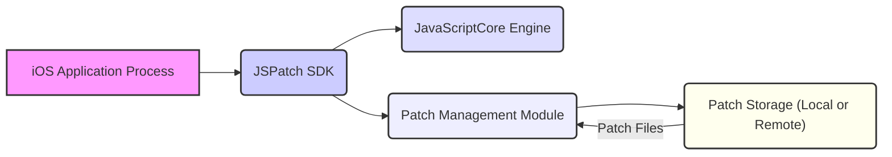
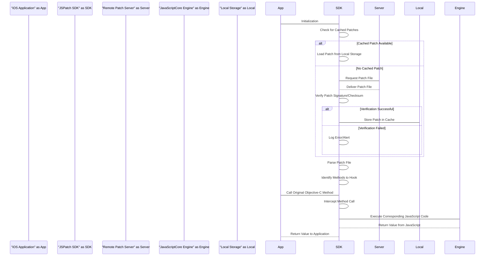

## Project Design Document: JSPatch (Improved)

**1. Introduction**

This document provides an enhanced and more detailed design overview of the JSPatch project (as found on GitHub: https://github.com/bang590/jspatch). Building upon the initial design, this version aims to provide a more granular understanding of the system's architecture, components, and data flow, specifically tailored for subsequent threat modeling activities. The focus remains on elucidating how JSPatch functions and the potential attack surfaces it introduces.

**2. Goals and Objectives**

The core goal of JSPatch is to enable dynamic patching of Objective-C code within running iOS applications using JavaScript. This allows developers to address bugs and deploy updates without necessitating a full application re-submission and user-initiated update via the App Store. The key objectives of JSPatch are:

*   **Dynamic Method Interception:**  To intercept and redirect calls to existing Objective-C methods at runtime.
*   **JavaScript-Based Implementation Replacement:** To execute JavaScript code in place of the original Objective-C method implementations.
*   **Patch Retrieval and Application Mechanism:** To provide a robust and efficient way to fetch, validate, and apply JavaScript patches.
*   **Performance Optimization:** To minimize the performance overhead introduced by the patching mechanism.
*   **Selective Patching:** To potentially target patches to specific application versions, user segments, or device configurations.

**3. High-Level Architecture**

The JSPatch system comprises the following key components and their interactions:

*   **iOS Application Process:** The running instance of the iOS application where JSPatch is integrated.
*   **JSPatch SDK:** The library embedded within the iOS application, providing the core patching functionalities and acting as the central orchestrator.
*   **JavaScriptCore Engine:** The built-in JavaScript engine in iOS responsible for executing the JavaScript code within the patches.
*   **Patch Management Module:** A logical component within the JSPatch SDK responsible for fetching, parsing, validating, and applying patches.
*   **Patch Storage (Local or Remote):** The location where JavaScript patch files are stored. This can be a remote server, local storage within the app, or a combination of both.

**4. Detailed Design**

This section provides a more in-depth look at each component and their interactions.

**4.1. JSPatch SDK (iOS Application)**

The JSPatch SDK is the central component within the iOS application. Its responsibilities are further detailed as:

*   **Initialization and Configuration:**
    *   Setting up internal data structures and configurations upon application launch.
    *   Potentially reading configuration settings for patch fetching intervals, server URLs, and other parameters.
*   **Patch Management Module:**
    *   **Patch Fetcher:** Responsible for retrieving JavaScript patch files. This involves:
        *   Constructing and sending network requests to the patch server (if remote).
        *   Implementing caching mechanisms to avoid redundant downloads.
        *   Handling network errors and retries.
        *   Potentially supporting different protocols (e.g., HTTP, HTTPS).
    *   **Patch Parser:** Responsible for processing the downloaded patch files:
        *   Deserializing the patch file content (likely JSON or a similar format).
        *   Extracting method hooking instructions and JavaScript code.
    *   **Patch Validator:** Responsible for ensuring the integrity and authenticity of the patch:
        *   Verifying digital signatures using embedded keys or certificates.
        *   Checking checksums or hashes to detect tampering.
        *   Potentially validating the patch against a predefined schema.
    *   **Patch Applier:** Responsible for applying the patch:
        *   Using Objective-C runtime manipulation techniques (e.g., method swizzling, `class_replaceMethod`) to redirect method calls.
        *   Associating the intercepted methods with their corresponding JavaScript implementations.
*   **JavaScript Bridge:**
    *   Providing a mechanism for JavaScript code to interact with the Objective-C runtime.
    *   Exposing a set of predefined functions and objects that allow JavaScript to call Objective-C methods, access object properties, and instantiate new objects.
    *   Handling the marshaling of data between the JavaScript and Objective-C environments.
*   **Error Handling and Logging:**
    *   Capturing and logging errors that occur during patch fetching, parsing, validation, or execution.
    *   Potentially providing mechanisms for reporting errors to a remote server.
*   **Performance Monitoring:**
    *   Tracking the performance impact of the patching mechanism.
    *   Potentially providing options to disable or throttle patching under certain conditions.

**4.2. JavaScriptCore Engine**

The JavaScriptCore engine within the iOS application is responsible for:

*   **JavaScript Execution Environment:** Providing the runtime environment for executing the JavaScript code from the patches.
*   **Just-In-Time (JIT) Compilation:**  Optimizing the execution of JavaScript code for performance.
*   **Garbage Collection:** Managing memory allocation and deallocation for JavaScript objects.
*   **Interaction with the JavaScript Bridge:**  Executing the JavaScript code that interacts with the Objective-C environment through the bridge provided by the JSPatch SDK.

**4.3. Patch Storage (Local or Remote)**

The location where patch files are stored plays a crucial role:

*   **Remote Patch Server:**
    *   **Storage:** Persistently storing JavaScript patch files.
    *   **Versioning:** Managing different versions of patches for various application versions or user segments.
    *   **Authentication and Authorization:** Controlling access to patch files, ensuring only authorized applications can download them.
    *   **Secure Communication:**  Providing secure channels (e.g., HTTPS) for transmitting patch files.
    *   **Content Delivery:**  Potentially using a CDN for efficient distribution of patches.
*   **Local Storage (within the App):**
    *   **Bundled Patches:**  Including initial or fallback patches within the application bundle.
    *   **Cached Patches:**  Storing downloaded patches locally to reduce network requests.
    *   **Security Considerations:**  Protecting locally stored patches from unauthorized modification or access.

**4.4. JavaScript Patch Files (Detailed)**

These files contain the instructions and code for modifying the application's behavior:

*   **Patch Metadata:**
    *   Version information for the patch.
    *   Target application version or build number.
    *   Digital signature or checksum for verification.
    *   Timestamp of creation or last modification.
*   **Method Hooking Definitions:**
    *   Specification of the Objective-C class and method to be hooked.
    *   Information about the original method signature.
*   **JavaScript Code Snippets:**
    *   JavaScript functions that will replace the original Objective-C method implementations.
    *   Code that interacts with the Objective-C runtime through the JavaScript bridge.
    *   Conditional logic to determine when and how the patch should be applied.

**5. Data Flow (Enhanced)**

The data flow for applying a JSPatch can be broken down into more specific steps:

1. **Initialization:** The iOS application initializes the JSPatch SDK.
2. **Cache Check:** The SDK checks if a valid patch is already cached locally.
3. **Remote Request (if needed):** If no valid cached patch exists, the SDK requests a patch file from the remote patch server.
4. **Patch Delivery:** The remote patch server delivers the patch file.
5. **Verification:** The SDK verifies the integrity and authenticity of the downloaded patch.
6. **Local Caching (if successful):** If verification is successful, the patch is stored locally for future use.
7. **Parsing:** The SDK parses the patch file to extract hooking instructions and JavaScript code.
8. **Method Hooking:** The SDK uses Objective-C runtime manipulation to hook the specified methods.
9. **Method Call:** The application calls an Objective-C method that has been hooked by JSPatch.
10. **Interception:** The JSPatch SDK intercepts the method call.
11. **JavaScript Execution:** The SDK invokes the JavaScriptCore engine to execute the corresponding JavaScript code from the patch.
12. **JavaScript Return:** The JavaScript code returns a value to the SDK.
13. **Application Return:** The SDK returns the value (potentially modified by the JavaScript code) to the application.

**6. Security Considerations (Detailed)**

Expanding on the initial considerations, here are more specific security concerns:

*   **Compromised Patch Server:**
    *   **Threat:** An attacker gaining control of the patch server could distribute malicious patches to all application users.
    *   **Impact:**  Complete compromise of the application's functionality and user data.
    *   **Mitigation:** Strong server security measures, access controls, regular security audits.
*   **Man-in-the-Middle (MITM) Attacks:**
    *   **Threat:** An attacker intercepting communication between the application and the patch server could inject malicious patches.
    *   **Impact:** Execution of arbitrary code within the application.
    *   **Mitigation:** Enforce HTTPS for all communication, implement certificate pinning.
*   **Weak Patch Validation:**
    *   **Threat:** Insufficient or flawed validation of patch signatures or checksums could allow malicious patches to be applied.
    *   **Impact:** Execution of untrusted code.
    *   **Mitigation:** Use strong cryptographic algorithms for signing and verification, regularly rotate signing keys.
*   **Exploiting JavaScript Bridge Vulnerabilities:**
    *   **Threat:** Vulnerabilities in the JavaScript bridge could allow malicious JavaScript code to bypass security restrictions and access sensitive resources or execute arbitrary Objective-C code.
    *   **Impact:**  Full application compromise.
    *   **Mitigation:**  Careful design and rigorous testing of the JavaScript bridge, input validation.
*   **Replay Attacks:**
    *   **Threat:** An attacker could intercept and replay older, potentially malicious, patch files.
    *   **Impact:**  Applying outdated or harmful patches.
    *   **Mitigation:** Implement nonce or timestamp-based mechanisms to prevent replay attacks.
*   **Local Patch Tampering (if applicable):**
    *   **Threat:** If patches are stored locally without adequate protection, an attacker with access to the device could modify them.
    *   **Impact:**  Execution of modified, potentially malicious, patches.
    *   **Mitigation:**  Encrypt locally stored patches, use file system permissions to restrict access.
*   **Information Disclosure through Patches:**
    *   **Threat:**  Accidentally or intentionally including code in patches that logs or transmits sensitive user data.
    *   **Impact:**  Privacy violations, data breaches.
    *   **Mitigation:**  Thorough code review of patches, secure coding practices.
*   **Denial of Service through Patches:**
    *   **Threat:**  Deploying patches that intentionally or unintentionally cause the application to crash or become unresponsive.
    *   **Impact:**  Application unavailability.
    *   **Mitigation:**  Thorough testing of patches before deployment, rollback mechanisms.

**7. Deployment Model (Detailed)**

The deployment of JSPatch and its associated components can vary:

*   **Direct Integration:** The JSPatch SDK is directly linked into the iOS application binary.
*   **Patch Server Infrastructure:**
    *   **Cloud Providers (AWS, Azure, GCP):** Utilizing cloud services for scalability and reliability. Security considerations include securing cloud storage, API gateways, and compute instances.
    *   **Self-Hosted Infrastructure:**  Requires managing server hardware, software, and security.
    *   **Content Delivery Networks (CDNs):**  Enhance patch delivery speed and availability but introduce the need to secure CDN configurations.
*   **Patch Delivery Mechanisms:**
    *   **Direct Downloads:** Applications directly download patches from the server.
    *   **Push Notifications:**  Potentially using push notifications to trigger patch downloads. Security considerations include securing push notification infrastructure.
*   **Application Distribution:**
    *   **App Store:**  Patches are applied to applications distributed through the official App Store. This raises concerns about bypassing App Store review processes.
    *   **Enterprise Distribution:**  Used for internal applications, offering more control over the distribution process but requiring robust security measures.

**8. Assumptions and Constraints (Enhanced)**

The design of JSPatch operates under the following assumptions and constraints, which have security implications:

*   **Trust in the Patch Server:** The application implicitly trusts the source of the patches. Compromising this trust leads to significant security risks.
*   **Security of the Device:** The security of the end-user's device is a factor. A compromised device could allow attackers to intercept or modify patches.
*   **No Built-in Sandboxing for Patches:**  JSPatch executes JavaScript code within the application's process, without strong sandboxing. This means a malicious patch has access to the application's resources.
*   **Reliance on Objective-C Runtime Behavior:** JSPatch's functionality depends on the specific behavior of the Objective-C runtime, which could change in future iOS versions, potentially breaking the patching mechanism or introducing new vulnerabilities.
*   **Developer Responsibility for Patch Security:**  The security of the patching mechanism heavily relies on developers implementing secure practices for creating, signing, and deploying patches.

This improved design document provides a more detailed and nuanced understanding of the JSPatch project, specifically focusing on aspects relevant to threat modeling. This enhanced information will enable a more thorough and effective identification of potential security vulnerabilities and the development of appropriate mitigation strategies.