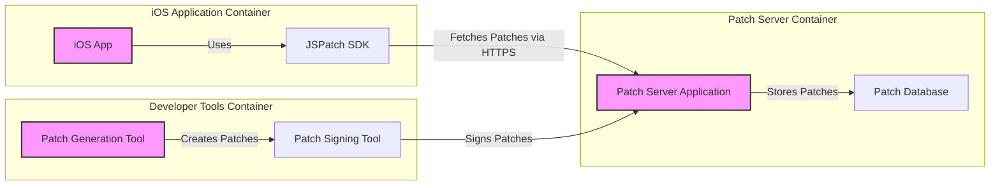

# BUSINESS POSTURE

- Business Priorities and Goals:
  - Goal: Enable rapid deployment of bug fixes and feature updates to iOS applications without requiring full app store review cycles.
  - Priority: Speed and agility in responding to user issues and market demands by bypassing traditional app update processes.
  - Priority: Maintain application stability and availability by quickly addressing critical bugs.
- Business Risks:
  - Business Risk: Security vulnerabilities introduced through dynamically loaded patches, potentially bypassing standard security review processes.
  - Business Risk: Instability and unexpected behavior in applications if patches are not thoroughly tested or are poorly implemented.
  - Business Risk: Compliance violations if the patching mechanism circumvents app store guidelines or introduces functionality that violates terms of service.
  - Business Risk: Reputational damage and loss of user trust if security incidents or application instability arise from the patching system.

# SECURITY POSTURE

- Existing Security Controls:
  - security control: iOS Code Signing - Ensures that the base application is signed by a trusted developer, providing a baseline level of trust for the initial application code. Implemented by Apple's iOS platform.
  - security control: HTTPS for Patch Delivery (Assumed) - Encrypts communication between the application and the patch server, protecting patches in transit from eavesdropping and tampering. Implementation location depends on the patch delivery infrastructure.
- Accepted Risks:
  - accepted risk: Dynamic Code Loading - Accepting the inherent risks of executing code that was not part of the original application package, which can increase the attack surface if not carefully managed.
  - accepted risk: Potential for Bypassing App Store Review - Accepting the risk that the patching mechanism might be used to deploy features or changes that would not pass standard app store review, potentially leading to policy violations.
- Recommended Security Controls:
  - security control: Patch Integrity Verification - Implement cryptographic signing of patches to ensure that the application only executes patches that originate from a trusted source and have not been tampered with in transit.
  - security control: Input Validation for Patches - Thoroughly validate the structure and content of patches before execution to prevent injection of malicious code or unexpected behavior.
  - security control: Secure Patch Storage - If patches are stored on a server, ensure secure storage mechanisms are in place to protect patch integrity and confidentiality.
  - security control: Access Control for Patch Management - Implement strict access controls to the patch generation and deployment infrastructure to limit who can create and deploy patches.
  - security control: Monitoring and Logging of Patch Application - Log patch application events, including successful and failed attempts, to detect anomalies and potential security incidents.
  - security control: Rollback Mechanism - Implement a robust rollback mechanism to quickly revert to a previous application state in case a patch introduces critical issues.
  - security control: Security Testing of Patches - Conduct security testing, including SAST and DAST, on patches before deployment to identify and remediate potential vulnerabilities.
- Security Requirements:
  - Authentication:
    - Requirement: Implement authentication for developers or systems that are authorized to create, sign, and deploy patches.
    - Requirement: Securely manage and store authentication credentials used for patch management.
  - Authorization:
    - Requirement: Define and enforce authorization policies to control who can perform actions such as creating, reviewing, approving, deploying, and rolling back patches.
    - Requirement: Implement role-based access control (RBAC) to manage permissions for patch management operations.
  - Input Validation:
    - Requirement: Implement strict input validation for all patch content to prevent code injection, cross-site scripting (XSS), and other input-based vulnerabilities.
    - Requirement: Validate patch structure, syntax, and semantics to ensure they conform to expected formats and do not contain malicious payloads.
  - Cryptography:
    - Requirement: Use cryptographic signing to ensure the integrity and authenticity of patches.
    - Requirement: Employ strong cryptographic algorithms and key management practices for patch signing and verification.
    - Requirement: Consider encryption for patches if they contain sensitive logic or data, both in transit and at rest.

# DESIGN

## C4 CONTEXT

```mermaid
flowchart LR
    subgraph "Mobile App Users"
        A[iOS App User]
    end
    subgraph "Development Team"
        B[Developers]
    end
    C[JSPatch Integration]
    D[App Store]
    E[Patch Server (Assumed)]
    F[Monitoring System (Optional)]

    A --> C
    B --> C
    C --> D
    C --> E
    C --> F

    style C fill:#f9f,stroke:#333,stroke-width:2px
```

- Context Diagram Elements:
  - Element:
    - Name: iOS App User
    - Type: Person
    - Description: End users who have installed the iOS application on their devices. They interact with the application and benefit from bug fixes and updates delivered through JSPatch.
    - Responsibilities: Use the iOS application.
    - Security controls: Limited to device-level security controls and user behavior.
  - Element:
    - Name: Developers
    - Type: Person
    - Description: Software developers responsible for creating, testing, and deploying JavaScript patches using JSPatch.
    - Responsibilities: Develop and test JavaScript patches, manage patch deployment process.
    - Security controls: Authentication and authorization to patch management systems, secure development practices.
  - Element:
    - Name: JSPatch Integration
    - Type: Software System
    - Description: The core component, an integrated library within the iOS application that handles fetching, verifying, and applying JavaScript patches at runtime.
    - Responsibilities: Fetch patches from a server, verify patch integrity and authenticity, apply patches to the running application, log patch application events.
    - Security controls: Patch integrity verification, input validation for patches, secure communication with patch server.
  - Element:
    - Name: App Store
    - Type: External System
    - Description: Apple's App Store, used for the initial distribution of the iOS application. Traditional updates go through the App Store review process.
    - Responsibilities: Initial application distribution, traditional application updates.
    - Security controls: App Store review process, code signing requirements.
  - Element:
    - Name: Patch Server (Assumed)
    - Type: External System
    - Description: A server infrastructure (potentially cloud-based) that hosts and serves JavaScript patches to the iOS application.
    - Responsibilities: Store and serve JavaScript patches, potentially manage patch versions and deployments.
    - Security controls: Access control, secure storage, HTTPS for patch delivery, potentially DDoS protection.
  - Element:
    - Name: Monitoring System (Optional)
    - Type: External System
    - Description: A system for monitoring and logging patch application events, performance, and errors.
    - Responsibilities: Collect and analyze logs related to patch application, provide alerts and insights into patch effectiveness and potential issues.
    - Security controls: Secure logging, access control to logs, data retention policies.

## C4 CONTAINER



- Container Diagram Elements:
  - Element:
    - Name: iOS App
    - Type: Mobile Application
    - Description: The native iOS application that is distributed through the App Store and installed on user devices. Contains the JSPatch SDK.
    - Responsibilities: Provide application functionality to users, integrate and initialize JSPatch SDK, handle patch application lifecycle.
    - Security controls: iOS platform security features, code signing, secure storage for application data.
  - Element:
    - Name: JSPatch SDK
    - Type: Library
    - Description: The JSPatch Software Development Kit integrated into the iOS application. Responsible for fetching, verifying, and applying JavaScript patches.
    - Responsibilities: Fetch patches from Patch Server, verify patch signature, validate patch content, apply JavaScript patches at runtime, handle patch errors and rollback (if implemented).
    - Security controls: Patch integrity verification (signature checking), input validation for patch content, secure communication (HTTPS) for fetching patches.
  - Element:
    - Name: Patch Server Application
    - Type: Web Application
    - Description: The application running on the Patch Server that manages and serves JavaScript patches.
    - Responsibilities: Store patches in the Patch Database, provide API endpoints for iOS applications to fetch patches, manage patch versions and deployments, handle authentication and authorization for patch management (if applicable).
    - Security controls: Access control, secure API design, input validation for patch management operations, secure storage of patches, HTTPS for serving patches.
  - Element:
    - Name: Patch Database
    - Type: Database
    - Description: Database used by the Patch Server Application to store JavaScript patches and related metadata.
    - Responsibilities: Persistently store JavaScript patches, provide data access to the Patch Server Application.
    - Security controls: Database access control, encryption at rest (if required), regular backups.
  - Element:
    - Name: Patch Generation Tool
    - Type: Command Line Tool/Application
    - Description: Tool used by developers to create JavaScript patch files from code changes.
    - Responsibilities: Generate patch files in the required format, potentially perform basic validation of patch content.
    - Security controls: Access control to the tool, secure handling of source code during patch generation.
  - Element:
    - Name: Patch Signing Tool
    - Type: Command Line Tool/Application
    - Description: Tool used to cryptographically sign JavaScript patch files to ensure integrity and authenticity.
    - Responsibilities: Sign patch files using a private key, generate signatures that can be verified by the JSPatch SDK in the iOS application.
    - Security controls: Secure key management, access control to signing keys, secure execution environment for signing operations.

## DEPLOYMENT

- Deployment Architecture Options:
  - Option 1: Simple Cloud Deployment - Patch Server and Database deployed on cloud infrastructure (e.g., AWS, Azure, GCP) using managed services. iOS applications directly fetch patches from this cloud server.
  - Option 2: CDN for Patch Distribution - Patches are served through a Content Delivery Network (CDN) for improved performance, scalability, and availability. Patch Server acts as the origin server for the CDN.
  - Option 3: On-Premise Patch Server - Patch Server and Database are deployed within the organization's own data center. Suitable for organizations with strict data residency or compliance requirements.

- Selected Deployment Architecture: Option 1: Simple Cloud Deployment

```mermaid
flowchart LR
    subgraph "iOS User Devices"
        A[iOS Device]
    end
    subgraph "Cloud Infrastructure (AWS)"
        subgraph "Patch Server EC2 Instance"
            B[Patch Server Application]
        end
        C[RDS Instance (PostgreSQL)]
        D[S3 Bucket (Patch Storage)]
    end
    E[Internet]

    A -- HTTPS --> E
    E -- HTTPS --> B
    B -- JDBC --> C
    B -- AWS SDK --> D

    style B fill:#f9f,stroke:#333,stroke-width:2px
    style C fill:#ccf,stroke:#333,stroke-width:2px
    style D fill:#ccf,stroke:#333,stroke-width:2px
```

- Deployment Diagram Elements:
  - Element:
    - Name: iOS Device
    - Type: Physical Device
    - Description: User's iPhone or iPad running the iOS application.
    - Responsibilities: Run the iOS application, execute JavaScript patches.
    - Security controls: Device-level security controls, operating system security features.
  - Element:
    - Name: Internet
    - Type: Network
    - Description: Public internet network connecting iOS devices to the cloud infrastructure.
    - Responsibilities: Provide network connectivity.
    - Security controls: General internet security considerations, reliance on HTTPS for secure communication.
  - Element:
    - Name: Patch Server EC2 Instance
    - Type: Virtual Machine
    - Description: An Amazon EC2 instance hosting the Patch Server Application.
    - Responsibilities: Run the Patch Server Application, serve patches, interact with the database and storage.
    - Security controls: EC2 instance security hardening, security groups, access control, regular patching of OS and application dependencies.
  - Element:
    - Name: RDS Instance (PostgreSQL)
    - Type: Managed Database Service
    - Description: Amazon RDS for PostgreSQL database instance used to store patch metadata and potentially patch content.
    - Responsibilities: Provide managed database service, store and manage patch data.
    - Security controls: RDS security features, database access control, encryption at rest and in transit, automated backups.
  - Element:
    - Name: S3 Bucket (Patch Storage)
    - Type: Cloud Storage Service
    - Description: Amazon S3 bucket used for storing patch files.
    - Responsibilities: Store patch files, provide scalable and durable storage.
    - Security controls: S3 bucket access policies, encryption at rest, versioning, logging.

## BUILD

```mermaid
flowchart LR
    A[Developer] --> B{Code Changes (JavaScript Patch)};
    B --> C[Patch Generation Tool];
    C --> D[Patch Signing Tool];
    D --> E[Signed Patch Artifact];
    E --> F[Patch Server Deployment];
    F --> G[Patch Server];

    style C fill:#f9f,stroke:#333,stroke-width:2px
    style D fill:#f9f,stroke:#333,stroke-width:2px
    style G fill:#f9f,stroke:#333,stroke-width:2px
```

- Build Process:
  - Step 1: Developer creates JavaScript code changes intended as a patch.
  - Step 2: Developer uses the Patch Generation Tool to create a patch file from the code changes.
  - Step 3: The Patch Signing Tool is used to cryptographically sign the generated patch file. This step ensures patch integrity and authenticity.
  - Step 4: The signed patch artifact is produced.
  - Step 5: The signed patch artifact is deployed to the Patch Server. This could be a manual upload or an automated process.
  - Step 6: The Patch Server stores and serves the signed patch.

- Build Security Controls:
  - security control: Secure Development Environment - Developers should use secure development environments to minimize the risk of introducing vulnerabilities during patch creation.
  - security control: Code Review - Implement code review processes for JavaScript patches to identify potential security issues and bugs before deployment.
  - security control: Automated Patch Generation - Automate the patch generation process to reduce manual errors and ensure consistency.
  - security control: Patch Signing Automation - Automate the patch signing process within a secure environment, ensuring that only authorized and properly signed patches are deployed.
  - security control: Access Control to Signing Keys - Securely manage and restrict access to the private keys used for patch signing. Use Hardware Security Modules (HSMs) or secure key management systems if necessary.
  - security control: Secure Deployment Pipeline - Implement a secure deployment pipeline to transfer signed patches to the Patch Server, ensuring integrity and confidentiality during transit.
  - security control: Version Control - Use version control systems to track changes to patches and manage different patch versions.
  - security control: Audit Logging - Log all build and deployment activities, including patch generation, signing, and deployment, for auditing and security monitoring purposes.

# RISK ASSESSMENT

- Critical Business Processes:
  - Critical Process: Rapid Bug Fixing - The ability to quickly resolve critical bugs in the iOS application to maintain application stability and user satisfaction.
  - Critical Process: Feature Rollout Agility - The ability to deploy new features or updates to users faster than traditional app store release cycles allow, enabling quicker response to market opportunities.
- Data to Protect:
  - Data: JavaScript Patches - These contain the application logic and are critical for the functionality of the application.
    - Sensitivity: High - Integrity and Availability are critical. Confidentiality may be important if patches contain sensitive business logic.
  - Data: Patch Signing Keys - Private keys used to sign patches.
    - Sensitivity: Critical - Confidentiality and Integrity are paramount. Compromise of signing keys would allow unauthorized patch deployment.
  - Data: Patch Deployment Logs - Logs of patch deployment and application events.
    - Sensitivity: Medium - Integrity and Availability are important for auditing and troubleshooting. Confidentiality may be relevant if logs contain user-specific information.

# QUESTIONS & ASSUMPTIONS

- Questions:
  - Question: What is the intended scale of patch deployments? (Number of users, frequency of patches).
  - Question: What is the process for testing patches before they are deployed to production users? Is there a staging environment?
  - Question: How are patch rollbacks handled in case of issues?
  - Question: What level of monitoring and logging is currently in place for patch application and potential errors?
  - Question: Are there any specific compliance requirements (e.g., GDPR, HIPAA) that need to be considered for patch management?
  - Question: What is the current process for managing and securing the patch signing keys?
- Assumptions:
  - Assumption: The primary use case for JSPatch is to enable rapid bug fixes and minor feature updates, not to completely bypass the app store review process for major application changes.
  - Assumption: Security is a significant concern, and measures to ensure patch integrity, authenticity, and prevent malicious use are important.
  - Assumption: There is a dedicated development team responsible for creating, testing, and deploying patches.
  - Assumption: Patches are delivered over HTTPS from a dedicated Patch Server infrastructure.
  - Assumption: The organization understands and accepts the inherent risks associated with dynamic code loading in mobile applications.