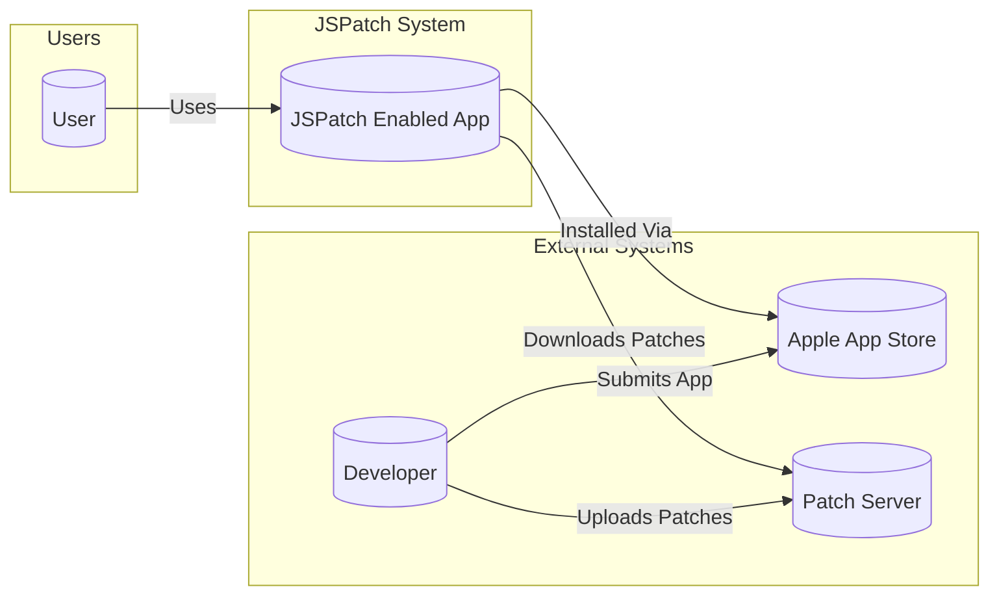
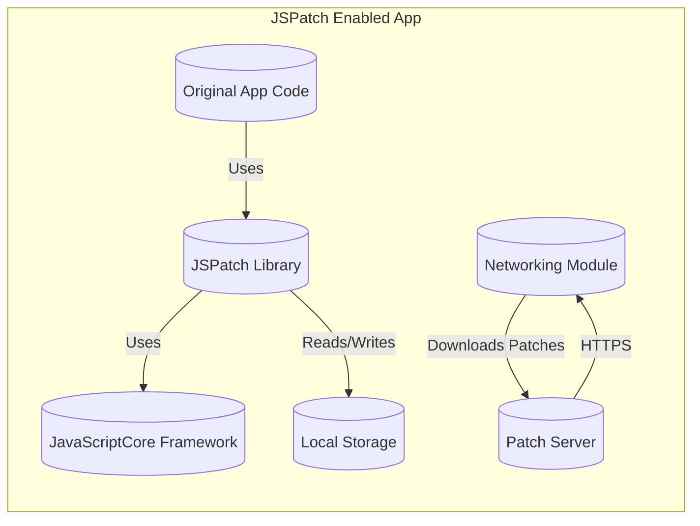
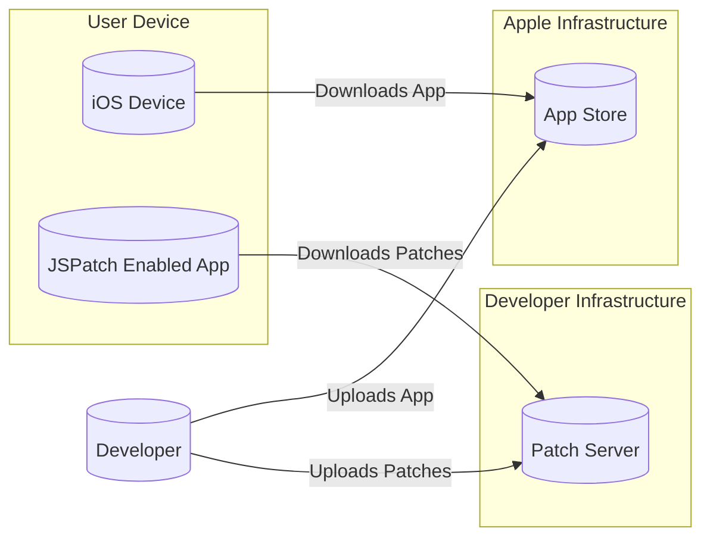
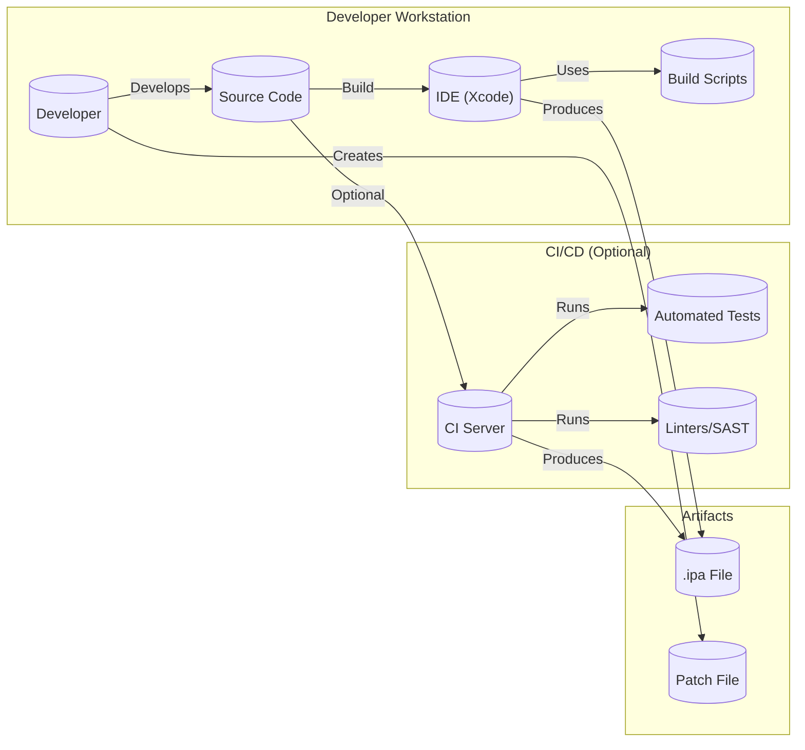

Okay, let's create a design document for the JSPatch project, focusing on aspects relevant for threat modeling.

# BUSINESS POSTURE

JSPatch is a project that allows developers to hotpatch iOS applications written in Objective-C using JavaScript.  This capability is primarily aimed at quickly fixing bugs and deploying small updates without going through the full App Store review process.

Priorities:

*   Rapid bug fixing:  The core value proposition is speed in addressing critical issues.
*   Developer convenience:  Ease of use and integration into existing workflows is crucial.
*   Minimal overhead:  The patching mechanism should not significantly impact app performance or stability.
*   Bypass App Store review for minor updates: This allows for faster iteration and response to user feedback or emerging issues.

Goals:

*   Provide a reliable and efficient mechanism for dynamically updating Objective-C code.
*   Enable developers to fix bugs and deploy minor features quickly.
*   Minimize the risk of introducing new issues through patching.

Business Risks:

*   Security vulnerabilities:  The ability to execute arbitrary JavaScript code introduces significant security risks if not properly managed. Malicious actors could exploit this to compromise user data or device functionality.
*   App instability:  Incorrectly applied patches could lead to crashes or unexpected behavior, damaging the user experience and potentially the app's reputation.
*   Apple App Store rejection: While JSPatch aims to provide a workaround, misuse or overly aggressive patching could lead to the app being rejected from the App Store.
*   Circumventing security controls: Bypassing the normal app update process means bypassing Apple's code review, which is a security control.
*   Dependency on a third-party library: Reliance on JSPatch introduces a supply chain risk. Vulnerabilities in JSPatch itself could impact all apps using it.

# SECURITY POSTURE

Existing Security Controls:

*   security control: Sandboxing: iOS applications operate within a sandbox environment, limiting the potential damage from compromised code. (Implemented by iOS operating system)
*   security control: Code Signing: iOS requires code to be signed, although JSPatch bypasses this for the patched code. (Implemented by iOS operating system)
*   security control: Limited JavaScript API: JSPatch exposes a controlled subset of Objective-C APIs to JavaScript, restricting the actions that can be performed. (Implemented in JSPatch library)

Accepted Risks:

*   accepted risk: Bypassing App Store review for code updates: This is inherent to the nature of hotpatching.
*   accepted risk: Potential for misuse: The power of dynamic code execution could be used maliciously if the patching mechanism is compromised.
*   accepted risk: Reliance on JavaScriptCore: JSPatch depends on the JavaScriptCore framework, inheriting any vulnerabilities present in that framework.

Recommended Security Controls:

*   security control: Secure Patch Delivery: Implement a secure channel (e.g., HTTPS with certificate pinning) for delivering patches to the app.
*   security control: Patch Integrity Verification: Use cryptographic signatures (e.g., digital signatures) to verify the integrity and authenticity of patches before applying them.
*   security control: Patch Origin Verification: Ensure patches originate from a trusted source. This could involve verifying the server's identity and using API keys or other authentication mechanisms.
*   security control: Runtime Monitoring: Implement runtime checks to detect and prevent malicious behavior within the patched code. This could include monitoring for suspicious API calls or data access patterns.
*   security control: Input Validation: Strictly validate all input passed to the JavaScript environment from the Objective-C side, and vice-versa.
*   security control: Least Privilege: Grant the JavaScript environment only the minimum necessary permissions to perform its intended function.
*   security control: Sandboxed JavaScript Execution: Explore options for further sandboxing the JavaScript execution environment, potentially using a separate process or context.

Security Requirements:

*   Authentication:
    *   Patches must be authenticated to ensure they originate from a legitimate source.
    *   The patch delivery mechanism should use strong authentication to prevent unauthorized access.
*   Authorization:
    *   The JavaScript environment should have limited access to Objective-C APIs, following the principle of least privilege.
    *   Access control mechanisms should be in place to restrict the actions that patched code can perform.
*   Input Validation:
    *   All input passed between JavaScript and Objective-C must be strictly validated to prevent injection attacks.
    *   Data received from external sources (e.g., patch files) must be treated as untrusted and carefully sanitized.
*   Cryptography:
    *   Use strong cryptographic algorithms for securing patch delivery (HTTPS) and verifying patch integrity (digital signatures).
    *   Protect any sensitive data used by the patching mechanism (e.g., API keys, private keys) using appropriate cryptographic techniques.

# DESIGN

## C4 CONTEXT

Element Descriptions:

*   Element:
    *   Name: User
    *   Type: Person
    *   Description: End-user of the iOS application.
    *   Responsibilities: Interacts with the application, providing input and receiving output.
    *   Security Controls: Relies on iOS platform security controls (sandboxing, code signing).

*   Element:
    *   Name: JSPatch Enabled App
    *   Type: Software System
    *   Description: The iOS application that incorporates the JSPatch library.
    *   Responsibilities: Executes the original application logic and applies patches dynamically.
    *   Security Controls: Sandboxing (iOS), Limited JavaScript API (JSPatch), Secure Patch Delivery (recommended), Patch Integrity Verification (recommended), Patch Origin Verification (recommended), Runtime Monitoring (recommended), Input Validation (recommended), Least Privilege (recommended).

*   Element:
    *   Name: Apple App Store
    *   Type: Software System
    *   Description: Apple's official distribution platform for iOS applications.
    *   Responsibilities: Hosts and distributes the initial version of the application.
    *   Security Controls: Code signing, app review process.

*   Element:
    *   Name: Patch Server
    *   Type: Software System
    *   Description: A server that hosts and delivers patches to the JSPatch-enabled app.
    *   Responsibilities: Stores patches, authenticates clients, and delivers patches securely.
    *   Security Controls: HTTPS with certificate pinning, authentication mechanisms (API keys, etc.), access controls.

*   Element:
    *   Name: Developer
    *   Type: Person
    *   Description: The developer of the iOS application.
    *   Responsibilities: Writes the original application code, creates and signs patches, and uploads them to the Patch Server.
    *   Security Controls: Secure development practices, code signing, secure storage of private keys.

## C4 CONTAINER

Element Descriptions:

*   Element:
    *   Name: Original App Code
    *   Type: Container (Code)
    *   Description: The original Objective-C code of the application.
    *   Responsibilities: Implements the core functionality of the application.
    *   Security Controls: Relies on iOS platform security and secure coding practices.

*   Element:
    *   Name: JSPatch Library
    *   Type: Container (Library)
    *   Description: The JSPatch library, integrated into the application.
    *   Responsibilities: Manages the patching process, interfaces with JavaScriptCore, and provides a bridge between JavaScript and Objective-C.
    *   Security Controls: Limited JavaScript API, Input Validation, (recommended) Sandboxed JavaScript Execution.

*   Element:
    *   Name: JavaScriptCore Framework
    *   Type: Container (Framework)
    *   Description: Apple's built-in JavaScript engine.
    *   Responsibilities: Executes JavaScript code.
    *   Security Controls: Relies on iOS platform security.

*   Element:
    *   Name: Networking Module
    *   Type: Container (Code/Library)
    *   Description: Handles network communication, including downloading patches.
    *   Responsibilities: Downloads patches from the Patch Server.
    *   Security Controls: HTTPS with certificate pinning.

*   Element:
    *   Name: Local Storage
    *   Type: Container (Data Store)
    *   Description: Persistent storage used by the app, potentially for storing downloaded patches.
    *   Responsibilities: Stores data locally on the device.
    *   Security Controls: iOS data protection mechanisms.

*   Element:
    *   Name: Patch Server
    *   Type: Container (Server)
    *   Description: External server that hosts and delivers patches.
    *   Responsibilities: Stores patches, authenticates clients, and delivers patches securely.
    *   Security Controls: HTTPS with certificate pinning, authentication mechanisms (API keys, etc.), access controls.

## DEPLOYMENT

Possible Deployment Solutions:

1.  Standard iOS Deployment: The app is deployed through the Apple App Store. Patches are delivered via a custom server.
2.  Enterprise Distribution: The app is distributed through an enterprise program, bypassing the App Store. Patches are delivered via a custom server.
3.  Ad Hoc Distribution: The app is distributed to a limited number of registered devices. Patches are delivered via a custom server.

Chosen Solution (Standard iOS Deployment):

Element Descriptions:

*   Element:
    *   Name: Developer
    *   Type: Person
    *   Description: The developer of the iOS application.
    *   Responsibilities: Builds and signs the application, uploads it to the App Store, creates and signs patches, and uploads them to the Patch Server.
    *   Security Controls: Secure development practices, code signing, secure storage of private keys.

*   Element:
    *   Name: App Store
    *   Type: Infrastructure Node
    *   Description: Apple's official distribution platform for iOS applications.
    *   Responsibilities: Hosts and distributes the initial version of the application.
    *   Security Controls: Code signing, app review process.

*   Element:
    *   Name: Patch Server
    *   Type: Infrastructure Node
    *   Description: A server that hosts and delivers patches to the JSPatch-enabled app.
    *   Responsibilities: Stores patches, authenticates clients, and delivers patches securely.
    *   Security Controls: HTTPS with certificate pinning, authentication mechanisms (API keys, etc.), access controls.

*   Element:
    *   Name: iOS Device
    *   Type: Infrastructure Node
    *   Description: The user's iOS device.
    *   Responsibilities: Runs the JSPatch-enabled application.
    *   Security Controls: iOS platform security (sandboxing, code signing).

*   Element:
    *   Name: JSPatch Enabled App
    *   Type: Software System
    *   Description: The iOS application that incorporates the JSPatch library.
    *   Responsibilities: Executes the original application logic and applies patches dynamically.
    *   Security Controls: Sandboxing (iOS), Limited JavaScript API (JSPatch), Secure Patch Delivery (recommended), Patch Integrity Verification (recommended), Patch Origin Verification (recommended), Runtime Monitoring (recommended), Input Validation (recommended), Least Privilege (recommended).

## BUILD

Build Process Description:

1.  Development: The developer writes the Objective-C code and JavaScript patches using an IDE (typically Xcode).
2.  Building the App: The developer uses Xcode (or a CI/CD system) to build the application. This process compiles the Objective-C code and packages it into an .ipa file.
3.  Creating Patches: The developer creates JavaScript patch files. These files contain the JavaScript code that will modify the Objective-C code at runtime.
4.  (Optional) CI/CD: A Continuous Integration/Continuous Delivery system can be used to automate the build process. This system can run automated tests, linters, and SAST (Static Application Security Testing) tools to identify potential security vulnerabilities.
5.  Artifacts: The build process produces two main artifacts: the .ipa file (the application) and the patch files.

Security Controls:

*   security control: Secure Coding Practices: Developers should follow secure coding guidelines to minimize vulnerabilities in the original code and the patches.
*   security control: Code Review: Code reviews should be conducted to identify potential security issues before they are deployed.
*   security control: (Optional) SAST: Static Application Security Testing tools can be integrated into the build process to automatically scan the code for vulnerabilities.
*   security control: (Optional) Linters: Linters can be used to enforce coding standards and identify potential errors.
*   security control: Patch Signing: Patch files should be digitally signed to ensure their integrity and authenticity.
*   security control: Secure Storage of Signing Keys: The private keys used for signing the app and patches must be stored securely.

# RISK ASSESSMENT

Critical Business Processes:

*   Application Functionality: The core functionality of the application must remain operational and reliable.
*   User Data Handling:  Any user data handled by the application must be protected from unauthorized access, modification, or disclosure.
*   Patch Delivery: The process of delivering patches to the application must be secure and reliable.

Data Sensitivity:

*   User Data:  This could range from low-sensitivity data (e.g., usage statistics) to high-sensitivity data (e.g., personal information, financial data, health data). The specific data handled by the application will determine the level of sensitivity.
*   Patch Files:  These are considered high-sensitivity because they contain code that can modify the application's behavior. Compromise of patch files could lead to significant security breaches.
*   API Keys/Credentials: Any API keys or credentials used for patch delivery or other services are considered high-sensitivity.

# QUESTIONS & ASSUMPTIONS

Questions:

*   What specific Objective-C APIs will be exposed to JavaScript through JSPatch?  A detailed list is needed for a thorough security assessment.
*   What is the expected frequency of patch deployments? This impacts the risk assessment and the design of the patch delivery mechanism.
*   What types of user data will the application handle? This is crucial for determining data sensitivity and appropriate security controls.
*   Will there be any third-party integrations or dependencies beyond JSPatch? These introduce additional supply chain risks.
*   What is the mechanism for storing and managing the private keys used for code signing and patch signing?
*   What is the specific implementation of the "Networking Module" used for downloading patches? Details are needed to assess its security.
*   Is there any existing logging or monitoring infrastructure in place?

Assumptions:

*   BUSINESS POSTURE: The primary goal is rapid bug fixing, and the organization is willing to accept some level of risk to achieve this.
*   SECURITY POSTURE: The iOS sandbox provides a baseline level of security.  The developer is responsible for implementing additional security controls related to patch delivery and execution.
*   DESIGN: The patch server is a separate entity from the App Store and is managed by the developer. The application uses standard iOS networking APIs for downloading patches. The application will use HTTPS for patch download.