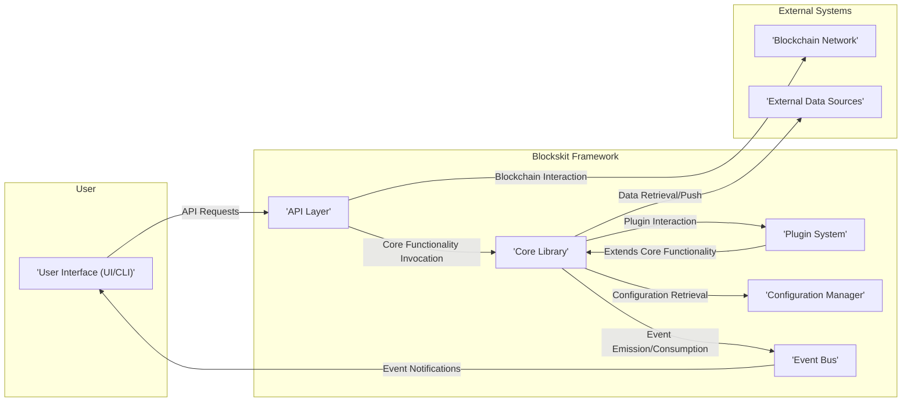
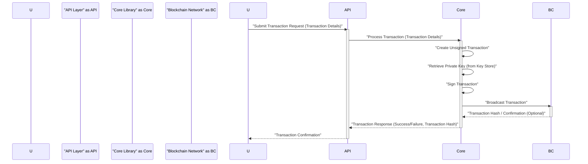
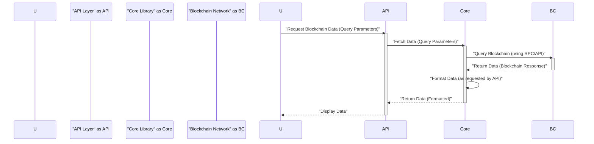

## Project Design Document: Blockskit (Improved)

**1. Introduction**

This document provides an enhanced design description of the Blockskit project, a framework intended for streamlining the development of blockchain-based applications. It offers a detailed overview of the system's architecture, its core components, and the pathways of data flow. This document is specifically crafted to serve as a robust foundation for subsequent threat modeling exercises.

**2. Goals**

* To articulate a precise and easily understandable depiction of the Blockskit architecture.
* To clearly define the key components and elucidate their interactions within the system.
* To visually represent the movement of data throughout the Blockskit framework.
* To emphasize areas of potential security relevance, thereby facilitating effective threat modeling.

**3. Scope**

This document focuses on the fundamental architectural blueprint of the Blockskit framework. It encompasses:

* A comprehensive overview of the system's high-level architecture.
* Detailed descriptions of the primary components that constitute Blockskit.
* Visual representations of data flow for critical operations within the framework.
* An initial assessment of security considerations pertinent to the design.

This document explicitly excludes:

* Intricate implementation details of individual components within Blockskit.
* Specific strategies for deploying and managing the infrastructure of Blockskit.
* Exhaustive lists of security controls and mitigation strategies.
* Detailed analyses of specific applications built utilizing the Blockskit framework.

**4. High-Level Architecture**

**5. Component Descriptions**

* **User Interface (UI/CLI):** This is the point of interaction for users with Blockskit. It can manifest as a graphical user interface (UI) for intuitive interaction or a command-line interface (CLI) for more programmatic access. It empowers users to initiate actions, examine data, and manage their engagement with the underlying blockchain.
* **API Layer:** This layer serves as the exposed interface of Blockskit, offering a set of well-defined APIs. It acts as a crucial intermediary, managing request routing from the user interface to the core library, potentially handling authentication and authorization, and structuring responses for the user. Examples include RESTful APIs or gRPC endpoints.
* **Core Library:**  This is the central engine of Blockskit, housing the fundamental logic required for interacting with blockchain networks. Its responsibilities include:
    * Constructing and digitally signing transactions.
    * Securely managing cryptographic keys.
    * Retrieving data from the blockchain.
    * Facilitating interactions with smart contracts deployed on the blockchain.
    * Handling events emitted by the blockchain or smart contracts.
* **Plugin System:** This component provides a mechanism for developers to augment Blockskit's native capabilities through the creation and integration of plugins. These plugins can introduce support for new blockchain protocols, implement custom data processing workflows, or enable integration with external services.
* **Configuration Manager:** This component is dedicated to the management of Blockskit's configuration parameters. It handles the processes of loading, persistently storing, and validating configuration settings, allowing for tailored customization and environment-specific adjustments.
* **Event Bus:** This component facilitates asynchronous communication between different parts of the Blockskit framework. Components can publish events to the bus, and other components can subscribe to specific events, enabling decoupled and reactive behavior. This can be used for logging, monitoring, or triggering actions based on blockchain events.
* **Blockchain Network:** This represents the underlying distributed ledger technology (DLT) network(s) that Blockskit is designed to interact with. This could encompass various blockchain platforms such as Ethereum, Bitcoin, or other permissioned or permissionless chains.
* **External Data Sources:** Blockskit might require interaction with external data repositories or services to enrich on-chain data or perform computations off-chain. This could include databases, APIs, or other data feeds.

**6. Detailed Component Design**

* **6.1. API Layer**
    * **Functionality:**
        * Receives and interprets incoming requests from the User Interface or other clients.
        * Potentially enforces authentication and authorization policies to control access.
        * Routes incoming requests to the appropriate functions within the Core Library.
        * Handles the formatting of requests and responses, potentially supporting multiple formats (e.g., JSON, XML, Protocol Buffers).
        * May implement rate limiting, request validation, and other security measures to protect against abuse.
    * **Potential Technologies:** Node.js with Express.js, Python with Flask or FastAPI, Go with Gin or Gorilla Mux, gRPC.
    * **Security Considerations:**  Vulnerable APIs are a significant attack vector. Focus areas include: authentication mechanisms (e.g., OAuth 2.0, API keys), authorization controls (RBAC, ABAC), input validation to prevent injection attacks, protection against Cross-Site Scripting (XSS) and Cross-Site Request Forgery (CSRF), and secure handling of sensitive data in transit and at rest.

* **6.2. Core Library**
    * **Functionality:**
        * Provides the fundamental logic for interacting with various blockchain networks.
        * Manages cryptographic operations, including key generation, signing of transactions, and verification of signatures.
        * Handles communication with blockchain nodes, potentially using RPC or other communication protocols.
        * Implements the necessary logic for interacting with smart contracts, including encoding function calls and decoding results.
        * Offers abstractions to simplify interactions with different blockchain protocols, hiding protocol-specific complexities.
    * **Internal Modules (Examples):**
        * `Transaction Builder`: Responsible for constructing transactions according to the specific blockchain's format.
        * `Signer`: Handles the signing of transactions using private keys.
        * `Key Store`:  Manages the secure storage and retrieval of cryptographic keys (may integrate with hardware security modules or secure enclaves).
        * `Blockchain Connector`:  Implements the communication logic for interacting with specific blockchain networks (e.g., Ethereum, Polkadot).
        * `Smart Contract Interface`: Provides tools for interacting with deployed smart contracts, including ABI encoding/decoding.
    * **Security Considerations:**  Security of the Core Library is paramount. Key management vulnerabilities can lead to complete compromise. Secure coding practices are essential to prevent vulnerabilities in cryptographic operations and blockchain interaction logic. Protection against replay attacks and ensuring transaction integrity are crucial.

* **6.3. Plugin System**
    * **Functionality:**
        * Enables developers to extend Blockskit's functionality in a modular way.
        * Provides a well-defined interface (API) for plugin development, ensuring consistency and maintainability.
        * Manages the lifecycle of plugins, including installation, activation, deactivation, and uninstallation.
        * May provide mechanisms for plugin isolation to prevent faulty or malicious plugins from compromising the core system.
    * **Security Considerations:**  Plugins represent a potential attack surface. Security considerations include: verifying the authenticity and integrity of plugins, sandboxing plugin execution to limit their access to system resources, carefully defining the plugin API to prevent unintended access or manipulation of core functionalities, and implementing mechanisms for auditing plugin activity.

* **6.4. Event Bus**
    * **Functionality:**
        * Facilitates asynchronous communication between components within Blockskit.
        * Allows components to publish events without needing to know the specific subscribers.
        * Enables components to subscribe to specific types of events.
        * Can be implemented using in-memory queues or more robust message brokers.
    * **Security Considerations:**  Consider the potential for unauthorized components to publish or subscribe to sensitive events. Appropriate access controls and validation of event data may be necessary.

**7. Data Flow Diagrams**

* **7.1. Transaction Submission**

* **7.2. Data Retrieval from Blockchain**

**8. Security Considerations**

This section outlines potential security concerns categorized for clarity during threat modeling.

* **Authentication and Authorization:**
    * How are users and applications interacting with Blockskit authenticated?
    * What mechanisms are in place to authorize actions based on user roles or permissions?
    * Are API keys, OAuth 2.0, or other authentication protocols used?
    * How is session management handled securely?

* **API Security:**
    * Is input validation performed on all API endpoints to prevent injection attacks (SQL, command, etc.)?
    * Are appropriate output encoding techniques used to prevent XSS vulnerabilities?
    * Are CSRF tokens implemented to protect against cross-site request forgery?
    * Is the API protected against denial-of-service (DoS) attacks through rate limiting and other mechanisms?
    * Are security headers (e.g., Content-Security-Policy, Strict-Transport-Security) properly configured?

* **Key Management:**
    * How are private keys generated, stored, and managed securely?
    * Are hardware security modules (HSMs) or secure enclaves considered for key storage?
    * What measures are in place to prevent unauthorized access to private keys?
    * How is key rotation handled?

* **Transaction Security:**
    * How is the integrity and authenticity of transactions ensured?
    * Are transactions signed using appropriate cryptographic algorithms?
    * Are there mechanisms to prevent transaction replay attacks?
    * How is the risk of front-running transactions mitigated?

* **Smart Contract Interaction Security:**
    * How are interactions with smart contracts validated to prevent exploitation of vulnerabilities in the contracts themselves?
    * Are secure coding practices followed when interacting with smart contracts?
    * Are gas limits and fees handled appropriately to prevent unexpected costs or denial-of-service?

* **Plugin Security:**
    * How are plugins verified and validated before installation?
    * Is plugin execution sandboxed to limit their access to system resources?
    * Are plugin APIs designed to prevent malicious plugins from compromising the core system?
    * Are there mechanisms for auditing plugin activity?

* **Configuration Security:**
    * How is sensitive configuration data (e.g., API keys, database credentials) stored and protected?
    * Are environment variables or secure configuration management tools used?
    * Are default configurations reviewed and hardened?

* **Data Privacy:**
    * How is user data handled and protected, especially if Blockskit interacts with personally identifiable information (PII)?
    * Are data encryption techniques used for data at rest and in transit?
    * Are data retention policies in place?

* **Dependency Management:**
    * Are software dependencies regularly scanned for vulnerabilities?
    * Are dependencies updated promptly to address security patches?

* **Event Bus Security:**
    * Are there access controls in place to restrict which components can publish or subscribe to specific events?
    * Is event data validated to prevent malicious or malformed events from causing issues?

**9. Technologies Used (Examples)**

This is a non-exhaustive list and illustrates potential technology choices for different components. Specific implementations may vary.

* **Programming Languages:**
    * User Interface: JavaScript/TypeScript with React, Angular, or Vue.js.
    * API Layer: Node.js with Express.js, Python with Flask or FastAPI, Go.
    * Core Library: Go, Rust, Python, Java.
    * Plugins:  Language-agnostic with well-defined interfaces (could be the same as Core Library or others).
* **Frameworks/Libraries:**
    * Blockchain Interaction: Web3.js, Ethers.js (for Ethereum), specific SDKs for other blockchains.
    * Cryptography: Libraries like OpenSSL, libsodium, or platform-specific crypto libraries.
    * API Frameworks: Express.js, Flask, FastAPI, gRPC.
    * Plugin Management:  Custom implementation or frameworks like Pluggy (Python).
    * Event Bus:  In-memory queues, Redis Pub/Sub, RabbitMQ, Kafka.
* **Databases/Storage:**
    * Configuration Storage:  File-based (YAML, JSON), relational databases (PostgreSQL, MySQL), NoSQL databases.
    * Key Storage: Hardware Security Modules (HSMs), secure enclaves, encrypted file systems.

**10. Deployment Considerations**

While not the primary focus, deployment choices can significantly impact security. Consider:

* **Deployment Environment:** Cloud (AWS, Azure, GCP), on-premises, containerized (Docker, Kubernetes).
* **Network Security:** Firewalls, intrusion detection/prevention systems (IDS/IPS).
* **Access Control:**  Role-Based Access Control (RBAC) for managing access to Blockskit components.
* **Monitoring and Logging:**  Centralized logging and monitoring for security events.
* **Secrets Management:** Securely managing API keys, database credentials, and other secrets during deployment and runtime.

**11. Future Considerations**

* **Enhanced Support for Diverse Blockchain Networks:** Expanding the framework's compatibility with a broader range of blockchain technologies.
* **Advanced Plugin Capabilities:**  Developing more sophisticated and flexible plugin interfaces to enable complex extensions.
* **Strengthened Security Features:** Implementing more advanced security controls, such as multi-factor authentication, advanced threat detection, and security auditing.
* **Increased Modularity and Extensibility:**  Further refining the framework's architecture to enhance modularity and ease of extension for future features.
* **Seamless Integration with Development and Deployment Tools:**  Providing smoother integration with popular development workflows, CI/CD pipelines, and deployment platforms.

This improved design document provides a more comprehensive and detailed view of the Blockskit project, making it a more effective resource for subsequent threat modeling activities. The added details and categorization of security considerations aim to facilitate a more thorough and targeted security analysis.