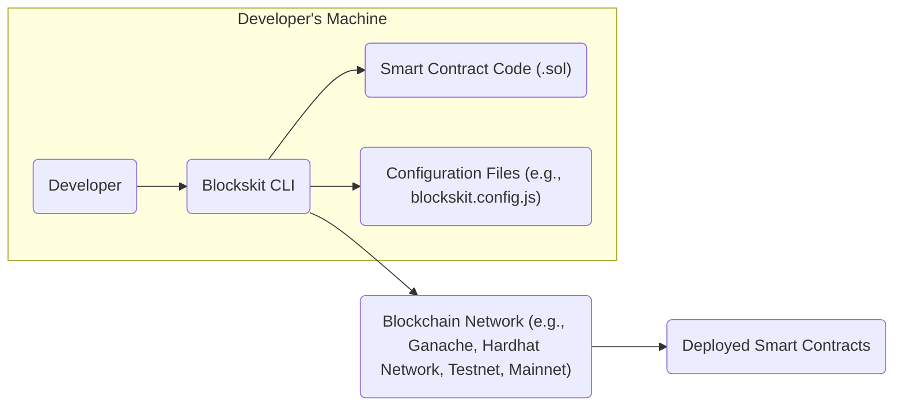

# Project Design Document: Blockskit

**Version:** 1.1
**Date:** October 26, 2023
**Author:** AI Software Architect

## 1. Introduction

This document provides a detailed design overview of the Blockskit project, a framework designed to simplify the development, testing, and deployment of blockchain applications. This document will serve as a foundation for subsequent threat modeling activities.

### 1.1. Purpose

The primary purpose of this document is to clearly articulate the architecture, components, and data flows within the Blockskit project. This detailed description will enable stakeholders to understand the system's functionality and identify potential security vulnerabilities during the threat modeling process.

### 1.2. Scope

This document covers the core components and functionalities of the Blockskit framework as represented in the provided GitHub repository (https://github.com/blockskit/blockskit). It focuses on the interactions between the user, the Blockskit CLI, and the underlying blockchain infrastructure. It includes:

*   Blockskit Command Line Interface (CLI) and its core functionalities
*   Configuration management mechanisms
*   Smart contract compilation and deployment processes
*   Interaction methods with deployed smart contracts
*   Local blockchain network management capabilities (if integrated)

This document does not cover:

*   In-depth specifics of individual blockchain implementations (e.g., the internal workings of Ethereum or Polygon), focusing instead on the interaction patterns.
*   Detailed internal implementation specifics of the Blockskit codebase's modules and functions.
*   Graphical User Interface (GUI) components, if they exist separately from the CLI.

### 1.3. Goals

*   Provide a comprehensive and easily understandable architectural overview of Blockskit.
*   Clearly define the key components and their respective responsibilities within the framework.
*   Illustrate the flow of data during critical operations within the system.
*   Establish a precise understanding of the system's boundaries, interfaces, and interactions with external entities.
*   Serve as a robust and detailed foundation for identifying potential threats, vulnerabilities, and attack vectors.

## 2. High-Level Architecture

The Blockskit framework primarily operates through a command-line interface (CLI), acting as the central point of interaction for developers to manage their blockchain projects and interact with blockchain networks.

**Components:**

*   **Developer:** The end-user who utilizes the Blockskit framework to build, test, and deploy blockchain applications.
*   **Blockskit CLI:** The primary command-line interface that developers use to execute various Blockskit functionalities.
*   **Smart Contract Code (.sol):** The Solidity source code files that define the logic of the blockchain applications being developed.
*   **Configuration Files (e.g., blockskit.config.js):** Files that store project-specific settings, blockchain network details, deployment parameters, and other configurations necessary for Blockskit to operate.
*   **Blockchain Network (e.g., Ganache, Hardhat Network, Testnet, Mainnet):** The underlying blockchain environment where smart contracts are deployed and their transactions are executed. This can range from local development networks to public mainnets.
*   **Deployed Smart Contracts:** The instances of the compiled smart contract code that are deployed and actively running on the blockchain network.

## 3. Component Details

This section provides a more granular description of the key components within the Blockskit framework, detailing their responsibilities and functionalities.

### 3.1. Blockskit CLI

*   **Responsibility:** Acts as the central command and control interface for developers interacting with the Blockskit framework.
*   **Functionality:**
    *   **Project Initialization (`init`):** Creates a new Blockskit project, scaffolding the necessary directory structure and configuration files.
    *   **Configuration Management:** Reads, parses, and validates project configuration settings from files like `blockskit.config.js`.
    *   **Smart Contract Compilation (`compile`):**  Invokes the Solidity compiler (e.g., `solcjs`, `hardhat`) to translate Solidity source code into bytecode.
    *   **Deployment (`deploy`):**  Facilitates the deployment of compiled smart contracts to a specified blockchain network by constructing and signing deployment transactions.
    *   **Contract Interaction (`call`, `send`):** Enables developers to interact with deployed smart contracts by sending transactions to invoke functions (both view/pure and state-changing).
    *   **Network Management (Potentially):** May include commands or integrations to manage local blockchain networks, such as starting or stopping Ganache or Hardhat Network instances.
    *   **Testing (`test`):**  Integrates with testing frameworks (e.g., Mocha, Chai) to allow developers to write and execute tests for their smart contracts.
    *   **Key Management (Limited):** May handle the temporary loading or referencing of private keys from configuration or environment variables (security critical).
*   **Inputs:** User commands entered in the terminal, configuration files, smart contract code files.
*   **Outputs:** Compiled bytecode files, deployment transaction hashes, results of smart contract interactions, console logs, error messages.

### 3.2. Configuration Files

*   **Responsibility:** Stores all project-specific settings and parameters required for Blockskit to function correctly.
*   **Content:**
    *   **Network Configurations:** Details about the target blockchain networks, including RPC URLs, chain IDs, and potentially gas price/limit settings.
    *   **Deployment Configurations:** Parameters specific to contract deployment, such as constructor arguments and deployment account details.
    *   **Smart Contract Artifacts:**  Storage locations or references to compiled contract bytecode and Application Binary Interfaces (ABIs).
    *   **Compiler Settings:**  Configuration options for the Solidity compiler.
    *   **Key Management (Potentially):**  May contain (or reference) private keys or mnemonics for interacting with blockchain networks (security critical).
*   **Format:** Typically JavaScript files (`.js`) or JSON files (`.json`).
*   **Access:** Read by the Blockskit CLI during various operations, especially during deployment and contract interaction.

### 3.3. Smart Contract Code (.sol)

*   **Responsibility:** Contains the business logic and data structures that define the functionality of the decentralized application being built.
*   **Language:** Primarily written in Solidity, the most common language for developing smart contracts on Ethereum-compatible blockchains.
*   **Location:** Typically stored in a designated directory within the project structure, often named `contracts`.
*   **Processing:** Compiled by the Blockskit CLI using a Solidity compiler, transforming the human-readable code into bytecode that can be executed on the blockchain's virtual machine (e.g., EVM).

### 3.4. Blockchain Network

*   **Responsibility:** Provides the distributed ledger and execution environment for deployed smart contracts.
*   **Examples:**
    *   **Local Development Networks:** Ganache, Hardhat Network (used for rapid development and testing).
    *   **Public Testnets:** Goerli, Sepolia (used for testing in a more realistic environment before deploying to mainnet).
    *   **Public Mainnets:** Ethereum Mainnet, Polygon Mainnet, etc. (live, production blockchain networks).
*   **Interaction:** The Blockskit CLI communicates with the blockchain network through RPC (Remote Procedure Call) endpoints, typically using libraries like `web3.js` or `ethers.js`.
*   **Key Components (Abstracted):**
    *   **Nodes:** Computers that participate in the network, validating transactions and maintaining a copy of the blockchain.
    *   **Consensus Mechanism:** The algorithm used by the network to agree on the order and validity of transactions (e.g., Proof-of-Work, Proof-of-Stake).
    *   **Virtual Machine (EVM or equivalent):** The execution environment where smart contract bytecode is executed.

### 3.5. Deployed Smart Contracts

*   **Responsibility:**  Represent the active instances of the smart contract code residing on the blockchain at specific addresses.
*   **State:** Maintain their own persistent state on the blockchain, which can be modified by executing transactions.
*   **Interaction:** Can be interacted with by sending transactions to their unique addresses on the blockchain network. These transactions can invoke functions defined in the contract.

## 4. Data Flow

This section details the typical flow of data during common operations performed using the Blockskit framework.

### 4.1. Smart Contract Deployment

```mermaid
graph LR
    A("Developer") --> B("Blockskit CLI: `deploy` command")
    B --> C("Read Configuration Files")
    C --> D("Locate Smart Contract Code (.sol)")
    D --> E("Compile Smart Contract (Solidity -> Bytecode)")
    E --> F("Construct Deployment Transaction (includes bytecode)")
    F --> G("Sign Transaction (using configured private key)")
    G --> H("Send Transaction to Blockchain Network (RPC)")
    H --> I("Blockchain Network processes transaction")
    I --> J("Smart Contract Deployed at address X")
    J --> K("Blockskit CLI: Store deployment address in configuration")
    K --> A
```

**Steps:**

1. The developer initiates the smart contract deployment process by executing the `deploy` command in the Blockskit CLI.
2. The CLI reads the project's configuration files to retrieve network details, deployment settings, and potentially private key information.
3. The CLI locates the Solidity smart contract code files intended for deployment.
4. The smart contract code is compiled into bytecode using the configured Solidity compiler.
5. A deployment transaction is constructed, containing the compiled bytecode of the smart contract.
6. The deployment transaction is digitally signed using the private key associated with the deploying account, as configured in the project.
7. The signed deployment transaction is sent to the specified blockchain network via an RPC call.
8. The blockchain network processes the transaction, including validation and execution of the deployment code.
9. Upon successful execution, the smart contract is deployed to the network at a unique address.
10. The Blockskit CLI may store the deployed contract address in the project's configuration for future interactions.
11. The developer is notified of the successful deployment, typically with the contract's address.

### 4.2. Interacting with a Deployed Smart Contract

```mermaid
graph LR
    A("Developer") --> B("Blockskit CLI: `call` or `send` command")
    B --> C("Read Configuration Files (contract address, ABI, network)")
    C --> D("Construct Transaction (function call, parameters)")
    D --> E("Sign Transaction (using configured private key)")
    E --> F("Send Transaction to Blockchain Network (RPC)")
    F --> G("Blockchain Network processes transaction")
    G --> H("Smart Contract executes function")
    H --> I("Blockchain Network returns transaction receipt/result")
    I --> J("Blockskit CLI: Display result to developer")
    J --> A
```

**Steps:**

1. The developer initiates an interaction with a deployed smart contract using the Blockskit CLI, specifying the command (`call` for read-only functions, `send` for state-changing functions), the contract, the function to invoke, and any necessary parameters.
2. The CLI reads the project's configuration files to retrieve the deployed contract's address, its Application Binary Interface (ABI), and the target blockchain network details.
3. A transaction is constructed to call the specified function on the smart contract, including the function signature and provided parameters.
4. The transaction is digitally signed using the private key of the interacting account, as configured in the project.
5. The signed transaction is sent to the blockchain network via an RPC call.
6. The blockchain network processes the transaction, including validation and execution of the smart contract function.
7. The smart contract's function is executed within the blockchain's virtual machine.
8. The blockchain network returns a transaction receipt (for `send`) or the function's return value (for `call`).
9. The Blockskit CLI receives the result from the blockchain network.
10. The Blockskit CLI displays the result of the interaction to the developer.

## 5. Security Considerations (For Threat Modeling)

This section outlines potential security considerations and areas of concern that should be thoroughly examined during the threat modeling process.

*   **Private Key Management:**
    *   **Threat:** Exposure of private keys stored in configuration files or environment variables could lead to unauthorized deployment or control of smart contracts, and theft of associated assets.
    *   **Consideration:** How are private keys stored, accessed, and managed by Blockskit? Are there options for using hardware wallets or secure enclave technologies?
*   **Configuration File Security:**
    *   **Threat:** Malicious modification of configuration files could alter deployment targets, inject malicious contract addresses, or expose sensitive information.
    *   **Consideration:** Are configuration files encrypted or protected from unauthorized access? Does Blockskit validate the integrity of these files?
*   **Input Validation in CLI:**
    *   **Threat:**  Improper validation of user inputs to the CLI could lead to command injection vulnerabilities, allowing attackers to execute arbitrary commands on the developer's machine.
    *   **Consideration:** Does the Blockskit CLI sanitize and validate all user-provided inputs?
*   **Dependency Vulnerabilities:**
    *   **Threat:**  Blockskit relies on external libraries and dependencies (e.g., `web3.js`, Solidity compiler). Vulnerabilities in these dependencies could be exploited to compromise Blockskit's functionality or the developer's environment.
    *   **Consideration:** How does Blockskit manage and update its dependencies? Are there mechanisms for vulnerability scanning?
*   **Smart Contract Security:**
    *   **Threat:** While Blockskit doesn't directly control smart contract code, it facilitates deployment. Vulnerabilities in the deployed smart contracts (e.g., reentrancy, integer overflows, access control issues) can lead to significant financial losses or data breaches.
    *   **Consideration:** Does Blockskit offer any built-in security checks or recommendations for secure smart contract development practices?
*   **Network Communication Security:**
    *   **Threat:**  If communication between the Blockskit CLI and the blockchain network (via RPC) is not secured (e.g., using HTTPS), sensitive information like transaction data could be intercepted.
    *   **Consideration:** Does Blockskit enforce secure communication protocols for RPC interactions?
*   **Access Control to Blockskit Functionality:**
    *   **Threat:**  If multiple users share a development environment, inadequate access controls within Blockskit could allow unauthorized users to deploy or interact with contracts.
    *   **Consideration:** Does Blockskit offer any mechanisms for managing user permissions or access control?
*   **Code Injection Risks:**
    *   **Threat:** If Blockskit dynamically generates or executes code based on user input or configuration, there's a risk of code injection vulnerabilities.
    *   **Consideration:** How does Blockskit handle dynamic code generation or execution? Are there sufficient safeguards in place?
*   **Supply Chain Security of Blockskit:**
    *   **Threat:**  Compromise of the Blockskit distribution channel or its own dependencies could lead to developers using a malicious version of the framework.
    *   **Consideration:** How is Blockskit distributed? Are there mechanisms to verify the integrity of the downloaded software?

## 6. Future Considerations

*   Expanding support for a wider range of blockchain networks and protocols.
*   Implementing more advanced testing and debugging tools specifically tailored for blockchain development.
*   Adding support for different smart contract languages beyond Solidity (e.g., Vyper).
*   Developing more sophisticated deployment strategies and automation capabilities (e.g., CI/CD integration).
*   Potentially developing a graphical user interface (GUI) to complement the CLI for improved user experience.
*   Integrating with smart contract security analysis tools.

This document provides a comprehensive design overview of the Blockskit project, intended to serve as a solid foundation for conducting thorough threat modeling activities to identify and mitigate potential security risks.