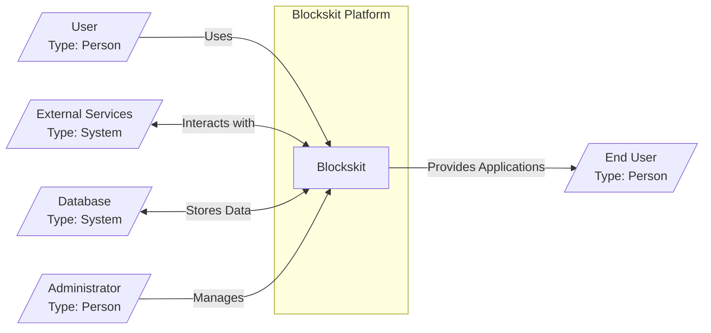

# BUSINESS POSTURE

The Blockskit project aims to provide a low-code platform that empowers users to rapidly build and deploy web applications using a visual, block-based interface. The primary business goal is to reduce the time and technical expertise required to develop web applications, enabling faster innovation and wider participation in software creation. This platform targets users who may not have extensive coding skills, such as citizen developers, business analysts, or designers, allowing them to create functional applications to address specific business needs.

Key business priorities for Blockskit include:

*   Ease of Use: The platform must be intuitive and accessible to users with varying technical backgrounds.
*   Rapid Development: Applications should be buildable and deployable quickly, significantly faster than traditional coding methods.
*   Flexibility and Extensibility: While low-code, the platform should offer sufficient flexibility to create diverse application types and potentially integrate with other systems.
*   Scalability and Reliability: Applications built on Blockskit should be able to scale to meet user demand and operate reliably.
*   Security and Data Protection: The platform and applications built on it must be secure to protect user data and business operations.

Most important business risks to address:

*   Data Breaches and Data Loss:  Unauthorized access to sensitive data within applications built on Blockskit could lead to significant financial and reputational damage.
*   Service Disruption:  Platform downtime or application unavailability can disrupt business processes and impact user productivity.
*   Unauthorized Application Access:  If access controls are not properly implemented, unauthorized users could gain access to applications and sensitive information.
*   Malicious Applications:  If the platform is not secured against malicious input or code injection, users could create applications that harm the platform or other users.
*   Compliance Violations:  Applications built on Blockskit might need to comply with various regulations (e.g., GDPR, HIPAA). Failure to meet these requirements can result in legal and financial penalties.

# SECURITY POSTURE

Existing security controls:

*   security control: GitHub repository hosting - Provides basic version control and access management for the codebase. Implemented in: GitHub.
*   security control: Code review process -  Likely implemented through GitHub pull requests, although not explicitly stated in the repository. Implemented in: Development workflow (assumed).
*   security control: Dependency management -  Uses `npm` for managing dependencies, which includes mechanisms for vulnerability scanning (e.g., `npm audit`). Implemented in: `package.json` and `package-lock.json`.
*   security control:  Frontend framework security - React framework provides some built-in security features against common web vulnerabilities (e.g., XSS prevention). Implemented in: React framework.
*   security control: Backend framework security - NestJS framework provides some built-in security features and best practices for building secure APIs. Implemented in: NestJS framework.

Accepted risks:

*   accepted risk: Reliance on open-source dependencies -  The project depends on numerous open-source libraries, which may contain vulnerabilities. Risk is partially mitigated by dependency scanning but not fully eliminated.
*   accepted risk: Security knowledge of platform users - Users building applications on Blockskit may not have strong security expertise, potentially leading to insecure application designs.

Recommended security controls:

*   security control: Implement automated Static Application Security Testing (SAST) in the CI/CD pipeline to identify potential vulnerabilities in the codebase.
*   security control: Implement automated Dynamic Application Security Testing (DAST) to test the running application for vulnerabilities.
*   security control: Implement regular dependency vulnerability scanning and automated updates.
*   security control: Implement robust input validation and sanitization across both frontend and backend to prevent injection attacks.
*   security control: Implement secure session management and authentication mechanisms.
*   security control: Implement comprehensive authorization controls to manage access to platform features and applications.
*   security control: Provide security guidelines and best practices documentation for users building applications on Blockskit.
*   security control: Implement security awareness training for developers and platform users.
*   security control: Implement logging and monitoring for security events and anomalies.

Security requirements:

*   Authentication:
    *   Requirement: Securely authenticate users accessing the Blockskit platform and applications built on it.
    *   Requirement: Support multi-factor authentication (MFA) for enhanced security.
    *   Requirement: Integrate with existing identity providers (e.g., OAuth 2.0, SAML) for enterprise environments.
*   Authorization:
    *   Requirement: Implement role-based access control (RBAC) to manage permissions within the platform and applications.
    *   Requirement: Enforce granular authorization policies to control access to specific features and data.
    *   Requirement: Ensure users can only access and modify data they are authorized to.
*   Input Validation:
    *   Requirement: Validate all user inputs on both the frontend and backend to prevent injection attacks (e.g., SQL injection, XSS).
    *   Requirement: Sanitize user inputs to remove potentially harmful characters or code.
    *   Requirement: Implement input validation rules based on expected data types, formats, and ranges.
*   Cryptography:
    *   Requirement: Use HTTPS for all communication to protect data in transit.
    *   Requirement: Securely store sensitive data at rest, such as user credentials and application data, using encryption.
    *   Requirement: Implement secure key management practices for encryption keys.
    *   Requirement: Utilize strong cryptographic algorithms and libraries.

# DESIGN

## C4 CONTEXT



Context Diagram Elements:

*   Element:
    *   Name: User
    *   Type: Person
    *   Description:  Developers, citizen developers, and other individuals who use the Blockskit platform to build and manage web applications.
    *   Responsibilities: Design, build, and deploy web applications using the Blockskit platform. Configure and manage their applications.
    *   Security controls: Authentication to access the platform, authorization to manage specific applications and platform features, input validation when configuring applications.
*   Element:
    *   Name: Blockskit
    *   Type: Software System
    *   Description: The low-code platform itself, providing the visual interface, backend services, and infrastructure for building and running web applications.
    *   Responsibilities: Provide a user-friendly interface for application development, execute application logic, manage application data, handle user authentication and authorization, and ensure platform security and stability.
    *   Security controls: Authentication and authorization for platform access, input validation, secure coding practices, vulnerability scanning, encryption of data at rest and in transit, logging and monitoring.
*   Element:
    *   Name: External Services
    *   Type: System
    *   Description:  Third-party services that Blockskit might integrate with, such as authentication providers (e.g., OAuth, SAML), external APIs, or data sources.
    *   Responsibilities: Provide functionalities or data that Blockskit applications can utilize.
    *   Security controls: Secure API communication (HTTPS), authentication and authorization mechanisms provided by external services, input validation when interacting with external services.
*   Element:
    *   Name: Database
    *   Type: System
    *   Description:  The database system used by Blockskit to store platform data, application definitions, user data, and application-specific data.
    *   Responsibilities: Persistently store and retrieve data for the Blockskit platform and its applications. Ensure data integrity and availability.
    *   Security controls: Access control to the database, encryption of data at rest, regular backups, database security hardening, monitoring of database activity.
*   Element:
    *   Name: Administrator
    *   Type: Person
    *   Description: Individuals responsible for managing and maintaining the Blockskit platform itself, including security configurations, user management, and system updates.
    *   Responsibilities: Platform maintenance, security management, user administration, monitoring platform health, applying updates and patches.
    *   Security controls: Strong authentication and authorization for administrative access, audit logging of administrative actions, secure configuration management.
*   Element:
    *   Name: End User
    *   Type: Person
    *   Description: Users who interact with the web applications built using the Blockskit platform.
    *   Responsibilities: Use the applications to perform their intended tasks.
    *   Security controls: Authentication to access applications, authorization to access specific application features and data, input validation within applications.

## C4 CONTAINER

```mermaid
graph LR
    subgraph "Blockskit Platform"
        Frontend[/"Frontend Application"\nType: Single Page Application (React)\nDescription: User interface for building and managing applications.\nTechnology: React, JavaScript, HTML, CSS"]
        BackendAPI[/"Backend API"\nType: Web Application (NestJS)\nDescription: RESTful API for platform functionalities.\nTechnology: NestJS, Node.js, TypeScript, Express"]
        DatabaseContainer[/"Database"\nType: Database System\nDescription: Persistent storage for platform and application data.\nTechnology: PostgreSQL, MySQL, or similar"]
    end
    User[/"User"\nType: Person\n/] -- Uses --> Frontend
    Frontend -- "API Calls (HTTPS)" --> BackendAPI
    BackendAPI -- "Database Queries" --> DatabaseContainer
    BackendAPI -- "External API Calls (HTTPS)" --> ExternalService[/"External Services"\nType: System\n/]
    Admin[/"Administrator"\nType: Person\n/] -- Manages --> BackendAPI
    DatabaseContainer -- Stores Data --> BackendAPI
    Frontend -- Provides UI for --> EndUser[/"End User"\nType: Person\n/]
```

Container Diagram Elements:

*   Element:
    *   Name: Frontend Application
    *   Type: Single Page Application (React)
    *   Description: The user interface of the Blockskit platform, built as a Single Page Application using React. It provides the visual block-based editor, application management tools, and user interaction elements.
    *   Responsibilities: Present the user interface, handle user interactions, communicate with the Backend API, render application previews, and manage the user session in the browser.
    *   Security controls: XSS prevention (inherent in React), input validation on the client-side, secure session management (cookies, tokens), HTTPS communication, Content Security Policy (CSP).
*   Element:
    *   Name: Backend API
    *   Type: Web Application (NestJS)
    *   Description: The backend server application built with NestJS and Node.js. It exposes a RESTful API that the Frontend Application uses to perform actions such as saving application designs, deploying applications, managing users, and accessing data.
    *   Responsibilities: Handle API requests from the Frontend, implement business logic, interact with the Database, manage user authentication and authorization, integrate with external services, and ensure data integrity.
    *   Security controls: Authentication and authorization for API endpoints, input validation and sanitization, secure coding practices, vulnerability scanning, rate limiting, protection against common web attacks (e.g., CSRF, injection attacks), logging and monitoring, HTTPS communication.
*   Element:
    *   Name: Database
    *   Type: Database System
    *   Description: A relational database system (e.g., PostgreSQL, MySQL) used to store all persistent data for the Blockskit platform, including user accounts, application definitions, application data, and platform configurations.
    *   Responsibilities: Persistently store and retrieve data for the Backend API, ensure data integrity, provide data backup and recovery, and handle database connections.
    *   Security controls: Database access control lists (ACLs), database user authentication, encryption of data at rest (if supported by the database), regular backups, database security hardening, monitoring of database activity, principle of least privilege for database access.
*   Element:
    *   Name: External Services
    *   Type: System
    *   Description: Third-party services that the Backend API might interact with, such as authentication providers (OAuth 2.0, SAML), external APIs for data enrichment, or notification services.
    *   Responsibilities: Provide functionalities or data that Blockskit applications can utilize, handle authentication and authorization for external services.
    *   Security controls: Secure API communication (HTTPS), API key management, authentication and authorization mechanisms provided by external services, input validation when interacting with external services, rate limiting when calling external APIs.

## DEPLOYMENT

Deployment Architecture Option: Cloud-based Deployment (AWS)

```mermaid
graph LR
    subgraph "AWS Cloud"
        subgraph "Virtual Private Cloud (VPC)"
            subgraph "Public Subnet"
                LoadBalancer[/"Load Balancer"\nType: AWS ELB\nDescription: Distributes traffic to Backend API instances."]
            end
            subgraph "Private Subnet"
                BackendInstances[/"Backend API Instances"\nType: EC2 Instances\nDescription: Multiple instances of the Backend API application."]
                FrontendStorage[/"Frontend Storage"\nType: AWS S3\nDescription: Stores the Frontend Application static files."]
                DatabaseInstance[/"Database Instance"\nType: AWS RDS\nDescription: Managed relational database service."]
            end
        end
        ContentDeliveryNetwork[/"Content Delivery Network (CDN)"\nType: AWS CloudFront\nDescription: Caches and serves Frontend Application static files."]
    end
    User[/"User"\nType: Person\n/] -- "HTTPS Requests" --> ContentDeliveryNetwork
    ContentDeliveryNetwork -- "Static Files" --> FrontendStorage
    ContentDeliveryNetwork -- "HTTPS Requests" --> LoadBalancer
    LoadBalancer -- "HTTPS Requests" --> BackendInstances
    BackendInstances -- "Database Connections" --> DatabaseInstance
    BackendInstances -- "External API Calls (HTTPS)" --> ExternalService[/"External Services"\nType: System\n/]
```

Deployment Diagram Elements:

*   Element:
    *   Name: Content Delivery Network (CDN)
    *   Type: AWS CloudFront
    *   Description: A CDN used to cache and serve the static files of the Frontend Application, improving performance and reducing latency for users.
    *   Responsibilities: Cache and deliver static content (HTML, CSS, JavaScript, images), reduce load on origin server (S3), provide DDoS protection, and improve website performance.
    *   Security controls: HTTPS delivery, CDN security configurations, DDoS protection, access control to origin storage (S3).
*   Element:
    *   Name: Load Balancer
    *   Type: AWS ELB (Elastic Load Balancer)
    *   Description: A load balancer that distributes incoming HTTPS traffic across multiple Backend API instances, ensuring high availability and scalability.
    *   Responsibilities: Distribute traffic, perform health checks on backend instances, provide SSL termination, and improve application availability.
    *   Security controls: HTTPS termination, security groups to control inbound traffic, access logs, integration with AWS WAF (Web Application Firewall).
*   Element:
    *   Name: Backend API Instances
    *   Type: EC2 Instances
    *   Description: Multiple virtual machines running the Backend API application. These instances process API requests, interact with the database, and handle business logic.
    *   Responsibilities: Run the Backend API application, process API requests, interact with the database, and execute business logic.
    *   Security controls: Security groups to control inbound and outbound traffic, operating system hardening, regular patching, application-level security controls (authentication, authorization, input validation), monitoring and logging, intrusion detection systems (IDS).
*   Element:
    *   Name: Frontend Storage
    *   Type: AWS S3 (Simple Storage Service)
    *   Description: AWS S3 bucket used to store the static files of the Frontend Application.
    *   Responsibilities: Store static files, serve files to CDN, provide scalable and durable storage.
    *   Security controls: S3 bucket access policies, encryption at rest, versioning, access logging.
*   Element:
    *   Name: Database Instance
    *   Type: AWS RDS (Relational Database Service)
    *   Description: A managed relational database service (e.g., PostgreSQL, MySQL) provided by AWS RDS, used for persistent data storage.
    *   Responsibilities: Manage database instances, provide backups, ensure high availability, handle database scaling, and provide database security features.
    *   Security controls: RDS security groups, database user authentication, encryption at rest and in transit, automated backups, database monitoring, patching, and security hardening provided by RDS.

## BUILD

```mermaid
graph LR
    Developer[/"Developer"\nType: Person/] --> CodeChanges[/"Code Changes"\nType: Code/]
    CodeChanges -- "Push" --> VersionControl[/"Version Control System"\nType: GitHub\nDescription: Stores source code and tracks changes."]
    VersionControl -- "Webhook Trigger" --> CI[/"CI/CD Pipeline"\nType: GitHub Actions\nDescription: Automates build, test, and deployment processes."]
    CI -- "Build & Test" --> BuildArtifacts[/"Build Artifacts"\nType: Container Images, Static Files\nDescription: Compiled and packaged application components."]
    CI -- "Security Scans" --> SecurityScanResults[/"Security Scan Results"\nType: Reports\nDescription: SAST, DAST, Dependency Scan reports."]
    BuildArtifacts -- "Publish" --> ArtifactRegistry[/"Artifact Registry"\nType: Container Registry, S3\nDescription: Stores build artifacts for deployment."]
    ArtifactRegistry -- "Deploy" --> DeploymentEnvironment[/"Deployment Environment"\nType: AWS Cloud\nDescription: Target environment for application deployment."]
    style SecurityScanResults fill:#f9f,stroke:#333,stroke-width:2px
```

Build Process Description:

1.  Developer makes code changes and pushes them to the Version Control System (GitHub).
2.  GitHub triggers the CI/CD Pipeline (e.g., GitHub Actions) via webhook.
3.  The CI/CD Pipeline performs the following steps:
    *   Build: Compiles the frontend and backend code, packages static files, and builds container images (if containerized).
    *   Test: Runs automated unit tests, integration tests, and potentially end-to-end tests.
    *   Security Scans: Executes security scans, including:
        *   Static Application Security Testing (SAST) to analyze source code for vulnerabilities.
        *   Dependency vulnerability scanning to identify vulnerable dependencies.
        *   Potentially Dynamic Application Security Testing (DAST) against a deployed test environment.
    *   Build Artifacts Creation: Creates build artifacts, such as container images for the backend and static files for the frontend.
4.  Security Scan Results are generated and reviewed (ideally, failing the pipeline if critical vulnerabilities are found).
5.  Build Artifacts are published to an Artifact Registry (e.g., container registry for backend images, S3 for frontend static files).
6.  The CI/CD Pipeline then deploys the Build Artifacts to the Deployment Environment (e.g., AWS Cloud).

Build Process Security Controls:

*   security control: Version Control System (GitHub) - Securely stores source code, tracks changes, and provides access control.
*   security control: CI/CD Pipeline (GitHub Actions) - Automates the build, test, and deployment process, ensuring consistency and repeatability.
*   security control: Automated Security Scans (SAST, DAST, Dependency Scanning) - Identifies potential vulnerabilities early in the development lifecycle.
*   security control: Code Review Process - Peer review of code changes before merging to the main branch to catch potential security flaws and improve code quality.
*   security control: Artifact Registry - Securely stores build artifacts and controls access to them.
*   security control: Immutable Infrastructure - Deploying applications as immutable artifacts (e.g., container images) reduces configuration drift and improves security.
*   security control: Principle of Least Privilege - Granting only necessary permissions to CI/CD pipelines and deployment processes.
*   security control: Audit Logging - Logging build and deployment activities for auditing and security monitoring.
*   security control: Supply Chain Security - Managing and securing dependencies, using trusted base images for containers, and verifying artifact integrity.

# RISK ASSESSMENT

Critical business processes we are trying to protect:

*   Application Development Process: The ability for users to build and deploy applications using the Blockskit platform. Disruption to this process would prevent users from creating new applications or updating existing ones.
*   Application Availability: The availability and proper functioning of applications built on Blockskit. Downtime or malfunctions can directly impact the business operations of end-users relying on these applications.
*   Data Integrity and Confidentiality: Protecting the integrity and confidentiality of data stored and processed by the Blockskit platform and the applications built on it. Data breaches or data corruption can lead to significant financial and reputational damage.
*   Platform Security and Stability: Ensuring the overall security and stability of the Blockskit platform itself. Compromise of the platform could affect all applications and users.

Data we are trying to protect and their sensitivity:

*   User Credentials: Usernames, passwords, API keys, and other authentication credentials. Sensitivity: Highly sensitive. Compromise can lead to unauthorized access to the platform and applications.
*   Application Definitions: The visual designs and configurations of applications built on Blockskit. Sensitivity: Sensitive. Represents intellectual property and business logic. Unauthorized access or modification could lead to business disruption or competitive disadvantage.
*   Application Data: Data stored and processed by applications built on Blockskit. Sensitivity: Varies depending on the application. Could range from low sensitivity (public data) to highly sensitive (personal data, financial data, health records). Sensitivity level is determined by the users of the platform and the applications they build.
*   Platform Configuration Data: Settings and configurations of the Blockskit platform itself. Sensitivity: Sensitive. Improper configuration could lead to security vulnerabilities or platform instability.
*   Audit Logs: Logs of user activity, system events, and security events. Sensitivity: Sensitive. Important for security monitoring, incident response, and compliance.

# QUESTIONS & ASSUMPTIONS

Questions:

*   What is the intended deployment environment for Blockskit (cloud, on-premise, hybrid)?
*   What are the specific compliance requirements for applications built on Blockskit (e.g., GDPR, HIPAA, PCI DSS)?
*   What level of security expertise is expected from users building applications on Blockskit?
*   What types of applications are expected to be built on Blockskit (e.g., internal tools, customer-facing applications, e-commerce platforms)?
*   What is the process for managing and updating dependencies for the Blockskit platform and applications?
*   Are there any existing security policies or guidelines that Blockskit needs to adhere to?
*   What is the incident response plan for security incidents related to Blockskit?

Assumptions:

*   BUSINESS POSTURE:
    *   Rapid application development and ease of use are primary business drivers.
    *   Security is a critical but potentially secondary concern compared to speed and usability for initial adoption.
    *   The platform will be used to build applications that handle sensitive data.
*   SECURITY POSTURE:
    *   Currently, security controls are basic and rely heavily on framework defaults and manual processes.
    *   There is an accepted risk associated with reliance on open-source dependencies and varying security knowledge of platform users.
    *   Security will become increasingly important as the platform matures and adoption grows.
*   DESIGN:
    *   The platform is designed as a web application with a frontend and backend architecture.
    *   A relational database is used for persistent data storage.
    *   Deployment will likely be cloud-based for scalability and ease of management.
    *   A CI/CD pipeline will be used for automated build and deployment.