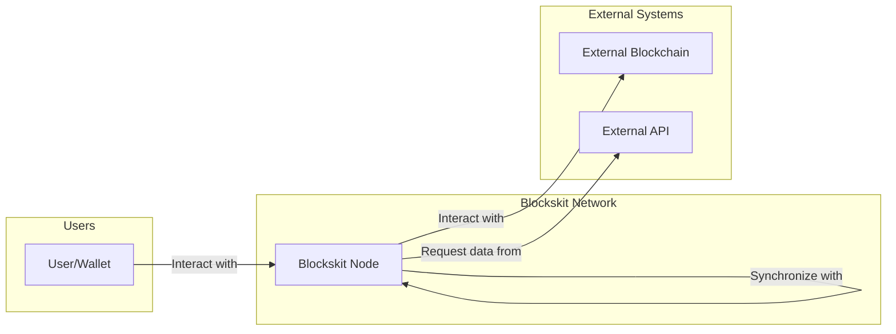
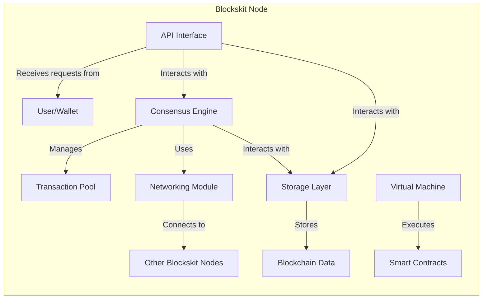
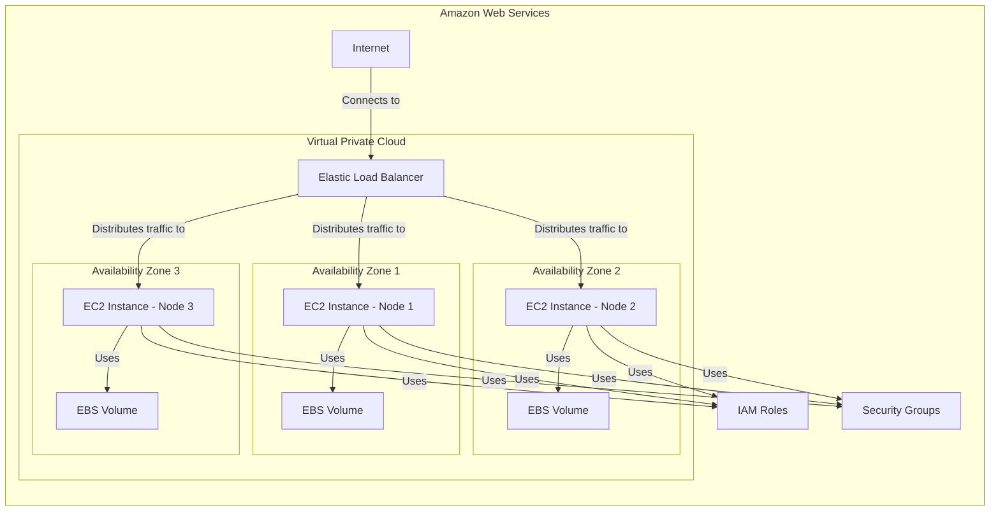

Okay, let's dive into creating a design document for the Blockskit project, focusing on aspects relevant to threat modeling.

# BUSINESS POSTURE

Blockskit, based on the GitHub repository, appears to be a modular framework for building blockchains. It seems targeted at developers who want a flexible and customizable base for creating their own blockchain solutions. This suggests a business posture that prioritizes:

*   _Priorities_:
    *   Developer adoption: Making the framework easy to use and understand is crucial for attracting developers.
    *   Flexibility and Customizability: The core value proposition is the ability to tailor the blockchain to specific needs.
    *   Performance and Scalability: Blockchains need to handle transactions efficiently, so performance is a key concern.
    *   Security and Reliability: As a foundational technology for potentially valuable assets, security is paramount.
    *   Maintainability and Extensibility: The project needs to be easily maintained and extended over time.

*   _Goals_:
    *   Provide a robust and secure foundation for building custom blockchains.
    *   Enable rapid prototyping and development of blockchain applications.
    *   Foster a community of developers around the framework.
    *   Become a recognized and trusted solution in the blockchain space.

*   _Business Risks_:
    *   _Low Adoption Rate_: If the framework is too complex, poorly documented, or lacks key features, developers may choose alternatives.
    *   _Security Vulnerabilities_: Flaws in the core framework could lead to exploits and loss of value in blockchains built upon it. This is the most critical risk.
    *   _Scalability Bottlenecks_: If the framework cannot handle a sufficient transaction volume, it will limit the usefulness of blockchains built with it.
    *   _Lack of Community Support_: A weak community can hinder development, bug fixing, and overall project growth.
    *   _Competition from Other Frameworks_: The blockchain space is rapidly evolving, and new frameworks may emerge that offer superior features or performance.

# SECURITY POSTURE

Based on the repository (and inherent to blockchain technology), the following security controls and accepted risks are likely present:

*   _Existing Security Controls_:
    *   security control: Cryptographic primitives: The foundation of blockchain security relies on cryptography (hashing, digital signatures, etc.). Implemented in core libraries and modules.
    *   security control: Consensus mechanisms: Blockskit likely implements various consensus algorithms (e.g., Proof-of-Work, Proof-of-Stake) to ensure agreement on the state of the blockchain. Described in documentation and implemented in consensus modules.
    *   security control: Peer-to-peer networking: Secure communication between nodes is essential. Likely uses TLS or similar protocols. Implemented in networking components.
    *   security control: Data validation: Input validation is crucial to prevent malicious or malformed data from entering the blockchain. Implemented in transaction processing and block validation logic.
    *   security control: Access control: Permissions and roles may be implemented to restrict access to certain functions or data. Implemented in modules related to account management and authorization.

*   _Accepted Risks_:
    *   accepted risk: 51% attacks: Inherent to many blockchain consensus mechanisms, a majority of network participants could collude to alter the blockchain.
    *   accepted risk: Vulnerabilities in specific implementations: While the framework itself may be secure, individual blockchains built upon it could introduce vulnerabilities through custom code.
    *   accepted risk: Key management risks: Users are responsible for securely managing their private keys. Loss or theft of keys can lead to loss of funds.
    *   accepted risk: Smart contract vulnerabilities: If Blockskit supports smart contracts, vulnerabilities in those contracts could lead to exploits.
    *   accepted risk: Denial of Service: It's almost impossible to prevent all possible denial of service attacks.

*   _Recommended Security Controls_:
    *   security control: Formal verification: For critical components (e.g., consensus, cryptography), consider formal verification to mathematically prove their correctness.
    *   security control: Regular security audits: Conduct independent security audits to identify and address potential vulnerabilities.
    *   security control: Bug bounty program: Incentivize security researchers to find and report vulnerabilities.
    *   security control: Secure coding guidelines: Provide clear guidelines for developers building on Blockskit to minimize the risk of introducing vulnerabilities.
    *   security control: Supply chain security: Implement measures to ensure the integrity of dependencies and build processes.

*   _Security Requirements_:
    *   _Authentication_:
        *   Users (wallets) are authenticated using cryptographic key pairs (public/private keys).
        *   Nodes in the network may authenticate each other using TLS certificates or similar mechanisms.
    *   _Authorization_:
        *   Access control lists (ACLs) or role-based access control (RBAC) may be used to restrict access to certain functions or data.
        *   Smart contracts (if supported) may have their own authorization mechanisms.
    *   _Input Validation_:
        *   All inputs (transactions, blocks, messages) must be rigorously validated to prevent malformed data from entering the system.
        *   Validation rules should be defined for each data type and enforced consistently.
    *   _Cryptography_:
        *   Use strong, well-vetted cryptographic algorithms for hashing, digital signatures, and encryption.
        *   Key management must be secure and follow best practices.
        *   Random number generation must be cryptographically secure.

# DESIGN

## C4 CONTEXT



*   _Elements_:
    *   _User/Wallet_:
        *   Name: User/Wallet
        *   Type: Person
        *   Description: Represents an end-user interacting with the Blockskit-based blockchain.  This could be through a dedicated wallet application, a web interface, or another client.
        *   Responsibilities: Creating transactions, signing transactions, querying blockchain data, managing keys.
        *   Security controls: Key management, secure storage of private keys, protection against phishing attacks.
    *   _Blockskit Node_:
        *   Name: Blockskit Node
        *   Type: Software System
        *   Description: A single instance of a node running the Blockskit framework.  This is the core component of the blockchain network.
        *   Responsibilities: Participating in consensus, validating transactions and blocks, storing the blockchain data, communicating with other nodes, providing an API for interaction.
        *   Security controls: Cryptographic primitives, consensus mechanisms, peer-to-peer networking security, data validation, access control.
    *   _External Blockchain_:
        *   Name: External Blockchain
        *   Type: Software System
        *   Description: Another blockchain network that the Blockskit-based blockchain might interact with (e.g., for cross-chain communication).
        *   Responsibilities: Maintaining its own state and consensus, potentially exchanging data with the Blockskit network.
        *   Security controls: Dependent on the specific external blockchain's security mechanisms.
    *   _External API_:
        *   Name: External API
        *   Type: Software System
        *   Description: An external service that the Blockskit-based blockchain might interact with (e.g., for retrieving external data, interacting with other systems).
        *   Responsibilities: Providing data or services to the Blockskit network.
        *   Security controls: API authentication, authorization, input validation, rate limiting.

## C4 CONTAINER



*   _Elements_:
    *   _API Interface_:
        *   Name: API Interface
        *   Type: Container
        *   Description: Provides an interface for external clients (wallets, applications) to interact with the node.
        *   Responsibilities: Handling requests, validating inputs, routing requests to appropriate modules, returning responses.
        *   Security controls: Authentication, authorization, input validation, rate limiting, TLS encryption.
    *   _Consensus Engine_:
        *   Name: Consensus Engine
        *   Type: Container
        *   Description: Implements the consensus algorithm (e.g., PoW, PoS) to ensure agreement on the state of the blockchain.
        *   Responsibilities: Proposing blocks, validating blocks, resolving forks, reaching consensus with other nodes.
        *   Security controls: Cryptographic verification of blocks and signatures, protection against Sybil attacks, resistance to 51% attacks.
    *   _Networking Module_:
        *   Name: Networking Module
        *   Type: Container
        *   Description: Handles communication between nodes in the network.
        *   Responsibilities: Discovering peers, establishing connections, sending and receiving messages, managing network topology.
        *   Security controls: TLS encryption, peer authentication, protection against denial-of-service attacks.
    *   _Storage Layer_:
        *   Name: Storage Layer
        *   Type: Container
        *   Description: Manages the persistent storage of the blockchain data.
        *   Responsibilities: Storing blocks, transactions, and other relevant data, providing efficient access to data, ensuring data integrity.
        *   Security controls: Data integrity checks, access control, encryption at rest (optional).
    *   _Virtual Machine (VM)_:
        *   Name: Virtual Machine
        *   Type: Container
        *   Description: Executes smart contracts (if supported by the specific Blockskit configuration).
        *   Responsibilities: Loading and executing smart contract code, managing contract state, providing a secure execution environment.
        *   Security controls: Sandboxing, resource limits, gas metering, protection against common smart contract vulnerabilities.
    *   _Transaction Pool_:
        *   Name: Transaction Pool
        *   Type: Container
        *   Description: Holds pending transactions that have not yet been included in a block.
        *   Responsibilities: Receiving and validating transactions, prioritizing transactions, providing transactions to the consensus engine.
        *   Security controls: Transaction validation, signature verification, protection against double-spending.

## DEPLOYMENT

Blockskit, being a framework, can be deployed in various configurations. Here are some possibilities, with a detailed description of one:

*   _Possible Deployment Solutions_:
    *   _Single Node_: For testing and development purposes.
    *   _Private Network_: A network of nodes controlled by a single organization or consortium.
    *   _Public Network_: A decentralized network open to anyone.
    *   _Cloud-Based Deployment_: Using cloud providers like AWS, Google Cloud, or Azure.
    *   _On-Premise Deployment_: Running nodes on dedicated hardware within an organization's infrastructure.

*   _Chosen Solution: Cloud-Based Deployment (e.g., AWS)_:



*   _Elements_:
    *   _EC2 Instance_:
        *   Name: EC2 Instance - Node [Number]
        *   Type: Virtual Machine
        *   Description: A virtual machine running the Blockskit node software. Multiple instances are deployed across different availability zones for high availability.
        *   Responsibilities: Running the Blockskit node software, participating in the blockchain network.
        *   Security controls: Operating system hardening, firewall rules, regular security updates, intrusion detection.
    *   _EBS Volume_:
        *   Name: EBS Volume
        *   Type: Storage
        *   Description: Persistent block storage attached to each EC2 instance. Stores the blockchain data.
        *   Responsibilities: Providing persistent storage for the blockchain data.
        *   Security controls: Encryption at rest, snapshots for backup and recovery.
    *   _Elastic Load Balancer (ELB)_:
        *   Name: Elastic Load Balancer
        *   Type: Load Balancer
        *   Description: Distributes incoming traffic across multiple EC2 instances.
        *   Responsibilities: Providing a single point of access to the blockchain network, improving availability and scalability.
        *   Security controls: TLS termination, health checks, DDoS protection.
    *   _IAM Roles_:
        *   Name: IAM Roles
        *   Type: Identity and Access Management
        *   Description: Defines permissions for the EC2 instances to access other AWS services.
        *   Responsibilities: Granting necessary permissions to the Blockskit nodes.
        *   Security controls: Least privilege principle, regular review of permissions.
    *   _Security Groups_:
        *   Name: Security Groups
        *   Type: Firewall
        *   Description: Acts as a virtual firewall for the EC2 instances, controlling inbound and outbound traffic.
        *   Responsibilities: Restricting network access to the Blockskit nodes.
        *   Security controls: Inbound and outbound rules based on IP address, port, and protocol.
    * _Internet_:
        *   Name: Internet
        *   Type: Network
        *   Description: Public network.
        *   Responsibilities: Provides access to blockchain network.
        *   Security controls: None.

## BUILD

The build process for Blockskit likely involves several steps, from compiling the source code to creating deployable artifacts. Security is crucial throughout this process.

```mermaid
graph LR
    subgraph Developer Workstation
        Dev[Developer]
        Code[Source Code]
        Dev -- Writes --> Code
    end
    subgraph CI/CD Pipeline [CI/CD Pipeline (e.g., GitHub Actions)]
        Lint[Linters]
        SAST[SAST Scanner]
        Test[Unit Tests]
        Build[Build Process]
        Package[Packaging]
        Publish[Publish Artifacts]

        Code -- Triggers --> CI/CD_Pipeline
        CI/CD_Pipeline -- Runs --> Lint
        CI/CD_Pipeline -- Runs --> SAST
        CI/CD_Pipeline -- Runs --> Test
        CI/CD_Pipeline -- Executes --> Build
        Build -- Creates --> Package
        Package -- Is published by --> Publish
    end
    subgraph Artifact Repository [Artifact Repository]
        Artifacts[Build Artifacts]
        Publish -- Stores --> Artifacts
    end
    Artifacts -- Deployed to --> Deployment_Environment[Deployment Environment]
```

*   _Process Description_:
    1.  _Development_: Developers write and modify the source code on their local workstations.
    2.  _Code Commit_: Code changes are committed to a version control system (e.g., Git).
    3.  _CI/CD Trigger_: A commit triggers the CI/CD pipeline (e.g., GitHub Actions, Jenkins).
    4.  _Linting_: Linters check the code for style and potential errors.
    5.  _SAST_: Static Application Security Testing (SAST) tools scan the code for security vulnerabilities.
    6.  _Unit Tests_: Unit tests are executed to verify the functionality of individual components.
    7.  _Build_: The source code is compiled into executable binaries or other deployable artifacts.
    8.  _Packaging_: The artifacts are packaged into a suitable format for deployment (e.g., Docker images, tarballs).
    9.  _Publish_: The packaged artifacts are published to an artifact repository (e.g., Docker Hub, a private registry).
    10. _Deployment_: The artifacts are deployed to the target environment.

*   _Security Controls_:
    *   security control: Code signing: Digitally sign the build artifacts to ensure their integrity and authenticity.
    *   security control: Dependency scanning: Scan dependencies for known vulnerabilities.
    *   security control: Software Bill of Materials (SBOM): Generate an SBOM to track all components and dependencies.
    *   security control: Build environment isolation: Run the build process in an isolated environment to prevent contamination.
    *   security control: Least privilege: Grant the CI/CD pipeline only the necessary permissions.

# RISK ASSESSMENT

*   _Critical Business Processes_:
    *   Maintaining the integrity and availability of the blockchain.
    *   Ensuring the secure execution of transactions and smart contracts (if applicable).
    *   Protecting user funds and data.
    *   Facilitating secure and reliable communication between nodes.

*   _Data to Protect_:
    *   _Blockchain Data_: The entire history of transactions and blocks. Sensitivity: High (public, but immutable and auditable).
    *   _Private Keys_: Used to authorize transactions. Sensitivity: Extremely High (must be kept secret).
    *   _Node Configuration Data_: Settings and parameters for the Blockskit node. Sensitivity: Medium (could reveal information about the network).
    *   _Smart Contract Code (if applicable)_: The source code and bytecode of smart contracts. Sensitivity: High (vulnerabilities could lead to exploits).
    *   _User Data (if stored by the node)_: Any personal or sensitive information stored by the node. Sensitivity: Depends on the specific data.

# QUESTIONS & ASSUMPTIONS

*   _Questions_:
    *   What specific consensus mechanisms are supported by Blockskit?
    *   Does Blockskit support smart contracts, and if so, which virtual machine is used?
    *   What are the specific networking protocols used for peer-to-peer communication?
    *   What are the recommended deployment configurations for different use cases (testing, private, public)?
    *   What are the existing security audits or certifications for Blockskit?
    *   Are there any plans for formal verification of critical components?
    *   What is the process for reporting and handling security vulnerabilities?
    *   What level of transaction throughput is Blockskit designed to handle?
    *   What are the specific data storage mechanisms used (e.g., database type)?
    *   Does Blockskit provide any built-in mechanisms for data privacy or confidentiality?

*   _Assumptions_:
    *   _BUSINESS POSTURE_: Blockskit is intended for developers building custom blockchain solutions, not for end-users directly.
    *   _SECURITY POSTURE_: Basic cryptographic security principles are implemented correctly. Developers building on Blockskit are responsible for the security of their own applications.
    *   _DESIGN_: The core components of a blockchain (consensus, networking, storage, API) are present and modular. The deployment environment will be secured according to best practices. The build process will incorporate security checks.