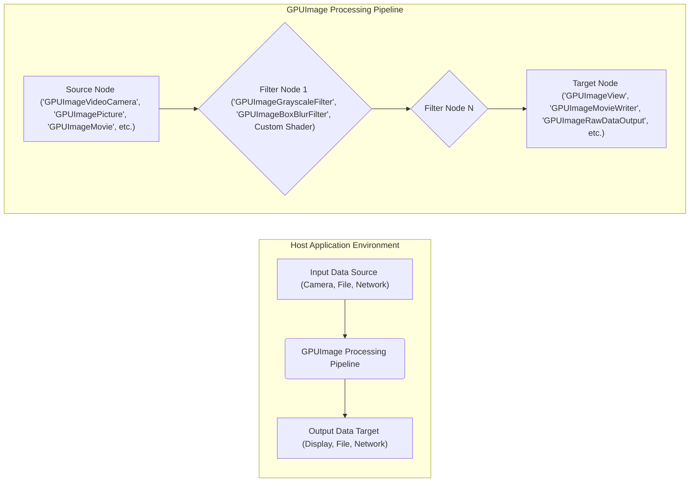

# Project Design Document: GPUImage Framework

**Version:** 1.1
**Date:** October 26, 2023
**Author:** Gemini (AI Architecture Expert)

## 1. Introduction

This document provides an enhanced design overview of the GPUImage framework, an open-source iOS and macOS library for performing image and video processing using the graphics processing unit (GPU). This document is specifically tailored to serve as a robust foundation for subsequent threat modeling activities. It details the core components, data flow, interactions, and external interfaces of the framework, as well as its integration within host applications.

## 2. Project Goals

The primary goal of GPUImage is to offer a high-performance and adaptable framework for applying a wide range of image and video filters and effects on Apple's operating systems. Key objectives include:

* **High-Performance GPU Processing:**  Maximize the utilization of the GPU's parallel processing capabilities to achieve real-time or near real-time performance for image and video manipulation tasks.
* **Extensible Filter Architecture:**  Enable developers to readily create and integrate custom filters and processing stages, fostering flexibility and innovation.
* **Simplified Integration:** Provide a well-defined and intuitive API, making it straightforward for developers to incorporate GPUImage into their iOS and macOS applications.
* **Apple Ecosystem Compatibility:** Ensure seamless operation and integration across both iOS and macOS platforms.

## 3. Architectural Overview

GPUImage employs a directed acyclic graph (DAG) architecture, where distinct processing stages (sources, filters, and targets) are interconnected. Image or video frame data traverses this graph, undergoing transformations at each filter stage.

**Key Architectural Concepts:**

* **Sources:** Components responsible for feeding image or video data into the processing pipeline. These act as the starting point of the data flow.
* **Filters:** Components that implement specific image or video transformations. They receive input data, apply processing logic, and generate output data.
* **Targets:** Components that consume the processed image or video data from the pipeline. They represent the end points of the data flow.
* **Processing Pipeline:** The interconnected sequence of source, filter, and target nodes that defines the flow of data and the series of transformations applied.

## 4. Component Description

This section provides a detailed description of the major components within the GPUImage framework:

* **`GPUImageContext`:**
    * Manages the underlying OpenGL ES (or Metal) context used for all GPU-based operations.
    * Acts as a central point for managing GPU resources, including framebuffers and textures.
    * Typically implemented as a singleton to ensure consistent resource management.

* **Source Nodes:**
    * **`GPUImageVideoCamera`:** Captures live video frames directly from the device's camera.
        * Manages the underlying AVFoundation `AVCaptureSession`.
        * Configures camera settings such as resolution, frame rate, and orientation.
        * Handles asynchronous capture of video frames.
        * Provides access to raw camera pixel buffers.
    * **`GPUImagePicture`:** Loads and provides still images for processing.
        * Supports various image file formats (e.g., JPEG, PNG).
        * Handles image decoding and the creation of GPU textures from image data.
    * **`GPUImageMovie`:** Loads and provides video frames from movie files.
        * Utilizes AVFoundation for video decoding and frame extraction.
        * Manages video playback timing and synchronization.
    * **`GPUImageRawDataInput`:** Allows developers to directly feed raw pixel data into the processing pipeline.
        * Offers flexibility for integrating with custom data sources or processing pipelines.

* **Filter Nodes:**
    * Implement specific image or video processing algorithms using GPU shaders.
    * Receive input textures, perform calculations on the GPU, and output processed textures.
    * Examples include: `GPUImageGrayscaleFilter`, `GPUImageBoxBlurFilter`, `GPUImageSobelEdgeDetectionFilter`, and custom shader-based filters.
    * Often have adjustable parameters (e.g., blur radius, contrast level) that can be configured programmatically.
    * May have specific input and output format requirements (e.g., color space, resolution).

* **Target Nodes:**
    * **`GPUImageView`:** Displays the processed output on a `UIView` (iOS) or `NSView` (macOS).
        * Handles the rendering of the output texture to the screen.
        * Manages display refresh and synchronization with the processing pipeline.
    * **`GPUImageMovieWriter`:** Encodes and writes the processed video frames to a movie file.
        * Utilizes AVFoundation for video encoding.
        * Allows configuration of encoding settings such as codec, bitrate, and output file format.
    * **`GPUImageStillImageFilter`:** Allows capturing a still image from any point within the processing pipeline.
        * Provides a mechanism to extract a single processed frame.
    * **`GPUImageRawDataOutput`:** Provides direct access to the raw pixel data of the processed output.
        * Enables further custom processing or analysis of the output data in the host application.

* **`GPUImageFilterGroup`:**
    * Facilitates the organization of multiple filters into a single, reusable processing unit.
    * Simplifies the management of complex processing pipelines by encapsulating a series of interconnected filters.
    * Manages the internal connections and data flow between the grouped filters.

* **`GPUImageFramebuffer`:**
    * Represents an off-screen buffer in GPU memory used to store intermediate processing results.
    * Managed by the `GPUImageContext`.
    * Essential for multi-stage processing where the output of one filter becomes the input of the next.

* **Shaders (GLSL/Metal Shading Language):**
    * Define the low-level GPU programs that perform the actual image and video processing.
    * Written in OpenGL Shading Language (GLSL) or Metal Shading Language, depending on the platform and configuration.
    * Provide fine-grained control over pixel manipulation and GPU computations.

## 5. Data Flow

The typical data flow within GPUImage proceeds as follows:

1. **Data Acquisition:** A source node (e.g., `GPUImageVideoCamera`) acquires image or video data from its source.
2. **Texture Creation:** The source node converts the raw data (e.g., pixel buffers, image data) into OpenGL or Metal textures, which are the fundamental data format for GPU processing.
3. **Pipeline Traversal:** The texture is passed to the first filter node in the configured processing pipeline.
4. **Filter Processing:** Each filter node receives the input texture, applies its specific processing algorithm (defined by its shaders), and generates a new processed texture as output.
5. **Intermediate Storage:** Intermediate processed textures are often stored in `GPUImageFramebuffer` objects for use by subsequent filters in the pipeline.
6. **Output to Target:** The final processed texture is passed to a target node (e.g., `GPUImageView`, `GPUImageMovieWriter`).
7. **Rendering or Encoding:** The target node either renders the texture to the display or encodes it into a video file, or makes the raw data available.

**Example Data Flow (Real-time Camera with Blur):**

1. `GPUImageVideoCamera` captures a frame from the device's camera.
2. The captured frame is converted into an OpenGL/Metal texture.
3. The texture is passed to a `GPUImageBoxBlurFilter`.
4. The `GPUImageBoxBlurFilter` applies its blur shader to the texture, producing a blurred texture.
5. The blurred texture is passed to a `GPUImageView`.
6. `GPUImageView` renders the blurred texture on the device's screen.

## 6. Integration with Host Applications

GPUImage is designed to be integrated as a framework within iOS and macOS applications. The typical integration process involves:

1. **Framework Inclusion:** Adding the GPUImage framework to the host application's project.
2. **Instantiation:** Creating instances of the desired source, filter, and target nodes.
3. **Configuration:** Setting the necessary parameters for each node (e.g., filter strength, camera resolution, output file path).
4. **Pipeline Construction:** Connecting the nodes together to form the desired processing chain, defining the flow of data.
5. **Initiation:** Starting the data flow by initiating the source node (e.g., starting the camera capture).

Host applications interact with GPUImage primarily through its Objective-C (and increasingly Swift) API.

## 7. External Interfaces

GPUImage interacts with several external components and subsystems:

* **Operating System (iOS/macOS):**
    * **AVFoundation:** Used for camera access (`GPUImageVideoCamera`) and video file handling (`GPUImageMovie`, `GPUImageMovieWriter`).
    * **CoreGraphics/UIKit/AppKit:** Used for image loading (`GPUImagePicture`) and display (`GPUImageView`).
    * **OpenGL ES/Metal:** The underlying graphics APIs used for GPU processing.
* **Hardware:**
    * **Camera:** Accessed directly for live video input.
    * **GPU:** The primary processing unit utilized by the framework.
    * **Display:** Used for rendering processed output.
    * **Storage:** Used for reading and writing image and video files.

## 8. Security Considerations

This section outlines potential security considerations relevant to GPUImage, forming a basis for threat modeling:

* **Input Validation:**
    * **Malicious Image/Video Files:** Ensure robust validation of image and video files loaded via `GPUImagePicture` and `GPUImageMovie` to prevent vulnerabilities from malformed files (e.g., buffer overflows, denial-of-service).
    * **Camera Input Manipulation:** Consider potential risks if the camera input stream can be manipulated externally.
    * **Raw Data Injection:** Validate and sanitize raw pixel data provided through `GPUImageRawDataInput` to prevent injection attacks.
* **Shader Security:**
    * **Malicious Custom Shaders:**  Custom shaders, if permitted, could contain malicious code that could potentially compromise the GPU, leak information, or cause system instability. Implement mechanisms to review or restrict custom shader usage.
    * **Shader Parameter Injection:** Sanitize and validate parameters passed to shaders to prevent unintended behavior or exploits.
* **Privacy:**
    * **Camera Data Handling:** When using `GPUImageVideoCamera`, ensure adherence to privacy best practices. Obtain necessary user permissions and avoid unauthorized storage or transmission of camera data.
    * **User Media Access:**  Properly handle user permissions for accessing photos and videos from the device's library.
* **Resource Management:**
    * **GPU Resource Exhaustion:**  Improper management of GPU resources (e.g., framebuffers, textures) could lead to denial-of-service or application crashes. Implement robust resource allocation and deallocation mechanisms.
    * **Memory Leaks:** Ensure proper deallocation of memory associated with GPUImage objects to prevent memory leaks.
* **Dependency Security:**
    * **Third-Party Libraries:** Assess the security posture of any third-party libraries or dependencies used by GPUImage.
* **Host Application Integration:**
    * **Vulnerabilities in Host Application:** Security vulnerabilities in the host application that integrates GPUImage could potentially be exploited to compromise the framework or its data. Secure coding practices in the host application are crucial.
* **Data Integrity:**
    * Ensure the integrity of processed data, especially when dealing with sensitive information. Consider potential for data manipulation during processing.

## 9. Deployment

GPUImage is deployed as a dynamic framework that is linked into the host application's bundle. It executes within the application's process and leverages the device's GPU for processing.

## 10. Assumptions and Constraints

* **Target Platforms:** Primarily designed for iOS and macOS.
* **Graphics API:** Primarily utilizes OpenGL ES (and increasingly Metal) for GPU operations.
* **Primary Language:** Primarily written in Objective-C, with increasing adoption of Swift.
* **GPU Availability:** Assumes the presence of a functional GPU on the target device.
* **Permissions Handling:** Relies on the host application to request and manage necessary user permissions (e.g., camera, photo library access).

This detailed design document provides a comprehensive understanding of the GPUImage framework's architecture, components, and interactions. It serves as a crucial input for conducting thorough threat modeling, enabling the identification and mitigation of potential security vulnerabilities.