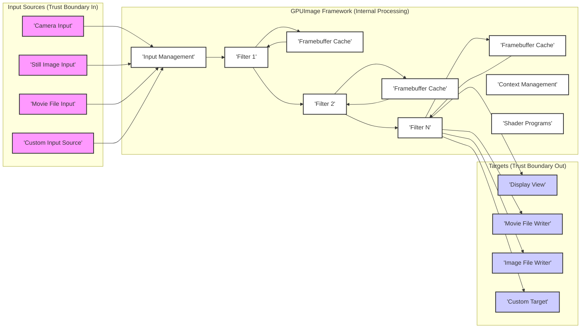

## Project Design Document: GPUImage Framework (Improved)

**1. Introduction**

This document provides an enhanced and more detailed design overview of the GPUImage framework, an open-source library for iOS and macOS that enables GPU-accelerated image and video processing. This document is specifically crafted to serve as a robust foundation for subsequent threat modeling activities. It meticulously outlines the key components, data flow, interactions, and trust boundaries within the framework.

**1.1. Purpose**

The primary purpose of this document is to furnish a comprehensive and security-focused architectural understanding of the GPUImage framework. This in-depth understanding is paramount for effectively identifying potential security vulnerabilities, analyzing attack surfaces, and designing appropriate mitigation strategies during the threat modeling process.

**1.2. Scope**

This document encompasses the core architecture and functionality of the GPUImage framework as represented in the provided GitHub repository. It places a strong emphasis on the data flow, key components, interactions, and trust boundaries that are directly relevant to security considerations. While it describes the general principles of filter operation, it does not delve into the intricate details of individual image processing filters' algorithms or the low-level implementation specifics of the underlying graphics APIs (OpenGL ES or Metal).

**1.3. Goals**

*   Clearly and comprehensively define the major components of the GPUImage framework and their responsibilities.
*   Illustrate the detailed flow of image and video data through the framework, highlighting transformation points.
*   Identify key interaction points, trust boundaries, and data access patterns within the system.
*   Provide a solid and actionable foundation for identifying potential threat vectors, attack surfaces, and security weaknesses.

**2. System Overview**

GPUImage is a powerful framework designed to streamline the application of complex image and video processing effects on iOS and macOS devices. It achieves this by harnessing the parallel processing capabilities of the Graphics Processing Unit (GPU). The framework offers a high-level, intuitive API that allows developers to construct chains of various image processing filters and seamlessly apply them to diverse sources of image and video data.

**3. Architectural Design**

The GPUImage framework is structured around a pipeline architecture, where image and video data progresses through a series of interconnected and specialized components.

**3.1. Key Components**

*   **Input Sources:** These components are responsible for ingesting the raw image or video data into the framework. They represent the initial trust boundary. Examples include:
    *   `GPUImageVideoCamera`: Captures real-time video frames from the device's camera.
    *   `GPUImagePicture`: Loads and provides still images from various sources (e.g., photo library, files).
    *   `GPUImageMovie`: Reads and decodes video frames from movie files.
    *   Custom Input Sources: Developers can implement custom sources for network streams or other data providers.
*   **Filters:** These are the fundamental processing units within the framework. Each filter performs a specific image or video manipulation operation. They operate within the GPU's memory space. Examples include:
    *   Color Adjustment Filters: Modify brightness, contrast, saturation, hue, etc.
    *   Blur Filters: Apply various blurring algorithms.
    *   Sharpening Filters: Enhance image details.
    *   Geometric Transformation Filters: Perform rotations, scaling, cropping, etc.
    *   Custom Filters: Implemented by developers using OpenGL Shading Language (GLSL) or potentially Metal Shading Language.
*   **Targets:** These components are the recipients of the processed image or video data from the filters. They represent the final trust boundary where data is output. Examples include:
    *   `GPUImageView`: Displays the processed video or image on the screen.
    *   `GPUImageMovieWriter`: Encodes and saves processed video frames to a movie file.
    *   Image File Writers: Save processed images to various file formats.
    *   Custom Targets: Allow developers to integrate the processed data into other parts of their application or transmit it over a network.
*   **Filter Chain Management:** This internal mechanism orchestrates the sequence of filters applied to the input data. It ensures that data flows correctly from one filter to the next.
*   **Framebuffer Cache:** This component efficiently manages the allocation and reuse of GPU memory buffers (framebuffers). These buffers store intermediate results between filters, significantly optimizing performance by minimizing memory allocation overhead.
*   **Context Management:** This crucial component handles the creation, management, and sharing of the OpenGL ES (or potentially Metal) context used for all GPU rendering operations. It ensures that all GPU commands are executed within a valid and consistent context.
*   **Shader Programs:** Filters are typically implemented using OpenGL Shading Language (GLSL) programs that are executed on the GPU. These programs define the precise image processing algorithms performed by each filter. The security of these shaders is paramount.

**3.2. Data Flow Diagram**

**3.3. Component Interactions**

*   **Data Ingestion:** Input sources acquire raw image or video frames and pass them to the Input Management component.
*   **Sequential Processing:** The Input Management component directs the data to the first filter in the defined chain. Each filter processes the incoming data, potentially modifying it, and then passes the result to the subsequent filter or a target.
*   **Framebuffer Utilization:** The Framebuffer Cache provides temporary storage for the output of each filter, allowing subsequent filters to access this intermediate data efficiently.
*   **Contextual Execution:** The Context Management component ensures that all GPU-related operations, including filter execution and framebuffer manipulation, occur within a valid and synchronized OpenGL ES (or Metal) context.
*   **Shader-Driven Processing:** Filters rely on Shader Programs to perform the actual image and video manipulations on the GPU. The logic within these shaders dictates the transformation applied to the data.
*   **Data Output:** Targets receive the final processed data from the last filter in the chain and handle its presentation (e.g., display), persistence (e.g., file writing), or further utilization.

**4. Security Considerations**

This section provides a more detailed examination of potential security considerations, categorized by the components and data flow within the framework.

*   **Input Sources (Trust Boundary In):**
    *   **Malicious Input Data:**  Compromised or crafted image/video files could exploit vulnerabilities in decoding or processing logic, potentially leading to crashes, information disclosure, or even remote code execution.
    *   **Camera Hijacking (OS Level):** While GPUImage itself doesn't directly control camera access permissions, vulnerabilities in the OS or application could lead to unauthorized camera access.
    *   **Network Stream Manipulation:** For custom network input sources, man-in-the-middle attacks could inject malicious data.
*   **Filters (Internal Processing):**
    *   **Shader Vulnerabilities:** Custom or even built-in shader programs might contain vulnerabilities (e.g., buffer overflows, out-of-bounds access) that could be exploited.
    *   **Integer Overflows/Underflows:**  Mathematical operations within filters could lead to unexpected behavior or security issues if not handled carefully.
    *   **Resource Exhaustion:**  Maliciously crafted filter chains or computationally expensive filters could lead to excessive GPU usage, causing denial of service.
*   **Framebuffer Cache (Internal Processing):**
    *   **Data Leakage:**  If not properly managed, sensitive data might persist in framebuffers after processing, potentially accessible by other processes or through memory corruption vulnerabilities.
*   **Context Management (Internal Processing):**
    *   **Context Hijacking (OS Level):** While less likely within the framework itself, vulnerabilities in the underlying graphics driver or OS could potentially allow for hijacking the OpenGL ES context.
*   **Targets (Trust Boundary Out):**
    *   **Unintended Data Exposure:** Processed data written to files or transmitted over the network might not be adequately protected (e.g., lack of encryption).
    *   **Path Traversal:** When writing files, vulnerabilities could allow writing to arbitrary locations on the file system.
    *   **Injection Attacks:** If processed data is used in subsequent operations (e.g., displayed in a web view), it could be susceptible to injection attacks (e.g., XSS).
*   **General Considerations:**
    *   **Dependency Vulnerabilities:**  GPUImage relies on system libraries and potentially third-party libraries, which could have their own security vulnerabilities.
    *   **Improper Error Handling:**  Insufficient or insecure error handling could expose sensitive information or create opportunities for exploitation.

**5. Trust Boundaries**

*   **Input Sources to Framework:** The boundary where raw image/video data enters the GPUImage framework. Data at this point should be considered untrusted.
*   **Framework Internal Processing:** The core of the GPUImage framework, where filters and framebuffers operate. This area should be protected from malicious external influence.
*   **Framework to Targets:** The boundary where processed data leaves the GPUImage framework. Data leaving this boundary needs appropriate security measures depending on its destination.

**6. Deployment Model**

The GPUImage framework is typically deployed as a library that is integrated directly into iOS and macOS applications. The application developer is responsible for:

*   Instantiating and configuring the necessary GPUImage components.
*   Managing the flow of data from input sources to the framework.
*   Defining the specific chain of filters to be applied.
*   Handling the output of processed data from the framework to targets.
*   Implementing appropriate security measures within their application to protect the data before it enters and after it leaves the GPUImage framework.

**7. Future Considerations**

*   **Enhanced Security Audits:**  Regular security audits of the codebase, including shader programs, are crucial.
*   **Metal API Transition:**  Full transition to the Metal API could offer improved security features and performance.
*   **Secure Coding Practices:**  Strict adherence to secure coding practices during development and maintenance is essential.
*   **Input Sanitization:**  Implementing mechanisms to sanitize or validate input data before processing could mitigate some input-related vulnerabilities.

**8. Conclusion**

This improved design document provides a more detailed and security-focused overview of the GPUImage framework's architecture. By clearly outlining the components, data flow, interactions, and trust boundaries, this document serves as a valuable resource for conducting thorough threat modeling activities. Identifying and addressing the potential security considerations outlined here is crucial for ensuring the secure and reliable operation of applications utilizing the GPUImage framework.