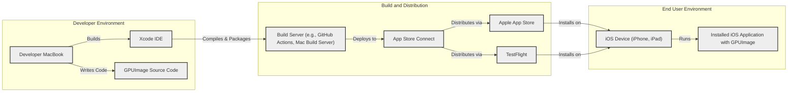
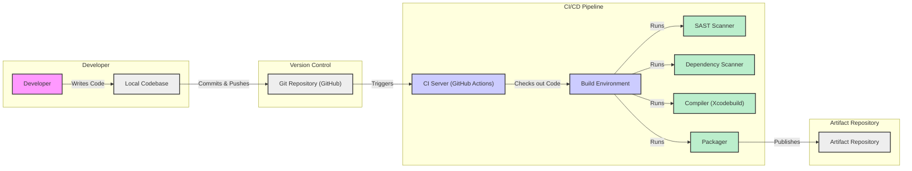

# BUSINESS POSTURE

This project, GPUImage, is an open-source iOS library for GPU-based image and video processing. The primary business goal is to provide iOS developers with a high-performance and easy-to-use solution for applying image and video effects within their applications. This addresses the need for efficient media processing on mobile devices, enhancing user experience in applications that require real-time or fast image and video manipulation.

Business priorities are:
- Performance: The library must be highly performant, leveraging the GPU for efficient processing to ensure smooth user experiences in mobile applications.
- Ease of Integration: The library should be simple to integrate into existing and new iOS projects, with clear documentation and a straightforward API.
- Feature Richness: Offer a wide range of image and video processing filters and effects to cater to diverse application needs.
- Stability and Reliability: The library needs to be stable and reliable to prevent crashes or unexpected behavior in applications using it.
- Community Support: As an open-source project, community support and contributions are important for long-term maintenance and growth.

Most important business risks to address:
- Performance Bottlenecks: Inefficient code or algorithms could lead to performance issues, negating the primary benefit of GPU acceleration.
- Integration Complexity: Difficult integration or unclear documentation could deter developers from adopting the library.
- Feature Gaps: Lack of essential features or filters could limit the library's applicability and adoption.
- Instability and Bugs: Bugs or instability could lead to application crashes and negative user reviews for applications using the library.
- Lack of Community Support: Insufficient community support could result in slow bug fixes, feature development, and eventual project stagnation.

# SECURITY POSTURE

Existing security controls:
- security control: Open Source Code Review - The code is publicly available on GitHub, allowing for community review and scrutiny.
- security control: BSD License - Permissive license encourages broad usage and potential community contributions, which can indirectly lead to bug fixes and security improvements.
- security control: Dependency Management - Project likely uses dependency management tools (like CocoaPods or Swift Package Manager) which may offer some level of dependency vulnerability scanning (depending on the tools and configurations used by developers integrating the library).
- accepted risk: Reliance on Community Security - Security updates and vulnerability patches are dependent on community contributions and maintainer responsiveness, which can vary.
- accepted risk: Third-Party Dependencies - The library may depend on third-party libraries, which could introduce vulnerabilities if not properly managed and vetted.
- accepted risk: Client-Side Execution - As a client-side library, security relies heavily on the security posture of the integrating application and the iOS platform itself.

Recommended security controls:
- security control: Automated Dependency Scanning - Implement automated dependency scanning in the development and release pipeline to identify and address known vulnerabilities in third-party libraries.
- security control: Static Application Security Testing (SAST) - Integrate SAST tools into the development process to automatically analyze the codebase for potential security vulnerabilities.
- security control: Regular Security Audits - Conduct periodic security audits, especially before major releases, to proactively identify and address potential security weaknesses.
- security control: Input Validation and Sanitization - Implement robust input validation and sanitization within the library to prevent unexpected behavior or vulnerabilities due to malformed input data (images, videos, filter parameters).

Security requirements:
- Authentication: Not directly applicable to a client-side library. Authentication is the responsibility of the application integrating the library.
- Authorization: Not directly applicable to a client-side library. Authorization is the responsibility of the application integrating the library.
- Input Validation:
    - Requirement: The library must validate all input data, including image and video data, filter parameters, and any other user-provided input, to prevent unexpected behavior, crashes, or potential vulnerabilities.
    - Requirement: Input validation should be performed at the library's API boundaries to ensure that only valid and expected data is processed.
    - Requirement: Error handling for invalid input should be robust and should not expose sensitive information or lead to exploitable conditions.
- Cryptography:
    - Requirement: If the library handles sensitive image or video data that requires confidentiality or integrity, appropriate cryptographic measures should be considered. However, based on the project description, cryptography is not a primary requirement. If used, ensure proper implementation of cryptographic algorithms and key management practices.
    - Requirement: If the library interacts with external services or storage that requires secure communication, ensure that communication channels are encrypted using protocols like HTTPS.

# DESIGN

## C4 CONTEXT

```mermaid
graph LR
    subgraph "Organization Context"
        U["iOS Developer"]:::user
        A["iOS Application"]:::software_system
        GPUI["GPUImage Library"]:::software_system
        IOS["iOS Devices"]:::software_system
    end

    U --> GPUI: Integrates
    GPUI --> A: Used by
    A --> IOS: Runs on
    U -- Uses --> IOS: Deploys to

    classDef user fill:#f9f,stroke:#333,stroke-width:2px
    classDef software_system fill:#ccf,stroke:#333,stroke-width:2px
```

Context Diagram Elements:

- Element:
    - Name: iOS Developer
    - Type: User
    - Description: Software developers who use the GPUImage library to add image and video processing capabilities to their iOS applications.
    - Responsibilities: Integrate the GPUImage library into their iOS projects, utilize its API to implement desired image and video effects, and deploy applications to iOS devices.
    - Security controls: Responsible for securely integrating the library into their applications, handling user data securely within their applications, and following secure development practices for their overall application.

- Element:
    - Name: GPUImage Library
    - Type: Software System
    - Description: An open-source iOS library that provides GPU-accelerated image and video processing functionalities.
    - Responsibilities: Provide a set of APIs and functionalities for applying various image and video filters and effects efficiently on iOS devices. Process image and video data according to the applied filters.
    - Security controls: Input validation and sanitization within the library to prevent vulnerabilities from malformed input. Code review and static analysis to identify and mitigate potential security flaws in the library's code. Dependency management to ensure secure third-party libraries.

- Element:
    - Name: iOS Application
    - Type: Software System
    - Description: Mobile applications developed by iOS developers that integrate and utilize the GPUImage library for image and video processing.
    - Responsibilities: Utilize the GPUImage library to enhance user experience with image and video effects. Manage user data and application security.
    - Security controls: Application-level security controls, including user authentication, authorization, secure data storage, and secure communication. Responsible for the overall security of the application, including the secure usage of the GPUImage library.

- Element:
    - Name: iOS Devices
    - Type: Software System
    - Description: Apple mobile devices (iPhones, iPads) on which iOS applications using the GPUImage library are deployed and run.
    - Responsibilities: Execute iOS applications and the GPUImage library. Provide the hardware and operating system environment for the applications.
    - Security controls: iOS operating system security features, including sandboxing, code signing, and system-level security updates. Device-level security controls like passcode/biometric authentication and encryption.

## C4 CONTAINER

```mermaid
graph LR
    subgraph "iOS Devices"
        subgraph "iOS Application Container"
            APP["iOS Application Code"]:::container
            GPUI_LIB["GPUImage Library"]:::container
        end
        IOS_FRAMEWORK["iOS Frameworks"]:::container
        GPU["GPU"]:::container
    end

    APP -- Uses --> GPUI_LIB: Library Calls
    GPUI_LIB -- Uses --> IOS_FRAMEWORK: iOS APIs
    GPUI_LIB -- Uses --> GPU: GPU Processing
    APP -- Uses --> IOS_FRAMEWORK: iOS APIs

    classDef container fill:#cff,stroke:#333,stroke-width:2px
```

Container Diagram Elements:

- Element:
    - Name: iOS Application Code
    - Type: Container
    - Description: The custom application code developed by iOS developers, which integrates and utilizes the GPUImage library.
    - Responsibilities: Application-specific logic, user interface, data management, and integration with other application components and services. Calls the GPUImage library API to perform image and video processing.
    - Security controls: Application-level security controls, including secure coding practices, input validation at the application level, secure data handling, and secure communication.

- Element:
    - Name: GPUImage Library
    - Type: Container
    - Description: The GPUImage library itself, packaged as a framework or static library for iOS.
    - Responsibilities: Provides the core image and video processing functionalities. Implements various filters and effects using GPU acceleration. Exposes an API for iOS applications to use.
    - Security controls: Input validation and sanitization within the library. Secure coding practices in the library's implementation. Dependency management for third-party libraries used by GPUImage.

- Element:
    - Name: iOS Frameworks
    - Type: Container
    - Description: Standard iOS frameworks provided by Apple, such as Core Image, AVFoundation, and Metal, which GPUImage likely utilizes.
    - Responsibilities: Provide low-level APIs for accessing device hardware and operating system functionalities, including graphics processing, media handling, and system services.
    - Security controls: Security is managed by Apple through iOS updates and security patches. Applications and libraries rely on the security features provided by the iOS frameworks.

- Element:
    - Name: GPU
    - Type: Container
    - Description: The Graphics Processing Unit on the iOS device, used by GPUImage for accelerated image and video processing.
    - Responsibilities: Perform parallel processing of image and video data as instructed by the GPUImage library.
    - Security controls: Hardware-level security controls managed by the device and operating system. Access to the GPU is mediated by the iOS frameworks and operating system.

## DEPLOYMENT

Deployment Architecture: Single Deployment Scenario - iOS Application Distribution



Deployment Diagram Elements:

- Element:
    - Name: Developer MacBook
    - Type: Development Environment
    - Description: The developer's local machine used for writing code, development, and local testing.
    - Responsibilities: Code development, local builds, and unit testing.
    - Security controls: Developer workstation security practices, including OS security, endpoint protection, and access controls.

- Element:
    - Name: Xcode IDE
    - Type: Development Tool
    - Description: Apple's Integrated Development Environment used for iOS application development, including building and packaging applications.
    - Responsibilities: Code editing, compilation, debugging, and packaging iOS applications.
    - Security controls: Code signing certificates managed by the developer, Xcode security updates.

- Element:
    - Name: GPUImage Source Code
    - Type: Code Repository
    - Description: The source code of the GPUImage library, managed in a version control system (like Git on GitHub).
    - Responsibilities: Storing and versioning the source code of the library.
    - Security controls: Access control to the repository, code review processes, branch protection policies.

- Element:
    - Name: Build Server (e.g., GitHub Actions, Mac Build Server)
    - Type: Build Automation
    - Description: Automated build environment used for continuous integration and continuous delivery (CI/CD) processes.
    - Responsibilities: Automated building, testing, and packaging of the iOS application and library.
    - Security controls: Secure build environment, access control to build configurations and secrets, secure artifact storage.

- Element:
    - Name: App Store Connect
    - Type: Distribution Platform
    - Description: Apple's platform for managing and distributing iOS applications to the App Store and TestFlight.
    - Responsibilities: Application submission, metadata management, distribution to the App Store and TestFlight.
    - Security controls: Apple's platform security, developer account security, code signing requirements, app review process.

- Element:
    - Name: Apple App Store & TestFlight
    - Type: Distribution Channels
    - Description: Apple's official app marketplace (App Store) and beta testing platform (TestFlight) for distributing iOS applications to end-users.
    - Responsibilities: Distributing applications to end-users, managing app updates.
    - Security controls: Apple's platform security, app review process, user account security.

- Element:
    - Name: iOS Device (iPhone, iPad)
    - Type: End-User Device
    - Description: End-user's iOS devices where applications with GPUImage are installed and run.
    - Responsibilities: Running the installed iOS applications.
    - Security controls: iOS operating system security, device-level security settings (passcode, biometrics), app sandboxing.

- Element:
    - Name: Installed iOS Application with GPUImage
    - Type: Application Instance
    - Description: The iOS application, including the integrated GPUImage library, installed on the end-user's device.
    - Responsibilities: Providing application functionalities to the end-user, utilizing GPUImage for image and video processing.
    - Security controls: Application-level security controls, reliance on iOS platform security, and secure usage of the GPUImage library.

## BUILD

Build Process Diagram:



Build Process Description and Security Controls:

1. Developer Commits Code:
    - Developer writes code on their local machine (LOCAL_CODE).
    - Security control: Developer workstation security practices. Code review before committing.

2. Code Push to Git Repository:
    - Developer commits and pushes code changes to the Git repository (GIT_REPO), likely hosted on GitHub.
    - Security control: Access control to the Git repository (authentication and authorization). Branch protection policies.

3. CI/CD Pipeline Trigger:
    - Push to the Git repository triggers the CI/CD pipeline on the CI server (CI_SERVER), such as GitHub Actions.
    - Security control: Secure configuration of CI/CD pipeline triggers.

4. Code Checkout and Build Environment Setup:
    - CI server checks out the code into a secure build environment (BUILD_ENV).
    - Security control: Secure CI/CD infrastructure. Isolated build environment.

5. Security Checks:
    - Static Application Security Testing (SAST): SAST scanner (SAST) analyzes the source code for potential security vulnerabilities.
    - Security control: SAST tool integration in the pipeline. Configuration of SAST rules and thresholds.
    - Dependency Scanning: Dependency scanner (DEPENDENCY_SCAN) checks for known vulnerabilities in third-party dependencies.
    - Security control: Dependency scanning tool integration. Vulnerability database updates.

6. Compilation and Packaging:
    - Compiler (COMPILER, e.g., Xcodebuild) compiles the source code.
    - Packager (PACKAGER) packages the compiled code into a library or framework artifact.
    - Security control: Secure build tools and toolchain. Code signing process.

7. Artifact Publishing:
    - Packaged artifacts are published to an artifact repository (ARTIFACT_REPO).
    - Security control: Secure artifact repository. Access control to the artifact repository. Integrity checks for artifacts.

# RISK ASSESSMENT

Critical business process we are trying to protect:
- Efficient and reliable image and video processing within iOS applications. This directly impacts the user experience of applications using the GPUImage library.

Data we are trying to protect and their sensitivity:
- Image and video data processed by applications using the GPUImage library.
- Sensitivity of data depends on the application context. It could range from publicly available images to highly sensitive personal or medical images and videos.
- The library itself does not store data, but processes data provided by the integrating application. The risk is primarily related to vulnerabilities in the library that could lead to unauthorized access, modification, or disclosure of the data being processed by applications using it.
- Code integrity of the GPUImage library itself is also important to protect, as compromised library code could be distributed to many applications, potentially causing widespread impact.

# QUESTIONS & ASSUMPTIONS

Questions:
- What are the typical use cases and application domains for the GPUImage library? Understanding the common use cases will help prioritize security concerns based on the sensitivity of data being processed.
- Are there any specific performance benchmarks or requirements that drive design decisions? Performance considerations might influence security control choices.
- What is the expected level of community involvement in security monitoring and patching? Understanding community support helps assess the reliance on external contributions for security maintenance.
- Are there any specific compliance requirements (e.g., HIPAA, GDPR, CCPA) that applications using GPUImage might need to adhere to? Compliance requirements can dictate specific security controls and design considerations.

Assumptions:
- BUSINESS POSTURE:
    - Performance and ease of use are primary drivers for adoption.
    - The library is intended for a wide range of iOS applications, from consumer apps to potentially more sensitive applications.
    - Long-term maintainability and community support are important for the project's success.
- SECURITY POSTURE:
    - Security is considered important but might be balanced with performance and ease of use.
    - The project relies on open-source security principles and community contributions for security improvements.
    - Integrating applications are responsible for their overall security posture, including the secure usage of the GPUImage library.
- DESIGN:
    - The library is designed as a client-side component integrated directly into iOS applications.
    - The library leverages iOS frameworks and GPU hardware for its core functionalities.
    - The build process involves standard iOS development tools and practices, potentially incorporating CI/CD for automation.