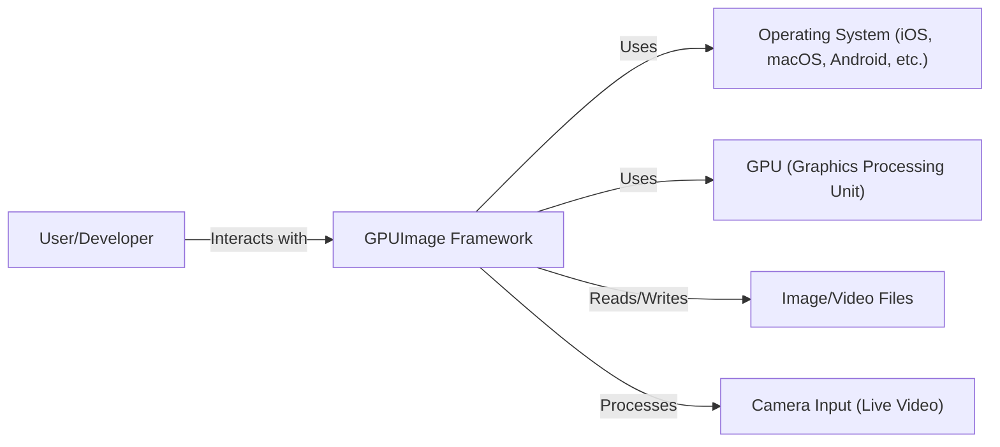
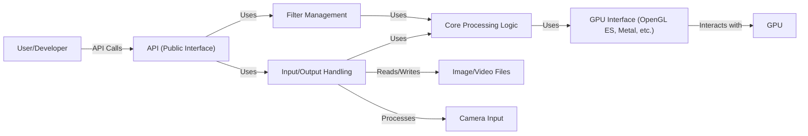
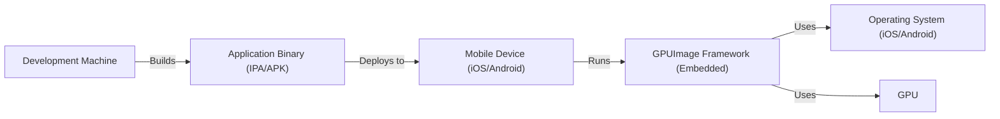
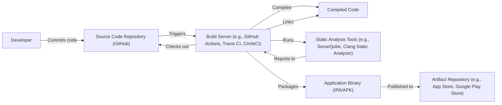

# Project Design Document: GPUImage

## BUSINESS POSTURE

Business Priorities and Goals:

*   Provide a high-performance, cross-platform image and video processing framework.
*   Enable developers to easily leverage GPU acceleration for image and video manipulation.
*   Offer a flexible and extensible architecture for creating custom image processing operations.
*   Maintain a user-friendly API that simplifies complex GPU-based computations.
*   Support a wide range of image and video formats.
*   Foster an active open-source community for contributions and support.

Business Risks:

*   Performance bottlenecks: Inefficient GPU utilization or memory management could lead to performance issues, hindering the core value proposition of the framework.
*   Platform compatibility issues: Inconsistencies across different operating systems, GPU vendors, or driver versions could limit the framework's reach and usability.
*   Security vulnerabilities: Bugs in the framework, especially in custom filter implementations, could expose applications to security risks like buffer overflows or code injection.
*   Maintainability challenges: As the framework grows, maintaining code quality, API consistency, and backward compatibility could become increasingly difficult.
*   Community engagement: Lack of active community participation could slow down development, bug fixing, and feature additions.
*   Competition: Other GPU-accelerated image processing libraries could emerge, potentially offering better performance, features, or ease of use.

## SECURITY POSTURE

Existing Security Controls:

*   security control: Code reviews: The project is open-source, allowing for community code review and scrutiny. (Described in GitHub repository's contribution guidelines and pull request process).
*   security control: Limited external dependencies: Reducing the number of external dependencies minimizes the attack surface. (Visible in the project's source code and build configuration).

Accepted Risks:

*   accepted risk: Reliance on underlying platform security: The framework's security depends on the security of the underlying operating system, GPU drivers, and hardware.
*   accepted risk: Potential for user-introduced vulnerabilities: Custom filters created by users may contain security flaws, as the framework cannot guarantee the security of user-provided code.

Recommended Security Controls:

*   security control: Static analysis: Integrate static analysis tools into the build process to identify potential security vulnerabilities in the framework's code.
*   security control: Fuzz testing: Implement fuzz testing to discover edge cases and vulnerabilities that might be missed by manual code review or static analysis.
*   security control: Input validation: Implement robust input validation for all user-provided data, including image data, filter parameters, and custom shader code.
*   security control: Sandboxing (if applicable): If the framework supports running user-provided code (e.g., custom shaders), consider implementing sandboxing mechanisms to limit the potential impact of vulnerabilities.
*   security control: Regular dependency updates: Keep all dependencies up-to-date to address known security vulnerabilities.
*   security control: Security documentation: Provide clear documentation on secure coding practices for users developing custom filters.

Security Requirements:

*   Authentication: Not directly applicable, as the framework itself does not handle user authentication.
*   Authorization: Not directly applicable, as the framework does not manage user permissions or access control.
*   Input Validation:
    *   All input data, including image dimensions, pixel formats, filter parameters, and custom shader code, must be validated to prevent buffer overflows, code injection, and other vulnerabilities.
    *   Specific validation rules should be defined based on the expected data types and ranges.
*   Cryptography:
    *   If the framework handles sensitive data (which is unlikely in this case), appropriate cryptographic algorithms and key management practices should be used.
    *   The framework itself does not appear to require cryptographic functionality.
*   Output Encoding:
    *   If the framework is used to generate output that will be displayed in a web browser or other context where cross-site scripting (XSS) is a concern, appropriate output encoding should be applied.

## DESIGN

### C4 CONTEXT

Element Descriptions:

*   Element:
    *   Name: User/Developer
    *   Type: Person
    *   Description: A person who uses the GPUImage framework to build applications that process images or videos.
    *   Responsibilities: Integrates GPUImage into their application, creates custom filters, handles input and output data.
    *   Security controls: Follows secure coding practices, validates user inputs, handles sensitive data appropriately.

*   Element:
    *   Name: GPUImage Framework
    *   Type: Software System
    *   Description: The core library that provides GPU-accelerated image and video processing capabilities.
    *   Responsibilities: Provides API for image/video processing, manages GPU resources, executes image processing operations.
    *   Security controls: Input validation, regular dependency updates, static analysis (recommended), fuzz testing (recommended).

*   Element:
    *   Name: Operating System (iOS, macOS, Android, etc.)
    *   Type: Software System
    *   Description: The underlying operating system that provides the platform for GPUImage to run.
    *   Responsibilities: Provides system resources, manages memory, handles device drivers.
    *   Security controls: OS-level security features (e.g., sandboxing, memory protection), regular security updates.

*   Element:
    *   Name: GPU (Graphics Processing Unit)
    *   Type: Hardware
    *   Description: The hardware component that performs the actual image and video processing computations.
    *   Responsibilities: Executes GPU kernels, performs parallel computations.
    *   Security controls: Hardware-level security features, driver-level security controls.

*   Element:
    *   Name: Media
    *   Type: Data
    *   Description: Image and video files that are processed by the framework.
    *   Responsibilities: Storing visual data.
    *   Security controls: File system permissions, encryption (if necessary).

*   Element:
    *   Name: Camera
    *   Type: Hardware
    *   Description: Provides live video input for processing.
    *   Responsibilities: Capturing video frames.
    *   Security controls: Device-specific security controls, access permissions.

### C4 CONTAINER

Element Descriptions:

*   Element:
    *   Name: API (Public Interface)
    *   Type: Container (API)
    *   Description: The public-facing interface that developers use to interact with the framework.
    *   Responsibilities: Exposes functions for creating filters, processing images/videos, managing resources.
    *   Security controls: Input validation, API documentation.

*   Element:
    *   Name: Filter Management
    *   Type: Container (Component)
    *   Description: Manages the creation, configuration, and chaining of image processing filters.
    *   Responsibilities: Creates filter instances, sets filter parameters, connects filters in a processing pipeline.
    *   Security controls: Input validation for filter parameters.

*   Element:
    *   Name: Input/Output Handling
    *   Type: Container (Component)
    *   Description: Handles the input and output of image and video data.
    *   Responsibilities: Reads image/video data from files or camera, writes processed data to files or display.
    *   Security controls: Input validation for image/video data, file system permissions.

*   Element:
    *   Name: Core Processing Logic
    *   Type: Container (Component)
    *   Description: Contains the core algorithms and logic for image and video processing.
    *   Responsibilities: Implements image processing operations, manages GPU memory, coordinates data transfer between CPU and GPU.
    *   Security controls: Code reviews, static analysis (recommended), fuzz testing (recommended).

*   Element:
    *   Name: GPU Interface (OpenGL ES, Metal, etc.)
    *   Type: Container (Component)
    *   Description: Provides an abstraction layer for interacting with the GPU using specific graphics APIs.
    *   Responsibilities: Translates high-level processing requests into GPU commands, manages GPU resources.
    *   Security controls: Relies on the security of the underlying graphics API and drivers.

*   Element:
    *   Name: GPU
    *   Type: Hardware
    *   Description: The hardware component that performs the actual image and video processing computations.
    *   Responsibilities: Executes GPU kernels, performs parallel computations.
    *   Security controls: Hardware-level security features, driver-level security controls.

*   Element:
    *   Name: Media
    *   Type: Data
    *   Description: Image and video files.
    *   Responsibilities: Storing visual data.
    *   Security controls: File system permissions.

*   Element:
    *   Name: Camera
    *   Type: Hardware
    *   Description: Provides live video input.
    *   Responsibilities: Capturing video frames.
    *   Security controls: Device-specific security controls.

### DEPLOYMENT

Possible Deployment Solutions:

1.  **Embedded within a Mobile Application (iOS/Android):** The framework is compiled and linked directly into the mobile application.
2.  **Desktop Application (macOS):** Similar to mobile, the framework is compiled and linked into the desktop application.
3.  **Server-Side Processing (Less Common):** While GPUImage is primarily designed for client-side processing, it could theoretically be used on a server with a GPU for tasks like video transcoding or image analysis. This is less common due to the framework's design and dependencies.

Chosen Deployment Solution (Most Common): **Embedded within a Mobile Application (iOS/Android)**

Element Descriptions:

*   Element:
    *   Name: Development Machine
    *   Type: Infrastructure
    *   Description: The developer's computer used to write and build the application.
    *   Responsibilities: Compiling code, linking libraries, creating the application package.
    *   Security controls: Secure development environment, code signing.

*   Element:
    *   Name: Application Binary (IPA/APK)
    *   Type: Artifact
    *   Description: The compiled application package for iOS (IPA) or Android (APK).
    *   Responsibilities: Contains the application code, resources, and the GPUImage framework.
    *   Security controls: Code signing, integrity checks.

*   Element:
    *   Name: Mobile Device (iOS/Android)
    *   Type: Infrastructure
    *   Description: The user's mobile device (phone or tablet).
    *   Responsibilities: Runs the application.
    *   Security controls: Device-level security features (e.g., sandboxing, app permissions).

*   Element:
    *   Name: GPUImage Framework (Embedded)
    *   Type: Software System
    *   Description: The GPUImage framework, embedded within the application.
    *   Responsibilities: Provides GPU-accelerated image/video processing.
    *   Security controls: Same as described in the C4 Container diagram.

*   Element:
    *   Name: Operating System (iOS/Android)
    *   Type: Software System
    *   Description: The mobile operating system.
    *   Responsibilities: Provides system resources, manages memory, handles device drivers.
    *   Security controls: OS-level security features, regular security updates.

*   Element:
    *   Name: GPU
    *   Type: Hardware
    *   Description: The mobile device's GPU.
    *   Responsibilities: Executes image/video processing operations.
    *   Security controls: Hardware-level security features, driver-level security controls.

### BUILD

Build Process Description:

1.  **Code Commit:** A developer commits code changes to the source code repository (GitHub).
2.  **Build Trigger:** The commit triggers a build process on a build server (e.g., GitHub Actions, Travis CI, CircleCI).
3.  **Checkout:** The build server checks out the latest source code from the repository.
4.  **Compilation:** The build server compiles the source code into object files.
5.  **Linking:** The build server links the object files and any required libraries (including GPUImage) to create the application binary.
6.  **Static Analysis:** Static analysis tools (e.g., SonarQube, Clang Static Analyzer) are run on the source code to identify potential security vulnerabilities and code quality issues. The results are reported to the build server.
7.  **Packaging:** The build server packages the compiled code and resources into the appropriate application binary format (IPA for iOS, APK for Android).
8.  **Publishing:** The application binary is published to an artifact repository (e.g., App Store, Google Play Store, or an internal repository).

Security Controls in Build Process:

*   security control: Source Code Repository (GitHub): Provides version control, access control, and audit trails for code changes.
*   security control: Build Server (GitHub Actions, Travis CI, CircleCI): Automates the build process, ensuring consistency and repeatability.
*   security control: Static Analysis Tools: Identify potential security vulnerabilities and code quality issues before deployment.
*   security control: Code Signing: Ensures the integrity and authenticity of the application binary.
*   security control: Dependency Management: Tracks and manages external dependencies, allowing for identification and mitigation of vulnerabilities in third-party libraries.

## RISK ASSESSMENT

Critical Business Processes:

*   **Image/Video Processing:** The core functionality of the framework, enabling users to manipulate images and videos.
*   **Custom Filter Creation:** Allowing developers to extend the framework with their own image processing operations.
*   **Application Development:** Enabling developers to build applications that leverage GPU-accelerated image/video processing.

Data Sensitivity:

*   **Image/Video Data:** The primary data processed by the framework. Sensitivity depends on the content of the images/videos.  Could range from non-sensitive (e.g., public domain images) to highly sensitive (e.g., personal photos, medical images, confidential documents).
*   **Filter Parameters:** Data used to configure image processing filters. Generally not sensitive, but could potentially leak information about the processing being performed.
*   **Custom Shader Code:** Code written by users to define custom image processing operations.  Could potentially contain sensitive algorithms or intellectual property.

## QUESTIONS & ASSUMPTIONS

Questions:

*   Are there any specific compliance requirements (e.g., HIPAA, GDPR) that the framework needs to adhere to?
*   What are the expected performance requirements for the framework (e.g., frames per second, latency)?
*   What are the target platforms and devices for the framework?
*   What level of support and maintenance is expected for the framework?
*   Are there any plans to monetize the framework (e.g., through licensing, support contracts)?
*   What is the process for handling security vulnerabilities reported by users or researchers?

Assumptions:

*   BUSINESS POSTURE: The primary goal is to provide a high-performance, open-source image/video processing framework.  Profitability is not a primary concern.
*   SECURITY POSTURE: The project relies on community code review and basic security practices.  A formal security audit has not been conducted.
*   DESIGN: The framework is primarily used for client-side processing on mobile devices.  The framework does not handle sensitive data directly. The framework does not require user authentication or authorization.