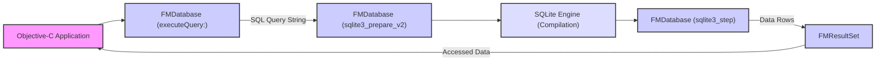
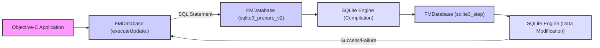
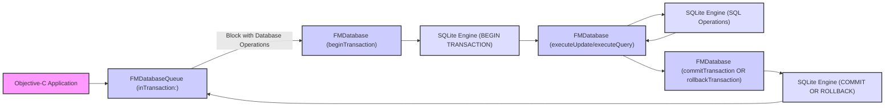

## Project Design Document: FMDB - An SQLite Wrapper for Objective-C (Improved)

**1. Introduction**

This document provides an enhanced design overview of FMDB, an Objective-C wrapper around the SQLite embedded database engine. FMDB simplifies SQLite interaction for developers on Apple platforms (macOS, iOS, watchOS, tvOS) by providing an Objective-C interface that abstracts the lower-level C API. This document is specifically designed to facilitate threat modeling by detailing FMDB's architecture, component interactions, and data flow.

**2. Goals**

*   Provide a detailed and unambiguous description of FMDB's architecture and its core components.
*   Clearly illustrate the data flow during common database operations, highlighting potential points of interaction and data transformation.
*   Specifically identify potential security vulnerabilities and threat vectors associated with FMDB's design and usage.
*   Serve as a comprehensive resource for security engineers and developers to understand FMDB's internal workings for security analysis and mitigation.

**3. Non-Goals**

*   This document does not aim to provide an exhaustive analysis of the SQLite engine's internal workings.
*   Performance analysis, benchmarking, or optimization strategies for FMDB are outside the scope.
*   A detailed, line-by-line code review of FMDB's implementation is not included.
*   Comparison of FMDB with alternative SQLite wrappers is not a goal of this document.

**4. Target Audience**

*   Security architects and engineers responsible for identifying and mitigating security risks in applications using FMDB.
*   Software developers integrating FMDB into their Objective-C applications who need to understand its security implications.
*   Penetration testers and security auditors evaluating the security posture of applications utilizing FMDB.

**5. System Overview**

FMDB acts as a bridge between an Objective-C application and the SQLite database engine. It encapsulates the SQLite C API within Objective-C classes, providing a more object-oriented and developer-friendly way to interact with SQLite databases.

**6. Component Details**

FMDB's functionality is organized into several key classes, each with specific responsibilities:

*   **`FMDatabase`**:  Represents a single connection to an SQLite database.
    *   Manages the underlying `sqlite3 *` database connection handle.
    *   Provides methods for executing SQL queries (`executeQuery:`, `executeUpdate:`), handling transactions (`beginTransaction`, `commitTransaction`, `rollbackTransaction`), and checking for errors.
    *   Handles the preparation and finalization of SQLite statements.
    *   Is *not* inherently thread-safe for concurrent access to the same instance.
*   **`FMResultSet`**: Represents the results of a query executed via `FMDatabase`.
    *   Holds a reference to the compiled SQLite statement (`sqlite3_stmt *`).
    *   Allows iteration through the result rows.
    *   Provides methods to access individual column values by name or index, with type conversion.
    *   Requires proper closing to release resources associated with the underlying statement.
*   **`FMDatabaseQueue`**: Enables thread-safe execution of database operations.
    *   Manages a serial dispatch queue (GCD) to ensure that database operations are performed sequentially, preventing race conditions when multiple threads access the same database.
    *   Provides a block-based API for executing database operations within the queue.
    *   Internally uses a single `FMDatabase` instance per queue.
*   **`FMDatabasePool`**: Manages a pool of `FMDatabase` connections for efficient reuse.
    *   Reduces the overhead of repeatedly opening and closing database connections.
    *   Provides methods to retrieve and return database connections from the pool.
    *   Useful in scenarios with frequent, short-lived database operations.
*   **`FMDatabaseAdditions`**: Offers convenience methods and categories extending the functionality of core FMDB classes.
    *   Includes methods for retrieving last inserted row ID, changes since the last operation, and other utility functions.
    *   Can simplify common database tasks.

**7. Data Flow**

The following diagrams illustrate the typical data flow for common database operations within FMDB:

**7.1. Query Execution Flow:**

*   The application initiates a query by calling `executeQuery:` on an `FMDatabase` instance, providing the SQL query string.
*   `FMDatabase` uses the SQLite C API function `sqlite3_prepare_v2` to compile the SQL query into a prepared statement.
*   The SQLite engine performs the compilation.
*   `FMDatabase` then uses `sqlite3_step` to execute the prepared statement and retrieve data rows.
*   The retrieved data is encapsulated within an `FMResultSet` object.
*   The application accesses the data by iterating through the `FMResultSet`.

**7.2. Update/Insert/Delete Operation Flow:**

*   The application calls `executeUpdate:` on an `FMDatabase` instance with the SQL statement for modification.
*   Similar to query execution, `FMDatabase` prepares the statement using `sqlite3_prepare_v2`.
*   The SQLite engine compiles the statement.
*   `FMDatabase` executes the statement using `sqlite3_step`.
*   The SQLite engine modifies the database file.
*   `executeUpdate:` returns a boolean indicating success or failure.

**7.3. Transaction Management Flow (using FMDatabaseQueue):**

*   The application uses `FMDatabaseQueue`'s `inTransaction:` method to execute a block of database operations within a transaction.
*   `FMDatabaseQueue` ensures exclusive access to its internal `FMDatabase` instance.
*   `FMDatabase` calls `beginTransaction`, which translates to the `BEGIN TRANSACTION` SQL command.
*   Subsequent `executeUpdate:` or `executeQuery:` calls within the block operate within the transaction.
*   Based on the success of the operations within the block (or explicit calls), `FMDatabase` calls either `commitTransaction` (issuing `COMMIT`) or `rollbackTransaction` (issuing `ROLLBACK`).

**8. Security Considerations (Detailed Threat Analysis)**

This section outlines potential security vulnerabilities and threat vectors associated with FMDB:

*   **SQL Injection Vulnerabilities:**
    *   **Threat:** If user-provided data is directly concatenated into SQL query strings passed to `executeQuery:` or `executeUpdate:`, attackers can inject malicious SQL code.
    *   **Attack Vector:**  Manipulating input fields to include SQL keywords and commands (e.g., `'; DROP TABLE users; --`).
    *   **Mitigation:**  Always use parameterized queries (using `?` placeholders) and the corresponding methods that accept arguments to bind values safely.
*   **Database File Security:**
    *   **Threat:** Unauthorized access to the SQLite database file can lead to data breaches, modification, or deletion.
    *   **Attack Vector:**  Exploiting file system permissions, insecure storage locations, or vulnerabilities in the operating system.
    *   **Mitigation:**  Store the database file in a secure location with appropriate file permissions. Consider using file system encryption.
*   **Data Sensitivity and Encryption:**
    *   **Threat:** Sensitive data stored in the database without encryption is vulnerable if the file is compromised.
    *   **Attack Vector:**  Gaining physical or logical access to the database file.
    *   **Mitigation:**  Implement encryption at rest for sensitive data. This can be done using SQLite extensions like SQLCipher or by encrypting the entire file system. FMDB itself does not provide encryption.
*   **Thread Safety Issues (Misuse of `FMDatabase`):**
    *   **Threat:**  Directly accessing the same `FMDatabase` instance from multiple threads without proper synchronization can lead to data corruption or crashes.
    *   **Attack Vector:**  Exploiting race conditions in multithreaded applications.
    *   **Mitigation:**  Always use `FMDatabaseQueue` or `FMDatabasePool` for managing database access in multithreaded environments. Avoid sharing single `FMDatabase` instances across threads.
*   **Error Handling and Information Disclosure:**
    *   **Threat:**  Insufficient error handling can expose sensitive information about the database structure or data through error messages.
    *   **Attack Vector:**  Triggering database errors through invalid input or actions.
    *   **Mitigation:**  Implement robust error handling and avoid displaying raw database error messages to the user. Log errors securely for debugging purposes.
*   **Denial of Service (DoS):**
    *   **Threat:**  Maliciously crafted, resource-intensive SQL queries can overload the database and cause performance degradation or crashes.
    *   **Attack Vector:**  Sending complex or poorly optimized queries.
    *   **Mitigation:**  Implement query timeouts, rate limiting, and input validation to prevent the execution of excessively demanding queries.
*   **Temporary File Security:**
    *   **Threat:** SQLite may create temporary files during certain operations. If these files are not handled securely, they could expose sensitive data.
    *   **Attack Vector:**  Gaining access to temporary files created by SQLite.
    *   **Mitigation:** Ensure the operating system's temporary file directory has appropriate security restrictions.
*   **Integer Overflow in Data Handling:**
    *   **Threat:**  Improper handling of large numerical values retrieved from the database could lead to integer overflows, potentially causing unexpected behavior or vulnerabilities in the application logic.
    *   **Attack Vector:**  Storing or retrieving extremely large numerical values.
    *   **Mitigation:**  Validate and sanitize numerical data retrieved from the database, especially when performing calculations.

**9. Assumptions and Constraints**

*   The application integrating FMDB is responsible for implementing proper user authentication and authorization mechanisms. FMDB itself does not handle authentication.
*   This design document focuses on the interaction with local SQLite databases. Security considerations for networked database solutions are outside the scope.
*   The security of the underlying operating system and hardware infrastructure is assumed to be a separate concern, although vulnerabilities at that level can impact the security of the database.
*   The specific version of FMDB and SQLite being used can influence certain implementation details and the availability of security features.

**10. Conclusion**

This improved design document provides a detailed overview of FMDB, emphasizing its architecture, data flow, and potential security vulnerabilities. By understanding these aspects, developers and security professionals can proactively identify and mitigate risks associated with using FMDB in their applications. Employing secure coding practices, such as using parameterized queries and implementing proper error handling, is crucial for maintaining the security and integrity of data managed by FMDB and SQLite. This document serves as a valuable resource for threat modeling and security assessments.